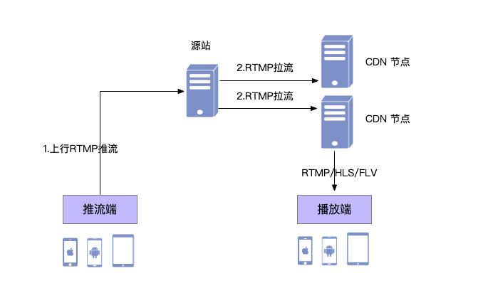

Android
=========================

.. _CDN 推流(android):

.. highlight:: java

**集成 CDN 推流功能前，请确保您已经集成了基础的多方音视频通话功能。**

.. note:: SDK 不支持模拟器运行，请使用真机。

**推流** 指的是把采集阶段封包好的内容传输到服务器的过程。用户无需安装 App，通过 Web 浏览器即可观看直播。

“推流”对网络要求比较高，如果网络不稳定，直播效果就会很差，观众观看直播时就会发生卡顿等现象，观看体验很是糟糕。

要想用于推流还必须把音视频数据使用传输协议进行封装，变成流数据。常用的流传输协议有 RTSP、RTMP、HLS等，使用 RTMP 传输的延时通常在1–3秒，对于手机直播这种实时性要求非常高的场景，RTMP也成为手机直播中最常用的流传输协议。最后通过一定的Qos算法将音视频流数据推送到网络端，通过CDN进行分发。

CDN 推流的原理如下：

CDN 推流服务适用于各类音视频直播场景，如企业级音视频会议、赛事、游戏直播、在线教育、娱乐直播等。

CDN 推流集成简单高效，开发者只需调用相关 API 即可将 CDN 推流无缝对接到自己的业务应用中。

推流地址设置
------------------------------------

如要开启 CDN 推流，需在 **加入频道前** 进行 CDN 推流地址的设置。具体为通过 JCMediaChannel.JoinParam 对象中的 cdn 属性进行设置

示例代码
::

    // 设置 CDN 推流地址
    JCMediaChannel.JoinParam joinParam = new JCMediaChannel.JoinParam();
    joinParam.cdn = "推流地址";
    // 加入频道
    mediaChannel.join("222", joinParam);

CDN 状态获取
------------------------------------

开启 CDN 推流前需要判断 CDN 的状态，通过下面的方法获取 CDN 的状态
::

    /**
     * 获得cdn推流状态
     *
     * @return cdn推流状态
     * @see CdnState
     */
    @CdnState
    public abstract int getCdnState();

其中，CdnState（推流状态）有以下几种：
::

    // 无法进行CDN推流
    public static final int CDN_STATE_NONE = 0;
    // 可以开启CDN推流
    public static final int CDN_STATE_READY = 1;
    // CDN推流中
    public static final int CDN_STATE_RUNNING = 2;

只有 CDN 当前状态不为 JCMediaChannel.CDN_STATE_NONE 时才可以开启 CDN 推流。

CDN 状态的变化通过 onMediaChannelPropertyChange 回调上报
::

    /**
     * 属性变化回调，目前主要关注屏幕共享状态的更新
     *
     * @param propChangeParam 变化标识集合
     */
    void onMediaChannelPropertyChange(JCMediaChannel.PropChangeParam propChangeParam);

开启或关闭 CDN 推流
------------------------------------

CDN 状态获取后，即可根据 CDN 的状态开启或关闭 CDN 推流，接口如下
::

    /**
     * 开关Cdn推流
     * 在收到 onMediaChannelPropertyChange 回调后检查是否开启
     *
     * @param enable       是否开启Cdn推流
     * @param keyInterval  推流关键帧间隔(毫秒)，当 enable 为 true 时有效，-1表示使用默认值(5000毫秒)，有效值需要>=1000
     * @return 返回 true 表示正常执行调用流程，false 表示调用异常
     */
    public abstract boolean enableCdn(boolean enable, int keyInterval);

示例代码
::

    public onMediaChannelPropertyChange(JCMediaChannel.PropChangeParam propChangeParam) {
        if (propChangeParam.cdn) { // CDN 状态变化
            // 根据CDN推流状态判断是否开启推流
            if (mediaChannel.getCdnState() = JCMediaChannel.CDN_STATE_NONE) {
                // 无法使用 CDN 推流
            } else if (mediaChannel.getCdnState() == JCMediaChannel.CDN_STATE_READY) {
                // 可以开启 CDN 推流
                mediaChannel.enableCdn(true, 0);
            } else if (mediaChannel.getCdnState() == JCMediaChannel. CDN_STATE_RUNNING) {
                // CDN 推流中，可以关关闭 CDN 推
                mediaChannel.enableCdn(false, 0);
            }
        }
    }
