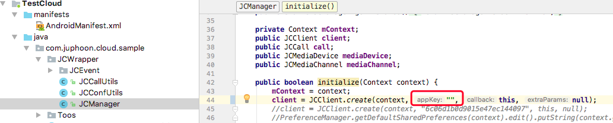

.. _Android:

Android Demo
===============================

想要快速体验 Demo，请按以下步骤操作：

获取 AppKey
----------------------------

请参考 :ref:`创建应用<创建应用>` 来获取您的 AppKey 。

.. note::

       同一个账号下创建的应用属于同一个域，同域中的应用可以互通。

SDK 下载
------------------------------

请点击 `这里 <http://developer.juphoon.com/document/cloud-communication-android-sdk#2>`_  进行 SDK 下载。

编译运行
-----------------------------

1. 解压 SDK 并打开目录，拷贝 armeabi-v7a、X86、mtc.jar 、JCSDK.jar 和 zmf.jar 到您的工程目录中的 libs 目录下，并打开工程，如下图所示:

.. image:: images/quickstart_android1.png

2. 设置自己的 AppKey

3. 连接 Android 真机，点击 Run 编译运行 Demo 程序

示例图片：

**一对一语音**

.. image:: images/android_call2.png
   :width: 300
   :height: 520

**一对一视频**

混音模式下的多方语音通话

.. image:: images/android_multicall2.png
   :width: 300
   :height: 520

**多方视频**

