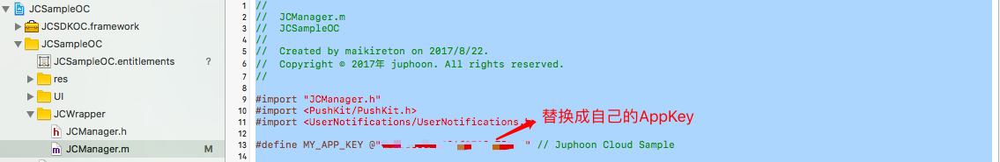
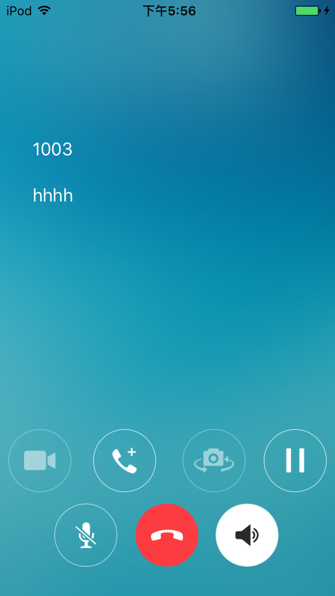
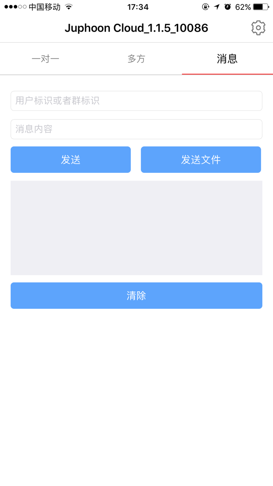

.. _iOS:

iOS Demo
===========================

想要快速体验 Demo，请按以下步骤操作：

获取 AppKey
----------------------------

请参考 :ref:`创建应用<创建应用>` 来获取您的 AppKey 。

.. note::

       同一个账号下创建的应用属于同一个域，同域中的应用可以互通。

SDK 下载
------------------------------

请点击 `这里 <http://developer.juphoon.com/document/cloud-communication-ios-sdk#2>`_ 进行 SDK 下载。

编译运行
-----------------------------

1. 解压 SDK，并打开工程

.. image:: images/ios_sdk.png
   :width: 280
   :height: 180

2. 设置自己的 AppKey

3. 连接 iOS 真机，点击 Run 编译运行 Demo 程序

示例图片：

**一对一语音**

.. image:: images/audio.png
   :width: 300
   :height: 520

**一对一视频**

.. image:: images/video.png
   :width: 300
   :height: 520

**混音模式下的多方语音**

**多方视频**

.. image:: images/multicall.png
   :width: 700
   :height: 410

**即时消息**

**涂鸦**

.. image:: images/doodle.png
   :width: 700
   :height: 410