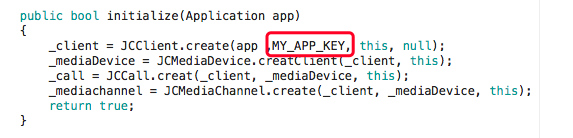
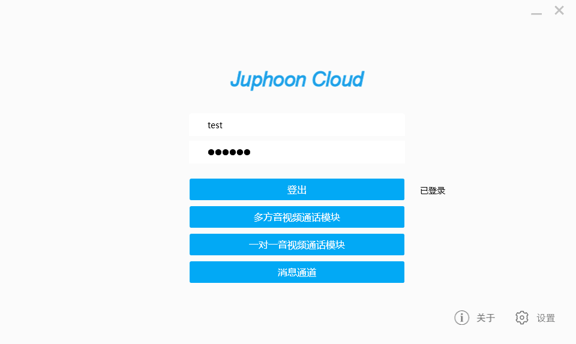
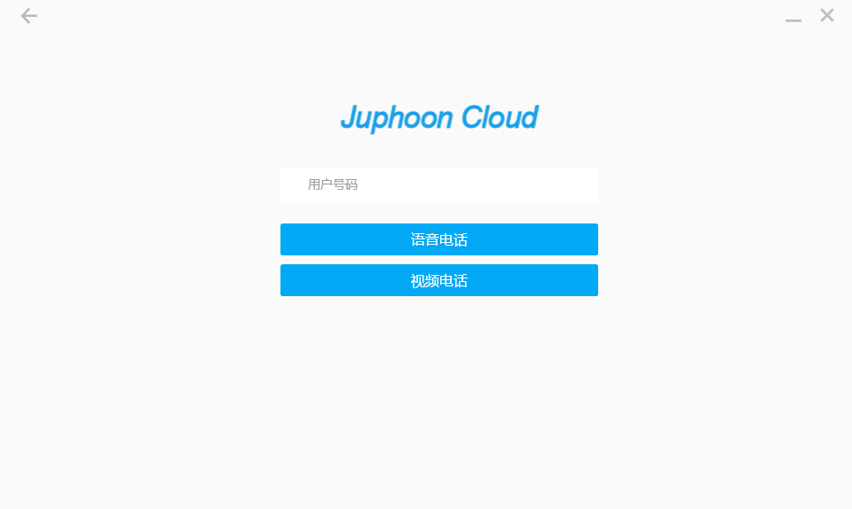
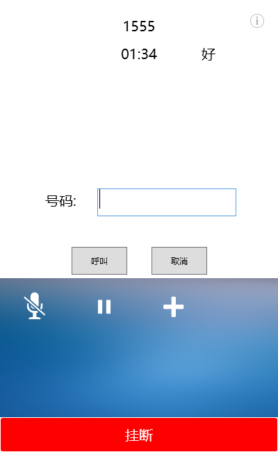
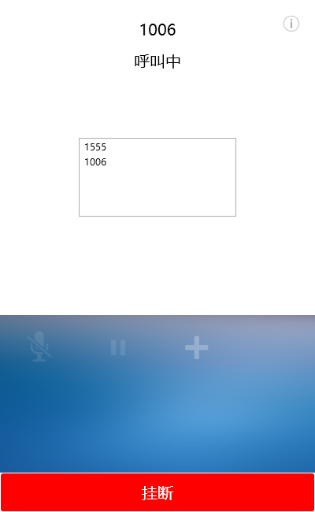
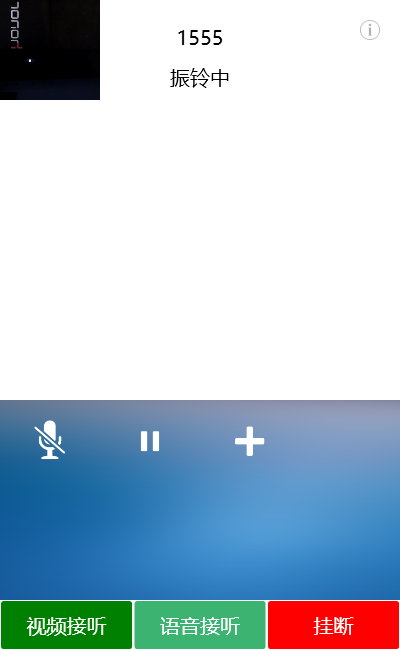
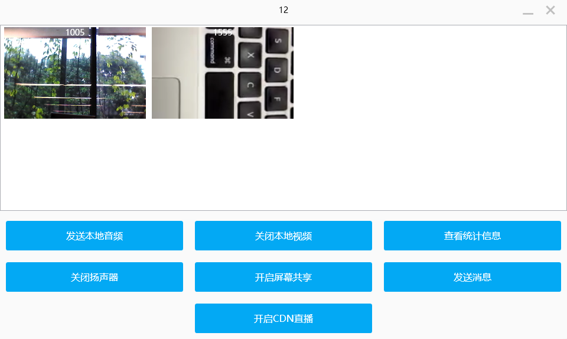
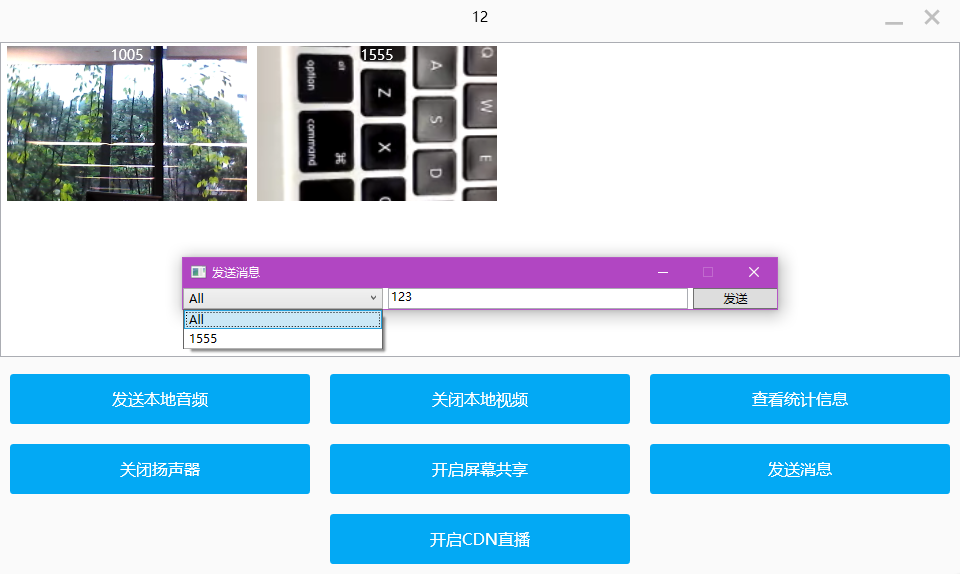
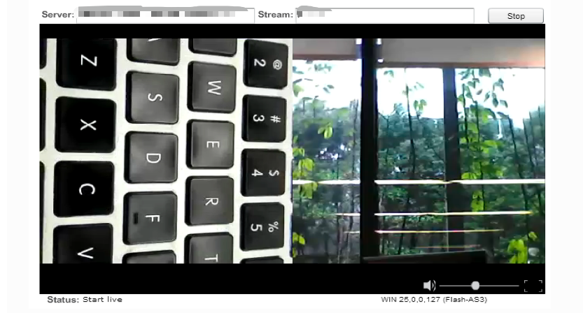
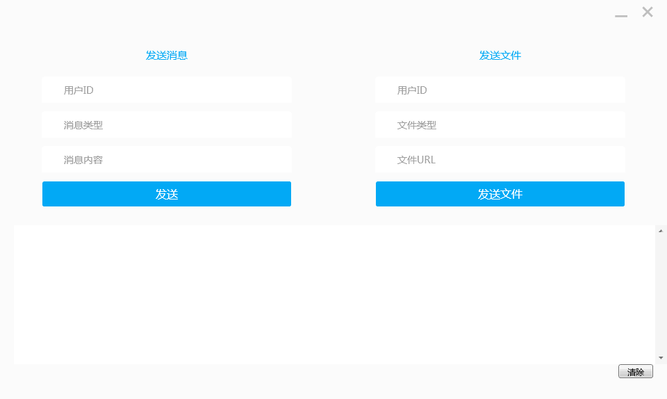

.. _Windows:

Windows Demo
==================================

想要快速体验 Demo，请按以下步骤操作：

获取 AppKey
----------------------------

请参考 :ref:`创建应用<创建应用>` 来获取您的 AppKey 。

.. note::

       同一个账号下创建的应用属于同一个域，同域中的应用可以互通。

SDK 下载
------------------------------

请点击 `这里 <http://developer.juphoon.com/document/cloud-communication-windows-sdk#2>`_ 进行 SDK 下载。

编译运行
-----------------------------

1. 在工程中输入自己的 AppKey

2. 编译运行 Demo 程序

**一对一通话**

**多方通话**

**CDN 直播测试**

**即时消息**

