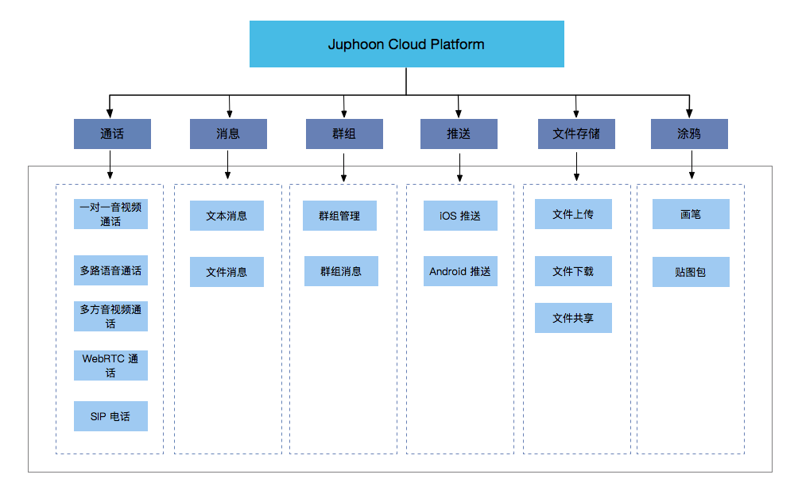

.. _产品介绍:

产品介绍
===========================

简介
-------------------------

现代生活中，音视频通话已经成为人们生活中不可或缺的沟通方式，随着技术的飞速发展，人们期待更高质量的通话体验。众所周知，开发实时音视频应用需要十分复杂的数字信号处理和网络技术，而菊风开发的 SDK 软件开发包在音视频编解码、图像处理、回声消除等方面具有独特的技术优势，不仅能带来高清流畅的通话体验，而且大大简化了音视频会话应用开发的研发过程。开发者只需要使用开发包封装的简洁、清晰的 API，便能快速开发具有优异性能的应用。

菊风云通讯平台 SDK 包含多种功能组件，如通话、会议、即时消息、文件共享、群组、涂鸦等，菊风云通讯平台提供的能力如下：

更多产品信息请参考 `官网 <http://cloud.juphoon.com/cn>`_ 。

.. _产品优势:

产品优势
------------------------------

- 广播级音质

 采用自适应回声消除技术，超强噪音抑制，为用户提供广播级音质。

- 高清流畅的画质

 - 采用业界领先的视频超分辨率技术，大大提升低分辨率视频图像的画面质量；

 - 独家SPo甜点技术可自动适应各类复杂网络环境，ARC传输机制保障数据能动态选择最高质量的传输路径，从而确保通话质量。

- 高性能

 - 视频带宽节省模式，对不同运动级别的图像采用不同码率，最高节省 90% 带宽，具有流量消耗低、流畅不卡顿的优势；

 - 在丢包达到 30% 时，仍然能够提供清晰流畅的音视频通话效果；

 - 全球120多个国家部署服务器，确保世界各个角落都能畅享清晰流畅的网络电话。

- 功能丰富

 提供涂鸦、视频录制、屏幕共享等丰富的功能，增加聊天的趣味性，提高用户间的互动性。

- 跨平台支持

 完美兼容 iOS、Android、Windows、Web 端（Chrome、Firefox 等浏览器），打破平台束缚。

- 接口简洁

 菊风云通讯平台 SDK 提供清楚简洁的接口，方便开发者快速高效的集成。

.. _应用场景:

应用场景
------------------------------

鉴于菊风云通讯平台的丰富功能，使得它能够应用于很多领域。如社交行业的音视频聊天、线上聚会，教育行业的在线辅导，医疗行业的远程诊断、线上咨询，企业内部的线上会议、协同办公以及游戏语音等。

- 社交娱乐

 1) 提供一对一聊天、多人语音视频聊天和即时消息，满足多样化的社交需求；

 2) 支持第三方图像处理，提高用户体验，增强用户粘性；

 3) 提供截屏、视频录制、CDN 推流、屏幕共享等多种功能，扩展聊天的功能。

- 在线教育

 1) 利用高清的视频画质，使老师可以更好的辅导学生；

 2) 提供文件共享的功能，使得线上教育突破空间限制；

 3) 实时音视频与 IM 的结合，提供房间等多人聊天室模式促进师生之间的交流。

- 远程医疗

 1) 足不出户，即可利用菊风的高清视频通话将医生和患者连接在一起，使得医生可以对患者的病情进行快速诊断，并及时给予治疗建议，从而节省大量的时间，提高诊疗效率；

 2) 医生和患者之间可以通过即时消息进行线上的咨询和交流，同时医生之间也可以建立群组进行技术交流；

- 企业办公

 1) 利用菊风的多方通话功能，可以实现企业内部人员的线上会议，即时相隔千里也能及时参加会议，为企业节省大量的成本；

 2) 利用群组和文件共享可以实现团队的管理和协同办公。

- 游戏交流

 1) 通过在游戏中集成通话功能，可实现在线用户的实时交流，增强游戏的互动性；

 2) 通过集成即时消息功能，可以增加文字、图片的交流方式；

 3) 利用 CDN 推流功能可以让用户实现在线游戏直播。

- 智能硬件

 1) 通过将音视频通话功能集成在盒子里，可以实现通过大屏电视与亲朋好友进行视频通话的功能，从而缩短时空距离，增强情感联络；

 2) 出门在外，利用摄像头查看家中状况，安全又方便。