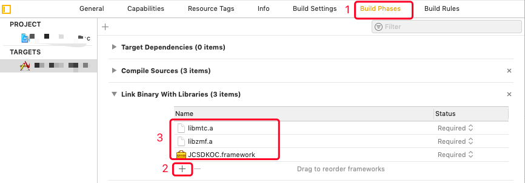
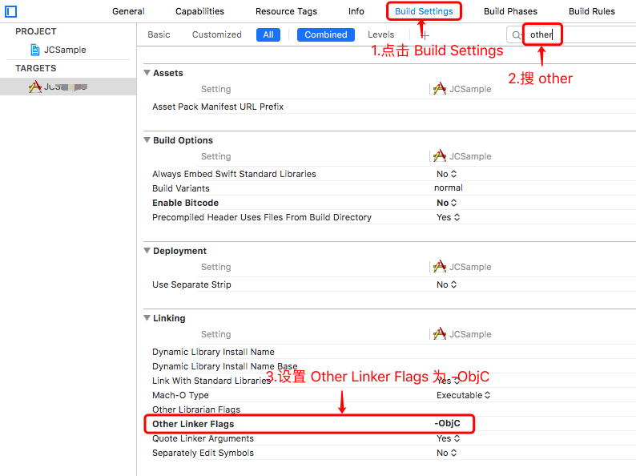
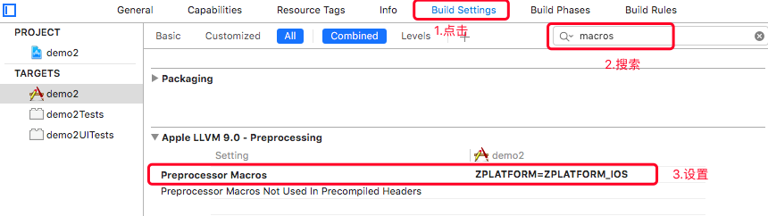
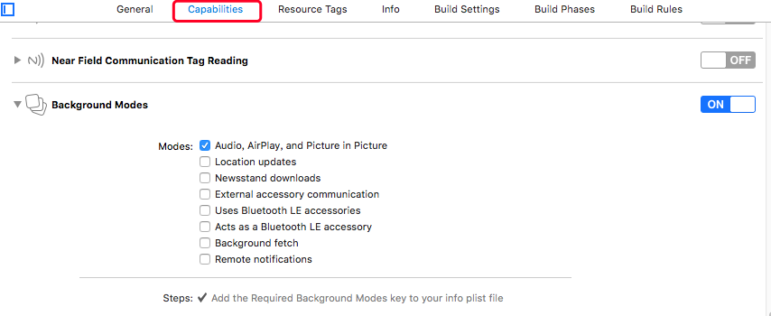

SDK 下载、配置和初始化
==========================

本节主要说明各开发平台 SDK 的下载、相关配置以及初始化。

.. _SDK 下载:

SDK 下载
------------------------------

目前支持 iOS、macOS、Android 和 Windows 开发平台，请点击下方链接下载相应的版本。

 - `iOS SDK 下载 <http://developer.juphoon.com/document/cloud-communication-ios-sdk#2>`_

 - `Android SDK 下载 <http://developer.juphoon.com/document/cloud-communication-android-sdk#2>`_

 - `Windows SDK 下载 <http://developer.juphoon.com/document/cloud-communication-windows-sdk#2>`_

完成 SDK 的下载后，您就可以进行 SDK 的配置和初始化了。

^^^^^^^^^^^^^^^^^^^^^^^^^^^^^^^^^^^^^^^^^^^^^^^^^^^^^^^^

.. _SDK 配置和初始化:

SDK 配置和初始化
------------------------------

 - :ref:`iOS SDK 配置和初始化<iOS SDK 配置和初始化>`

 - :ref:`Android SDK 配置和初始化<Android SDK 配置和初始化>`

 - :ref:`Windows SDK 配置和初始化<Windows SDK 配置和初始化>`

^^^^^^^^^^^^^^^^^^^^^^^^^^^^^^^^^^^^^

.. _iOS SDK 配置和初始化:

iOS SDK
-------------------------------

SDK 配置
>>>>>>>>>>>>>>>>>>>>>>>>>>>>>>
 
您可以导入 iOS 静态库或者动态库，在此默认导入静态库。如果您已经集成了多家音视频引擎，则推荐使用动态库，导入动态库说明文档请参阅 :ref:`iOS 导入动态库<iOS 导入动态库>` 。
 
只有完成 SDK 的导入之后，您才可以集成各种应用，请完成以下操作：

**导入静态库**

在 Mac 环境下打开下载的 iOS SDK，在 sdk 文件夹内包含了 lib、JCSDKOC.framework 和 include 三个文件。

.. image:: images/ios_sdk_list1.png

**拷贝文件**

** 将 sdk 文件夹拷贝到您工程所在的目录下。**

**工程设置**

1. 导入 SDK

点击 ‘Build Phases’，点击 ‘+’ 符号，导入 sdk 文件夹下的 JCSDKOC.framework、lib 文件夹下的两个 .a 文件，如下图：

2. 导入 SDK 依赖的库

点击 ‘Build Phases’，点击 ‘+’ 符号，导入下图红框中的库：

.. image:: images/inputotherlib.png

3. 设置路径

点击 ‘Build Settings’，找到 Framework Search Paths 和 Library Search Paths。并设置 Framework Search Paths 和 Library Search Paths，如下图：

.. note:: 在完成第1步导入 JCSDKOC.framework 和两个.a文件后，Xcode 会自动生成该路径，如果 Xcode 没有自动生成路径，用户要根据 JCSDKOC.framework 和 lib 库文件所在目录，手动设置路径。

4. 设置 Enable Bitcode 为 NO

点击 ‘Build Settings’，找到 Enable Bitcode 设置为 NO，如下图：

.. image:: images/iOS_integration_DynamicBitcode.png

5. 设置 Other Linker Flags 的参数为 -ObjC

点击 ‘Build Settings’，找到 Other Linker Flags 并添加参数 -ObjC，如下图：

6.设置预处理宏定义

点击 ‘Build Settings’，找到 Preprocessor Macros，在右侧输入 ZPLATFORM=ZPLATFORM_IOS，如下图：

.. _voipset:

**如果设置了 VOIP 推送**，则还需要在 Preprocessor Macros 下的 Debug 中输入 VOIP_PUSH_DEBUG，如下图：

.. image:: images/pushset.png

7. 设置 Documentation Comments 为 NO

点击 ‘Build Settings’，找到 Documentation Comments 并设置为 NO，如下图：

.. image:: images/static_import_ios1.png

8. 设置后台运行模式

点击 ‘Capabilities’，找到 Background Modes，勾选红框内的 Audio, AirPlay, and Picture in Picture ，如下图：

**权限设置**

9. 设置麦克风和摄像头权限

点击 ‘Info’，然后添加麦克风和摄像头的权限，如下图：

.. image:: images/iOS_integration_DynamicPermissions.png

10. 编译运行

以上步骤进行完后，编译工程，如果没有报错，恭喜您，您已经成功配置 SDK，可以进行下一步了。

.. note:: SDK 不支持模拟器运行，请使用真机。

.. _iOS SDK 初始化:

SDK 初始化
>>>>>>>>>>>>>>>>>>>>>>>>>>>>>>

在使用 SDK 任何方法之前，都应该首先进行 SDK 的初始化。

.. highlight:: objective-c

初始化 SDK，具体接口如下：
::

    /**
     *  @brief 创建 JCClient 实例
     *  @param appKey       用户从 Juphoon Cloud 平台上申请的 AppKey 字符串
     *  @param callback     回调接口，用于接收 JCClient 相关通知
     *  @param extraParams  额外参数，没有则填nil
     *  @return JCClient 对象
     */
    +(JCClient*)create:(NSString*)appKey callback:(id<JCClientCallback>)callback extraParams:(NSDictionary*)extraParams;

如何获取 AppKey 请参考 :ref:`创建应用 <创建应用>` 。

示例代码::

    - (BOOL)application:(UIApplication *)application didFinishLaunchingWithOptions:(NSDictionary *)launchOptions
    {
        // 初始化各模块，因为这些模块实例将被频繁使用，建议声明在单例中
        JCClient *client = [JCClient create:@"your appkey" callback:self extraParams:nil];
        JCMediaDevice *mediaDevice = [JCMediaDevice create:client callback:self];
        JCCall *call = [JCCall create:client mediaDevice:mediaDevice callback:self];
        JCMediaChannel *mediaChannel = [JCMediaChannel create:client mediaDevice:mediaDevice callback:self];
        JCMessageChannel *messageChannel = [JCMessageChannel create:client callback:self];
        JCStorage *storage = [JCStorage create:client callback:self];
        JCGroup *group = [JCGroup create:client callback:self];
        JCPush *push = [JCPush create:client];
        JCAccount *account = [JCAccount create:self];
        return YES;
    }

**后续步骤**

SDK 初始化之后，您即可进行登录的集成，详见 :ref:`iOS 登录<iOS 登录>`。

^^^^^^^^^^^^^^^^^^^^^^^^^^^^^^^

.. _Android SDK 配置和初始化:

Android SDK
-------------------------------

SDK 配置
>>>>>>>>>>>>>>>>>>>>>>>>>>>>>>>

1. 下载 SDK，拷贝 libs 文件夹内的 armeabi-v7a、X86、mtc.jar 、JCSDK.jar 和 zmf.jar 到您工程目录中的 libs 目录下，并打开工程，如下图所示:

.. image:: images/android_sdklist.png

.. image:: images/quickstart_android1.png

2. 为能连接到我们的 so 库，在您工程 build.gradle 文件中确保增加以下配置，如图:

.. image:: images/set_sdk_android2.png

3. 修改您工程中 Application 配置文件 AndroidManifest.xml，**请确保已经加入以下特性和权限信息**。具体信息可以参考 :ref:`Android 权限说明<Android 权限说明>` 。
::

    <uses-feature android:name="android.hardware.camera" />
    <uses-feature android:name="android.hardware.camera.autofocus" />
    <uses-permission android:name="android.permission.INTERNET" />
    <uses-permission android:name="android.permission.ACCESS_NETWORK_STATE" />
    <uses-permission android:name="android.permission.ACCESS_WIFI_STATE" />
    <uses-permission android:name="android.permission.READ_PHONE_STATE" />
    <uses-permission android:name="android.permission.WAKE_LOCK" />
    <uses-permission android:name="android.permission.CAMERA" />
    <uses-permission android:name="android.permission.RECORD_AUDIO" />
    <uses-permission android:name="android.permission.MODIFY_AUDIO_SETTINGS" />
    <uses-permission android:name="android.permission.WRITE_EXTERNAL_STORAGE" />
    <uses-permission android:name="android.permission.VIBRATE"/>
    <uses-permission android:name="android.permission.BLUETOOTH" />
    <uses-permission android:name="android.permission.SYSTEM_ALERT_WINDOW" />

4. 配置完成后编译运行，如果没有报错，恭喜您，您已经成功配置 SDK，可以进行下一步了。

.. note:: SDK 不支持模拟器运行，请使用真机。

.. _Android SDK 初始化:

SDK 初始化
>>>>>>>>>>>>>>>>>>>>>>>>>>>>>>>

在使用 SDK 任何方法之前，都应该首先进行 SDK 的初始化。

.. highlight:: java

初始化 SDK，具体接口如下：

::

    /**
     * 创建 JCClient 实例
     *
     * @param appKey      用户从 Juphoon Cloud 平台上申请的 AppKey 字符串
     * @param callback    回调接口，用于接收 JCClient 相关通知
     * @param extraParams 额外参数，没有则填null
     * @return JCClient 对象
     */
    public static JCClient create(Context context, String appKey, JCClientCallback callback, Map<String, String> extraParams)

如何获取 AppKey 请参考 :ref:`创建应用 <创建应用>` 。

示例代码::

    public boolean initialize(Context context) {
        // 初始化各模块，因为这些模块实例将被频繁使用，建议声明在单例中
        JCClient client = JCClient.create(Context, "your appkey", this, null);
        JCMediaDevice mediaDevice = JCMediaDevice.create(client, this);
        JCCall call = JCCall.create(client, mediaDevice, this);
        JCMediaChannel mediaChannel = JCMediaChannel.create(client, mediaDevice, this);
        JCMessageChannel messageChannel = JCMessageChannel.create(client, this);
        JCStorage storage = JCStorage.create(client, this);
        JCPush push = JCPush.create(client);
        JCGroup group = JCGroup.create(client, this);
        JCAccount account = JCAccount.create(this);
        return true;
    }

**后续步骤**

SDK 初始化之后，您即可进行登录的集成，详见 :ref:`Android 登录<Android 登录>`。

^^^^^^^^^^^^^^^^^^^^^^^^^^^^^^^

.. _Windows SDK 配置和初始化:

Windows SDK
------------------------------

SDK 配置
>>>>>>>>>>>>>>>>>>>>>>>>>>>>>>>

准备工作

1. 下载 Visual Studio 2013，请参考: `Visual Studio Downloads <https://www.visualstudio.com/en-us/downloads/download-visual-studio-vs.aspx>`_ 。

2. 安装 Directx End-User Runtime Web，请参考: `DirectX End-User Runtime Web <https://www.microsoft.com/zh-tw/download/details.aspx?id=35>`_ 。

.. note:: JC SDK Windows 版本（以下简称 SDK）支持 .net Framework 4.5及以上。

下载 Windows 版 SDK 并解压，解压后可以看到 bin 目录包含以下文件：

.. image:: images/windows_1.png

**导入Windows SDK**

1. 打开visual studio，新建WPF应用程序。

2. 点击“项目 > 添加引用”，将 bin 目录中的 JCSDK.dll，mtc.dll，mtcmanaged.dll，mtcwrap.dll，Newtonsoft.Json.dll，zmf.dll 和 zmfmanaged.dll 七个文件添加到您的工程目录中。

.. image:: images/windows_2.png

.. image:: images/windows_3_1.png

3. 在 Reference Manager 窗口中，可以看到添之后的文件，如下图：

.. image:: images/windows_4.png

4. 设置应用输出路径与库所在文件夹一致

.. image:: images/windows_5.png

5. 导入完成后编译运行，如果没有报错，恭喜您，您已经成功配置 SDK，可以进行下一步了。

.. _Windows SDK 初始化:

SDK 初始化
>>>>>>>>>>>>>>>>>>>>>>>>>>>>>>>

在使用 SDK 任何方法之前，都应该首先进行 SDK 的初始化。

.. highlight:: csharp

初始化 SDK，具体接口如下：

::

    /// 

    /// 创建 JCClient 实例
    /// 

    /// <param name="appKey">用户从 Juphoon Cloud 平台申请的 AppKey 字符串</param>
    /// <param name="callback">回调接口，用于接收 JCClient 相关通知</param>
    /// <param name="extraParams">额外参数，没有则填 null </param>
    /// <returns></returns>
    public static JCClient create(Application app, string appKey, JCClientCallback callback, Dictionary<string, string> extraParams)

如何获取 AppKey 请参考 :ref:`创建应用 <创建应用>` 。

示例代码::

    public bool initialize(Application app)
    {
        // 初始化各模块，因为这些模块实例将被频繁使用，建议声明在单例中
        JCClient client = JCClient.create(app, "your appkey", this, null);
        JCMediaDevice mediaDevice = JCMediaDevice.create(client, this);
        JCCall call = JCCall.create(client, mediaDevice, this);
        JCMediaChannel mediaChannel = JCMediaChannel.create(client, mediaDevice, this);
        JCMessageChannel messagechannel = JCMessageChannel.create(client, this);
        JCStorage storage = JCStorage.create(client, this);
        JCGroup group = JCGroup.create(client, this);
        JCDoodle doodle = JCDoodle.create(this);
        JCAccount account = JCAccount.create(this);
        JCConfig config = JCConfig.create();
        return true;
    }

**后续步骤**

SDK 初始化之后，您即可进行登录的集成，详见 :ref:`Windows 登录<Windows 登录>`。