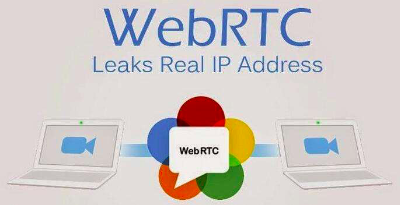

简介
--------------------

WebRTC(Web Real-Time Communication）是一个支持网页浏览器进行实时音视频通话的 API。它于2011年6月1日开源并在 Google、Mozilla、Opera 支持下被纳入万维网联盟的 W3C 推荐标准。

WebRTC 的优势是在浏览器中集成了媒体引擎，从而不需要另外安装插件或代理程序，可实现免安装使用；但并不是所有的浏览器都能够支持 WebRTC，目前 WebRTC 支持以下浏览器版本：

.. list-table::

   * - 桌上PC端
     - Microsoft Edge 12

       Google Chrome 23

       Mozilla Firefox 22

       Opera 18

       Safari 11（仍处于开发者预览阶段）
   * - Android端
     - Google Chrome 28（从版本29开始默认开启）

       Mozilla Firefox 24

       Opera Mobile 12

