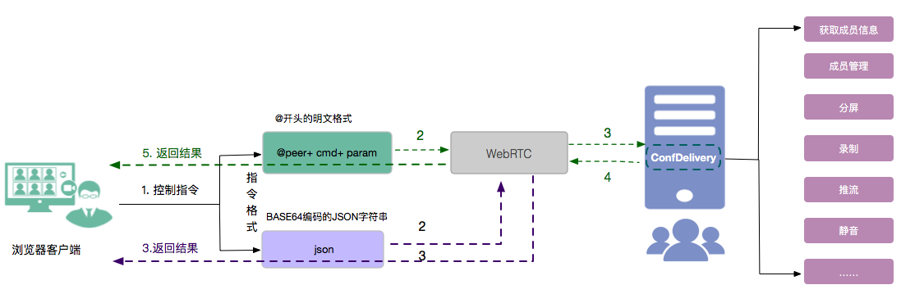

WebRTC 通讯原理
------------------------------

Web 端音视频通话是借助 WebRTC 搭建媒体通道，从而实现 Web 端与 ConfDelivery 之间的通信。ConfDelivery 作为一种特殊的终端，可实现 CDN 推流、会议录制、会议跟 WebRTC 对接服务等功能。

**WebRTC 支持以下浏览器：**

- Google Chrome 59.0.3071.115 及以上
- FireFox 54.0.1 (32 位) 及以上

**WebRTC 通讯原理如下：**

- 假设会场已经建立，Browser 创建 WebRTC 对象并通过 WebServer 接入 GW Entry；

- GW Entry 实例化网关 ConfDelivery，并通过 WebServer 透传 Offer/Answer 媒体协商 SDP；

- Browser 和 ConfDelivery 建立连接并完成协商；

- Browser 成功创建并加入或加入已存在的会场；

会议中的控制信息通过 Data-Channel 进行传递。

对于业务上的控制，由于 ConfDelivery 运行在服务器，由 JSMD(会议引擎）负责启动并传递初始配置，所以其他业务上的控制，只能通过特定的控制协议，远程操作 ConfDelivery 完成。

**控制协议有两种格式：**

- 以 @ 开头的明文格式，适合手工输入，但无法处理特殊字符，此格式下 ConfDelivery 会自动反馈结果；

- BASE64 编码的 JSON 串，适合由代码构造，可以处理特殊字符，但没有反馈机制。

两种格式的控制指令具体运行机制如下图：

在 @ 开头的明文格式下，Web 端通过发送指令直接作用到目标对象，并通过 ConfDelivery 对目标对象进行相应的处理。

在 BASE64 编码的 JSON 字符串中，通过把会议指令进行加密，直接作用到 WebRTC，并由 WebRTC 对指令进行后续的处理。

两种控制指令的格式说明如下表所示：

.. list-table::
   :header-rows: 1

   * - 指令格式
     - 说明
   * - @ 开头的明文格式
     - @开头的明文格式之后必须紧跟 ConfDelivery 的短名,然后是指令
     
       形式如下：

       '@'+peer+cmd+param

        - peer为指令发送的目标
        - cmd 为指令,大小写不敏感
        - param为相应参数

       举例：

       ConfDelivery 的账户 ID 是 
       
       [username:delivery0121@101055.cloud.justalk.com]，

       则如下打印帮助的指令都是正确的：

        - @delivery0121 help
        - @delivery0121help
   * - BASE64 编码的 JSON 格式
     - 格式为：{"cmd":"cmd",param} 

       - cmd 为指令, param为相应参数

       举例：

       修改成员昵称的指令：
       
       {"cmd":"setnick", "nick":%s, "target":%s}
