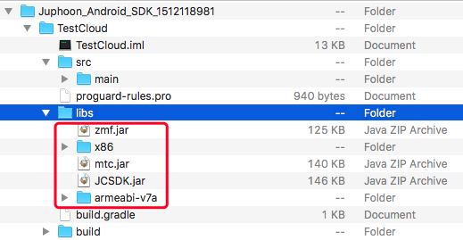
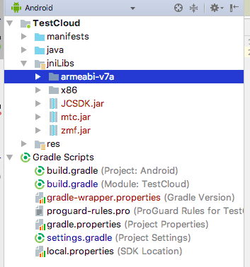

Android
============================

.. highlight:: java

前提条件
----------------------------------

- Android SDK API 等级 16 或以上

- 支持 Android 4.1 或以上版本的移动设备

- 有效的菊风开发者账号（`免费注册 <http://developer.juphoon.com/signup>`_ ）

准备工作
----------------------------

开始之前，请您先做好如下准备工作：

SDK 下载
>>>>>>>>>>>>>>>>>>>>>>>>>>>>>>>>>>

点击 `Android SDK <http://developer.juphoon.com/document/cloud-communication-android-sdk#2>`_ 进行下载。

AppKey 获取
>>>>>>>>>>>>>>>>>>>>>>>>>>>>>>>>>>

AppKey 是应用在菊风云平台中的唯一标识。需要在 SDK 初始化的时候使用，AppKey 获取请参考 :ref:`创建应用 <创建应用>` 。

SDK 配置
>>>>>>>>>>>>>>>>>>>>>>>>>>>>>>>>>>

有两种方式集成 JC SDK：

**方法一：使用 JCenter 自动集成**

.. note:: 该方法仅适用于 2.0 及以上版本的 JC SDK 集成。
 
在项目的 /app/build.gradle 文件中，添加如下行：

::

    ...
    dependencies {
        ...
        // 可通过 SDK 发版说明取得最新版本号
        implementation 'com.JuphoonCloud:JC-SDK:2.0'
    }

**方法二：手动导入 JC SDK**

1. 下载 SDK，拷贝 libs 文件夹内的 armeabi-v7a、X86、mtc.jar 、JCSDK.jar 和 zmf.jar 到您工程目录中的 libs 目录下，并打开工程，如下图所示:

2. 为能连接到我们的 so 库，在您工程 build.gradle 文件中确保增加以下配置，如图:

.. image:: images/set_sdk_android2.png

3. 修改您工程中 Application 配置文件 AndroidManifest.xml，**请确保已经加入以下特性和权限信息**。具体信息可以参考 :ref:`Android 权限说明<Android 权限说明>` 。
::

    <uses-feature android:name="android.hardware.camera" />
    <uses-feature android:name="android.hardware.camera.autofocus" />
    <uses-permission android:name="android.permission.INTERNET" />
    <uses-permission android:name="android.permission.ACCESS_NETWORK_STATE" />
    <uses-permission android:name="android.permission.ACCESS_WIFI_STATE" />
    <uses-permission android:name="android.permission.READ_PHONE_STATE" />
    <uses-permission android:name="android.permission.WAKE_LOCK" />
    <uses-permission android:name="android.permission.CAMERA" />
    <uses-permission android:name="android.permission.RECORD_AUDIO" />
    <uses-permission android:name="android.permission.MODIFY_AUDIO_SETTINGS" />
    <uses-permission android:name="android.permission.WRITE_EXTERNAL_STORAGE" />
    <uses-permission android:name="android.permission.VIBRATE"/>
    <uses-permission android:name="android.permission.BLUETOOTH" />
    <uses-permission android:name="android.permission.SYSTEM_ALERT_WINDOW" />

.. note::

    您在 AndroidManifest 中进行权限配置时，请确保您能够获得打开摄像头、音视频录制等相关权限。

4. 配置完成后编译运行，如果没有报错，恭喜您，您已经成功配置 SDK，可以进行 SDK 初始化了。

.. note:: SDK 不支持模拟器运行，请使用真机。

SDK 初始化
>>>>>>>>>>>>>>>>>>>>>>>>>>>>>>>>>>

.. _Android SDK 初始化:

在使用 SDK 之前，需要进行 SDK 的初始化。在 App 的整个生命周期中，开发者只需要将 SDK 初始化一次。

首先在需要使用 JC SDK 的地方引入相关的类::

    import com.juphoon.cloud.JCClient;

在实现初始化的文件中实现 JCClientCallback 回调，用于接收 JCClient 相关通知。

在初始化的时候还可以设置 SDK 信息存储目录，日志路径以及日志打印的等级，具体通过 createParam 对象设置，如果不设置则使用默认值。

CreateParam 类有以下属性
::

    /**
     * SDK 相关信息存放目录，包括账号信息，日志信息等，默认为 sdcard/Android/data/包名/files 下
     */
    public String sdkInfoDir;
    /**
     * SDK 日志目录，如果不设置则默认在 sSdkInfoDir 下的 log 目录中
     */
    public String sdkLogDir;
    /**
     * 是否内部自动加载so库，默认为 true，如果上层需要自己加载则设置为 false
     */
    public boolean needLoadLibrary = true;
    /**
     * sdk 日志等级
     */
    public @LogLevel int sdkLogLevel;

日志等级 sdkLogLevel 有以下几种
::

    /**
     * disable日志等级
     */
    public static final int LOG_LEVEL_DISABLE = 0;
    /**
     * error日志等级
     */
    public static final int LOG_LEVEL_ERROR = 1;
    /**
     * info日志等级
     */
    public static final int LOG_LEVEL_INFO = 2;
    /**
     * debug日志等级
     */
    public static final int LOG_LEVEL_DEBUG = 3;

调用下面的接口初始化 SDK
::

    /**
     * 创建 JCClient 实例
     *
     * @param context   上下文句柄
     * @param appKey    用户从 Juphoon Cloud 平台上申请的 AppKey 字符串
     * @param callback    回调接口，用于接收 JCClient 相关通知
     * @param createParam 创建参数，null 则按默认值创建
     * @return JCClient 对象
     */
    public static JCClient create(@NonNull Context context, @NonNull String appKey, @NonNull JCClientCallback callback, CreateParam createParam) {

.. note::

       appKey 为准备工作中“获取 AppKey”步骤中取得的 AppKey。如果还未获取 AppKey，请参考 :ref:`创建应用 <创建应用>` 来获取。

示例代码::

    public boolean initialize(Context context) {
        // 初始化各模块，因为这些模块实例将被频繁使用，建议声明在单例中
        JCClient.CreateParam createParam = new JCClient.CreateParam(this);
        createParam.sdkLogLevel = LOG_LEVEL_INFO;
        createParam.sdkInfoDir = "SDK 信息存放路径";
        createParam.sdkLogDir = "日志存放路径";
        JCClient client = JCClient.create(Context, "your appkey", this, createParam);
        return true;
    }

SDK 初始化之后，可以调用下面的方法获取创建参数
::

    /**
     * 创建参数
     * @return 创建参数
     */
    public abstract CreateParam getCreateParam();

示例代码
::

    JCClient.CreateParam createParam = client.getCreateParam();

SDK 初始化之后，即可进行登录的集成。

登录
----------------------------------

.. _Android 登录:

登录涉及 JCClient 类及其回调 JCClientCallback，其主要作用是负责登录、登出管理及帐号信息存储。

登录之前，可以通过 loginParam 登录参数进行登录的相关配置，如服务器地址的设置或者使用代理服务器登录，如不设置则按照默认值登录，具体如下：

::

        JCClient.LoginParam loginParam = new JCClient.LoginParam();
        //默认国内环境 http:cn.router.justalkcloud.com:8080
        loginParam.serverAddress = "服务器地址";
        //如果使用代理服务器登录
        loginParam.httpsProxy = "代理服务器地址";

其中，服务器地址包括国际环境服务器地址和国内环境服务器地址：

**国际环境** 服务器地址默认为 ``http:intl.router.justalkcloud.com:8080`` 。

**国内环境** 服务器地址默认为 ``http:cn.router.justalkcloud.com:8080`` 。

开发者可以使用自定义服务器地址。

还可以通过 setDisplayName 接口设置昵称
::

    /**
     * 设置昵称，用于通话，消息等，可以更直观的表明身份
     * @param displayName 昵称
     */
    public abstract void setDisplayName(@NonNull String displayName);

示例代码::

    client.setDisplayName("小张");

发起登录
>>>>>>>>>>>>>>>>>>>>>>>>>>>

登录参数设置之后，即可调用 login 接口发起登录操作，userId 为英文、数字和'+' '-' '_' '.'，大小写不敏感，长度不要超过64字符，'-' '_' '.'不能作为第一个字符
::

    /**
     * 登陆 Juphoon Cloud 平台，只有登陆成功后才能进行平台上的各种业务 
     * 登陆结果通过 JCCallCallback 通知 
     * 注意:用户名为英文数字和'+' '-' '_' '.'，长度不要超过64字符，'-' '.' '_'字符不能处于第一位 
     *
     * @param userId   用户名
     * @param password 密码，但不能为空
     * @param loginParam 登录参数，null 则按默认值
     * @return 返回 true 表示正常执行调用流程，false 表示调用异常，异常错误通过 JCClientCallback 通知
     */
    public abstract boolean login(@NonNull String userId, @NonNull String password, LoginParam loginParam);

其中，LoginParam 类有以下属性
::

        /**
         * 登录服务器地址
         */
        public String serverAddress = "http:cn.router.justalkcloud.com:8080";
        /**
         * https代理地址，例如 192.168.1.100:3128
         */
        public String httpsProxy;
        /**
         * 设备id，一般模拟器使用，因为模拟器可能获得的设备id都一样
         */
        public String deviceId;
        /**
         * 登录账号不存在的情况下是否内部自动创建该账号，默认为 true
         */
        public boolean autoCreateAccount = true;

示例代码：
::

        JCClient.LoginParam loginParam = new JCClient.LoginParam();
        //默认国内环境 http:cn.router.justalkcloud.com:8080
        loginParam.serverAddress = "http:cn.router.justalkcloud.com:8080";
        client.login("账号", "123", loginParam);

登录成功之后，首先会触发登录状态改变（onClientStateChange）回调
::

    /**
     * 登录状态变化通知
     *
     * @param state    当前状态值
     * @param oldState 之前状态值
     */
    void onClientStateChange(@JCClient.ClientState int state, @JCClient.ClientState int oldState);

ClientState 有::

    // 未初始化
    public static final int STATE_NOT_INIT = 0;
    // 未登录
    public static final int STATE_IDLE = 1;
    // 登录中
    public static final int STATE_LOGINING = 2;
    // 登录成功
    public static final int STATE_LOGINED = 3;
    // 登出中
    public static final int STATE_LOGOUTING = 4;

示例代码::

    public void onClientStateChange(@JCClient.ClientState int state, @JCClient.ClientState int oldState) {
         if (state == JCClient.STATE_IDLE) { // 未登录
           ...
        } else if (state == JCClient.STATE_LOGINING) { // 正在登录
           ...
        } else if (state == JCClient.STATE_LOGINED) { // 登录成功
           ... 
        } else if (state == JCClient.STATE_LOGOUTING) { // 登出中
           ...
        }
    }

之后通过 onLogin 回调上报登录结果
::

    /**
     * 登陆结果回调
     *
     * @param result true 表示登陆成功，false 表示登陆失败
     * @param reason 当 result 为 false 时该值有效
     */
    void onLogin(boolean result, @JCClient.ClientReason int reason);

其中，ClientReason 有
::

    /**
     * 正常
     */
    public static final int REASON_NONE = 0;
    /**
     * sdk 未初始化
     */
    public static final int REASON_SDK_NOT_INIT = 1;
    /**
     * 无效参数
     */
    public static final int REASON_INVALID_PARAM = 2;
    /**
     * 函数调用失败
     */
    public static final int REASON_CALL_FUNCTION_ERROR = 3;
    /**
     * 当前状态无法再次登录
     */
    public static final int REASON_STATE_CANNOT_LOGIN = 4;
    /**
     * 超时
     */
    public static final int REASON_TIMEOUT = 5;
    /**
     * 网络异常
     */
    public static final int REASON_NETWORK = 6;
    /**
     * appkey 错误
     */
    public static final int REASON_APPKEY = 7;
    /**
     * 账号密码错误
     */
    public static final int REASON_AUTH = 8;
    /**
     * 无该用户
     */
    public static final int REASON_NOUSER = 9;
    /**
     * 强制登出
     */
    public static final int REASON_SERVER_LOGOUT = 10;
    /**
     * 其他错误
     */
    public static final int REASON_OTHER = 100;

登录成功之后，SDK 会自动保持与服务器的连接状态，直到用户主动调用登出接口，或者因为帐号在其他设备登录导致该设备登出。

登录之后可以通过下面的方法获取昵称、用户标识以及登录参数
::

    /**
     * 获取昵称
     *
     * @return 昵称
     */
    public abstract String getDisplayName();

    /**
     * 获得用户标识
     *
     * @return 用户标识
     */
    public abstract String getUserId();

    /**
     * 登录参数，只有调用登录接口后会有值，登出后为 nil
     * @return 登录参数
     */
    public abstract LoginParam getLoginParam();

示例代码::

        JCClient.CreateParam createParam = client.getCreateParam();
        JCClient.LoginParam loginParam = client.getLoginParam();
        String displayName = client.getDisplayName();
        String userId = client.getUserId();

登出
>>>>>>>>>>>>>>>>>>>>>>>>>>>

登出调用下面的方法，登出后不能进行平台上的各种业务操作
::

    /**
     * 登出 Juphoon Cloud 平台，登出后不能进行平台上的各种业务
     *
     * @return 返回 true 表示正常执行调用流程，false 表示调用异常，异常错误通过 JCClientCallback 通知
     */
    public abstract boolean logout();

登出同样会触发登录状态改变（onClientStateChange）回调

之后将通过 onlogout 回调上报登出结果
::

    /**
     * 登出回调
     *
     * @param reason 登出原因
     */
    void onLogout(@JCClient.ClientReason int reason);

集成登录后，即可进行相关业务的集成。

``SDK 支持前后台模式，可以在应用进入前台或者后台时调用 JCClient 类中的 setForeground 方法进行设置``

::

    /**
     * 设置是否为前台, 在有控制后台网络的手机上当进入前台时主动触发
     *
     * @param foreground 是否为前台
     */
    public abstract void setForeground(boolean foreground);

^^^^^^^^^^^^^^^^^^^^^^^^^^^^^^^

完成以上步骤，就做好了基础工作，您可以开始集成业务了。

业务集成
----------------------------

一对一视频通话涉及以下类：

.. list-table::
   :header-rows: 1

   * - 名称
     - 描述
   * - `JCCall <https://developer.juphoon.com/portal/reference/V2.0/android/com/juphoon/cloud/JCCall.html>`_
     - 一对一通话类，包含一对一语音和视频通话功能
   * - `JCCallItem <https://developer.juphoon.com/portal/reference/V2.0/android/com/juphoon/cloud/JCCallItem.html>`_ 
     - 通话对象类，此类主要记录通话的一些状态，UI 可以根据其中的状态进行显示逻辑
   * - `JCCallCallback <https://developer.juphoon.com/portal/reference/V2.0/android/com/juphoon/cloud/JCCallCallback.html>`_
     - 通话模块回调代理
   * - `JCMediaDevice <https://developer.juphoon.com/portal/reference/V2.0/android/com/juphoon/cloud/JCMediaDevice.html>`_
     - 设备模块，主要用于视频、音频设备的管理
   * - `JCMediaDeviceVideoCanvas <https://developer.juphoon.com/portal/reference/V2.0/android/com/juphoon/cloud/JCMediaDeviceVideoCanvas.html>`_
     - 视频对象，主要用于 UI 层视频显示、渲染的控制
   * - `JCMediaDeviceCallback <https://developer.juphoon.com/portal/reference/V2.0/android/com/juphoon/cloud/JCMediaDeviceCallback.html>`_
     - 设备模块回调代理

接口的详细信息请参考 `API 说明文档 <https://developer.juphoon.com/portal/reference/V2.0/android/>`_ 。

*接口调用逻辑和相关状态*

.. image:: 1-1workflowandroid.png

*说明：黑色字体表示接口，棕色字体表示通话状态*

.. note::

    通话方向（direction）及通话状态（state）可通过 `JCCallItem <https://developer.juphoon.com/portal/reference/V2.0/android/com/juphoon/cloud/JCCallItem.html>`_  对象中的 `getDirection() <http://developer.juphoon.com/portal/reference/android/com/juphoon/cloud/JCCallItem.html#getDirection-->`_ 方法和 `getState() <http://developer.juphoon.com/portal/reference/android/com/juphoon/cloud/JCCall.html#STATE_INIT>`_ 方法获得。

**开始集成通话功能前，请先实现 JCMediaDeviceCallback, JCCallCallback 回调，用于接收 JCMediaDevice 和 JCCall 的相关通知**

之后进行 ``模块的初始化``

创建 JCMediaDevice 实例
::

    /**
     * 创建 JCMediaDevice 对象
     *
     * @param client   JCClient 对象
     * @param callback JCMediaDeviceCallback 回调接口，用于接收 JCMediaDevice 相关通知
     * @return 返回 JCMediaDevice 对象
     */
    public static JCMediaDevice create(JCClient client, JCMediaDeviceCallback callback);

创建 JCCall 实例
::

    /**
     * 创建JCCall实例
     *
     * @param client        JCClient实例
     * @param mediaDevice   JCMediaDevice实例
     * @param callback      回调接口，用于接收 JCCall 相关回调事件
     * @return JCCall       JCCall实例
     */
    public static JCCall create(JCClient client, JCMediaDevice mediaDevice, JCCallCallback callback);

示例代码
::

    // 初始化各模块，因为这些模块实例将被频繁使用，建议声明在单例中
    JCMediaDevice mediaDevice = JCMediaDevice.create(client, this);
    JCCall call = JCCall.create(client, mediaDevice, this);

**开始集成**

1. 拨打通话
>>>>>>>>>>>>>>>>>>>>>>>>>>>>>>>>>

主叫调用下面的接口发起视频通话，此时 video 传入值为 true
::

    /**
     * 一对一呼叫
     *
     * @param userId        用户标识
     * @param video         是否视频呼叫
     * @param extraParam    透传参数，设置后被叫方可获取该参数
     * @return              返回 true 表示正常执行调用流程，false 表示调用异常
     */
    public abstract boolean call(String userId, boolean video, String extraParam);

.. note:: 

       调用此接口会自动打开音频设备。

       extraParam 为自定义透传字符串，被叫可通过 `JCCallItem <https://developer.juphoon.com/portal/reference/V2.0/android/com/juphoon/cloud/JCCallItem.html>`_  对象中的 `getExtraParam() <http://developer.juphoon.com/portal/reference/android/com/juphoon/cloud/JCCallItem.html#getExtraParam-->`_ 方法获取 extraParam 属性。

通话发起后，主叫和被叫均会收到新增通话的回调，此时通话状态变为 STATE_PENDING
::

    /**
     * 新增通话回调
     *
     * @param item JCCallItem 对象
     */
    void onCallItemAdd(JCCallItem item);

示例代码::

    public void onCallItemAdd(JCCallItem item) {
        // 新增通话回调
    }

.. note::

        如果主叫想取消通话，可以直接转到第4步，调用第4步中的挂断通话的接口。这种情况下调用挂断后，通话状态变为 STATE_CANCEL.

创建本地视频画面
^^^^^^^^^^^^^^^^^^^^^^^^^^^^^^^^^^^

通话发起后，即可调用 JCMediaDevice 类中的 :ref:`startCameraVideo<创建本地视频画面(android)>` 方法打开本地视频预览，**调用此方法会打开摄像头**
::

    /**
     * 获得视频预览对象，通过此对象能获得视频用于UI显示
     *
     * @param renderType    渲染模式
     * @return              JCMediaDeviceVideoCanvas 对象
     * @see RenderType
     */
    public abstract JCMediaDeviceVideoCanvas startCameraVideo(@RenderType int renderType);

其中，RenderType（渲染模式）有以下几种：
::

    /**
     * 铺满窗口
     */
    public static final int RENDER_FULL_SCREEN = 0;
    /**
     * 全图像显示，会有黑边，类似放电影的荧幕
     */
    public static final int RENDER_FULL_CONTENT = 1;
    /**
     * 自适应
     */
    public static final int RENDER_FULL_AUTO = 2;

.. note:: 调用该方法后，在挂断通话或者关闭摄像头时需要对应调用 stopVideo 方法停止视频。

调用该方法采集分辨率默认值为 640*360，帧率为 30，默认打开的是前置摄像头。

如果想自定义摄像头采集参数，如采集的高度、宽度和帧速率以及旋转角度等，请参考 :ref:`视频采集和渲染<视频采集和渲染(Android)>`。

示例代码::

    // 发起视频呼叫
    call.call("peer number", true, "自定义透传字符串");
    // 打开本地视频预览
    JCMediaDeviceVideoCanvas localCanvas = mediaDevice.startCameraVideo(JCMediaDevice.RENDER_FULL_CONTENT);
    viewGroup.addView(localCanvas.getVideoView(), 0);

2. 应答通话
>>>>>>>>>>>>>>>>>>>>>>>>>>>>>>>>>

被叫收到 onCallItemAdd 回调事件，此时可通过 JCCallItem 中的 `getVideo() <https://developer.juphoon.com/portal/reference/V2.0/android/com/juphoon/cloud/JCCallItem.html#getVideo-->`_ 方法以及 `getDirection() <https://developer.juphoon.com/portal/reference/V2.0/android/com/juphoon/cloud/JCCallItem.html#getDirection-->`_ 方法获取 video 和 direction 属性，并根据 video 属性的值以及 direction 属性的值判断是视频呼入还是语音呼入，然后调用下面的接口选择视频应答或者语音应答
::

    /**
     * 接听
     *
     * @param item  JCCallItem 对象
     * @param video 针对视频呼入可以选择以视频接听还是音频接听
     * @return 返回 true 表示正常执行调用流程，false 表示调用异常
     */
    public abstract boolean answer(JCCallItem item, boolean video);

如果被叫应答通话成功，双方都会收到 onCallItemUpdate 的回调。

示例代码::

    public void onCallItemAdd(JCCallItem item) {
        // 如果是视频呼入且在振铃中
        if (item.getDirection() == JCCall.DIRECTION_IN && item.getVideo()) {
            // 应答通话
            call.answer(item, true);
        }
    }

通话接听后，通话状态变为 STATE_CONNECTING。

.. note::

        如果要拒绝通话，可以直接转到第4步，调用第4步中的挂断通话的接口。这种情况下调用挂断后，通话状态变为 STATE_CANCELED。

3. 通话建立
>>>>>>>>>>>>>>>>>>>>>>>>>>>>>>>>>

被叫接听通话后，双方将建立连接，此时，主叫和被叫都将会收到通话更新的回调（onCallItemUpdate），通话状态变为 STATE_TALKING。连接成功之后，可以进行远端视频的渲染。

创建远端视频画面
^^^^^^^^^^^^^^^^^^^^^^^^^^^^^^^^^^^

远端视频画面的获取通过调用 JCMediaDevice 类中的 :ref:`startVideo<创建远端视频画面(android)>` 方法实现 
::

    /**
     * 获得视频对象，通过此对象能获得视频用于UI显示
     *
     * @param videoSource   渲染标识串，比如 JCMediaChannelParticipant JCCallItem 中的 renderId
     * @param renderType    渲染模式
     * @return              JCMediaDeviceVideoCanvas 对象
     * @see RenderType
     */
    public abstract JCMediaDeviceVideoCanvas startVideo(String videoSource, @RenderType int renderType);

.. note:: 调用该方法后，在挂断通话或者关闭摄像头时需要对应调用 stopVideo 方法停止视频。

现在您可以进行一对一视频通话了。

示例代码::

    public void onCallItemUpdate(JCCallItem item) {
        // 如果对端在上传视频流（uploadVideoStreamOther）
        if (item.getState() == JCCall.STATE_TALKING && remoteCanvas == null && item.getUploadVideoStreamOther()) {
            // 获取远端视频画面，renderId来源JCCallItem对象
            JCMediaDeviceVideoCanvas remoteCanvas = mediaDevice.startVideo(item.renderId, JCMediaDevice.RENDER_FULL_CONTENT);
            viewGroup.addView(remoteCanvas.getVideoView(), 0);
        }
    }

4. 挂断通话
>>>>>>>>>>>>>>>>>>>>>>>>>>>>>>>>>

主叫或者被叫均可以挂断通话，首先调用下面的接口获取当前活跃的通话对象
::

    /**
     * 获得当前活跃的通话
     *
     * @return 有返回 JCCallItem 对象，没有返回 null
     */
    public abstract JCCallItem getActiveCallItem();

当前活跃通话对象获取后，调用下面的方法挂断通话
::

    /**
     * 挂断
     *
     * @param item          JCCallItem 对象
     * @param reason        挂断原因
     * @param description   挂断描述
     * @return              返回 true 表示正常执行调用流程，false 表示调用异常
     * @see CallReason
     */
    public abstract boolean term(JCCallItem item, @CallReason int reason, String description);

示例代码::

    JCCallItem item = call.getActiveCallItem();
    call.term(item, JCCall.REASON_NONE, null);

销毁本地和远端视频画面
^^^^^^^^^^^^^^^^^^^^^^^^^^^^^^^^^^^

通话挂断后，还需要调用 :ref:`stopVideo<销毁本地和远端视频画面(android)>` 接口移除视频画面
::

    /**
     * 停止视频
     *
     * @param canvas JCMediaDeviceVideoCanvas 对象，由 startVideo 获得
     */
    public abstract void stopVideo(JCMediaDeviceVideoCanvas canvas);

通话挂断后，UI 会收到移除通话的回调，通话状态变为 STATE_OK
::

    /**
     * 移除通话回调
     *
     * @param item          JCCallItem 对象
     * @param reason        通话结束原因
     * @param description   通话结束原因的描述，只有被动挂断的时候，才会收到这个值，其他情况下则返回空字符串
     */
    void onCallItemRemove(JCCallItem item, @JCCall.CallReason int reason, String description);

示例代码::

    public void onCallItemRemove(JCCallItem item, @JCCall.CallReason int reason, String description) {  // 移除通话回调
       if (mLocalCanvas != null) { // 本地视频销毁
            mContentView.removeView(mLocalCanvas.getVideoView());
            JCManager.getInstance().mediaDevice.stopVideo(mLocalCanvas);
            mLocalCanvas = null;
        }
        if (mRemoteCanvas != null) { // 远端视频销毁
            mContentView.removeView(mRemoteCanvas.getVideoView());
            JCManager.getInstance().mediaDevice.stopVideo(mRemoteCanvas);
            mRemoteCanvas = null;
        }
    }

其中，reason 有以下几种

.. list-table::
   :header-rows: 1

   * - 名称
     - 描述
   * - REASON_NONE = 0
     - 无异常
   * - REASON_NOT_LOGIN = 1
     - 未登录
   * - REASON_CALL_FUNCTION_ERROR = 2
     - 函数调用错误
   * - REASON_TIMEOUT = 3
     - 超时
   * - REASON_NETWORK = 4
     - 网络错误
   * - REASON_OVER_LIMIT = 5
     - 超出通话上限
   * - REASON_TERM_BY_SELF = 6
     - 自己挂断
   * - REASON_ANSWER_FAIL = 7
     - 应答失败
   * - REASON_BUSY = 8
     - 忙
   * - REASON_DECLINE = 9
     - 拒接
   * - REASON_USER_OFFLINE = 10
     - 用户不在线
   * - REASON_NOT_FOUND = 11
     - 无此用户
   * - REASON_REJECT_VIDEO_WHEN_HAS_CALL
     - 已有通话拒绝视频来电
   * - REASON_REJECT_WHEN_HAS_VIDEO_CALL
     - 已有视频通话拒绝来电
   * - REASON_OTHER = 100
     - 其他错误

**通话挂断的其他情况：**

如果拨打通话时，**对方未在线，或者主叫呼叫后立即挂断**，则对方再次上线时会收到未接来电的回调

::

    /**
     * 上报服务器拉取的未接来电
     *
     * @param item    JCCallItem 对象
     */
    void onMissedCallItem(JCCallItem item);

此时通话状态变为 STATE_MISSED。

