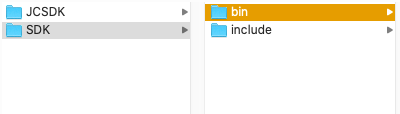

Windows
==============================

.. _一对一视频通话-Windows:

.. highlight:: csharp

前提条件
----------------------------------

- Microsoft Visual Studio 2013 或以上版本

- 支持 Windows 7 或以上版本的 Windows 设备

- 有效的菊风开发者账号（`免费注册 <http://developer.juphoon.com/signup>`_ ）

准备工作
------------------------------

开始之前，请您先做好如下准备工作：

SDK 下载
>>>>>>>>>>>>>>>>>>>>>>>>>>>>>>>>>>

点击 `Windows SDK <http://developer.juphoon.com/document/cloud-communication-windows-sdk#2>`_ 进行下载。

AppKey 获取
>>>>>>>>>>>>>>>>>>>>>>>>>>>>>>>>>>

AppKey 是应用在菊风云平台中的唯一标识。需要在 SDK 初始化的时候使用，AppKey 获取请参考 :ref:`创建应用 <创建应用>` 。

SDK 配置
>>>>>>>>>>>>>>>>>>>>>>>>>>>>>>>>>>

.. _Windows SDK 配置:

准备工作：

1. 下载 Visual Studio 2013，请参考: `Visual Studio Downloads <https://www.visualstudio.com/en-us/downloads/download-visual-studio-vs.aspx>`_ 。

2. 安装 Directx End-User Runtime Web，请参考: `DirectX End-User Runtime Web <https://www.microsoft.com/zh-tw/download/details.aspx?id=35>`_ 。

.. note:: JC SDK Windows 版本（以下简称 SDK）支持 .net Framework 4.5及以上。

解压 SDK：

下载 Windows 版 SDK 并解压，解压后的目录如下：

**导入Windows SDK**

1. 打开visual studio，新建 WPF 应用程序。

2. 点击“项目 > 添加引用”，将 bin 目录中的 JCSDK.dll，mtc.dll，mtcmanaged.dll，mtcwrap.dll，Newtonsoft.Json.dll，zmf.dll 和 zmfmanaged.dll 七个文件添加到您的工程目录中。

.. image:: images/windows_2.png

.. image:: images/windows_3_1.png

3. 在 Reference Manager 窗口中，可以看到添之后的文件，如下图：

.. image:: images/windows_4.png

4. 设置应用输出路径与库所在文件夹一致

.. image:: images/windows_5.png

5. 导入完成后编译运行，如果没有报错，恭喜您，您已经成功配置 SDK，可以进行 SDK 初始化了。

SDK 初始化
>>>>>>>>>>>>>>>>>>>>>>>>>>>>>>>>>>

.. _Windows SDK 初始化:

在实现初始化的文件中实现 JCClientCallback 回调，用于接收 JCClient 相关通知。

在初始化的时候还可以设置 SDK 信息存储目录，日志路径以及日志打印的等级，具体通过 CreateParam 对象设置，如果不设置则使用默认值。

CreateParam 对象有以下属性
::

    /// 

    /// SDK 相关信息存放目录，包括账号信息，日志信息等
    /// 

    public String sdkInfoDir;
    /// 

    /// SDK 日志目录
    /// 

    public String sdkLogDir;
    /// 

    /// SDK 日志打印等级
    /// 

    public JCLogLevel sdkLogLevel; 

调用下面的接口初始化 SDK

::

        /// 

        /// 创建 JCClient 实例
        /// 

        /// <param name="app">创建实例依赖的程序APP</param>
        /// <param name="appKey">用户从 Juphoon Cloud 平台申请的 AppKey 字符串</param>
        /// <param name="callback">回调接口，用于接收 JCClient 相关通知</param>
        /// <param name="createParam">创建参数</param>
        /// <returns>创建成功则返回创建的实例，否则返回null</returns>
        public static JCClient create(Application app, string appKey, JCClientCallback callback, CreateParam createParam)

.. note::

       appKey 为准备工作中“获取 AppKey”步骤中取得的 AppKey。如果还未获取 AppKey，请参考 :ref:`创建应用 <创建应用>` 来获取。

示例代码::

    public bool initialize(Application app)
    {
        // 初始化各模块，因为这些模块实例将被频繁使用，建议声明在单例中
         JCClient.CreateParam createParam = new JCClient.CreateParam();
         createParam.sdkInfoDir = "SDK 信息存放路径";
         createParam.sdkLogDir = "日志存放路径";
         createParam.sdkLogLevel = JCLogLevel.Info;
         JCClient client = JCClient.create(app, "your appkey", this, createParam);
         return true;
    }

SDK 初始化之后，即可进行登录的集成。

登录
------------------------

.. _Windows 登录:

登录涉及 JCClient 类及其回调 JCClientCallback，其主要作用是负责登录、登出管理及帐号信息存储。

登录之前，可以通过 loginParam 登录参数进行登录的相关配置，如服务器地址的设置或者使用代理服务器登录，如不设置则按照默认值登录，具体如下：

::

        /// 

        /// 登录服务器地址
        /// 

        public String serverAddress = "http:cn.router.justalkcloud.com:8080";
        /// 

        /// https代理地址，例如 192.168.1.100:3128
        /// 

        public String httpsProxy;
        /// 

        /// 设备id，一般模拟器使用，因为模拟器可能获得的设备id都一样
        /// 

        public String deviceId;
        /// 

        /// 登录账号不存在的情况下是否内部自动创建该账号，默认为 true
        /// 

        public bool autoCreateAccount = true;

其中，服务器地址包括国际环境服务器地址和国内环境服务器地址：

**国际环境** 服务器地址默认为 ``http:intl.router.justalkcloud.com:8080`` 。

**国内环境** 服务器地址默认为 ``http:cn.router.justalkcloud.com:8080`` 。

开发者可以使用自定义服务器地址。

示例代码::

    JCClient.LoginParam loginParam = new JCClient.LoginParam();
    loginParam.serverAddress = "服务器地址";

还可以通过 displayName 属性设置昵称，例如::

    client.displayName = "小张";

发起登录
>>>>>>>>>>>>>>>>>>>>>>>>>>>>>>>>>>

调用下面的接口发起登录，userId 为英文、数字和'+' '-' '_' '.'，大小写不敏感，长度不要超过64字符，'-' '_' '.'不能作为第一个字符
::

        /// 

        /// 登陆 Juphoon Cloud 平台，只有登陆成功后才能进行平台上的各种业务
        /// 登陆结果通过 JCCallCallback 通知
        /// 

        /// <param name="username">用户标识</param>
        /// <param name="password">密码，不能为空</param>
        /// <param name="loginParam">登入参数</param>
        /// <returns>true 表示正常执行调用流程，false 表示调用异常</returns>
        /// <remarks>注意:用户名为英文数字和'+' '-' '_' '.'，长度不要超过64字符, '-' '_' '.'不能作为首字符</remarks>
        /// <remarks>当用户不存在时会自动创建该用户</remarks>
        public bool login(string username, string password, LoginParam loginParam)

示例代码：
::

        JCClient.LoginParam loginParam = new JCClient.LoginParam();
        loginParam.serverAddress = "服务器地址";
        client.login("账号", "密码", loginParam);

登录成功之后，首先会触发登录状态改变（onClientStateChange）回调

::

        /// 

        /// 登陆状态变化通知
        /// 

        /// <param name="state">当前状态值</param>
        /// <param name="oldState">之前状态值</param>
        void onClientStateChange(JCClientState state, JCClientState oldState);

JCClientState 有::

    // 未初始化
    NotInit,
    // 未登录
    Idle,
    // 登录中
    Logining,
    // 登录成功
    Logined,
    // 登出中
    Logouting,

示例代码::

    public void onClientStateChange(JCClientState state, JCClientState oldState)
        {
            if (state == JCClientState.Idle) { // 未登录
               ...
            }
            else if (state == JCClientState.Logining) { // 登录中
               ...
            }
            else if (state == JCClientState.Logined) { // 登录成功
                ...
            }
            else if (state == JCClientState.Logouting) { // 登出中
                ...
            }
        }

之后通过 onLogin 回调上报登录结果
::

        /// 

        /// 登陆结果回调
        /// 

        /// <param name="result">true 表示登陆成功，false 表示登陆失败</param>
        /// <param name="reason">当 result 为 false 时该值有效，了解具体原因</param>
        void onLogin(bool result, JCClientReason reason);

其中，JCClientReason 有
::

        /// 

        /// 正常
        /// 

        None,
        /// 

        /// sdk 未初始化
        /// 

        SDKNotInit,
        /// 

        /// 无效参数
        /// 

        InvalidParam,
        /// 

        /// 函数调用失败
        /// 

        CallFucntionError,
        /// 

        /// 当前状态无法再次登录
        /// 

        StateCannotLogin,
        /// 

        /// 超时
        /// 

        TimeOut,
        /// 

        /// 网络异常
        /// 

        NetWork,
        /// 

        /// appkey 错误
        /// 
 
        AppKey,
        /// 

        /// 账号密码错误
        /// 

        Auth,
        /// 

        /// 无该用户
        /// 

        NoUser,
        /// 

        /// 强制登出
        /// 

        ServerLogout,
        /// 

        /// 其他错误
        /// 

        Other = 100,

登录成功之后，SDK 会自动保持与服务器的连接状态，直到用户主动调用登出接口，或者因为帐号在其他设备登录导致该设备登出。

登出
>>>>>>>>>>>>>>>>>>>>>>>>>>>>>>>>>>

登出调用下面的接口，登出后不能进行平台上的各种业务操作
::

    /// 

    /// 登出 Juphoon Cloud 平台
    /// 

    /// <returns>返回 true 表示正常执行调用流程，false 表示调用异常，异常错误通过 JCClientCallback 通知</returns>
    public bool logout();

登出同样会触发登录状态改变（onClientStateChange）回调

之后将通过 onlogout 回调上报登出结果
::

    /// 

    /// 登出回调
    /// 

    /// <param name="reason">登出原因</param>
    void onLogout(JCClientReason reason);

集成登录后，即可进行相关业务的集成。

^^^^^^^^^^^^^^^^^^^^^^^^^^^^^^^^^^^^^^^^^

业务集成
-----------------------------------

一对一视频通话涉及以下类：

.. list-table::
   :header-rows: 1

   * - 名称
     - 描述
   * - `JCCall <http://developer.juphoon.com/portal/reference/V2.0/windows/html/e1a40c0e-ec58-49c2-3063-295fb883e86f.htm>`_
     - 一对一通话类，包含一对一语音和视频通话功能
   * - `JCCallItem <http://developer.juphoon.com/portal/reference/V2.0/windows/html/0267696e-79ee-8d46-c086-3c071a2b2b3a.htm>`_
     - 通话对象类，此类主要记录通话的一些状态，UI 可以根据其中的状态进行显示逻辑
   * - `JCCallCallback <http://developer.juphoon.com/portal/reference/V2.0/windows/html/25bca4ea-ad43-2cbb-42a8-b4e626739711.htm>`_
     - 通话模块回调代理
   * - `JCMediaDevice <http://developer.juphoon.com/portal/reference/V2.0/windows/html/034d5af6-ec04-5148-7ec5-04e27e93e8c2.htm>`_
     - 设备模块，主要用于视频、音频设备的管理
   * - `JCMediaDeviceVideoCanvas <http://developer.juphoon.com/portal/reference/V2.0/windows/html/6a5b853c-d890-c30e-d236-5728d789ace1.htm>`_
     - 视频对象，主要用于 UI 层视频显示、渲染的控制
   * - `JCMediaDeviceCallback <http://developer.juphoon.com/portal/reference/V2.0/windows/html/3a00aa12-4e18-cf90-4610-b2c9c63b7a7b.htm>`_
     - 设备模块回调代理

接口的详细信息请参考 `API 说明文档 <http://developer.juphoon.com/portal/reference/V2.0/windows/html/e36ffb00-647f-0198-a895-56556009f19d.htm>`_ 。

*接口调用逻辑和相关状态*

.. image:: 1-1workflowwindows.png

*说明：黑色字体表示接口，棕色字体表示通话状态*

.. note::

    通话方向（呼入或呼出）及通话状态（振铃、连接中、通话中等）可通过 `JCCallItem <http://developer.juphoon.com/portal/reference/V2.0/windows/html/0267696e-79ee-8d46-c086-3c071a2b2b3a.htm>`_  对象中的 `direction <http://developer.juphoon.com/portal/reference/windows/html/024186ef-6f0d-a89a-ac66-56f82874fc43.htm>`_ 和 `state <http://developer.juphoon.com/portal/reference/windows/html/bf54b32e-b6cc-7192-4119-6d0e603d6967.htm>`_ 获得。

**开始集成通话功能前，请先实现 JCMediaDeviceCallback, JCCallCallback 回调，用于接收 JCMediaDevice 和 JCCall 的相关通知**

之后进行 ``模块的初始化``

创建 JCMediaDevice 实例
::

        /// 

        /// 创建JCMediaDevice实例
        /// 

        /// <param name="client">JCClient实例</param>
        /// <param name="callback">JCMediaDeviceCallback回调函数，用于接收JCMediaDevice相关事件</param>
        /// <returns>JCMediaDevice实例</returns>
        public static JCMediaDevice create(JCClient.JCClient client, JCMediaDeviceCallback callback)

创建 JCCall 实例
::

        /// 

        /// 创建JCCall实例
        /// 

        /// <param name="client">JCClient实例</param>
        /// <param name="mediaDevice">JCMediaDevice实例</param>
        /// <param name="callback">回调接口，用于接收JCCall相关回调事件</param>
        /// <returns>JCCall实例</returns>
        public static JCCall create(JCClient.JCClient client, JCMediaDevice.JCMediaDevice mediaDevice, JCCallCallback callback)

示例代码
::

    // 初始化各模块，因为这些模块实例将被频繁使用，建议声明在单例中
    JCMediaDevice mediaDevice = JCMediaDevice.create(client, this);
    JCCall call = JCCall.create(client, mediaDevice, this);

**开始集成**

1. 拨打通话
>>>>>>>>>>>>>>>>>>>>>>>>>>>>>>>>>

主叫调用下面的接口发起视频通话，此时 video 传入值为 true
::

        /// 

        /// 一对一呼叫
        /// 

        /// <param name="userId">用户标识</param>
        /// <param name="video">是否为视频呼叫</param>
        /// <param name="extraParam">透传参数，设置后被叫方可获取该参数</param>>
        /// <returns>返回true表示正常执行调用流程，false表示调用异常</returns>
        public bool call(string userId, bool video, string extraParam)

.. note:: 

       调用此接口会自动打开音频设备。

       extraParam 为自定义透传字符串，被叫可通过 `JCCallItem <https://developer.juphoon.com/portal/reference/V2.0/android/com/juphoon/cloud/JCCallItem.html>`_  对象中的 `getExtraParam() <http://developer.juphoon.com/portal/reference/android/com/juphoon/cloud/JCCallItem.html#getExtraParam-->`_ 方法获取 extraParam 属性。

示例代码::

    call.call("peer number", true, "自定义透传字符串");

通话发起后，主叫和被叫均会收到新增通话的回调，此时通话状态变为 Pending
::

        /// 

        /// 新增通话回调
        /// 

        /// <param name="item">JCCallItem对象</param>
        void onCallItemAdd(JCCallItem item);

示例代码::

    public void onCallItemAdd(JCCallItem item)
        {
          // 收到新增通话回调
        }

.. note::

        如果主叫想取消通话，可以直接转到第4步，调用第4步中的挂断通话的接口。这种情况下调用挂断后，通话状态变为 Cancel。

创建本地视频画面
^^^^^^^^^^^^^^^^^^^^^^^^^^^^^^^^^^^

通话发起后，需要创建本地视图，以便在通话中看到本地图像，调用 JCMediaDevice 类中的 :ref:`startCameraVideo<创建本地视频画面(windows)>` 方法打开本地视频预览，**调用此方法会打开摄像头**
::

        /// 

        /// 获取预览视频对象，通过此对象能获得视图用于UI显示
        /// 

        /// <param name="mode">渲染方式</param>
        /// <returns>JCMediaDeviceVideoCanvas对象</returns>
        public JCMediaDeviceVideoCanvas startCameraVideo(JCMediaDeviceRenderMode mode)

其中，JCMediaDeviceRenderMode（渲染模式）有以下几种：
::

        /// 

        /// 铺满窗口
        /// 

        FULLSCREEN,
        /// 

        /// 全图像显示，会有黑边
        /// 

        FULLCONTENT,
        /// 

        /// 自适应
        /// 

        FULLAUTO

.. note:: 调用该方法后，在挂断通话或者关闭摄像头时需要对应调用 stopVideo 方法停止视频。

调用该方法采集分辨率默认值为 640*360，帧率为 30。

如果想自定义摄像头采集参数，如采集的高度、宽度和帧速率以及旋转角度等，请参考 :ref:`视频采集和渲染<视频采集和渲染(Windows)>`。

示例代码::

    // 创建本地视频画面
    JCMediaDeviceVideoCanvas loacalCanvas = mediaDevice.startCameraVideo(JCMediaDeviceRenderMode.FULLCONTENT);
    ImageBrush image = new ImageBrush(loacalCanvas.videoView);
    image.Stretch = Stretch.Uniform;
    this.smVideoGrid.Background = image;

2. 应答通话
>>>>>>>>>>>>>>>>>>>>>>>>>>>>>>>>>

被叫收到 onCallItemAdd 回调事件，此时可通过 JCCallItem 中的 video 和 direction 属性值判断是视频呼入还是语音呼入，然后调用下面的接口选择视频应答或者语音应答
::

        /// 

        /// 接听
        /// 

        /// <param name="item">JCCallItem对象</param>
        /// <param name="video">针对视频呼入可选择视频接听和音频接听</param>
        /// <returns>返回true表示正常执行调用流程，false表示调用异常</returns>
        public bool answer(JCCallItem item, bool video)

如果被叫应答通话成功，双方都会收到 onCallItemUpdate 的回调。

示例代码::

    public void onCallItemAdd(JCCallItem item) {
        // 如果是视频呼入且在振铃中
        if (item.direction == JCCallDirection.In && item.video) {
            // 应答通话
            call.answer(item, true);
        }
    }

通话接听后，通话状态变为 Connecting。

.. note::

        如果要拒绝通话，可以直接转到第4步，调用第4步中的挂断通话的接口。这种情况下调用挂断后，通话状态变为 Canceled。

3. 通话建立
>>>>>>>>>>>>>>>>>>>>>>>>>>>>>>>>>>

被叫接听通话后，双方将建立连接，此时，主叫和被叫都将会收到通话更新的回调（onCallItemUpdate），通话状态变为 Talking。连接成功之后，可以进行远端视频的渲染。如果选择语音应答，则不需要渲染远端视频。

创建远端视频画面
^^^^^^^^^^^^^^^^^^^^^^^^^^^^^^^^^^^

远端视频画面的创建通过调用 JCMediaDevice 类中的 :ref:`startVideo<创建远端视频画面(windows)>` 方法实现 
::

        /// 

        /// 获得视频对象，通过此对象能获得视图用于UI显示
        /// 

        /// <param name="videoSource">渲染标识串，比如 JCMediaChannelParticipant JCCallItem 中的 renderId，当videoSource 为 videoFileId 时，内部会调用 startVideoFile</param>
        /// <param name="mode">渲染模式</param>
        /// <returns>JCMediaDeviceVideoCanvas对象</returns>
        public JCMediaDeviceVideoCanvas startVideo(string videoSource, JCMediaDeviceRenderMode mode)

.. note:: 调用该方法后，在挂断通话或者关闭摄像头时需要对应调用 stopVideo 方法停止视频。

现在您可以进行一对一视频通话了。

示例代码::

    public void onCallItemUpdate(JCCallItem item) {
        // 如果对端在上传视频流（uploadVideoStreamOther）
        if (item.state == JCCallState.Talking && item.uploadVideoStreamOther && remoteCanvas == null) { 
            // 创建远端视频画面对象，renderId来源JCCallItem对象         
            JCMediaDeviceVideoCanvas remoteCanvas = mediaDevice.startVideo(item.renderId, JCMediaDevice.JCMediaDeviceRenderMode.FULLSCREEN);
            ImageBrush image = new ImageBrush(remoteCanvas.videoView);
            image.Stretch = Stretch.Uniform;
            this.smVideoGrid.Background = image;
        }
    }

4. 挂断通话
>>>>>>>>>>>>>>>>>>>>>>>>>>>>>>>>>

主叫或者被叫均可以挂断通话，首先调用下面的接口获取当前活跃的通话对象
::

        /// 

        /// 返回当前活跃童话
        /// 

        /// <returns>当前活跃通话，没有则返回null</returns>
        public JCCallItem getActiveCallItem()

当前活跃通话对象获取后，调用下面的方法挂断通话
::

        /// 

        /// 挂断
        /// 

        /// <param name="item">JCCallItem对象</param>
        /// <param name="reason">挂断原因，参考</param>
        /// <param name="description">挂断描述</param>
        /// <returns>返回true表示正常执行调用流程，false表示调用异常</returns>
        public bool term(JCCallItem item, JCCallReason reason, string description)

示例代码
::

    // 挂断通话
    JCCallItem item = call.getActiveCallItem();
    call.term(item, JCCallReason.TermBySelf, "挂断");

销毁本地和远端视频画面
^^^^^^^^^^^^^^^^^^^^^^^^^^^^^^^^^^^

通话挂断后，还需要调用 :ref:`stopVideo<销毁本地和远端视频画面(windows)>` 接口移除视频画面
::

    /// 

    /// 停止视频
    /// 

    /// <param name="canvas">JCMediaDeviceVideoCanvas对象，由startVideo获得</param>
    public void stopVideo(JCMediaDeviceVideoCanvas canvas)

通话挂断后，UI 会收到移除通话的回调，通话状态变为 Ok。
::

        /// 

        /// 移除通话回调
        /// 

        /// <param name="item">JCCallItem对象</param>
        /// <param name="reason">通话结束原因</param>
        void onCallItemRemove(JCCallItem item, JCCallReason reason);

::

    public void onCallItemRemove(JCCallItem item, JCCallReason reason)
    {
        if (mLocalCanvas != null) // 移除本端视频画面
        {
            this.smvideoGrid.Background = null;
            JCManager.shared().mediaDevice.stopVideo(mLocalCanvas);
            mLocalCanvas = null;
        }
        if (mRemoteCanvas != null) // 移除远端视频画面
        {
            this.fullvideoGrid.Background = null;
            JCManager.shared().mediaDevice.stopVideo(mRemoteCanvas);
            mRemoteCanvas = null;
        }
    }

其中，reason 有以下几种

.. list-table::
   :header-rows: 1

   * - 名称
     - 描述
   * - None
     - 无异常
   * - NotLogin
     - 未登录
   * - CallFunctionError
     - 函数调用错误
   * - TimeOut
     - 超时
   * - NetWorkError
     - 网络错误
   * - CallOverLimit
     - 超出通话上限
   * - TermBySelf
     - 自己挂断
   * - AnswerFail
     - 应答失败
   * - Busy
     - 忙
   * - Decline
     - 拒接
   * - UserOffline 
     - 用户不在线
   * - NotFound
     - 无此用户
   * - RejectVideoWhenHasCall
     - 已有通话拒绝视频来电
   * - RejectWhenHasVideoCall
     - 已有视频通话拒绝来电
   * - Other = 100
     - 其他错误

**通话挂断的其他情况：**

如果拨打通话时，**对方未在线，或者主叫呼叫后立即挂断**，则对方再次上线时会收到未接来电的回调

::

        /// 

        /// 上报服务器拉取的未接来电
        /// 

        /// <param name="item">JCCallItem对象</param>
        void onMissedCallItem(JCCallItem item);

此时通话状态变为 Missed。

