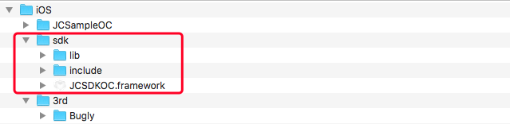

iOS
==============================

.. _一对一信令通话-iOS:

前提条件
----------------------------------

- 支持 iOS 8.0 或以上版本的 iOS **真机** 设备

- 有效的菊风开发者账号（`免费注册 <http://developer.juphoon.com/signup>`_ ）

准备工作
----------------------------------

开始之前，请先做好如下准备工作：

SDK 下载
>>>>>>>>>>>>>>>>>>>>>>>>>>>>>>>>>>

点击 `iOS SDK <http://developer.juphoon.com/document/cloud-communication-ios-sdk#2>`_ 进行下载。如果已经下载了 SDK，请直接进行 SDK 配置。

AppKey 获取
>>>>>>>>>>>>>>>>>>>>>>>>>>>>>>>>>>

AppKey 是应用在菊风云平台中的唯一标识。需要在 SDK 初始化的时候使用，AppKey 获取请参考 :ref:`创建应用 <创建应用>` 。

SDK 配置
>>>>>>>>>>>>>>>>>>>>>>>>>>>>>>>>>>

您可以在工程中使用静态库或者动态库，此处介绍使用静态库的配置方法。如果想使用动态库，请参考动态库的配置说明文档 :ref:`iOS 导入动态库<iOS 导入动态库>` 。

.. note::

        如果您已经集成了多家音视频引擎，则推荐使用动态库。

只有完成 SDK 的配置之后，您才可以集成 JC SDK 提供的功能，请按以下操作完成静态库的配置：

**导入静态库**

在 Mac 环境下打开下载的 iOS SDK，在 sdk 文件夹内包含了 lib、JCSDKOC.framework 和 include 三个文件。

``拷贝文件``

将 sdk 文件夹拷贝到您工程所在的目录下。

``工程设置``

**1. 导入 SDK**

打开 Xcode，进入 TARGETS > Project Name > Build Phases > Link Binary with Libraries 菜单，点击 ‘+’ 符号，导入 sdk 文件夹下的 JCSDKOC.framework、lib 文件夹下的两个 .a 文件，如下图：

.. image:: images/inputlib.png

**2. 导入 SDK 依赖的库**

继续点击 ‘+’ 符号，导入下图红框中的库：

.. image:: images/inputotherlib.png

**3. 设置路径**

点击 ‘Build Settings’，找到 Framework Search Paths 、Header Search Paths（头文件路径） 和 Library Search Paths（库文件路径）。并设置 Framework Search Paths、Header Search Paths 和 Library Search Paths，如下图：

.. image:: images/pathset.png

.. note:: 在完成第1步导入 JCSDKOC.framework 和两个.a文件后，Xcode 会自动生成该路径，如果 Xcode 没有自动生成路径，用户要根据 JCSDKOC.framework 、include 和 lib 库文件所在目录，手动设置路径。

**4. 设置 Enable Bitcode 为 NO**

点击 ‘Build Settings’，找到 Enable Bitcode 设置为 NO，如下图：

.. image:: images/iOS_integration_DynamicBitcode.png

**5. 设置 Other Linker Flags 的参数为 -ObjC**

点击 ‘Build Settings’，找到 Other Linker Flags 并添加参数 -ObjC，如下图：

.. image:: images/iOS_integration_ObjC.png

**6.设置预处理宏定义**

点击 ‘Build Settings’，找到 Preprocessor Macros，在右侧输入 ZPLATFORM=ZPLATFORM_IOS，如下图：

.. image:: images/static_import_ios.png

.. _voipset:

**如果设置了 VOIP 推送**，则还需要在 Preprocessor Macros 下的 Debug 中输入 VOIP_PUSH_DEBUG，如下图：

.. image:: images/pushset.png

**7. 设置 Documentation Comments 为 NO**

点击 ‘Build Settings’，找到 Documentation Comments 并设置为 NO，如下图：

.. image:: images/static_import_ios1.png

**8. 设置后台运行模式**

点击 ‘Capabilities’，找到 Background Modes，勾选红框内的 Audio, AirPlay, and Picture in Picture ，如下图：

.. image:: images/iOS_integration_DynamicBackgroundModes.png

**权限设置**

**9. 设置麦克风和摄像头权限**

点击 ‘Info’，然后添加麦克风和摄像头的权限，如下图：

.. image:: images/iOS_integration_DynamicPermissions.png

**10. 编译运行**

以上步骤进行完后，编译工程，如果提示 succeeded，恭喜您已经成功配置 SDK，可以进行 SDK 初始化了。

.. note:: SDK 不支持模拟器运行，请使用真机。

^^^^^^^^^^^^^^^^^^^^^^^^^^^^^^^^^^^^^^^

SDK 初始化
>>>>>>>>>>>>>>>>>>>>>>>>>>>>>>>>>>

在使用 SDK 之前，需要进行 SDK 的初始化。

.. highlight:: objective-c

在 APP 加载完成后（didFinishLaunchingWithOptions）初始化 SDK，具体接口如下：
::

    /**
     *  @brief 创建 JCClient 实例
     *  @param appKey       用户从 Juphoon Cloud 平台上申请的 AppKey 字符串
     *  @param callback     回调接口，用于接收 JCClient 相关通知
     *  @param extraParams  额外参数，没有则填nil
     *  @return JCClient 对象
     */
    +(JCClient*)create:(NSString*)appKey callback:(id<JCClientCallback>)callback extraParams:(NSDictionary*)extraParams;

.. note::

       appKey 为准备工作中“获取 AppKey”步骤中取得的 AppKey。如果还未获取 AppKey，请参考 :ref:`创建应用 <创建应用>` 来获取。

示例代码::

    - (BOOL)application:(UIApplication *)application didFinishLaunchingWithOptions:(NSDictionary *)launchOptions
    {
        // 初始化各模块，因为这些模块实例将被频繁使用，建议声明在单例中
        JCClient *client = [JCClient create:@"your appkey" callback:self extraParams:nil];
        return YES;
    }

SDK 初始化之后，即可进行登录的集成。

^^^^^^^^^^^^^^^^^^^^^^^^^^^^^^^^^^^^^^^

登录
----------------------------------

登录涉及 JCClient 类及其回调 JCClientCallback 类，其主要作用是负责登录、登出管理及帐号信息存储。

.. highlight:: objective-c

登录之前，可以通过配置关键字进行登录的相关配置，如是否使用代理服务器登录以及服务器地址的设置，具体如下：

登录环境设置
>>>>>>>>>>>>>>>>>>>>>>>>>>>>>>>>>>

.. _登录环境设置:

服务器地址设置，包括国际环境服务器地址和国内环境服务器地址

::

    /**
     *  @brief 设置配置相关参数
     *  JCClientConfigServer, JCClientConfigHttpsProxy 均需要在 login 之前调用
     *  @param key   参数关键字, 参见 JCClientConstants 中定义
     *  @param value 参数值
     *  @return 返回 true 表示设置成功，false 表示设置失败
     */
    -(bool)setConfig:(NSString*)key value:(NSString*)value;

其中，配置关键字有
::

    /// 服务器
    extern NSString* const JCClientConfigServer;
    /// 设备标识，用户可以自己传入设备标识
    extern NSString* const JCClientConfigDeviceId;
    /// https代理, 例如 192.168.1.100:3128
    extern NSString* const JCClientConfigHttpsProxy;

.. note::

    **国际环境** 服务器地址为 ``http:intl.router.justalkcloud.com:8080`` 。

    **国内环境** 服务器地址为 ``http:cn.router.justalkcloud.com:8080`` 。

示例代码::

    JCClient *client = [JCClient create:@"your appkey" callback:self extraParams:nil];
    // 设置登录地址（国内环境）
    [client setConfig:JCClientConfigServer value:@"http:cn.router.justalkcloud.com:8080"];
    // 设置登录地址（国际环境）
    [client setConfig:JCClientConfigServer value:@"http:intl.router.justalkcloud.com:8080"];

设置登录相关参数后，可以调用下面的方法获取相关的配置
::

    /**
     *  @brief 获取配置相关参数
     *  @param key 参数关键字, 参见 JCClientConstants 中定义
     *  @return 成功返回字符串类型具体值, 失败返回 NULL
     */
    -(NSString*)getConfig:(NSString*)key;

示例代码::

    // 获取登录配置
    [client getConfig:JCClientConfigServer];

发起登录
>>>>>>>>>>>>>>>>>>>>>>>>>>>>>>>>>>

登录参数设置之后，即可调用 login 接口发起登录操作::

    /**
     *  @brief 登录
     *  @param userId   用户名
     *  @param password 密码，免鉴权模式密码可以随意输入，但不能为空
     *  @return 返回 true 表示正常执行调用流程，false 表示调用异常，异常错误通过 JCClientCallback 通知
     *  @warning 目前只支持免鉴权模式，免鉴权模式下当账号不存在时会自动去创建该账号
     *  @warning 用户名为英文、数字和'+' '-' '_' '.'，长度不要超过64字符，'-' '_' '.'不能作为第一个字符
     */
    -(bool)login:(NSString*)userId password:(NSString*)password;

.. note:: 用户名大小写不敏感，用户名为英文、数字和'+' '-' '_' '.'，长度不要超过64字符，'-' '_' '.'不能作为第一个字符。

示例代码：
::

    // 登录
    [client login:@"userId" password:@"your password"];

登录的结果通过 onlogin 回调接口上报::

    /**
     *  @brief 登录结果回调
     *  @param result  true 表示登录成功，false 表示登录失败
     *  @param reason  当 result 为 false 时该值有效
     *  @see JCClientReason
     */
    -(void)onLogin:(bool)result reason:(JCClientReason)reason;

其中，JCClientReason 有
::

    /// 正常
    JCClientReasonNone,
    /// sdk 未初始化
    JCClientReasonSDKNotInit,
    /// 无效的参数
    JCClientReasonInvalidParam,
    /// 函数调用失败
    JCClientReasonCallFunctionError,
    /// 当前状态无法再次登录
    JCClientReasonStateCannotLogin,
    /// 超时
    JCClientReasonTimeOut,
    /// 网络异常
    JCClientReasonNetWork,
    /// appkey 错误
    JCClientReasonAppKey,
    /// 账号密码错误
    JCClientReasonAuth,
    /// 无该用户
    JCClientReasonNoUser,
    /// 被强制登出
    JCClientReasonServerLogout,
    /// 其他错误
    JCClientReasonOther,

登录成功之后，SDK 会自动保持与服务器的连接状态，直到用户主动调用登出接口，或者因为帐号在其他设备登录导致该设备登出。

登出
>>>>>>>>>>>>>>>>>>>>>>>>>>>>>>>>>>

登出调用下面的方法，登出后不能进行平台上的各种业务操作
::

    /**
     *  登出 Juphoon Cloud 平台，登出后不能进行平台上的各种业务
     *  @return 返回 true 表示正常执行调用流程，false 表示调用异常，异常错误通过 JCClientCallback 通知
     */
    -(bool)logout;

登出结果通过 onlogout 回调接口上报::

    /**
     *  @brief 登出回调
     *  @param reason 登出原因
     *  @see JCClientReason
     */
    -(void)onLogout:(JCClientReason)reason;

当登录状态发生改变时，会通过 onClientStateChange 回调接口上报：

::
    
    /**
     *  @brief 登录状态变化通知
     *  @param state    当前状态值
     *  @param oldState 之前状态值
     */
    -(void)onClientStateChange:(JCClientState)state oldState:(JCClientState)oldState;

JCClientState 有::

    // 未初始化
    JCClientStateNotInit,
    // 未登录
    JCClientStateIdle,
    // 登录中
    JCClientStateLogining,
    // 登录成功
    JCClientStateLogined,
    // 登出中
    JCClientStateLogouting,

示例代码::

    -(void)onClientStateChange:(JCClientState)state oldState:(JCClientState)oldState
    {
        if (state == JCClientStateIdle) { // 未登录
           ...
        } else if (state == JCClientStateLogining) { // 登录中
           ...
        } else if (state == JCClientStateLogined) {  // 登录成功
           ...
        } else if (state == JCClientStateLogouting) {  // 登出中
           ...
        }
    }

集成登录后，即可进行相关业务的集成。

``SDK 支持前后台模式，可以在应用进入前台或者后台时调用 JCClient 类中的 setForeground 方法进行设置``

::

    /**
     *  @brief 设置是否是前台，当应用进入前台标志为true，进入后台标志为false
     *  @param foreground  true 是前台，false 是后台
     */
    -(void)setForeground:(bool)foreground;

^^^^^^^^^^^^^^^^^^^^^^^^^^^^^^^

完成以上步骤，就做好了基础工作，您可以开始集成业务了。

.. note:: SDK 不支持模拟器运行，请使用真机。

业务集成
-----------------------------------

一对一视频通话涉及以下类：

.. list-table::
   :header-rows: 1

   * - 名称
     - 描述
   * - `JCCall <http://developer.juphoon.com/portal/reference/ios/Classes/JCCall.html>`_
     - 一对一通话类，包含一对一语音和视频通话功能
   * - `JCCallItem <http://developer.juphoon.com/portal/reference/ios/Classes/JCCallItem.html>`_
     - 通话对象类，此类主要记录通话的一些状态，UI 可以根据其中的状态进行显示逻辑
   * - `JCCallCallback <http://developer.juphoon.com/portal/reference/ios/Protocols/JCCallCallback.html>`_
     - 通话模块回调代理
   * - `JCMediaDevice <http://developer.juphoon.com/portal/reference/ios/Classes/JCMediaDevice.html>`_
     - 设备模块，主要用于视频、音频设备的管理
   * - `JCMediaDeviceVideoCanvas <http://developer.juphoon.com/portal/reference/ios/Classes/JCMediaDeviceVideoCanvas.html>`_
     - 视频对象，主要用于 UI 层视频显示、渲染的控制
   * - `JCMediaDeviceCallback <http://developer.juphoon.com/portal/reference/ios/Protocols/JCMediaDeviceCallback.html>`_
     - 设备模块回调代理

更多接口的详细信息请参考 `API 说明文档 <http://developer.juphoon.com/portal/reference/ios/>`_ 。

**接口调用逻辑和相关状态**

.. image:: 1-1workflowios.png

*说明：黑色字体表示接口，棕色字体表示通话状态*

.. note::

    通话方向（呼入或呼出）及通话状态（振铃、连接中、通话中等）可通过 `JCCallItem <http://developer.juphoon.com/portal/reference/ios/Classes/JCCallItem.html>`_  对象中的 `direction <http://developer.juphoon.com/portal/reference/ios/Constants/JCCallDirection.html>`_ 和 `state <http://developer.juphoon.com/portal/reference/ios/Constants/JCCallState.html>`_ 获得。

.. highlight:: objective-c

**开始集成通话功能前，请先进行** ``模块的初始化``

创建 JCCall 实例
::

    /**
     *  @brief                  创建 JCCall 实例
     *  @param client           JCClient 实例
     *  @param mediaDevice      JCMediaDevice 实例
     *  @param callback         JCCallCallback 回调接口，用于接收 JCCall 相关回调事件
     *  @return                 返回 JCCall 实例
     */
    +(JCCall*)create:(JCClient*)client mediaDevice:(JCMediaDevice*)mediaDevice callback:(id<JCCallCallback>)callback;

创建 JCMediaDevice 实例
::

    /**
     *  @brief     创建 JCMediaChannel 对象
     *  @param     client JCClient 对象
     *  @param     mediaDevice JCMediaDevice 对象
     *  @param     callback JCMediaChannelCallback 回调接口，用于接收 JCMediaChannel 相关通知
     *  @return    返回 JCMediaChannel 对象
     */
    +(JCMediaChannel*)create:(JCClient*)client mediaDevice:(JCMediaDevice*)mediaDevice callback:(id<JCMediaChannelCallback>)callback;

示例代码
::

    // 初始化各模块，因为这些模块实例将被频繁使用，建议声明在单例中
    JCMediaDevice *mediaDevice = [JCMediaDevice create:client callback:self];
    JCCall *call = [JCCall create:client mediaDevice:mediaDevice callback:self];

**开始集成**

1. 拨打通话
>>>>>>>>>>>>>>>>>>>>>>>>>>>>>>>>>>>>>>>>>>>>

主叫调用下面的接口发起视频通话，此时 video 传入值为 true
::

    /**
     *  @brief                  一对一呼叫
     *  @param userId           用户标识
     *  @param video            是否为视频呼叫
     *  @param extraParam       透传参数，被叫方可获取透传参数
     *  @return                 返回 true 表示正常执行调用流程，false 表示调用异常
     */
    -(bool)call:(NSString*)userId video:(bool)video extraParam:(NSString *)extraParam;

.. note:: 

       调用此接口会自动打开音频设备。

       extraParam 为自定义透传字符串，被叫可通过 `JCCallItem <http://developer.juphoon.com/portal/reference/ios/Classes/JCCallItem.html>`_  对象中的 `extraParam <http://developer.juphoon.com/portal/reference/ios/Classes/JCCallItem.html#//api/name/extraParam>`_ 属性获得。

通话发起后，主叫和被叫均会收到新增通话的回调，通话状态变为 JCCallStatePending
::

    /**
     *  @brief 新增通话回调
     *  @param item JCCallItem 对象
     */
    -(void)onCallItemAdd:(JCCallItem*)item;

示例代码::

    -(void)onCallItemAdd:(JCCallItem*)item {
        // 收到新增通话回调
        ...
    }

.. note::

        如果主叫想取消通话，可以直接转到第4步，调用第4步中的挂断通话的接口。这种情况下调用挂断后，通话状态变为 JCCallStateCancel。

创建本地视频画面
^^^^^^^^^^^^^^^^^^^^^^^^^^^^^^^^^^^^^

通话发起后，即可调用 JCMediaDevice 类中的 :ref:`startCameraVideo<创建本地视频画面>` 方法打开本地视频预览，**调用此方法会打开摄像头**
::

    /**
     *  @brief           获得预览视频对象，通过此对象能获得视频用于UI显示
     *  @param type      渲染模式，@ref JCMediaDeviceRender
     *  @return          JCMediaDeviceVideoCanvas 对象
     */
    -(JCMediaDeviceVideoCanvas*)startCameraVideo:(int)type;

.. note:: 调用该方法后，在挂断通话或者关闭摄像头时需要对应调用 stopVideo 方法停止视频。

示例代码::

    // 发起视频呼叫
    [call call:@"peer number" video:true extraParam:@"自定义透传字符串"];
    // 本地视频渲染
    JCMediaDeviceVideoCanvas *localCanvas = [mediaDevice startCameraVideo:JCMediaDeviceRenderFullContent];
    localCanvas.videoView.frame = CGRectMake(20, 20, 90, 160);
    [self.view addSubview:localCanvas.videoView];

该方法采集分辨率默认值为 640*360，帧率为 30，默认打开的是前置摄像头。

如果想自定义摄像头采集参数，如采集的高度、宽度和帧速率，请参考 :ref:`视频采集和渲染<视频采集和渲染(ios)>`。

2. 应答通话
>>>>>>>>>>>>>>>>>>>>>>>>>>>>>>>>>>>>>>>>>>>>

被叫收到 onCallItemAdd 回调事件，并通过 JCCallItem 中的 `video <http://developer.juphoon.com/portal/reference/ios/Classes/JCCallItem.html#//api/name/video>`_ 属性以及 `direction <http://developer.juphoon.com/portal/reference/ios/Classes/JCCallItem.html#//api/name/direction>`_  属性值 JCCallDirectionIn 判断是视频呼入还是语音呼入，此时可以调用以下接口选择视频应答或者语音应答

::

    /**
     *  @brief                  接听
     *  @param item             JCCallItem 对象
     *  @param video            针对视频呼入可以选择以视频接听还是音频接听
     *  @return                 返回 true 表示正常执行调用流程，false 表示调用异常
     */
    -(bool)answer:(JCCallItem*)item video:(bool)video;

如果被叫应答通话成功，双方都会收到 onCallItemUpdate 的回调。

示例代码::

    -(void)onCallItemAdd:(JCCallItem*)item {
        // 如果是视频呼入且在振铃中
        if(item && item.state == JCCallStatePending) {
            if (item.direction == JCCallDirectionIn && item.video) {
                 // 应答通话
                 [call answer:item video:true];
            }
        }
    }

通话应答后，通话状态变为 JCCallStateConnecting。

.. note::

        如果要拒绝通话，可以直接转到第4步，调用第4步中的挂断通话的接口。这种情况下调用挂断后，通话状态变为 JCCallStateCanceled。

3. 通话建立
>>>>>>>>>>>>>>>>>>>>>>>>>>>>>>>>>>>>>>>>>>>>

被叫接听通话后，双方将建立连接，此时，主叫和被叫都将会收到通话更新的回调（onCallItemUpdate），通话状态变为 JCCallStateTalking。连接成功之后，可以进行远端视频的渲染。

创建远端视频画面
^^^^^^^^^^^^^^^^^^^^^^^^^^^^^^^^^^^^^

远端视频画面的获取通过调用 JCMediaDevice 类中的 :ref:`startVideo<创建远端视频画面>` 方法实现
::

    /**
     *  @brief              获得预览视频对象，通过此对象能获得视频用于UI显示
     *  @param videoSource  渲染标识串，比如 JCMediaChannelParticipant JCCallItem 中的 renderId
     *  @param type         渲染模式，@ref JCMediaDeviceRender
     *  @return             JCMediaDeviceVideoCanvas 对象
     */
    -(JCMediaDeviceVideoCanvas*)startVideo:(NSString*)videoSource renderType:(int)type;

.. note:: 调用该方法后，在挂断通话或者关闭摄像头时需要对应调用 stopVideo 方法停止视频。

现在您可以进行一对一视频通话了。

示例代码::

    -(void)onCallItemUpdate:(JCCallItem*)item {
        // 如果对端在上传视频流（uploadVideoStreamOther）
        if (item.state == JCCallStateTalking && remoteCanvas == nil && item.uploadVideoStreamOther) {
            // 获取远端视频画面，renderId来源JCCallItem对象
            JCMediaDeviceVideoCanvas *remoteCanvas = [mediaDevice startVideo:item.renderId renderType:JCMediaDeviceRenderFullContent];
            remoteCanvas.videoView.frame = self.view.frame;
            [self.view addSubview:remoteCanvas.videoView];
        }
    }

4. 挂断通话
>>>>>>>>>>>>>>>>>>>>>>>>>>>>>>>>>>>>>>>>>>>>

主叫或者被叫均可以调用下面的方法挂断通话
::

    /**
     *  @brief                  挂断
     *  @param item             JCCallItem 对象
     *  @param reason           挂断原因
     *  @param description      挂断描述
     *  @return                 返回 true 表示正常执行调用流程，false 表示调用异常
     *  @see JCCallReason
     */
    -(bool)term:(JCCallItem*)item reason:(JCCallReason)reason description:(NSString*)description;

示例代码
::

    // 挂断通话
    JCCallItem *item = call.callItems[0];
    [call term:item reason:JCCallReasonNone description:@"test"];

销毁本地和远端视频画面
^^^^^^^^^^^^^^^^^^^^^^^^^^^^^^^^^^^^^

通话挂断后，还需要调用 :ref:`stopVideo<销毁本地和远端视频画面>` 接口移除视频画面
::

    /**
     *  @brief 停止视频
     *  @param canvas JCMediaDeviceVideoCanvas 对象，由 startVideo 获得
     */
    -(void)stopVideo:(JCMediaDeviceVideoCanvas*)canvas;

通话挂断后，UI 会收到移除通话的回调，通话状态变为 JCCallStateOk
::

    /**
     *  @brief              移除通话
     *  @param item         JCCallItem 对象
     *  @param reason       通话结束原因
     *  @param description  通话结束原因的描述，只有被动挂断的时候，才会收到这个值，其他情况下则返回空字符串
     *  @see JCCallReason
     */
    -(void)onCallItemRemove:(JCCallItem*)item reason:(JCCallReason)reason description:(NSString *)description;

示例代码::

    -(void)onCallItemRemove:(JCCallItem*)item reason:(JCCallReason)reason description:(NSString *)description { //移除通话回调
        // 界面处理
        if (_localCanvas) { // 本端视频销毁
            [JCManager.shared.mediaDevice stopVideo:_localCanvas];
            [_localCanvas.videoView removeFromSuperview];
            _localCanvas = nil;
        }
        if (_remoteCanvas) { // 远端视频销毁
            [JCManager.shared.mediaDevice stopVideo:_remoteCanvas];
            [_remoteCanvas.videoView removeFromSuperview];
            _remoteCanvas = nil;
        }
    }

其中，reason 有以下几种

.. list-table::
   :header-rows: 1

   * - 名称
     - 描述
   * - JCCallReasonNone
     - 无异常
   * - JCCallReasonNotLogin
     - 未登录
   * - JCCallReasonCallFunctionError
     - 函数调用错误
   * - JCCallReasonTimeOut
     - 超时
   * - JCCallReasonNetWork
     - 网络错误
   * - JCCallReasonCallOverLimit
     - 超出通话上限
   * - JCCallReasonTermBySelf
     - 自己挂断
   * - JCCallReasonAnswerFail
     - 应答失败
   * - JCCallReasonBusy
     - 忙
   * - JCCallReasonDecline
     - 拒接
   * - JCCallReasonUserOffline
     - 用户不在线
   * - JCCallReasonNotFound
     - 无此用户
   * - JCCallReasonRejectVideoWhenHasCall
     - 已有通话拒绝视频来电
   * - JCCallReasonRejectCallWhenHasVideoCall
     - 已有视频通话拒绝来电
   * - JCCallReasonOther
     - 其他错误

**通话挂断的其他情况：**

如果拨打通话时，**对方未在线，或者主叫呼叫后立即挂断**，则对方再次上线时会收到未接来电的回调

::

    /**
     * @brief上报服务器拉取的未接来电
     * @param item JCCallItem 对象
     */
    -(void)onMissedCallItem:(JCCallItem *)item;

Sample 代码
>>>>>>>>>>>>>>>>>>>>>>>>>>>>>>>>>>>>>>>>>>>>

**关键代码实现：**

1.初始化 JC SDK 以及通话和媒体设备模块

::

    // 创建 JCManager 类用来管理各个模块的创建和销毁
    static JCManager* _manager;
    + (JCManager*)shared
    {
        static dispatch_once_t predicate;
        dispatch_once(&predicate, ^{
            _manager = [[self alloc] init];
        });
        return _manager;
    }

    // 初始化SDK和各个模块，在程序完成启动时进行初始化
    - (BOOL)application:(UIApplication *)application didFinishLaunchingWithOptions:(NSDictionary *)launchOptions {
        [JCManager.shared initialize];
        return YES;
    }

    -(bool)initialize
    {
         _client = [JCClient create:MY_APP_KEY callback:self extraParams:nil];
         _mediaDevice = [JCMediaDevice create:_client callback:self];
         _call = [JCCall create:_client mediaDevice:_mediaDevice callback:self];
         return _client.state == JCClientStateIdle;
    }

    // 反初始化
    -(void)uninitialize
    {
        if (_client != nil) {
            [_client destroy];
            [_call destroy];
            [_mediaDevice destroy];
            _call = nil;
            _mediaDevice = nil;
            _client = nil;
        }
    }

2. 登录

::

    -(IBAction)login:(id)sender
    {
        if (JCManager.shared.client.state == JCClientStateLogined) {
            [JCManager.shared.client logout];
        } else if (JCManager.shared.client.state == JCClientStateIdle) {
            if (_textUsername.text.length == 0) {
                NSLog(@"please enter the user");
                return;
            }

            NSString *server = @"服务器地址";
            if (server.length > 0) {
                [JCManager.shared.client setConfig:JCClientConfigServer value:server];
            }

            // 使用代理登录
            if (_httpsProxy.text.length != 0) {
                [JCManager.shared.client setConfig:JCClientConfigHttpsProxy value:_httpsProxy.text];
            }
            
            // 设置昵称
            JCManager.shared.client.displayName = @"Lorus";

            if ([JCManager.shared.client login:_textUsername.text password:_textPassword.text]) {

            } else {
                [Toast showWithText:@"调用登录失败"];
            }
        }
    }

    -(void)onLogin:(bool)result reason:(JCClientReason)reason
    {
        if (result) {
        // 登录成功后的界面处理
        ....
        }
    }

3.注册相关回调

在通话功能模块中，当业务事件触发时，SDK 通过回调将事件通知给 UI，回调包括新增通话、通话状态更新以及通话挂断回调，可以在相应的 ViewController 中实现相关的回调

::

    // 新增通话回调，拨打通话或收到来电时会收到该回调
    -(void)onCallItemAdd:(JCCallItem*)item
    {
    }

    // 移除通话回调，挂断通话时会收到该回调
    -(void)onCallItemRemove:(JCCallItem*)item reason:(JCCallReason)reason description:(NSString *)description
    {
    }

    // 通话状态更新回调，通话状态发生改变时会收到该回调，具体哪些状态发生了改变参考JCCallChangeParam类
    -(void)onCallItemUpdate:(JCCallItem *)item changeParam:(JCCallChangeParam *)changeParam
    {
    }

    - (void)onMessageReceive:(JCCallItem *)item type:(NSString *)type content:(NSString *)content
    {
    }

    // 未接来电回调，当对方未接或者主叫发起呼叫又立即挂断后会上报服务器未接来电，对方再次上线时会收到该回调，
    - (void)onMissedCallItem:(JCCallItem *)item {
    }

4.拨打视频通话

::

    - (IBAction)voiceCall:(id)sender {
        if (_numberField.text.length == 0) {
            NSLog(@"please enter the number");
            return;
        }
        // 调用接口发起呼叫
        [JCManager.shared.call call:_numberField.text video:true extraParam:@"iOS_Test"];
    }

    -(void)onCallItemAdd:(JCCallItem*)item
    {
        //拉起通话界面
        ...
    }

5.本地视图渲染

::

    // 新增通话回调，拨打通话时会收到该回调
    JCMediaDeviceVideoCanvas* _localCanvas;
    -(void)onCallItemAdd:(JCCallItem*)item
    {
        if (item.state == JCCallStatePending) {
            if (item.video) {
                if (_localCanvas == nil && item.uploadVideoStreamSelf) {
                    // 可以选择要打开的摄像头类型，如果不设置则默认前置摄像头
                    [JCManager.shared.mediaDevice specifyCamera:JCMediaDeviceCameraFront];
                    // 设置采集分辨率，可选值有640*360、1280*720、1920*1080，可以根据具体场景进行设置，如果不设置则默认640*360
                    [JCManager.shared.mediaDevice setCameraProperty:640 height:360 framerate:30];
                    // 创建本地视图Canvas对象
                    _localCanvas = [mediaDevice startCameraVideo:JCMediaDeviceRenderFullContent];
                    _localCanvas.videoView.frame = CGRectMake(20, 20, 90, 160);
                    // 将本地视图画面添加到 viewController 中
                    [self.view addSubview:_localCanvas.videoView];
                }
            }
        }
    }

6.应答通话

::

    // 获取通话对象
    -(JCCallItem*)getActiveCall
    {
        for (JCCallItem* item in JCManager.shared.call.callItems) {
            if (item.active) {
                return item;
            }
        }
        return nil;
    }

    // 新增通话回调，当收到来电时会收到该回调
    -(void)onCallItemAdd:(JCCallItem*)item
    {
        // 应答通话
        [JCManager.shared.call answer:[self getActiveCall] video:true];
    }

7.远端视图渲染

::

    JCMediaDeviceVideoCanvas* _remoteCanvas;
    -(void)onCallItemAdd:(JCCallItem*)item
    {
        if (item.state == JCCallStateTalking) {
            if (item.video) {
                if (_remoteCanvas == nil && activeCall.uploadVideoStreamOther) {
                    // 创建远端视图Canvas对象
                    _remoteCanvas = [JCManager.shared.mediaDevice startVideo:activeCall.renderId renderType:JCMediaDeviceRenderFullContent];
                    _remoteCanvas.videoView.frame = self.view.frame;
                    // 将远端视图画面添加到 viewController 中
                    [self.view insertSubview:_remoteCanvas.videoView aboveSubview:self.backgroudView];
                }
            }
        }
    }

8.挂断通话

::

    // 获取通话对象
    -(JCCallItem*)getActiveCall
    {
        for (JCCallItem* item in JCManager.shared.call.callItems) {
            if (item.active) {
                return item;
            }
        }
        return nil;
    }

    //挂断通话
    - (IBAction)endCall:(id)sender {
        [JCManager.shared.call term:[self getActiveCall] reason:JCCallReasonNone description:@"test"];
    }

    //界面处理
    -(void)onCallItemRemove:(JCCallItem*)item reason:(JCCallReason)reason description:(NSString *)description
    {
        if (self.call.callItems.count == 0) {
            //移除本地视图
            if (_localCanvas) {
                //调用接口停止视频
                [JCManager.shared.mediaDevice stopVideo:_localCanvas];
                [_localCanvas.videoView removeFromSuperview];
                _localCanvas = nil;
            }
            //移除远端视图
            if (_remoteCanvas) {
                //调用接口停止视频
                [JCManager.shared.mediaDevice stopVideo:_remoteCanvas];
                [_remoteCanvas.videoView removeFromSuperview];
                _remoteCanvas = nil;
            }
            //销毁通话界面
            [_callViewController dismissViewControllerAnimated:YES completion:nil];
            _callViewController = nil;
        }
    }  

**更多功能**

- :ref:`通话状态更新<通话状态更新(ios1-1)>`

- :ref:`通话过程控制<通话过程控制(ios1-1)>`

- :ref:`获取网络状态<获取网络状态(ios1-1)>`

- :ref:`音频管理<设备控制(ios)>`

- :ref:`视频管理<视频设备管理(iOS)>`

**进阶**

在实现视频通话的过程中，您可能还需要添加以下功能来增强您的应用：

- :ref:`通话录音<通话录音(iOS)>`

- :ref:`视频通话录制<视频通话录制(iOS)>`

- :ref:`截屏<截屏(iOS)>`

- :ref:`推送<推送(iOS)>`