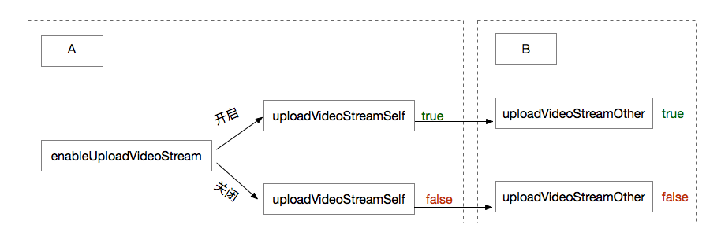

Android
============================

.. highlight:: java

.. _通话状态更新(android1-1):

本节内容提供通话中的状态更新以及通话过程控制的接口说明。

通话状态更新
-----------------------------

通话过程中，如果通话状态发生了改变，如开启关闭静音、开启关闭通话保持、活跃状态切换、开启关闭视频流发送、网络变化等，将会收到通话状态更新的回调
::

    /**
     * 通话状态更新回调（当上层收到此回调时，可以根据 JCCallItem 对象获得该通话的所有信息及状态，从而更新该通话相关UI）
     *
     * @param item           JCCallItem 对象，当 item 为 null 时表示全部更新
     * @param changeParam    更新标识类
     */
    void onCallItemUpdate(JCCallItem item, JCCallItem.ChangeParam changeParam);

.. note::

       静音状态、通话保持状态、活跃状态可通过 `JCCallItem <https://developer.juphoon.com/portal/reference/V2.0/android/com/juphoon/cloud/JCCallItem.html>`_ 对象获得。

示例代码::

    public void onCallItemUpdate(JCCallItem item, JCCallItem.ChangeParam changeParam) {
        if (item.mute) { // 开启静音
            ...
        } else if (item.hold) { // 挂起通话
            ...
        } else if (item.held) { // 被挂起
            ...
        } else if (item.active) { // 激活状态
            ...
        } else if (item.uploadVideoStreamSelf) { // 本端在上传视频流
            ...
        } else if (item.uploadVideoStreamOther) { // 远端在上传视频流
            ...
        } 
    }

^^^^^^^^^^^^^^^^^^^^^^^^^^^^^^^^

.. _通话过程控制(android1-1):

通话过程控制
-----------------------------

通话静音
>>>>>>>>>>>>>>>>>>>>>>>>>>>>>>

您可以通过下面的方法开启或关闭静音，开启关闭静音需要根据 JCCallItem 中的静音状态来决定，静音状态（mute）可通过 `getMute() <http://developer.juphoon.com/portal/reference/android/com/juphoon/cloud/JCCallItem.html#getMute-->`_ 方法获得。静音开启后，对方将听不到您的声音
::

    /**
     * 静音，通过 JCCallItem 对象中的静音状态来决定开启关闭静音
     *
     * @param   item JCCallItem 对象
     * @return  返回 true 表示正常执行调用流程，false 表示调用异常
     */
    public abstract boolean mute(JCCallItem item);

开启/关闭呼叫保持
>>>>>>>>>>>>>>>>>>>>>>>>>>>>>>

您可以调用下面的方法对通话对象进行呼叫保持或解除呼叫保持，开启或关闭呼叫保持需要根据 JCCallItem 对象中的呼叫保持状态来决定，呼叫保持状态（hold）可通过 `getHold() <https://developer.juphoon.com/portal/reference/V2.0/android/com/juphoon/cloud/JCCallItem.html#getHold-->`_ 方法获得
::

    /**
     * 呼叫保持，通过 JCCallItem 对象中的呼叫保持状态来决定开启关闭呼叫保持
     * 只针对音频，如果是视频通话则要上层处理视频逻辑
     *
     * @param item  JCCallItem 对象
     * @return      返回 true 表示正常执行调用流程，false 表示调用异常
     */
    public abstract boolean hold(JCCallItem item);

切换活跃通话
>>>>>>>>>>>>>>>>>>>>>>>>>>>>>>

调用下面的方法对通话中被保持的对象和活跃的通话对象进行切换

::

    /**
     * 切换活跃通话
     *
     * @param item  需要变为活跃状态的 JCCallItem 对象
     * @return      返回 true 表示正常执行调用流程，false 表示调用异常
     */
    public abstract boolean becomeActive(JCCallItem item);

开启/关闭视频流发送
>>>>>>>>>>>>>>>>>>>>>>>>>>>>>>

您可以调用下面的方法开启或关闭视频流发送，调用后对端会 **收到 onCallItemUpdate 回调**
::

    /**
     * 开启关闭视频流发送，用于视频通话中
     *
     * @param item  JCCallItem 对象
     * @return      返回 true 表示正常执行调用流程，false 表示调用异常
     */
    public abstract boolean enableUploadVideoStream(JCCallItem item);

该接口的具体作用机制如下图所示：

- 如果 A 开启发送视频流，则 A 的 uploadVideoStreamSelf 属性值为 true，B 则通过 uploadVideoStreamOther 属性值（此处为true）判断 A 的视频流发送状态。

- 如果 A 关闭发送视频流，则 A 的 uploadVideoStreamSelf 属性值为 false，B 则通过 uploadVideoStreamOther 属性值（此处为false）判断 A 的视频流发送状态。此时 B 将看不到 A 的画面。

示例代码::

    //获取活跃通话对象
    JCCallItem item = call.getActiveCallItem();
    call.mute(item);
    call.hold(item);
    call.becomeActive(item);
    call.enableUploadVideoStream(item);

