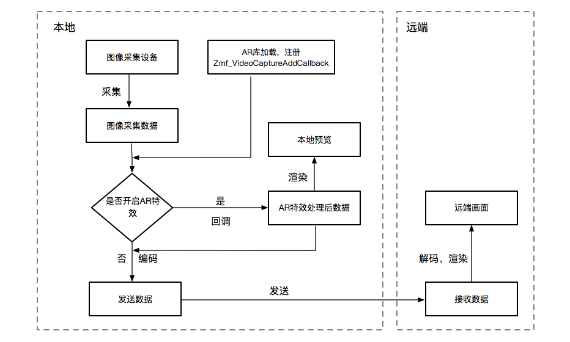
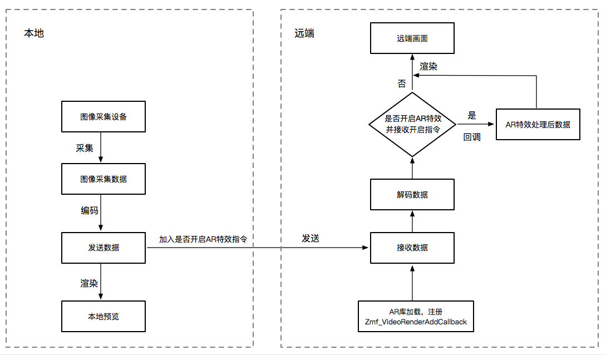

导入第三方图像处理库函数说明
=================================

接口调用说明
---------------------

1. 如果想在图像数据发送之前实现图像数据的处理，则发送端先进行第三方库的加载，然后在图像采集后、编码之前调用下面的接口注册第三方图像处理库：
::

    int Zmf_VideoCaptureAddCallback(void *pUser, ZmfVideoCaptureCallback pfnCb);

参数说明：

::

    输入参数：
    
       void *pUser 

       回调的用户数据

       ZmfVideoCaptureCallback pfnCb 
       
       回调函数指针

    输出参数：
    
    无

采集的图像数据经过第三方图像处理库处理后，调用下面的接口回调处理后的数据
::

    typedef void (*ZmfVideoCaptureCallback)(void* pUser, const char* captureId, int iFace, int iImgAngle, int iCaptureOrient, int* iWidth, int* iHeight, unsigned char *buf, ZmfVideoCaptureEncoder* encoder);

参数说明：

::

    输入参数：

       void *pUser 

       回调的用户数据
       
       const char* captureId 
       
       图像采集ID
       
       int iFace 
       
       采集镜头朝向
       
       int iImgAngle 
       
       图像旋转角度
       
       int iCaptureOrient
       
       镜头采集角度

    输出参数：

       int* iWidth

       图像宽度

       int* iHeight

       图像高度

       unsigned char *buf

       图像数据buffer

       ZmfVideoCaptureEncoder* encoder

       采集编码信息

2. 如果想在接收端实现图像数据的处理，则接收端可以先进行第三方库的加载，再调用下面的接口注册第三方图像处理库：

::

    int Zmf_VideoRenderAddCallback (void *pUser, ZmfVideoRenderCallback pfnCb);

参数说明：

::

    输入参数：
    
       void *pUser 

       回调的用户数据

       ZmfVideoRenderCallback pfnCb
       
       回调函数指针

    输出参数：
    
    无

接收端解码接收到的图像数据后，在进行图像渲染之前，调用下面的接口回调处理后的图像数据
::

    typedef int  (*ZmfVideoRenderCallback)(void* pUser, const char* renderId, int sourceType, int iAngle,int iMirror, int* iWidth, int* iHeight, unsigned char *buf,
                                       unsigned long timeStamp);

参数说明：

::

    输入参数：
    
       void *pUser  

       用户数据

       const char* renderId

       渲染ID

       int sourceType

       渲染源类型

       int iAngle

       渲染角度

       int iMirror

       是否镜像

       unsigned long timeStamp

       时间戳

    输出参数：
    
       int* iWidth 

       图像宽度

       int* iHeight

       图像高度

       unsigned char *buf

       图像数据buffer

场景应用解决方案
----------------------

在一对一的场景中，远端需要看到本地控制的AR特效，有两种实现方式：

1. 本地处理 AR 特效

本地采集图像，加载相应的 AR 库，并注册 Zmf_VideoCaptureAddCallback；

采集后、编码发送前询问是否开启AR特效，不开启则直接发送；开启则回调接口，接口函数调用图像处理库对数据进行处理，并回调处理之后的数据，然后再编码发送；远端接收数据并进行渲染。具体流程如下图所示：

2. 远端处理 AR 特效

本地采集编码图像，发送图像前加入是否开启 AR 特效的指令；接收端提前加载入 AR 特效库并注册 Zmf_VideoRenderAddCallback。渲染前判断是否接到开启 AR 特效的指令并且加载入 AR 库，如果接到开启 AR 特效的指令，则回调函数调用 AR 库处理图像数据，否则直接渲染。具体流程如下图所示：

**方案比较**

在本地控制远端的 AR 特效方案中：

方案一：本地需加载 AR 库，在编码前回调处理，本地预览和远端均能看到加入 AR 特效的画面；

方案二：远端需加载 AR 库，本地需发送是否开启 AR 特效的指令来控制远端的画面。
