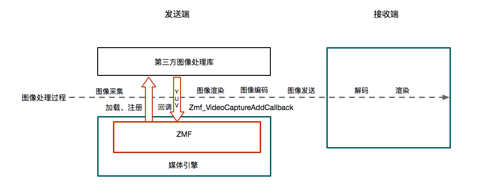
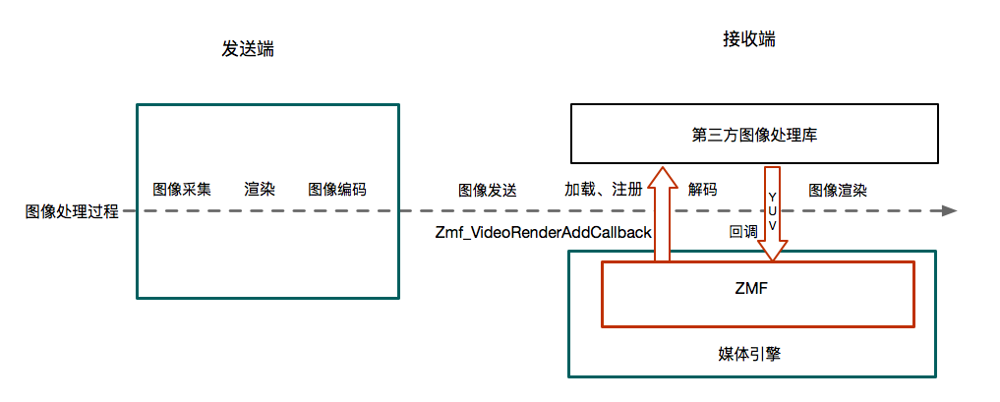
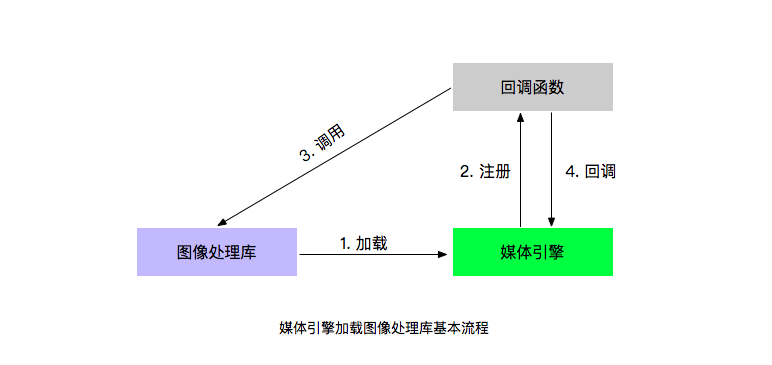

媒体引擎 ZMF
====================

在媒体引擎中接入第三方库可以实现美颜、AR特效等多种效果，为方便接入第三方库，媒体引擎中 ZMF 提供了以下注册和回调接口：

- 图像采集后编码前的注册接口：Zmf_VideoCaptureAddCallback

  回调函数：ZmfVideoCaptureCallback

- 渲染前的注册接口：Zmf_VideoRenderAddCallback

  回调函数：ZmfVideoRenderCallback

   

ZMF 提供的回调接口可用于 iOS、Android 和 Windows 等平台。在加载入相应动静态库后注册相应的回调接口，回调函数调用库函数处理图像数据。其中 Android 平台，可在 JAVA 和 C 层注册和处理相应的回调数据。

ZMF 调用第三库的基本流程如图所示：

