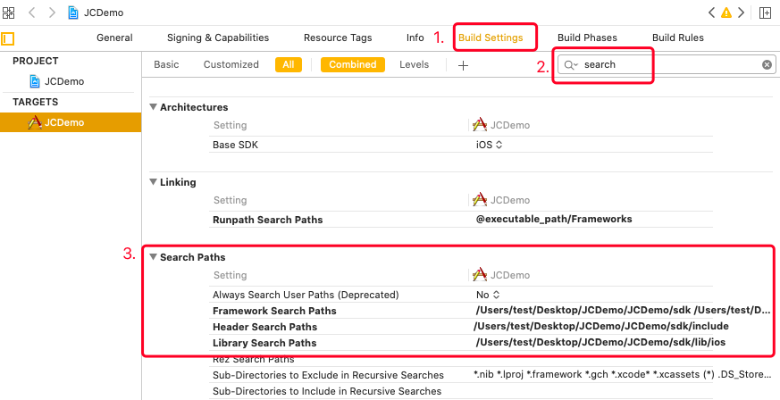

iOS
======================

.. highlight:: objective-c

前提条件
----------------------------------

- 支持 iOS 8.0 或以上版本的 iOS **真机** 设备

- 有效的菊风开发者账号（`免费注册 <http://developer.juphoon.com/signup>`_ ）

准备工作
----------------------------------

开始之前，请先做好如下准备工作：

SDK 下载
>>>>>>>>>>>>>>>>>>>>>>>>>>>>>>>>>>

点击 `iOS SDK <http://developer.juphoon.com/document/cloud-communication-ios-sdk#2>`_ 进行下载。如果已经下载了 SDK，请直接进行 SDK 配置。

AppKey 获取
>>>>>>>>>>>>>>>>>>>>>>>>>>>>>>>>>>

AppKey 是应用在菊风云平台中的唯一标识。需要在 SDK 初始化的时候使用，AppKey 获取请参考 :ref:`创建应用 <创建应用>` 。

SDK 配置
>>>>>>>>>>>>>>>>>>>>>>>>>>>>>>>>>>

您可以在工程中使用静态库或者动态库，此处介绍使用静态库的配置方法。如果想使用动态库，请参考动态库的配置说明文档 :ref:`iOS 导入动态库<iOS 导入动态库>` 。

.. note::

        如果您已经集成了多家音视频引擎，则推荐使用动态库。

只有完成 SDK 的配置之后，您才可以集成 JC SDK 提供的功能，请按以下操作完成静态库的配置：

**导入静态库**

有两种方式导入静态库

**方法一：使用 CocoaPods 自动导入**

.. note:: 该方法仅适用于 2.0 及以上版本的静态库集成。

SDK 支持使用 CocoaPods 导入 SDK。 需要安装 CocoaPods 环境，请参照 `CocoaPods 官网 <https://cocoapods.org>`_ 安装。

CocoaPods 环境安装好后，请执行以下操作：

1. 打开 Terminal，cd 至项目根目录

2. 执行 pod init，项目文件夹下会生成一个 Podfile 文本文件

3. 执行 open -e Podfile

4. 添加导入配置 pod 'JuphoonCloudSDK_iOS', '2.0'

修改后内容如下所示，注意将 Your App 替换为你的 Target 名称。
::

    platform :ios, '9.0'
    #use_frameworks!
    target 'Your App' do
    pod 'JuphoonCloudSDK_iOS', '2.0'
    end

2.0 为当前发布的最新版本，关于指定具体版本请参考 `pod 使用规范 <https://guides.cocoapods.org/using/the-podfile.html>`_ 。

5. 执行 pod install，成功安装后，Terminal 中会显示 Pod installation complete!，此时项目文件夹下会生成一个 xcworkspace 文件。

.. note:: 如果需要更新本地库版本，在执行 pod install 之前执行 pod update 命令。

6. 双击打开 .xcworkspace 文件即可。

**方法二：手动导入**

在 Mac 环境下打开下载的 iOS SDK，在 sdk 文件夹内包含了 lib、JCSDKOC.framework 和 include 三个文件。

.. image:: images/ios_sdk_list1.png

``拷贝文件``

将 sdk 文件夹拷贝到您工程所在的目录下。

``工程设置``

**1. 导入 SDK**

打开 Xcode，进入 TARGETS > Project Name > Build Phases > Link Binary with Libraries 菜单，点击 ‘+’ 符号，导入 sdk 文件夹下的 JCSDKOC.framework、lib 文件夹下的两个 .a 文件，如下图：

.. image:: images/inputlib.png

**2. 导入 SDK 依赖的库**

继续点击 ‘+’ 符号，导入下图红框中的库：

.. image:: images/inputotherlib.png

**3. 设置路径**

点击 ‘Build Settings’，找到 Framework Search Paths 、Header Search Paths（头文件路径） 和 Library Search Paths（库文件路径）。并设置 Framework Search Paths、Header Search Paths 和 Library Search Paths，如下图：

.. note:: 在完成第1步导入 JCSDKOC.framework 和两个.a文件后，Xcode 会自动生成该路径，如果 Xcode 没有自动生成路径，用户要根据 JCSDKOC.framework 、include 和 lib 库文件所在目录，手动设置路径。

**4. 设置 Enable Bitcode 为 NO**

点击 ‘Build Settings’，找到 Enable Bitcode 设置为 NO，如下图：

.. image:: images/iOS_integration_DynamicBitcode.png

**5. 设置 Other Linker Flags 的参数为 -ObjC**

点击 ‘Build Settings’，找到 Other Linker Flags 并添加参数 -ObjC，如下图：

.. image:: images/iOS_integration_ObjC.png

**6.设置预处理宏定义**

点击 ‘Build Settings’，找到 Preprocessor Macros，在右侧输入 ZPLATFORM=ZPLATFORM_IOS，如下图：

.. image:: images/static_import_ios.png

**如果设置了 APNs 推送**，则还需要在 Preprocessor Macros 下的 Debug 中输入 DEBUG，如下图：

.. image:: images/pushdebug.png

.. note::

    DEBUG 宏定义的目的是为了区分推送环境是 release 还是 debug，环境不对会导致推送失败。

**7. 设置 Documentation Comments 为 NO**

点击 ‘Build Settings’，找到 Documentation Comments 并设置为 NO，如下图：

.. image:: images/static_import_ios1.png

**8. 设置后台运行模式**

点击 ‘Capabilities’，找到 Background Modes，勾选红框内的 Audio, AirPlay, and Picture in Picture ，如下图：

.. image:: images/iOS_integration_DynamicBackgroundModes.png

**权限设置**

**9. 设置麦克风和摄像头权限**

点击 ‘Info’，然后添加麦克风和摄像头的权限，如下图：

.. image:: images/iOS_integration_DynamicPermissions.png

.. list-table::
   :header-rows: 1

   * - Key
     - Type
     - Value
   * - Privacy - Microphone Usage Description
     - String
     - 使用麦克风的目的，如语音通话。
   * - Privacy - Camera Usage Description
     - String
     - 使用摄像头的目的，如视频通话。

**10. 编译运行**

以上步骤进行完后，编译工程，如果提示 succeeded，恭喜您已经成功配置 SDK，可以进行 SDK 初始化了。

.. note:: SDK 不支持模拟器运行，请使用真机。

^^^^^^^^^^^^^^^^^^^^^^^^^^^^^^^^^^^^^^^

SDK 初始化
>>>>>>>>>>>>>>>>>>>>>>>>>>>>>>>>>>

在使用 SDK 之前，需要进行 SDK 的初始化。在 App 的整个生命周期中，开发者只需要将 SDK 初始化一次。

首先在需要使用 JC SDK 的地方 #import <JCSDKOC/JCSDKOC.h> 。

然后在实现初始化的文件中实现 JCClientCallback 回调接口，用于接收 JCClient 相关通知。

在初始化的时候还可以设置 SDK 信息存储目录，日志路径以及日志打印的等级，具体通过 JCClientCreateParam 对象设置，如果不设置则使用默认值。

JCClientCreateParam 对象有以下属性
::

    /// sdk信息存储目录
    @property (nonatomic, copy) NSString* __nonnull sdkInfoDir;

    /// sdk日志目录
    @property (nonatomic, copy) NSString* __nonnull sdkLogDir;

    /// sdk日志等级 JCLogLevel
    @property (nonatomic) JCLogLevel sdkLogLevel;

调用下面的接口初始化 SDK
::

    /**
     * @brief 创建 JCClient 实例
     * @param appKey 用户从 Juphoon Cloud 平台上申请的 AppKey 字符串
     * @param callback 回调接口，用于接收 JCClient 相关通知
     * @param createParam 创建参数，nil 则按默认值创建
     * @return JCClient 对象
     */
    +(JCClient* __nullable)create:(NSString* __nonnull)appKey callback:(id<JCClientCallback> __nonnull)callback creatParam:(JCClientCreateParam* __nullable)createParam;

.. note::

       appKey 为准备工作中“获取 AppKey”步骤中取得的 AppKey。如果还未获取 AppKey，请参考 :ref:`创建应用 <创建应用>` 来获取。

示例代码::

    // 初始化，因为这些模块实例将被频繁使用，建议声明在单例中
    JCClientCreateParam *param = [[JCClientCreateParam alloc] init];
    param.sdkLogLevel = JCLogLevelInfo;
    param.sdkInfoDir = @"SDK 信息存放路径";
    param.sdkLogDir = @"日志存放路径";
    JCClient *client = [JCClient create:@"your appkey" callback:self creatParam:param];

SDK 初始化之后，即可进行登录的集成。

^^^^^^^^^^^^^^^^^^^^^^^^^^^^^^^^^^^^^^^

登录
----------------------------------

登录涉及 JCClient 类及其回调 JCClientCallback，其主要作用是负责登录、登出管理及帐号信息存储。

登录之前，可以通过 loginParam 登录参数进行登录的相关配置，如服务器地址的设置或者使用代理服务器登录，如不设置则按照默认值登录，具体如下：

::

        JCClientLoginParam* loginParam = [[JCClientLoginParam alloc] init];
        //默认国内环境 http:cn.router.justalkcloud.com:8080
        loginParam.serverAddress = @"服务器地址";
        //如果使用代理服务器登录
        loginParam.httpsProxy = @"代理服务器地址";

其中，服务器地址包括国际环境服务器地址和国内环境服务器地址：

**国际环境** 服务器地址默认为 ``http:intl.router.justalkcloud.com:8080`` 。

**国内环境** 服务器地址默认为 ``http:cn.router.justalkcloud.com:8080`` 。

开发者可以使用自定义服务器地址。

还可以通过 displayName 属性设置昵称，例如::

    JCManager.shared.client.displayName = @"小张";

发起登录
>>>>>>>>>>>>>>>>>>>>>>>>>>>>>>>>>>

调用下面的接口发起登录，userId 为英文、数字和'+' '-' '_' '.'，大小写不敏感，长度不要超过64字符，'-' '_' '.'不能作为第一个字符
::

    /**
     * @brief 登陆 Juphoon Cloud 平台，只有登陆成功后才能进行平台上的各种业务
     * 服务器分为鉴权模式和非鉴权模式
     *
     *     - 鉴权模式: 服务器会检查用户名和密码
     *
     *     - 免鉴权模式: 只要用户保证用户标识唯一即可, 服务器不校验
     *
     * 登陆结果通过 JCClientCallback 通知
     *
     * @param userId 用户名
     * @param password 密码，免鉴权模式密码可以随意输入，但不能为空
     * @param loginParam 登录参数，nil则按照默认值登录
     * @return 返回 true 表示正常执行调用流程，false 表示调用异常，异常错误通过 JCClientCallback 通知
     * @warning 目前只支持免鉴权模式，免鉴权模式下当账号不存在时会自动去创建该账号
     * @warning 用户名为英文数字和'+' '-' '_' '.'，长度不要超过64字符，'-' '_' '.'不能作为第一个字符
     */
    -(bool)login:(NSString* __nonnull)userId password:(NSString* __nonnull)password loginParam:(JCClientLoginParam* __nullable)loginParam;

示例代码：
::

        JCClientLoginParam* loginParam = [[JCClientLoginParam alloc] init];
        //默认国内环境 http:cn.router.justalkcloud.com:8080
        loginParam.serverAddress = @"服务器地址";
        [JCManager.shared.client login:@"账号" password:@"123" loginParam:loginParam];

登录成功之后，首先会触发登录状态改变（onClientStateChange）回调

::
    
    /**
     *  @brief 登录状态变化通知
     *  @param state    当前状态值
     *  @param oldState 之前状态值
     */
    -(void)onClientStateChange:(JCClientState)state oldState:(JCClientState)oldState;

JCClientState 有::

    // 未初始化
    JCClientStateNotInit,
    // 未登录
    JCClientStateIdle,
    // 登录中
    JCClientStateLogining,
    // 登录成功
    JCClientStateLogined,
    // 登出中
    JCClientStateLogouting,

示例代码::

    -(void)onClientStateChange:(JCClientState)state oldState:(JCClientState)oldState
    {
        if (state == JCClientStateIdle) { // 未登录
           ...
        } else if (state == JCClientStateLogining) { // 登录中
           ...
        } else if (state == JCClientStateLogined) {  // 登录成功
           ...
        } else if (state == JCClientStateLogouting) {  // 登出中
           ...
        }
    }

之后通过 onLogin 回调上报登录结果
::

    /**
     *  @brief 登陆结果回调
     *  @param result true 表示登陆成功，false 表示登陆失败
     *  @param reason 当 result 为 false 时该值有效
     *  @see JCClientReason
     */
    -(void)onLogin:(bool)result reason:(JCClientReason)reason;

其中，JCClientReason 有
::

    /// 正常
    JCClientReasonNone,
    /// sdk 未初始化
    JCClientReasonSDKNotInit,
    /// 无效的参数
    JCClientReasonInvalidParam,
    /// 函数调用失败
    JCClientReasonCallFunctionError,
    /// 当前状态无法再次登录
    JCClientReasonStateCannotLogin,
    /// 超时
    JCClientReasonTimeOut,
    /// 网络异常
    JCClientReasonNetWork,
    /// appkey 错误
    JCClientReasonAppKey,
    /// 账号密码错误
    JCClientReasonAuth,
    /// 无该用户
    JCClientReasonNoUser,
    /// 被强制登出
    JCClientReasonServerLogout,
    /// 其他错误
    JCClientReasonOther,

登录成功之后，SDK 会自动保持与服务器的连接状态，直到用户主动调用登出接口，或者因为帐号在其他设备登录导致该设备登出。

登出
>>>>>>>>>>>>>>>>>>>>>>>>>>>>>>>>>>

登出调用下面的接口，登出后不能进行平台上的各种业务操作
::

    /**
     *  登出 Juphoon Cloud 平台，登出后不能进行平台上的各种业务
     *  @return 返回 true 表示正常执行调用流程，false 表示调用异常，异常错误通过 JCClientCallback 通知
     */
    -(bool)logout;

登出同样会触发登录状态改变（onClientStateChange）回调

之后将通过 onlogout 回调上报登出结果
::

    /**
     *  @brief 登出回调
     *  @param reason 登出原因
     *  @see JCClientReason
     */
    -(void)onLogout:(JCClientReason)reason;

集成登录后，即可进行相关业务的集成。

^^^^^^^^^^^^^^^^^^^^^^^^^^^^^^^^^^^^^^^^^^^

业务集成
---------------------------

一对一语音通话涉及以下类：

.. list-table::
   :header-rows: 1

   * - 名称
     - 描述
   * - `JCCall <https://developer.juphoon.com/portal/reference/V2.0/ios/Classes/JCCall.html>`_
     - 一对一通话类，包含一对一语音和视频通话功能
   * - `JCCallItem <https://developer.juphoon.com/portal/reference/V2.0/ios/Classes/JCCallItem.html>`_
     - 通话对象类，此类主要记录通话的一些状态，UI 可以根据其中的状态进行显示逻辑
   * - `JCCallCallback <https://developer.juphoon.com/portal/reference/V2.0/ios/Protocols/JCCallCallback.html>`_
     - 通话模块回调代理
   * - `JCMediaDevice <https://developer.juphoon.com/portal/reference/V2.0/ios/Classes/JCMediaDevice.html>`_
     - 设备模块，主要用于视频、音频设备的管理
   * - `JCMediaDeviceCallback <https://developer.juphoon.com/portal/reference/V2.0/ios/Protocols/JCMediaDeviceCallback.html>`_
     - 设备模块回调代理

更多接口的详细信息请参考 `API 说明文档 <https://developer.juphoon.com/portal/reference/V2.0/ios/>`_ 。

*接口调用逻辑和相关状态*

.. image:: 1-1workflowios.png

*说明：黑色字体表示接口，棕色字体表示通话状态*

.. note::

    通话方向（呼入或呼出）及通话状态（振铃、连接中、通话中等）可通过 `JCCallItem <https://developer.juphoon.com/portal/reference/V2.0/ios/Classes/JCCallItem.html>`_  对象中的 `direction <http://developer.juphoon.com/portal/reference/ios/Constants/JCCallDirection.html>`_ 和 `state <http://developer.juphoon.com/portal/reference/ios/Constants/JCCallState.html>`_ 获得。

**开始集成通话功能前，请先实现 JCMediaDeviceCallback, JCCallCallback 回调，用于接收 JCMediaDevice 和 JCCall 的相关通知**

之后进行 ``模块的初始化``

创建 JCMediaDevice 实例
::

    /**
     *  @brief 创建 JCMediaDevice 对象
     *  @param client JCClient 对象
     *  @param callback JCMediaDeviceCallback 回调接口，用于接收 JCMediaDevice 相关通知
     *  @return 返回 JCMediaDevice 对象
     */
    +(JCMediaDevice* __nullable)create:(JCClient* __nonnull)client callback:(id<JCMediaDeviceCallback> __nonnull)callback;

创建 JCCall 实例
::

    /**
     *  @brief                  创建 JCCall 实例
     *  @param client           JCClient 实例
     *  @param mediaDevice      JCMediaDevice 实例
     *  @param callback         JCCallCallback 回调接口，用于接收 JCCall 相关回调事件
     *  @return                 返回 JCCall 实例
     */
    +(JCCall* __nullable)create:(JCClient* __nonnull)client mediaDevice:(JCMediaDevice* __nonnull)mediaDevice callback:(id<JCCallCallback> __nonnull)callback;

示例代码
::

    // 初始化各模块，因为这些模块实例将被频繁使用，建议声明在单例中
    JCMediaDevice *mediaDevice = [JCMediaDevice create:client callback:self];
    JCCall *call = [JCCall create:client mediaDevice:mediaDevice callback:self];

**开始集成**

1. 拨打通话
>>>>>>>>>>>>>>>>>>>>>>>>>>>>>>>>>>

主叫调用下面的接口发起语音通话，此时 video 传入值为 false
::

    /**
     *  @brief                  一对一呼叫
     *  @param userId           用户标识
     *  @param video            是否为视频呼叫
     *  @param extraParam       透传参数，被叫方可获取透传参数
     *  @return                 返回 true 表示正常执行调用流程，false 表示调用异常
     */
    -(bool)call:(NSString* __nonnull)userId video:(bool)video extraParam:(NSString * __nullable)extraParam;

.. note:: 

       调用此接口会自动打开音频设备。

       extraParam 为自定义透传字符串，被叫可通过 `JCCallItem <https://developer.juphoon.com/portal/reference/V2.0/ios/Classes/JCCallItem.html>`_  对象中的 `extraParam <http://developer.juphoon.com/portal/reference/ios/Classes/JCCallItem.html#//api/name/extraParam>`_ 属性获得。

示例代码
::

    // 发起语音呼叫
    [call call:@"peer number" video:false extraParam:@"自定义透传字符串"];

通话发起后，主叫和被叫均会收到新增通话的回调，通话状态变为 JCCallStatePending
::

    /**
     *  @brief 新增通话回调
     *  @param item JCCallItem 对象
     */
    -(void)onCallItemAdd:(JCCallItem* __nonnull)item;

示例代码::

    -(void)onCallItemAdd:(JCCallItem* __nonnull)item {
        // 收到新增通话回调
    }

.. note::

        如果主叫想取消通话，可以直接转到第4步，调用第4步中的挂断通话的接口。这种情况下调用挂断后，通话状态变为 JCCallStateCancel。

2. 应答通话
>>>>>>>>>>>>>>>>>>>>>>>>>>>>>>>>>>

主叫发起呼叫后，被叫会收到 onCallItemAdd 回调事件，并通过回调带上来的 JCCallItem 中的 video 以及 direction 属性值判断是视频呼入还是语音呼入，此时可以调用下面的接口进行应答，**语音通话只能进行语音应答**
::

    /**
     *  @brief                  接听
     *  @param item             JCCallItem 对象
     *  @param video            针对视频呼入可以选择以视频接听还是音频接听
     *  @return                 返回 true 表示正常执行调用流程，false 表示调用异常
     */
    -(bool)answer:(JCCallItem* __nonnull)item video:(bool)video;

示例代码::

    -(void)onCallItemAdd:(JCCallItem* __nonnull)item {
        // 如果是语音呼入且在振铃中
        if (item && item.direction == JCCallDirectionIn && !item.video) {
             // 应答通话
             [call answer:item video:false];
        }
    }

通话应答后，通话状态变为 JCCallStateConnecting。

.. note::

        如果要拒绝通话，可以直接转到第4步，调用第4步中的挂断通话的接口。这种情况下调用挂断后，通话状态变为 JCCallStateCanceled。

3. 通话建立
>>>>>>>>>>>>>>>>>>>>>>>>>>>>>>>>>>

被叫接听通话后，双方将建立连接，此时，主叫和被叫都将会收到通话更新的回调，连接成功之后，通话将建立。通话状态变为 JCCallStateTalking。

现在您可以进行一对一语音通话了。

如果已经在语音通话中，但又有新通话进来，可以选择接听或挂断，如果选择接听，则原来的一路通话将被保持。

4. 挂断通话
>>>>>>>>>>>>>>>>>>>>>>>>>>>>>>>>>>

主叫或者被叫均可以挂断通话，首先调用下面的接口获取当前活跃的通话对象
::

    /**
     * @brief 获得当前活跃通话
     *
     * @return 当前活跃通话，没有则返回nil
     */
    -(JCCallItem* __nullable)getActiveCallItem;

当前活跃通话对象获取后，调用下面的方法挂断通话
::

    /**
     *  @brief                  挂断
     *  @param item             JCCallItem 对象
     *  @param reason           挂断原因
     *  @param description      挂断描述
     *  @return                 返回 true 表示正常执行调用流程，false 表示调用异常
     *  @see JCCallReason
     */
    -(bool)term:(JCCallItem* __nonnull)item reason:(JCCallReason)reason description:(NSString* __nullable)description;

示例代码
::

    // 挂断通话
    JCCallItem *item = [call getActiveCallItem];
    [call term:item reason:JCCallReasonNone description:@"主叫挂断"];

通话挂断后，UI 会收到移除通话的回调，通话状态变为 JCCallStateOk。
::

    /**
     *  @brief 移除通话
     *  @param item JCCallItem 对象
     *  @param reason 通话结束原因
     *  @param description 通话结束原因的描述，只有被动挂断的时候，才会收到这个值，其他情况下则返回空字符串
     *  @see JCCallReason
     */
    -(void)onCallItemRemove:(JCCallItem* __nonnull)item reason:(JCCallReason)reason description:(NSString * __nullable)description;

其中，reason 有以下几种

.. list-table::
   :header-rows: 1

   * - 名称
     - 描述
   * - JCCallReasonNone
     - 无异常
   * - JCCallReasonNotLogin
     - 未登录
   * - JCCallReasonCallFunctionError
     - 函数调用错误
   * - JCCallReasonTimeOut
     - 超时
   * - JCCallReasonNetWork
     - 网络错误
   * - JCCallReasonCallOverLimit
     - 超出通话上限
   * - JCCallReasonTermBySelf
     - 自己挂断
   * - JCCallReasonAnswerFail
     - 应答失败
   * - JCCallReasonBusy
     - 忙
   * - JCCallReasonDecline
     - 拒接
   * - JCCallReasonUserOffline
     - 用户不在线
   * - JCCallReasonNotFound
     - 无此用户
   * - JCCallReasonRejectVideoWhenHasCall
     - 已有通话拒绝视频来电
   * - JCCallReasonRejectCallWhenHasVideoCall
     - 已有视频通话拒绝来电
   * - JCCallReasonOther
     - 其他错误

示例代码::

    -(void)onCallItemRemove:(JCCallItem* __nonnull)item reason:(JCCallReason)reason description:(NSString * __nullable)description { //移除通话回调
        // 界面处理
    }

**通话挂断的其他情况：**

如果拨打通话时，**对方未在线，或者主叫呼叫后立即挂断**，则对方再次上线时会收到未接来电的回调

::

    /**
     * @brief上报服务器拉取的未接来电
     * @param item JCCallItem 对象
     */
    -(void)onMissedCallItem:(JCCallItem * __nonnull)item;

此时通话状态变为 JCCallStateMissed。

