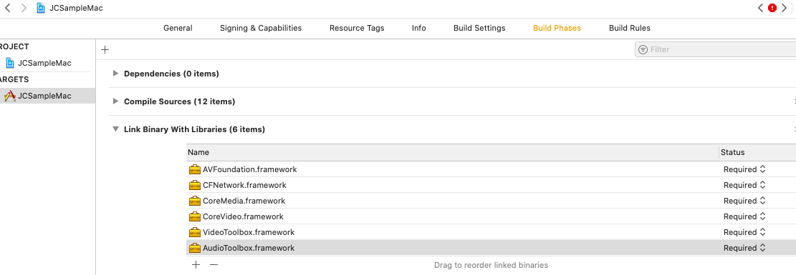

macOS
======================

.. highlight:: objective-c

前提条件
----------------------------------

- 支持 macOS 10.10 或以上版本的 macOS 设备

- 有效的菊风开发者账号（`免费注册 <http://developer.juphoon.com/signup>`_ ）

准备工作
----------------------------------

开始之前，请先做好如下准备工作：

SDK 下载
>>>>>>>>>>>>>>>>>>>>>>>>>>>>>>>>>>

点击 `macOS SDK <http://developer.juphoon.com/document/cloud-communication-ios-sdk#2>`_ 进行下载。如果已经下载了 SDK，请直接进行 SDK 配置。

AppKey 获取
>>>>>>>>>>>>>>>>>>>>>>>>>>>>>>>>>>

AppKey 是应用在菊风云平台中的唯一标识。需要在 SDK 初始化的时候使用，AppKey 获取请参考 :ref:`创建应用 <创建应用>` 。

SDK 配置
>>>>>>>>>>>>>>>>>>>>>>>>>>>>>>>>>>

只有完成 SDK 的配置，才可以集成 JC SDK 提供的功能，mac 端使用的是动态库，因此下面介绍动态库的配置方法。

.. note::

        如果您已经集成了多家音视频引擎，则推荐使用动态库。

在 Mac 环境下解压下载的压缩包，解压后的文件夹内有 JCSDK 文件夹。JCSDK 文件夹里包含了 JCSDKOC.framework。

**拷贝文件**

将 JCSDK 文件夹拷贝到您工程所在的目录下，如下图（仅供参考）：

.. image:: images/sdkshare1.png

**工程设置**

1. 导入文件和库

打开 Xcode（以 Xcode 11.0 为例），进入 TARGETS > Project Name > Build Phases > Link Binary with Libraries 菜单，点击 + 添加如下依赖的库。

进入 TARGETS > Project Name > General > Frameworks, Libraries, and Embedded Content 菜单，点击 + ，再点击 Add Other…，找到 JCSDKOC.framework、libmtc.dylib 和 libzmf.dylib 文件并添加，并将这些文件的状态改为 Embed & Sign。

2. 设置 Framework Search Paths 路径

点击 ‘Build Settings’，找到 Framework Search Paths、Header Search Paths 和 Library Search Paths，在右侧输入路径。如下图：

.. note:: 在设置 Framework Search Paths 时，一般在完成第1步导入 JCSDKOC.framework 后，Xcode 会自动生成该路径
       如果 Xcode 没有自动生成路径，用户要根据 JCSDKOC.framework、lib 和 include 文件所在目录，手动设置路径。

3. 设置预处理宏定义

点击 ‘Build Settings’，找到 Preprocessor Macros，在右侧输入 ZPLATFORM=ZPLATFORM_OSX，如下图：

.. image:: images/macsdk4.png

4. 设置 Other Linker Flags 的参数为 -ObjC

点击 ‘Build Settings’，找到 Other Linker Flags 并添加参数 -ObjC，如下图：

.. image:: images/macsdk3.png

5. 若你的项目已启用 App Sandbox 或 Hardened Runtime 设置，则需勾选如下内容，获取相应的设备权限：

.. image:: images/macsdk5.png

**权限设置**

6. 设置麦克风和摄像头的权限

点击 ‘Info’，然后添加麦克风和摄像头权限，如下图：

.. image:: images/macsdk6.png

.. list-table::
   :header-rows: 1

   * - Key
     - Type
     - Value
   * - Privacy - Microphone Usage Description
     - String
     - 使用麦克风的目的，如语音通话。
   * - Privacy - Camera Usage Description
     - String
     - 使用摄像头的目的，如视频通话。

7. 编译运行

以上步骤进行完后，编译工程，如果没有报错，恭喜您，您已经成功配置 SDK，可以进行下一步了。

^^^^^^^^^^^^^^^^^^^^^^^^^^^^^^^^^^^^^^^

SDK 初始化
>>>>>>>>>>>>>>>>>>>>>>>>>>>>>>>>>>

在使用 SDK 之前，需要进行 SDK 的初始化。

在需要使用 JC SDK 的地方 #import <JCSDKOC/JCSDKOC.h> 。

.. highlight:: objective-c

初始化 SDK，具体接口如下：

在初始化的时候还可以设置 SDK 信息存储目录，日志路径以及日志打印的等级，具体通过 createParam 参数设置，如果不设置则使用默认值。
::

    /**
     * @brief 创建 JCClient 实例
     * @param appKey 用户从 Juphoon Cloud 平台上申请的 AppKey 字符串
     * @param callback 回调接口，用于接收 JCClient 相关通知
     * @param createParam 创建参数，nil 则按默认值创建
     * @return JCClient 对象
     */
    +(JCClient* __nullable)create:(NSString* __nonnull)appKey callback:(id<JCClientCallback> __nonnull)callback creatParam:(JCClientCreateParam* __nullable)createParam;

.. note::

       appKey 为准备工作中“获取 AppKey”步骤中取得的 AppKey。如果还未获取 AppKey，请参考 :ref:`创建应用 <创建应用>` 来获取。

示例代码::

    // 初始化各模块，因为这些模块实例将被频繁使用，建议声明在单例中
    JCClientCreateParam *param = [[JCClientCreateParam alloc] init];
    param.sdkLogLevel = JCLogLevelInfo;
    param.sdkInfoDir = @"SDK 信息存放路径";
    param.sdkLogDir = @"日志存放路径";
    JCClient *client = [JCClient create:@"your appkey" callback:self creatParam:param];

SDK 初始化之后，即可进行登录的集成。

^^^^^^^^^^^^^^^^^^^^^^^^^^^^^^^^^^^^^^^

登录
----------------------------------

登录涉及 JCClient 类及其回调 JCClientCallback 类，其主要作用是负责登录、登出管理及帐号信息存储。

登录之前，可以通过 loginParam 登录参数进行登录的相关配置，如服务器地址的设置或者使用代理服务器登录，如不设置则按照默认值登录，具体如下：

::

        JCClientLoginParam* loginParam = [[JCClientLoginParam alloc] init];
        //默认国内环境 http:cn.router.justalkcloud.com:8080
        loginParam.serverAddress = @"服务器地址";
        //如果使用代理服务器登录
        loginParam.httpsProxy = @"代理服务器地址";

其中，服务器地址包括国际环境服务器地址和国内环境服务器地址：

**国际环境** 服务器地址为 ``http:intl.router.justalkcloud.com:8080`` 。

**国内环境** 服务器地址为 ``http:cn.router.justalkcloud.com:8080`` 。

还可以通过 displayName 属性设置昵称，例如::

    JCManager.shared.client.displayName = @"小张";

发起登录
>>>>>>>>>>>>>>>>>>>>>>>>>>>>>>>>>>

调用下面的接口发起登录
::

    /**
     * @brief 登陆 Juphoon Cloud 平台，只有登陆成功后才能进行平台上的各种业务
     * 服务器分为鉴权模式和非鉴权模式
     *
     *     - 鉴权模式: 服务器会检查用户名和密码
     *
     *     - 免鉴权模式: 只要用户保证用户标识唯一即可, 服务器不校验
     *
     * 登陆结果通过 JCClientCallback 通知
     *
     * @param userId 用户名
     * @param password 密码，免鉴权模式密码可以随意输入，但不能为空
     * @param loginParam 登录参数，nil则按照默认值登录
     * @return 返回 true 表示正常执行调用流程，false 表示调用异常，异常错误通过 JCClientCallback 通知
     * @warning 目前只支持免鉴权模式，免鉴权模式下当账号不存在时会自动去创建该账号
     * @warning 用户名为英文数字和'+' '-' '_' '.'，长度不要超过64字符，'-' '_' '.'不能作为第一个字符
     */
    -(bool)login:(NSString* __nonnull)userId password:(NSString* __nonnull)password loginParam:(JCClientLoginParam* __nullable)loginParam;

.. note:: 用户名大小写不敏感，用户名为英文、数字和'+' '-' '_' '.'，长度不要超过64字符，'-' '_' '.'不能作为第一个字符。

示例代码：
::

        JCClientLoginParam* loginParam = [[JCClientLoginParam alloc] init];
        //默认国内环境 http:cn.router.justalkcloud.com:8080
        loginParam.serverAddress = @"服务器地址";
        [JCManager.shared.client login:@"账号" password:@"123" loginParam:loginParam];

登录的结果通过 onlogin 回调上报::

    /**
     *  @brief 登陆结果回调
     *  @param result true 表示登陆成功，false 表示登陆失败
     *  @param reason 当 result 为 false 时该值有效
     *  @see JCClientReason
     */
    -(void)onLogin:(bool)result reason:(JCClientReason)reason;

其中，JCClientReason 有
::

    /// 正常
    JCClientReasonNone,
    /// sdk 未初始化
    JCClientReasonSDKNotInit,
    /// 无效的参数
    JCClientReasonInvalidParam,
    /// 函数调用失败
    JCClientReasonCallFunctionError,
    /// 当前状态无法再次登录
    JCClientReasonStateCannotLogin,
    /// 超时
    JCClientReasonTimeOut,
    /// 网络异常
    JCClientReasonNetWork,
    /// appkey 错误
    JCClientReasonAppKey,
    /// 账号密码错误
    JCClientReasonAuth,
    /// 无该用户
    JCClientReasonNoUser,
    /// 被强制登出
    JCClientReasonServerLogout,
    /// 其他错误
    JCClientReasonOther,

登录成功之后，SDK 会自动保持与服务器的连接状态，直到用户主动调用登出接口，或者因为帐号在其他设备登录导致该设备登出。

登出
>>>>>>>>>>>>>>>>>>>>>>>>>>>>>>>>>>

登出调用下面的接口，登出后不能进行平台上的各种业务操作
::

    /**
     *  登出 Juphoon Cloud 平台，登出后不能进行平台上的各种业务
     *  @return 返回 true 表示正常执行调用流程，false 表示调用异常，异常错误通过 JCClientCallback 通知
     */
    -(bool)logout;

登出结果通过 onlogout 回调上报::

    /**
     *  @brief 登出回调
     *  @param reason 登出原因
     *  @see JCClientReason
     */
    -(void)onLogout:(JCClientReason)reason;

当登录状态发生改变时，会通过 onClientStateChange 回调上报：

::
    
    /**
     *  @brief 登录状态变化通知
     *  @param state    当前状态值
     *  @param oldState 之前状态值
     */
    -(void)onClientStateChange:(JCClientState)state oldState:(JCClientState)oldState;

JCClientState 有::

    // 未初始化
    JCClientStateNotInit,
    // 未登录
    JCClientStateIdle,
    // 登录中
    JCClientStateLogining,
    // 登录成功
    JCClientStateLogined,
    // 登出中
    JCClientStateLogouting,

示例代码::

    -(void)onClientStateChange:(JCClientState)state oldState:(JCClientState)oldState
    {
        if (state == JCClientStateIdle) { // 未登录
           ...
        } else if (state == JCClientStateLogining) { // 登录中
           ...
        } else if (state == JCClientStateLogined) {  // 登录成功
           ...
        } else if (state == JCClientStateLogouting) {  // 登出中
           ...
        }
    }

集成登录后，即可进行相关业务的集成。

^^^^^^^^^^^^^^^^^^^^^^^^^^^^^^^

业务集成
---------------------------

一对一语音通话涉及以下类：

.. list-table::
   :header-rows: 1

   * - 名称
     - 描述
   * - `JCCall <https://developer.juphoon.com/portal/reference/V2.0/ios/Classes/JCCall.html>`_
     - 一对一通话类，包含一对一语音和视频通话功能
   * - `JCCallItem <https://developer.juphoon.com/portal/reference/V2.0/ios/Classes/JCCallItem.html>`_
     - 通话对象类，此类主要记录通话的一些状态，UI 可以根据其中的状态进行显示逻辑
   * - `JCCallCallback <https://developer.juphoon.com/portal/reference/V2.0/ios/Protocols/JCCallCallback.html>`_
     - 通话模块回调代理
   * - `JCMediaDevice <https://developer.juphoon.com/portal/reference/V2.0/ios/Classes/JCMediaDevice.html>`_
     - 设备模块，主要用于视频、音频设备的管理
   * - `JCMediaDeviceCallback <https://developer.juphoon.com/portal/reference/V2.0/ios/Protocols/JCMediaDeviceCallback.html>`_
     - 设备模块回调代理

更多接口的详细信息请参考 `API 说明文档 <https://developer.juphoon.com/portal/reference/V2.0/ios/>`_ 。

*接口调用逻辑和相关状态*

.. image:: 1-1workflowios.png

*说明：黑色字体表示接口，棕色字体表示通话状态*

.. note::

    通话方向（呼入或呼出）及通话状态（振铃、连接中、通话中等）可通过 `JCCallItem <https://developer.juphoon.com/portal/reference/V2.0/ios/Classes/JCCallItem.html>`_  对象中的 `direction <http://developer.juphoon.com/portal/reference/ios/Constants/JCCallDirection.html>`_ 和 `state <http://developer.juphoon.com/portal/reference/ios/Constants/JCCallState.html>`_ 获得。

**开始集成通话功能前，请先进行** ``模块的初始化``

创建 JCMediaDevice 实例
::

    /**
     *  @brief 创建 JCMediaDevice 对象
     *  @param client JCClient 对象
     *  @param callback JCMediaDeviceCallback 回调接口，用于接收 JCMediaDevice 相关通知
     *  @return 返回 JCMediaDevice 对象
     */
    +(JCMediaDevice* __nullable)create:(JCClient* __nonnull)client callback:(id<JCMediaDeviceCallback> __nonnull)callback;

创建 JCCall 实例
::

    /**
     *  @brief                  创建 JCCall 实例
     *  @param client           JCClient 实例
     *  @param mediaDevice      JCMediaDevice 实例
     *  @param callback         JCCallCallback 回调接口，用于接收 JCCall 相关回调事件
     *  @return                 返回 JCCall 实例
     */
    +(JCCall* __nullable)create:(JCClient* __nonnull)client mediaDevice:(JCMediaDevice* __nonnull)mediaDevice callback:(id<JCCallCallback> __nonnull)callback;

示例代码
::

    // 初始化各模块，因为这些模块实例将被频繁使用，建议声明在单例中
    JCMediaDevice *mediaDevice = [JCMediaDevice create:client callback:self];
    JCCall *call = [JCCall create:client mediaDevice:mediaDevice callback:self];

**开始集成**

1. 拨打通话
>>>>>>>>>>>>>>>>>>>>>>>>>>>>>>>>>>

主叫调用下面的接口发起语音通话，此时 video 传入值为 false
::

    /**
     *  @brief                  一对一呼叫
     *  @param userId           用户标识
     *  @param video            是否为视频呼叫
     *  @param extraParam       透传参数，被叫方可获取透传参数
     *  @return                 返回 true 表示正常执行调用流程，false 表示调用异常
     */
    -(bool)call:(NSString* __nonnull)userId video:(bool)video extraParam:(NSString * __nullable)extraParam;

.. note:: 

       调用此接口会自动打开音频设备。

       extraParam 为自定义透传字符串，被叫可通过 `JCCallItem <https://developer.juphoon.com/portal/reference/V2.0/ios/Classes/JCCallItem.html>`_  对象中的 `extraParam <http://developer.juphoon.com/portal/reference/ios/Classes/JCCallItem.html#//api/name/extraParam>`_ 属性获得。

示例代码
::

    // 发起语音呼叫
    [call call:@"peer number" video:false extraParam:@"自定义透传字符串"];

通话发起后，主叫和被叫均会收到新增通话的回调，通话状态变为 JCCallStatePending
::

    /**
     *  @brief 新增通话回调
     *  @param item JCCallItem 对象
     */
    -(void)onCallItemAdd:(JCCallItem* __nonnull)item;

示例代码::

    -(void)onCallItemAdd:(JCCallItem* __nonnull)item {
        // 收到新增通话回调
    }

.. note::

        如果主叫想取消通话，可以直接转到第4步，调用第4步中的挂断通话的接口。这种情况下调用挂断后，通话状态变为 JCCallStateCancel。

2. 应答通话
>>>>>>>>>>>>>>>>>>>>>>>>>>>>>>>>>>

主叫发起呼叫后，被叫会收到 onCallItemAdd 回调事件，并通过回调带上来的 JCCallItem 中的 video 以及 direction 属性值判断是视频呼入还是语音呼入，此时可以调用下面的接口进行应答，**语音通话只能进行语音应答**
::

    /**
     *  @brief                  接听
     *  @param item             JCCallItem 对象
     *  @param video            针对视频呼入可以选择以视频接听还是音频接听
     *  @return                 返回 true 表示正常执行调用流程，false 表示调用异常
     */
    -(bool)answer:(JCCallItem* __nonnull)item video:(bool)video;

示例代码::

    -(void)onCallItemAdd:(JCCallItem* __nonnull)item {
        // 如果是语音呼入且在振铃中
        if (item && item.direction == JCCallDirectionIn && !item.video) {
             // 应答通话
             [call answer:item video:false];
        }
    }

通话应答后，通话状态变为 JCCallStateConnecting。

.. note::

        如果要拒绝通话，可以直接转到第4步，调用第4步中的挂断通话的接口。这种情况下调用挂断后，通话状态变为 JCCallStateCanceled。

3. 通话建立
>>>>>>>>>>>>>>>>>>>>>>>>>>>>>>>>>>

被叫接听通话后，双方将建立连接，此时，主叫和被叫都将会收到通话更新的回调，连接成功之后，通话将建立。通话状态变为 JCCallStateTalking。

现在您可以进行一对一语音通话了。

如果已经在语音通话中，但又有新通话进来，可以选择接听或挂断，如果选择接听，则原来的一路通话将被保持。

4. 挂断通话
>>>>>>>>>>>>>>>>>>>>>>>>>>>>>>>>>>

主叫或者被叫均可以挂断通话，首先调用下面的接口获取当前活跃的通话对象
::

    /**
     * @brief 获得当前活跃通话
     *
     * @return 当前活跃通话，没有则返回nil
     */
    -(JCCallItem* __nullable)getActiveCallItem;

当前活跃通话对象获取后，调用下面的方法挂断通话
::

    /**
     *  @brief                  挂断
     *  @param item             JCCallItem 对象
     *  @param reason           挂断原因
     *  @param description      挂断描述
     *  @return                 返回 true 表示正常执行调用流程，false 表示调用异常
     *  @see JCCallReason
     */
    -(bool)term:(JCCallItem* __nonnull)item reason:(JCCallReason)reason description:(NSString* __nullable)description;

示例代码
::

    // 挂断通话
    JCCallItem *item = [call getActiveCallItem];
    [call term:item reason:JCCallReasonNone description:@"主叫挂断"];

通话挂断后，UI 会收到移除通话的回调，通话状态变为 JCCallStateOk。
::

    /**
     *  @brief 移除通话
     *  @param item JCCallItem 对象
     *  @param reason 通话结束原因
     *  @param description 通话结束原因的描述，只有被动挂断的时候，才会收到这个值，其他情况下则返回空字符串
     *  @see JCCallReason
     */
    -(void)onCallItemRemove:(JCCallItem* __nonnull)item reason:(JCCallReason)reason description:(NSString * __nullable)description;

其中，reason 有以下几种

.. list-table::
   :header-rows: 1

   * - 名称
     - 描述
   * - JCCallReasonNone
     - 无异常
   * - JCCallReasonNotLogin
     - 未登录
   * - JCCallReasonCallFunctionError
     - 函数调用错误
   * - JCCallReasonTimeOut
     - 超时
   * - JCCallReasonNetWork
     - 网络错误
   * - JCCallReasonCallOverLimit
     - 超出通话上限
   * - JCCallReasonTermBySelf
     - 自己挂断
   * - JCCallReasonAnswerFail
     - 应答失败
   * - JCCallReasonBusy
     - 忙
   * - JCCallReasonDecline
     - 拒接
   * - JCCallReasonUserOffline
     - 用户不在线
   * - JCCallReasonNotFound
     - 无此用户
   * - JCCallReasonRejectVideoWhenHasCall
     - 已有通话拒绝视频来电
   * - JCCallReasonRejectCallWhenHasVideoCall
     - 已有视频通话拒绝来电
   * - JCCallReasonOther
     - 其他错误

示例代码::

    -(void)onCallItemRemove:(JCCallItem* __nonnull)item reason:(JCCallReason)reason description:(NSString * __nullable)description { //移除通话回调
        // 界面处理
    }

**通话挂断的其他情况：**

如果拨打通话时，**对方未在线，或者主叫呼叫后立即挂断**，则对方再次上线时会收到未接来电的回调

::

    /**
     * @brief上报服务器拉取的未接来电
     * @param item JCCallItem 对象
     */
    -(void)onMissedCallItem:(JCCallItem * __nonnull)item;

此时通话状态变为 JCCallStateMissed。

Sample 代码
>>>>>>>>>>>>>>>>>>>>>>>>>>>>>>>>>>>>>>>>>>>>

**关键代码实现：**

1.模块初始化

::

    -(void)initialize 
    {
      //登录模块初始化
      JCClient *client = [JCClient create:@"your appkey" callback:self creatParam:nil];
      //设备模块初始化
      JCMediaDevice *mediaDevice = [JCMediaDevice create:client callback:self];
      //通话模块初始化
      JCCall *call = [JCCall create:client mediaDevice:mediaDevice callback:self];
    }

AppKey ：是应用在菊风云平台中的唯一标识，通过 `注册开发者网站 <http://developer.juphoon.com/signup>`_ 创建应用（创建应用需要贴链接） 后获取

`JCClient <https://developer.juphoon.com/portal/reference/V2.0/ios/Classes/JCClient.html>`_  ：登录模块，用于登录登出管理及账户属性存储

`JCCall <https://developer.juphoon.com/portal/reference/V2.0/ios/Classes/JCCall.html>`_  ：一对一通话模块

`JCMediaDevice <https://developer.juphoon.com/portal/reference/V2.0/ios/Classes/JCMediaDevice.html>`_  ：设备模块，用于音视频设备管理

2. 登录

::

    -(void)login 
    {
       //发起登录
       [client login:@"账号" password:@"123" loginParam:nil];
    }

client 为 `JCClient <https://developer.juphoon.com/portal/reference/V2.0/ios/Classes/JCClient.html>`_ 实例

3. 拨打语音通话

::

    -(void)voiceCall 
    {
      //发起语音呼叫
      [call call:@"对方账号" video:false extraParam:@"自定义透传字符串"];
    }

call 为 `JCCall <https://developer.juphoon.com/portal/reference/V2.0/ios/Classes/JCCall.html>`_ 实例

4.应答通话

::

    -(void)onCallItemAdd:(JCCallItem*)item {
        //应答通话
        [call answer:item video:false];
    }

`JCCallItem <https://developer.juphoon.com/portal/reference/V2.0/ios/Classes/JCCallItem.html>`_ ：通话对象，此类主要记录通话的一些状态，UI可以根据其中的状态进行更新

5.挂断通话

::

    -(void)term 
    {
      [call term:item reason:JCCallReasonNone description:@"自己挂断"];
    }

call 为 `JCCall <https://developer.juphoon.com/portal/reference/V2.0/ios/Classes/JCCall.html>`_ 实例

item 为 `JCCallItem <https://developer.juphoon.com/portal/reference/V2.0/ios/Classes/JCCallItem.html>`_ 实例
