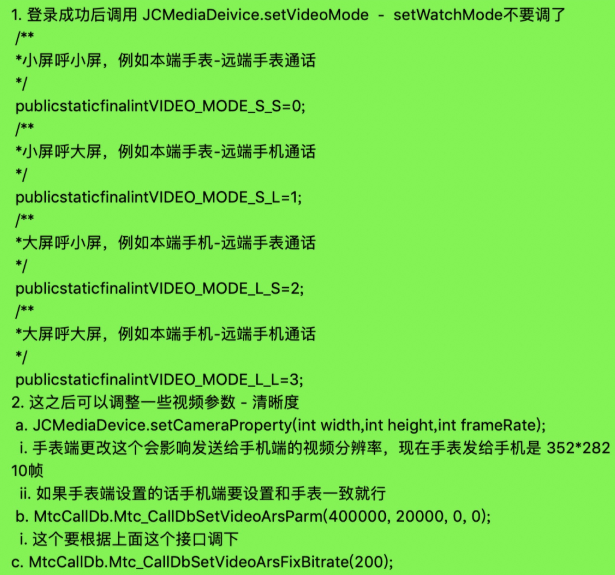

手表模式
=========================

一对一通话支持手表模式，您的 Android 手机或者 iPhone 可以和手表进行互通。**如果您已经集成了一对一通话**，则在此基础上只需添加简单的配置即可支持手表模式。

手表模式接口简洁，只需调用极少的接口即可集成，下面将介绍 iOS 和 Android 手机以及 Android 手表的集成。

**手机与手表互通需要分别进行以下设置：**

手机端设置
----------------------

iOS
>>>>>>>>>>>>>>>>>>>>>>>>>>

.. highlight:: objective-c

``设置抗锯齿``

针对视频质量，可以在 **登录成功后** 调用下面的方法设置抗锯齿
::

    /**
     *  @brief 设置抗锯齿
     *  @param sawtooth 是否抗锯齿
     */
    -(void)setSawtooth:(bool)sawtooth;

示例代码
::

    JCMediaDevice *mediaDevice = [[JCMediaDevice create:client callback:self];
    [mediaDevice setSawtooth:true];

.. note:: 此方法要在 setVideoMode 方法之前调用。

``设置视频模式``

设置视频模式，需要在 **登录成功后，呼叫前和收到来电前** 调用此接口，因此在调用前要 **明确本端设备和远端设备类型** ，并传入合适的类型
::

    /**
     *  @brief 设置视频模式，在呼叫前调用此接口，因此在调用前要明确本端设备和远端设备类型，并传入合适的类型
     *  @param videoMode 视频模式
     */
    -(void)setVideoMode:(int)videoMode otherParam:(JCVideoModeOtherParam*)param;

.. note:: JCVideoModeOtherParam 不需要更改填 nil，目前可设置 agc(声音增益) 开关，可能会导致手表端破音。

其中，JCMediaDeviceVideoMode(视频通话呼叫模式)有以下两种
::

    /// 大屏呼小屏，例如 本端手机 - 远端手表 通话
    JCMediaDeviceVideoModeLS = 2,
    /// 大屏呼大屏，例如 本端手机 - 远端手机 通话
    JCMediaDeviceVideoModeLL,

JCVideoModeOtherParam 是指声音增益，具体信息如下：
::

    /**
     * @brief 声音增益, JCMediaDeviceVideoModeLS 默认关闭，JCMediaDeviceVideoModeLL 默认开启
     * @param agc 声音增益
     *      -1 不会按照此 agc 设置，按照 VideoMode 的默认值设置
     *      0 表示关闭 agc
     *      1 表示开启 agc
     */
    @property (nonatomic) int agc;

示例代码::

    [JCManager.shared.mediaDevice setVideoMode:JCMediaDeviceVideoModeLS otherParam:nil];

.. note:: 

        若启用 VP8，则需要在 setVideoMode 方法后调用 Mtc_CallDbSetVideoCodecByPriority("VP8", (short)0); 设置为首位；

        如需关闭裁剪，则需要在 setVideoMode 方法后调用 Mtc_CallDbSetAdaptiveAspect 方法，设置 true 表示关闭图像裁剪。

``设置采集分辨率``

如需调整采集分辨率，需要在 **发起通话前** 调用 setCameraProperty 方法对视频采集参数进行设置
::

    // 设置帧率为10
    JCMediaDevice *mediaDevice = [[JCMediaDevice create:client callback:self];
    [mediaDevice setCameraProperty:640 height:480 framerate:10];
    // 设置帧率为15
    [mediaDevice setCameraProperty:640 height:480 framerate:15];

以上方法调用后，即可与手表或者其他智能设备进行通话。

^^^^^^^^^^^^^^^^^^^^^^^^^^^^^^^^^^^^^^

Android
>>>>>>>>>>>>>>>>>>>>>>>>>>>

.. highlight:: java

``设置回声消除模式``

需在 **登录前** 设置
::

    /**
     * 设置回声消除模式, 登录前设置
     * @param aecMode 回声消除模式
     */
    public abstract void setAecMode(@AecMode int aecMode);

其中，回声消除模式有以下几种
::

    /**
     * OS
     */
    public static final int AEC_OS = 0;

    /**
     * SDE
     */
    public static final int AEC_SDE = 1;

    /**
     * OS & SDE
     */
    public static final int AEC_OS_SDE = 2;

示例代码::

    JCManager.getInstance().mediaDevice.setAecMode(0);

调用下面的方法获取回声消除模式
::

    /**
     * 获取回声消除模式
     * @return 回声消除模式
     */
    public abstract @AecMode int getAecMode();

.. note:: 此方法要在 setVideoMode 方法之前调用。

``设置抗锯齿``

针对视频质量，可以在 **发起通话前** 调用下面的方法设置抗锯齿
::

    /**
     * 设置抗锯齿
     *
     * @param sawtooth 是否抗锯齿
     */
    public abstract void setSawtooth(boolean sawtooth);

示例代码
::

    JCMediaDevice mediaDevice = JCMediaDevice.create(client,this);
    mediaDevice.setSawtooth(true);

.. note:: 此方法要在 setVideoMode 方法之前调用。

``设置视频模式``

设置视频模式，需要在 **登录成功后，呼叫前和收到来电前** 调用此接口，因此在调用前要 **明确本端设备和远端设备类型** ，并传入合适的类型
::

     /**
      * 设置视频模式，在登录成功后, 呼叫前或者收到来电前调用此接口, 因此在调用前要明确本端设备和远端设备类型，并传入合适的类型
      *
      * @param videoMode 视频模式
      * @param otherParam 额外设置参数
      */
     public abstract void setVideoMode(@VideoMode int videoMode, VideoModeOtherParam otherParam);

其中， VideoMode(视频通话呼叫模式)有
::

    /**
     * 大屏呼小屏，例如 本端手机 - 远端手表 通话
     */
    public static final int VIDEO_MODE_L_S = 2;
    /**
     * 大屏呼大屏，例如 本端手机 - 远端手机 通话
     */
    public static final int VIDEO_MODE_L_L = 3;

VideoModeOtherParam 是指
::

    /**
     * setVideoMode 额外参数
     */
    public static class VideoModeOtherParam {
        /**
         * 声音增益，VIDEO_MODE_S_S 默认关，VIDEO_MODE_S_L 默认开，VIDEO_MODE_L_S 默认关，VIDEO_MODE_L_L 默认开
         *
         * -1 不会按照此 agc 设置，按照 VideoMode 的默认值设置
         * 0 表示关闭 agc
         * 1 表示开启 agc
         */
        public int agc;
    }

.. note:: VideoModeOtherParam 不需要更改则填 null，目前可设置 agc(声音增益) 开关，可能会导致手表端破音。

示例代码::

    public void onLogin(boolean result, @JCClient.ClientReason int reason) {
        if (result) {
            // 设置大屏呼小屏模式
            mediaDevice.setVideoMode(JCMediaDevice.VIDEO_MODE_L_S, null);
            ...
        }
    }

调用下面的方法获取视频模式
::

    /**
     * 获得视频模式
     *
     * @return 视频模式
     */
    public abstract int getVideoMode();

.. note:: 

        若启用 VP8，则需要在 setVideoMode 方法后调用 Mtc_CallDbSetVideoCodecByPriority("VP8", (short)0); 设置为首位；

        如需关闭裁剪，则需要在 setVideoMode 方法后调用 Mtc_CallDbSetAdaptiveAspect 方法，设置 true 表示关闭图像裁剪。

``设置采集分辨率``

如需调整采集分辨率，需要在 **发起通话前** 调用 setCameraProperty 方法对视频采集参数进行设置
::

    // 设置帧率为10
    JCMediaDevice mediaDevice = JCMediaDevice.create(client,this);
    mediaDevice.setCameraProperty(640, 480, 10);
    // 设置帧率为15
    mediaDevice.setCameraProperty(640, 480, 15);

以上方法调用后，即可与手表或者其他智能设备进行通话。

^^^^^^^^^^^^^^^^^^^^^^^^^^^^^^^^^^^^^^^^^^

手表端设置
----------------------

.. highlight:: java

``设置回声消除模式``

需在 **登录前** 设置
::

    /**
     * 设置回声消除模式, 登录前设置
     * @param aecMode 回声消除模式
     */
    public abstract void setAecMode(@AecMode int aecMode);

其中，回声消除模式有以下几种
::

    /**
     * OS
     */
    public static final int AEC_OS = 0;

    /**
     * SDE
     */
    public static final int AEC_SDE = 1;

    /**
     * OS & SDE
     */
    public static final int AEC_OS_SDE = 2;

示例代码::

    JCManager.getInstance().mediaDevice.setAecMode(0);

调用下面的方法获取回声消除模式
::

    /**
     * 获取回声消除模式
     * @return 回声消除模式
     */
    public abstract @AecMode int getAecMode();

.. note:: 此方法要在 setVideoMode 方法之前调用。

``设置抗锯齿``

针对视频质量，可以在 **发起通话前** 调用下面的方法设置抗锯齿
::

    /**
     * 设置抗锯齿
     *
     * @param sawtooth 是否抗锯齿
     */
    public abstract void setSawtooth(boolean sawtooth);

示例代码
::

    JCMediaDevice mediaDevice = JCMediaDevice.create(client,this);
    mediaDevice.setSawtooth(true);

.. note:: 此方法要在 setVideoMode 方法之前调用。

``设置视频模式``

设置视频模式，需要在 **登录成功后，呼叫前和收到来电前** 调用此接口，因此在调用前要 **明确本端设备和远端设备类型** ，并传入合适的类型
::

     /**
      * 设置视频模式，在登录成功后, 呼叫前或者收到来电前调用此接口, 因此在调用前要明确本端设备和远端设备类型，并传入合适的类型
      *
      * @param videoMode 视频模式
      * @param otherParam 额外设置参数
      */
     public abstract void setVideoMode(@VideoMode int videoMode, VideoModeOtherParam otherParam);

其中， VideoMode(视频通话呼叫模式)有
::

    /**
     * 小屏呼小屏，例如 本端手表 - 远端手表 通话
     */
    public static final int VIDEO_MODE_S_S = 0;
    /**
     * 小屏呼大屏，例如 本端手表 - 远端手机 通话
     */
    public static final int VIDEO_MODE_S_L = 1;

VideoModeOtherParam 是指
::

    /**
     * setVideoMode 额外参数
     */
    public static class VideoModeOtherParam {
        /**
         * 声音增益，VIDEO_MODE_S_S 默认关，VIDEO_MODE_S_L 默认开，VIDEO_MODE_L_S 默认关，VIDEO_MODE_L_L 默认开
         *
         * -1 不会按照此 agc 设置，按照 VideoMode 的默认值设置
         * 0 表示关闭 agc
         * 1 表示开启 agc
         */
        public int agc;
    }

.. note:: VideoModeOtherParam 不需要更改则填 null，目前可设置 agc(声音增益) 开关，可能会导致手表端破音。

示例代码::

    public void onLogin(boolean result, @JCClient.ClientReason int reason) {
        if (result) {
            // 设置小屏呼大屏模式
            mediaDevice.setVideoMode(JCMediaDevice.VIDEO_MODE_S_L, null);
            ...
        }
    }

调用下面的方法获取视频模式
::

    /**
     * 获得视频模式
     *
     * @return 视频模式
     */
    public abstract int getVideoMode();

.. note:: 

        若启用 VP8，则需要在 setVideoMode 方法后调用 Mtc_CallDbSetVideoCodecByPriority("VP8", (short)0); 设置为首位；

        如需关闭裁剪，则需要在 setVideoMode 方法后调用 Mtc_CallDbSetAdaptiveAspect 方法，设置 true 表示关闭图像裁剪。

``设置采集分辨率``

如需调整采集分辨率，需要在 **发起通话前** 调用 setCameraProperty 方法对视频采集参数进行设置
::

    // 设置帧率为10
    JCMediaDevice mediaDevice = JCMediaDevice.create(client,this);
    mediaDevice.setCameraProperty(640, 480, 10);
    // 设置帧率为15
    mediaDevice.setCameraProperty(640, 480, 15);

以上方法调用后，即可与手表、手机或者其他智能设备进行通话。

^^^^^^^^^^^^^^^^^^^^^^^^^^^^^^^^^^^^^^^^^^^^^^^^^^^^^^^^^^^

手表自身推送拉起菊风通话方案
-------------------------------

.. highlight:: java

``前提条件``

手表本身有自己的推送。

.. note:: 手表端不需要集成 米push 或者 华为push 的 jar 包。

``主叫方``

1. 调用菊风接口呼叫被叫方(手表)；

2. 发送一个 push 用于唤起被叫。

被叫方(手表)进行以下操作：

1. 增加创建 JCPush 模块
::
 
    JCPush push = JCPush.create(client);

2. 登录成功后向服务器注册个假的push，主要是让服务器认为此用户不是离线状态，这样主叫呼叫就不会被服务器直接拒绝
::

    JCPushTemplate pushInfo = new JCPushTemplate();
    pushInfo.initWithMiPush(context.getPackageName(), "随便");
    JCManager.getInstance().push.addPushInfo(pushInfo);
    pushInfo.initWithCall(JCPushTemplate.XIAOMI, JCManager.getInstance().client.getUserId(), "呼叫", "0");
    JCManager.getInstance().push.addPushInfo(pushInfo);

3. 手表收到厂家自身 push 后调起菊风模块进行初始化、登录等操作，登录成功后就会收到来电；

4. 通话结束后可以 destroy 菊风的模块。

^^^^^^^^^^^^^^^^^^^^^^^^^^^^^^^^^^^^^^^^^^^^^^^^^^^^^^^

手表模式中的常见问题
--------------------------

.. highlight:: java

1. 针对手表设备摄像头获取角度不正确的问题，可以在 **初始化后** 调用下面的方法
::

    ZmfVideo.screenOrientation(0);

    ZmfVideo.captureListenRotation(0,0);

    ZmfVideo.renderListenRotation(0,0);

2. 手表画面传输到手机端模糊问题

- 可以按照如下图所示的内容进行修改

其中，MtcCallDb.Mtc_CallDbSetVideoArsParm(400000,20000,0,0) 方法中前两个参数为视频发送最高和最低码率。

如：手表端设置如下（登录成功后设置）
::

    mediaDevice.setVideoMode(…);
    // 手表端
    mediaDevice.setCameraProperty(352, 282, 10);
    MtcCallDb.Mtc_CallDbSetVideoArsParm(600000, 200000, 0, 0);
    MtcCallDb.Mtc_CallDbSetVideoArsFixBitrate(200);

手机端设置如下（登录成功后设置）
::

    mediaDevice.setVideoMode(…);
    // 手机端
    mediaDevice.setCameraProperty(640, 480, 10);
