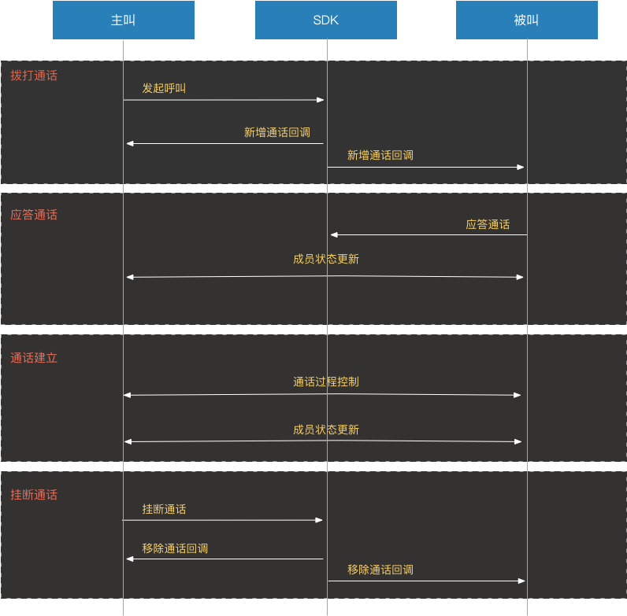

业务流程
=========================

一对一语音通话类似平时打电话的功能，业务流程简洁、易实现。

**业务流程图**

**业务流程描述**

- ``拨打通话``

主叫向被叫发起呼叫，呼叫发起后，主叫和被叫均会收到新增通话回调。

- ``应答通话``

被叫收到新增通话回调后进行应答通话。如果主叫发起语音呼叫，则被叫只能选择语音应答；如果主叫发起视频呼叫，则被叫有两种选择：视频应答和语音应答。

- ``通话建立``

被叫接听通话后，双方将建立连接，此时，主叫和被叫都将会收到通话更新的回调，连接成功之后，通话将建立。

通话过程中，如果通话状态发生了改变，如通话保持、静音和活跃状态切换等，双方都将收到通话更新的回调。此外，还可以在通话中对设备进行控制，如开启关闭扬声器、打开关闭音频设备、切换摄像头等。

- ``挂断通话``

如果想结束通话，主叫或者被叫均可以挂断通话，通话挂断后，双方将收到移除通话的回调，该回调将返回通话挂断的对象和挂断的原因。
