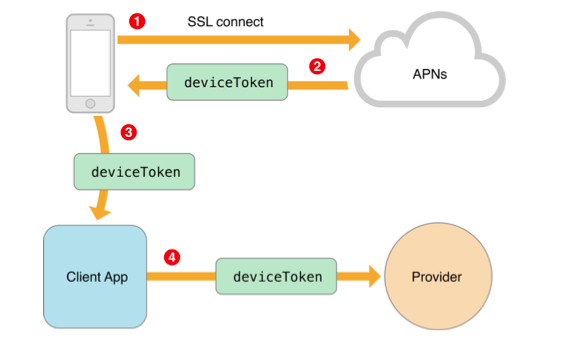
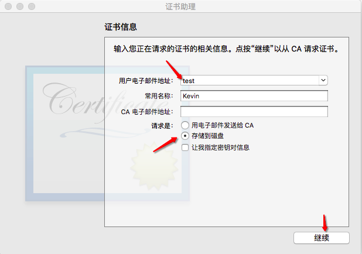
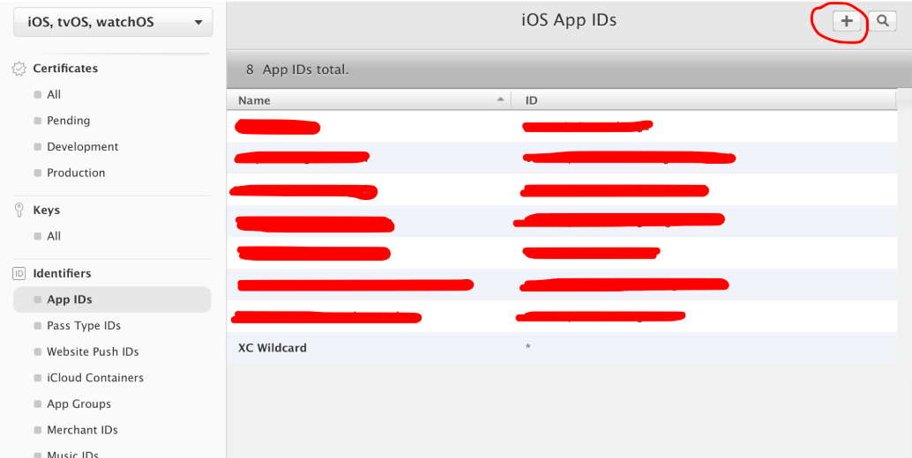
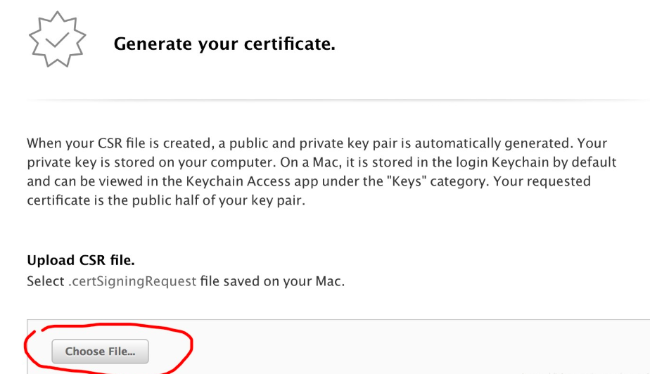
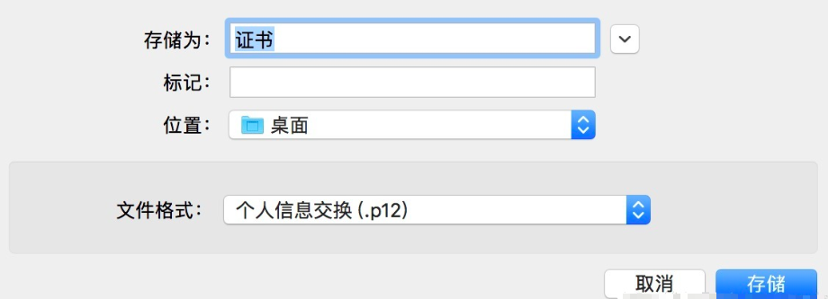
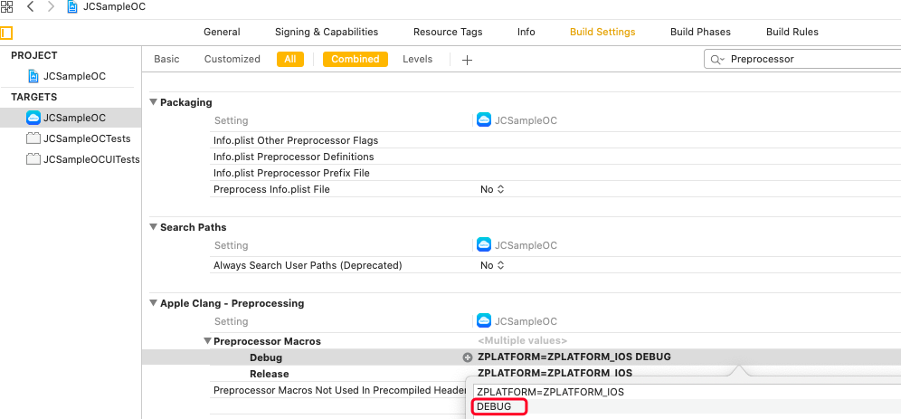

iOS 推送
=============================

.. highlight:: objective-c

.. _iOS 推送:

简介
---------------------

由于苹果不支持后台 App 的长链接，所以当 App 处于后台或者被杀掉的情况下将无法收到音视频的呼叫，因此在这种情况下需借助 Push 机制来接收音视频呼叫。

iOS 推送分为 APNs 推送和 VoIP 推送，由于 VoIP 推送后必须跟随 calllkit 的调用，而 callkit 已经在大陆被禁，为保护用户的数据，苹果 iOS 13 限制具有 VoIP 功能的应用程序后台访问权限。因此 voip 推送也基本无法在大陆使用。根据苹果文档提示，只能用普通推送（ usernotifications ）来代替 voip 推送（ pushkit ）。这将影响所有用 xcode11 编译的应用。

因此，此处仅介绍 APNs 推送的集成方法。

APNs 推送原理
--------------------------

APNs 是 Apple Push Notification service的缩写，也就是苹果的推送服务器。

APNs 推送可以分为三个阶段，如下图：

.. image:: images/apns_push_principle1.png

第一阶段：应用程序的服务器端把要发送的消息、目的iPhone的标识打包，发给APNs。

第二阶段：APNs在自身的已注册Push服务的iPhone列表中，查找有相应标识的iPhone，并把消息发送到iPhone。

第三阶段：iPhone把发来的消息传递给相应的应用程序，并且按照设定弹出Push通知。

更多关于 APNs 推送的信息请参考 `苹果开发指南 <https://developer.apple.com/library/content/documentation/NetworkingInternet/Conceptual/RemoteNotificationsPG/APNSOverview.html#//apple_ref/doc/uid/TP40008194-CH8-SW1>`_ 。

**APNs 注册流程**

1、应用程序注册 APNs 消息推送。

2、iOS从 APNs Server 获取 devicetoken，应用程序接收 device token。

3、应用程序将 device token 发送给程序的 PUSH 服务端程序。

APNs 推送证书申请
--------------------------

证书申请分为以下几步：

- 准备CSR文件

- 生成带有 Push Notifications 功能的 AppID

- 给该 AppID 的 Push Notifications配置CSR

- 下载证书配置钥匙串

- 导出 p12 文件

具体如下：

1.1 准备 CSR 文件

首先通过证书助手生成一个 Certificate Signing Request(也就是 CSR)的请求文件。

.. image:: images/csr1.png

继续之后选择保存位置，点击保存，此时该位置上会有一个 CertificateSigningRequest.certSigningRequest 的请求文件，也就是我们说的 CSR 文件。

1.2 生成带有Push Notifications功能的AppID 

在此处点+添加，按需求填写信息即可。 

.. image:: images/appid2.png

.. image:: images/appid3.png

这里的bundleID是识别APP的唯一ID，一个APP对应一个APP ID 也就是一个bundleID，一般采用域名反写的方式命名，输入部分的英文建议如此。 

.. image:: images/appid4.png

这里要把 Push Notifications 勾选上，应用才能带有推送能力。 全部设定好之后继续，保存，生成了一个新的 APP ID 。

1.3 给该AppID的Push Notifications配置CSR

.. image:: images/setcsr1.png

这部分是为这个APP ID配置push notifications，一个SSL Certificate可以让你手机上的notification server连接到Apple Push Notification Service（APNS） 

可以看到配置部分有两个： 

Development SSL Certificate:开发推送证书配置，开发环境可以收到推送。 

Production SSL Certificate：生成推送证书配置，线上环境可以收到推送。

在配置页面选取之前生成的CSR文件：CertificateSigningRequest.certSigningRequest点击continue即可配置完成

1.4 下载推送证书，加到自己电脑上的钥匙串里

.. image:: images/keychain1.png

点击Download，下载开发和生产的推送证书。 

双击两个证书，会自动添加在钥匙串里去。

.. image:: images/keychain2.png

1.5 导出p12文件

找到自己的APP（后面的名字为当时设定的bundleID），右键导出p12文件，填上密码，保存。

利用终端将 p12 转为 pem 格式

 具体命令如下：

 ::

    openssl pkcs12 -in apns_dev_cert.p12 -out apns_dev_cert.pem -nodes -clcerts -nokeys

    openssl pkcs12 -in apns_dev_cert.p12 -out apns_dev_key.pem -nodes -nocerts

    openssl rsa -in apns_dev_key.pem -out apns_dev_rsa_key.pem

    cat apns_dev_cert.pem  apns_dev_rsa_key.pem  > apns_dev.pem（要上传的文件）

下图为生成的 pem 文件需要包含的关键内容

1.6 验证证书是否工作。首先执行下面的命令
::
 
    telnet gateway.sandbox.push.apple.com 2195

它将尝试发送一个规则的，不加密的连接到 APNs 服务。如果看到下面的反馈，那说明您的 Mac 能够到达 APNs。按下 Ctrl+C 关闭连接。如果得到一个错误信息，那么需要确保您的防火墙允许2195端口。

下面要使用之前生成的 SSL 证书和私钥来设置一个安全的链接去链接苹果服务器：
::

    openssl s_client -connect gateway.sandbox.push.apple.com:2195 -cert apns_dev_cert.pem -key apns_dev_rsa_key.pem

执行完这一句命令后需要输入密码：
::

    Enter pass phrase for apns_dev_rsa_key.pem:

由于密码为空，直接按回车。 如果链接是成功的，您可以随便输入一个字符，按下回车，服务器就会断开链接，如果建立连接时有问题，OpenSSL 会返回一个错误信息。

如果您看到以下内容，说明链接是成功的：

::

    CONNECTED(00000003)
    depth=1 /C=US/O=Entrust, Inc./OU=www.entrust.net/rpa is incorporated by reference/OU=(c) 2009 Entrust, Inc./CN=Entrust Certification Authority - L1C
    verify error:num=20:unable to get local issuer certificate
    verify return:0
    ---
    Certificate chain
    0 s:/C=US/ST=California/L=Cupertino/O=Apple Inc./CN=gateway.sandbox.push.apple.com
    i:/C=US/O=Entrust, Inc./OU=www.entrust.net/rpa is incorporated by reference/OU=(c) 2009 Entrust, Inc./CN=Entrust Certification Authority - L1C
    1 s:/C=US/O=Entrust, Inc./OU=www.entrust.net/rpa is incorporated by reference/OU=(c) 2009 Entrust, Inc./CN=Entrust Certification Authority - L1C        i:/O=Entrust.net/OU=www.entrust.net/CPS_2048 incorp. by ref. (limits liab.)/OU=(c) 1999 Entrust.net Limited/CN=Entrust.net Certification Authority (2048)
    ---
    Server certificate
    -----BEGIN CERTIFICATE-----
    MIIFMzCCBBugAwIBAgIETCMmsDANBgkqhkiG9w0BAQUFADCBsTELMAkGA1UEBhMC
    ...
    -----END CERTIFICATE-----
    subject=/C=US/ST=California/L=Cupertino/O=Apple Inc./CN=gateway.sandbox.push.apple.com
    issuer=/C=US/O=Entrust, Inc./OU=www.entrust.net/rpa is incorporated by reference/OU=(c) 2009 Entrust, Inc./CN=Entrust Certification Authority - L1C
    ---
    Acceptable client certificate CA names
    /C=US/O=Apple Inc./OU=Apple Certification Authority/CN=Apple Root CA
    /C=US/O=Apple Inc./OU=Apple Worldwide Developer Relations/CN=Apple Worldwide         Developer Relations Certification Authority
    /C=US/O=Apple Inc./OU=Apple Certification Authority/CN=Apple Application Integration Certification Authority
    ---
    SSL handshake has read 3160 bytes and written 2179 bytes
    ---
    New, TLSv1/SSLv3, Cipher is AES256-SHA
    Server public key is 2048 bit
    Secure Renegotiation IS supported
    Compression: NONE
    Expansion: NONE
    SSL-Session:
        Protocol  : TLSv1
        Cipher    : AES256-SHA
        Session-ID: 
        Session-ID-ctx: 
        Master-Key:1D3F740E6FFF3AE1C56E09CC3876E701FC18D211652EF0C9B11D1C13F9357C71F44CDB11421AA47087E18ED86FFAD373
        Key-Arg   : None
        Start Time: 1444985977
        Timeout   : 300 (sec)
        Verify return code: 0 (ok)
    ---

上传 APNs 推送证书
--------------------------

APNs 证书生成之后，登录菊风云控制台进行对应的设置，具体如下：

- 登录菊风云控制台，进入要进行推送设置的应用详情，找到 Push 设置里的 APNS 配置

- 推送设置分为 Release 和 Debug，其中 Release 用于苹果正式环境；Debug 用于开发环境。

下面以 AppId 为 com.juphoon.cloud.JCSample 为例，分别添加上述两种模式证书，证书为上述生成的 apns_dev.pem 文件。

``Release 的 Bundle ID 为 com.juphoon.cloud.JCSample``

``Debug 的 Bundle  ID 为 com.juphoon.cloud.JCSample.DEBUG``

点击页面底部的“保存修改”按钮保存设置。 设置中 Release 对应 生产（Production） 证书，Debug 对应 开发（Sandbox）证书。 APNs 证书均有有效期的限制，开发证书的有效期是3个月，生产证书的有效期是1年，证书过期后无法推送消息。因此，请务必在证书到期前重新上传新证书，以保证推送服务持续正常。

配置 APNs 推送
--------------------------

证书上传完成后，还需要确保已经在工程设置中的 Preprocessor Macros 下的 Debug 中设置了 DEBUG 宏定义，如下图：

.. note::

    DEBUG 宏定义的目的是为了区分推送环境是 release 还是 debug，环境不对会导致推送失败。

代码集成
--------------------------

完成以上步骤即可进行代码集成，具体如下：

1. 创建 JCPush 对象
>>>>>>>>>>>>>>>>>>>>>>>>>>>>>>>

::

    /**
     *  @brief 创建 JCPush 对象
     *  @param client JCClient 对象
     *  @return 返回 JCPush 对象
     */
    +(JCPush*)create:(JCClient*)client;

示例代码::

    JCClient *client = [JCClient create:@"your appkey" callback:self extraParams:nil];
    JCPush *push = [JCPush create:client];

2. 注册 APNs 推送
>>>>>>>>>>>>>>>>>>>>>>>>>>>>>>>

- 注册 APNs 通知

注册推送。在APP完成初始化时，可通过系统函数 registerForRemoteNotifications告知系统需要 APNs 离线推送：
::

    UIUserNotificationSettings *userNotifySetting = [UIUserNotificationSettings 
                settingsForTypes:UIUserNotificationTypeBadge | UIUserNotificationTypeSound | 
                UIUserNotificationTypeAlert categories:nil];
    [[UIApplication sharedApplication] registerUserNotificationSettings:settings];
    [[UIApplication sharedApplication] registerForRemoteNotifications];

- 获取 device token

注册 APNs 推送后，在下面的方法中获取注册下发的 Token
::

    - (void)application:(UIApplication *)application didRegisterForRemoteNotificationsWithDeviceToken:(NSData *)deviceToken {

    }

如果无法正确获得 device token，可以在 UIApplication 中的代理方法中查看详细错误信息，此方法发生在获取 device token 失败之后
::

    -(void)application:(UIApplication *)application didFailToRegisterForRemoteNotificationsWithError:(NSError *)error {
    }

3. 添加推送模板
>>>>>>>>>>>>>>>>>>>>>>>>>>>>>>>

注册推送后，需要添加推送模板，添加推送模板有两种方式：

- 使用 JCPushTemplate 类中提供的模板方法添加模板

- 使用自定义的模板

开发者可以选择其中一种方法添加模板。下面对这两种方式进行具体说明：

``使用提供的模板``

注册推送后，调用下面的接口添加推送模板

::

    /**
     *  @brief 添加推送模板，用于服务器将不同类型的推送以不同的内容格式推给客户端
     *  @param info JCPushTemplate 对象
     *  @return true 表示成功 false 表示失败
     */
    -(bool)addPushInfo:(JCPushTemplate*)info;

在 JCPushTemplate 类中，可以设置苹果服务器获取的 token、通话推送信息和消息推送信息，具体如下：

- 设置苹果服务器获取的 token

::

    /**
     *  @brief 设置苹果服务器获取的token
     *  @param deviceToken token 值
     *  @param voip 是否是 voip token
     *  @param debug 是否是 debug 模式
    */
    -(id)initWithToken:(NSData*)deviceToken voip:(bool)voip debug:(bool)debug;

.. note:: debug 参数值需要依据开发环境而定，发布版设置为 false，开发版设置为 true。

- 设置通话推送信息
::

    /**
     *  @brief 设置通话推送信息
     *  @param sound 声音资源，例如 ring.m4r，为 nil 时则用默认声音
     *  @param seconds 消息过期时间
     */
    -(id)initWithCall:(NSString*)sound expiration:(int)seconds;

- 设置消息推送信息
::

    /**
     *  @brief 设置消息推送信息
     *  @param infoType 消息类型
     *  @param tip 提示内容，不包含发送者，例如 “xx:发送了条消息”，其中"发送了条消息"为tip值，如果要提示发送内容，则填 nil
     *  @param sound 声音资源，例如 ring.m4r
     *  @param seconds 消息过期时间
     */
    -(id)initWithText:(NSString*)infoType tip:(NSString*)tip sound:(NSString*)sound expiration:(int)seconds;

.. note::

    tip 为提示内容：
     - 如果 tip 值为空，则会在提示中显示消息详情；
     - 如果 tip 值不为空，则只显示消息的标题。
    例如“xx:发送了条消息”，其中"发送了条消息"为 tip 值。

示例代码
::

    - (void)application:(UIApplication *)application didRegisterForRemoteNotificationsWithDeviceToken:(NSData *)deviceToken {
        // 设置苹果服务器获取的token
        [_push addPushInfo:[[JCPushTemplate alloc] initWithToken:deviceToken.token voip:false debug:PushEnv]];
        // 设置通话推送信息
        [_push addPushInfo:[[JCPushTemplate alloc] initWithCall:nil expiration:2419200]];
        // 设置消息推送信息
        [_push addPushInfo:[[JCPushTemplate alloc] initWithText:@"text" tip:nil sound:nil expiration:2419200]];
    }

^^^^^^^^^^^^^^^^^^^^^^^^^^^^^^^^^^^^

``添加自定义推送模板``

为方便开发者更加灵活的配置推送的内容，菊风推出了自定义推送模板的接口，在该接口中，开发者可以进行自定义的推送模板配置
::

    /**
     * @brief 添加自定义推送模板，用于服务器将不同类型的推送以不同的内容格式推给客户端
     * @param pushTemplate     json格式字符串 包含Token模板，通话模板和消息模板，可以根据需要选择对应的模板进行配置，但是最终的json必须包含Token模板
     *
     *  @return true 表示成功 false 表示失败
     */
    -(void)addPushTemplate:(NSString *)pushTemplate;

推送模板为 json 格式的字符串，推送模板有通话推送模板格式和文本类消息推送模板格式两种，开发者可以根据需要选择对应的模板进行配置，**但是最终的 json 必须包含 Token 模板。** 详细说明如下：

1. 通话推送模板格式，JCCall 使用

格式为::

    {
        "Notify.APNS.AppId": "注册推送服务的AppId,需要与您在Juphoon网站上传证书时填入的AppId一致",
        "Notify.APNS.Invite.ResendCount": "推送内容重发次数，会加1", //例如填5，则会发送6次
        "Notify.APNS.Invite.ResendTimeout": "推送通知重发的超时时间，即每次重发的时间间隔，单位为妙",
        "Notify.APNS.Invite.Expiration": "推送过期时间",
        "Notify.APNS.Token": "注册推送时苹果下发的设备令牌，需转为16进制字符串"
        "Notify.APNS.Invite.Payload": {  // 推送的内容,必须包含一个aps键
            "aps": {
                "alert": {
                    "loc-args": ["${Caller}"],    // ${Caller}表示服务器传入的主叫userId，如果主叫设置了昵称则显示昵称
                    "loc-key": "${MediaType} call from %@"  //${MediaType}表示服务器传入的呼叫类型(视频或音频)，%@将会被 loc-args 中的宏定义替代
                },
                "sound": "%@"  //通知铃声，值为APP资源文件内或者Library/Sounds文件夹内的铃声文件名,如果文件不能被找到或者设置了默认值，则会使用系统默认铃声
            },
            "callid": "${CallId}", // ${CallId}表示服务器生成的callid
            "resend": "${ResendIndex}"  //${ResendIndex}表示服务器返回的第几次重发
        }
    }

Payload可灵活配置，具体参考 `官网 <https://developer.apple.com/library/archive/documentation/NetworkingInternet/Conceptual/RemoteNotificationsPG/CreatingtheNotificationPayload.html#//apple_ref/doc/uid/TP40008194-CH10-SW1>`_ 。

2. 文本类消息推送模板格式，JCMessageChannel 使用

格式为::

    { 
        "Notify.APNS.AppId": "注册推送服务的AppId,需要与您在Juphoon网站上传证书时填入的AppId一致",
        "Notify.APNS.Token": "注册推送时苹果下发的设备令牌，需转为16进制字符串"
        "Notify.APNS.Message.Info.text.Expiration": "推送消息过期时间", // text 为 sendMessage 中传入的 type
        "Notify.APNS.Message.Info.text.Payload":{ // 推送的内容,必须包含一个aps键
            "aps": {
                "alert": {
                    "loc-key": "收到来自%@的消息: %@",  // %@将会被 loc-args 中的宏定义替代
                    "loc-args": ["${Sender}", "${Text}"]    //${Sender}表示服务器传入的消息发送者，${Text}表示消息的内容
                },
                "badge": 1,    // 代表app图标右上角的消息数，如果不包含这个key值，消息数量不会改变，如果要删掉这个                                  badge，则把对应的key值设为0即可

                "sound": "default"    // 当推送信息送达时手机播放的声音，传defalut就标明使用系统默认声音
            },
            "to": "${Receiver}"    //${Receiver}表示服务器传入的消息接收对象
        }
    }

Payload 可灵活配置，具体参考 `官网 <https://developer.apple.com/library/archive/documentation/NetworkingInternet/Conceptual/RemoteNotificationsPG/CreatingtheNotificationPayload.html#//apple_ref/doc/uid/TP40008194-CH10-SW1>`_ 。

示例代码::

    {
        "Notify.APNS.AppId": "com.juphoon.cloud.JCSample", // APNS生产环境
        //"Notify.APNS.AppId": "com.juphoon.cloud.JCSample.DEBUG", // APNS沙盒环境
        "Notify.APNS.Token": "640652DF9891C3CDD7AB30086697713233AAA72F74924A36FAC3C1E60B30AF16",
        "Notify.APNS.Invite.ResendCount": "3",
        "Notify.APNS.Invite.ResendTimeout": "3",
        "Notify.APNS.Invite.Expiration": "3",
        "Notify.APNS.Invite.Payload": {
            "aps": {
                "alert": {
                    "loc-args": ["${Caller}", "${MediaType}"],
                    "loc-key": "收到%@的%@来电"
                },
                "sound": "default"
            },
            "callid": "${CallId}",
            "resend": "${ResendIndex}"
        },
        "Notify.APNS.Message.Info.text.Expiration": "20",
        "Notify.APNS.Message.Info.text.Payload": {
            "aps": {
                "alert": {
                    "loc-key": "收到来自%@的消息: %@",
                    "loc-args": ["${Sender}", "${Text}"]
                },
                "badge": 1,
                "sound": "default"
            },
            "to": "${Receiver}"
        }
    }

注册完成后，当 APNS 服务器推送消息到对应 token 的设备时会触发下面的回调
::

    -(void)application:(UIApplication *)application didReceiveRemoteNotification:(NSDictionary *)userInfo {
        NSLog(@"receiveRemoteNotification,userInfo is %@",userInfo);
    }

验证 APNs 推送
--------------------------

APNs 推送集成后，即可进行验证，具体如下：

1. 使用用户名登录您的 App，登录后将 App 从后台杀掉。

2. 进入 `Juphoon for developer <http://developer.juphoon.com>`_ ->控制台 ->我的应用 ->设置 ->基本 ->验证 Push。

3. 输入用户名和推送内容，点击验证，此时页面应提示“push 信息发送到服务器成功”。

