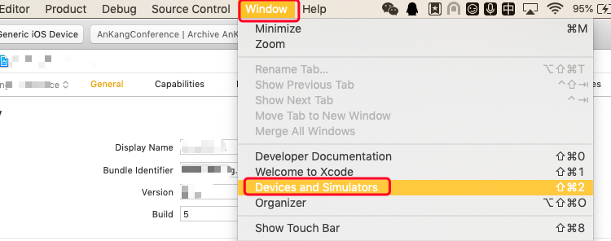
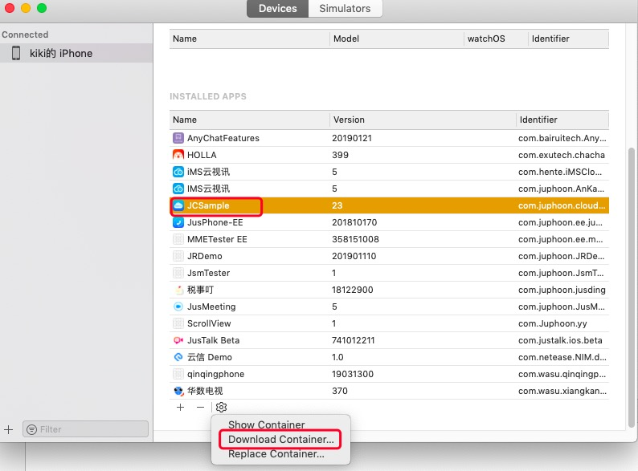
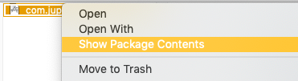
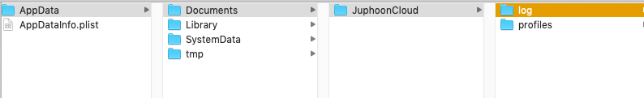

iOS
========================

.. highlight:: objective-c

.. _登录问题:

**登录**

1. 调用登录接口返回值为 true 是否表明已登录成功？应该如何判断登录成功？

- 登录接口返回 true 仅表示接口调用成功，不表明登录已经成功。只有收到登录成功的事件通知(JCCliNotifyTypeLoginOk)才表明登录成功。

2. JCCliNotifyTypeDidLogout 与 JCCliNotifyTypeLogouted 有什么区别？

- JCCliNotifyTypeDidLogout 表示主动调用登出接口后已经登出的事件通知；
- JCCliNotifyTypeLogouted 表示没有调用登录接口，但是收到已登出的事件。一般是当前设备登录的帐号在其他设备上登录，导致当前设备被踢下线的情况。

3. 收到 JCCliNotifyTypeDidLogout 通知后，界面应如何处理？

- 在收到 JCCliNotifyTypeDidLogout 后，界面不需要在调用注销的接口了。此时界面应该认为已经处于未登录状态。如果界面需要保持登录状态，需要重新发起登录。或者等待一段时间再发起登录，避免连续登录操作。

4. iOS 登录失败错误码在哪里看？

- 可以前往 `此地址 <http://developer.juphoon.com/portal/document/html/newguide/logguide.html#id1>`_ 查看错误的原因。

**通话**

1. 通话建立时如何将自己的昵称带给对方？

可以在 JCClient 中设置 displayName。

2. 通话集成之后，之前几次呼叫都可以接通，现在呼叫之后，那个终端没有弹出通话界面，是什么原因？

- 一个可能的原因是那个终端登录的帐号，在其他设备上登录了，导致那个设备上帐号已经登出。此时 SDK 会通知界面 JCCliNotifyTypeLogouted 事件。但是 UI 没有对该事件处理，所以再次呼叫那个帐号，对应的终端将不会收到呼叫了。

- 如果确定不是上述原因，就需要日志具体确定问题。

3. iOS 切换到后台后，来电点开为什么没有通话界面？

- 需要在 applicationDidBecomeActive 中调用 DidBecomeActive 函数。

4. 视频像素可以自定义设置吗?

- 如果是本端视频像素设置，可以在本地视频预览的时候调用 mediaDevice 中的 setCameraProperty 方法进行采集分辨率的设置。

5. 1对1通话，把app从后台杀掉后，来电是如何接收到的？

- App被杀掉后，如果注册的推送方式是透传方式，则会唤醒App，此时会收到XX来电的通知，点击通知即可进入来电界面。

6. iOS如何设置通话拨打铃声和来电铃声？

- 可以在收到来电的回调时，由App做放音处理。

7. 手表或手机通话时没有声音

- 需要检查麦克风，扬声器是否打开；

**视频采集**

1.如何设置视频分辨率？

- 如果是本端视频像素设置，可以在本地视频预览的时候调用 mediaDevice 中的 setCameraProperty 方法进行采集分辨率的设置。

**推送问题**

1. iOS 推送失败问题

- 可能的原因有以下几个方面：

  a. VoIP 证书是否有效，这个有效包括证书的过期时间，证书与包名是否匹配；

  b. 检查推送环境是否正确（release 对应苹果正式环境，debug 对应开发环境）；

  c. 检查 App 是否开启了通知权限。

**日志路径**

1.iOS 日志在哪里看？

- 导出日志方法如下:

打开日志方法及日志路径

日志路径在 doucments 目录下

**异常情况**

1. 通话集成之后，之前几次呼叫都可以接通，现在呼叫之后，那个终端没有弹出通话界面，是什么原因？

- 一个可能的原因是那个终端登录的帐号，在其他设备上登录了，导致那个设备上帐号已经登出。此时 SDK 会通知界面 JCCliNotifyLogouted 事件。但是 UI 没有对该事件处理，所以再次呼叫那个帐号，对应的终端将不会收到呼叫了。如果确定不是上述原因，就需要日志具体确定问题。

2. 通话一方没有收到 JCCallNotifyTypeTalking 的通知，可能是什么原因？

- 第一种情况是另一方的网络出现问题，造成媒体数据没有到达。
- 第二种情况是另一方没有打开音视频设备，比如没有调用 -(bool)startAudio; 或者是调用返回错误。具体的原因需要查看相关日志来定位。
