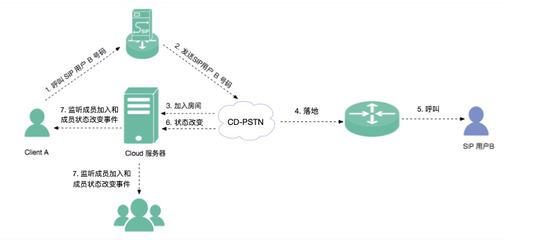

iOS 进阶
=========================

.. highlight:: objective-c

**集成进阶功能前，请确保您已经集成了基础的音视频通话功能**

.. _查询频道(iOS):

查询频道
---------------------------

如需查询频道相关信息，例如频道名称、是否存在、成员名、成员数，可以调用 query 接口进行查询操作
::

    /**
     *  @brief              查询媒体频道相关信息，例如是否存在，人数等
     *  @param channelId    媒体通道标识
     *  @return             返回操作id，与 onQuery 回调中的 operationId 对应
     */
    -(int)query:(NSString* __nonnull)channelId;

示例代码::

    [mediaChannel query:@"channelId"];

查询操作发起后，UI 通过以下方法监听回调查询的结果：
::

    /**
     *  @brief 查询媒体通道信息结果回调
     *  @param operationId 操作id，由 query 接口返回
     *  @param result true 表示查询成功，false 表示查询失败
     *  @param reason  查询失败原因 当 result 为 false 时该值有效
     *  @param queryInfo 查询到的信息，当失败时只需关注 channelId
     *  @see JCMediaChannelReason
     */
    -(void)onQuery:(int)operationId result:(bool)result reason:(JCMediaChannelReason)reason queryInfo:(JCMediaChannelQueryInfo*)queryInfo;

其中，JCMediaChannelQueryInfo 有下面几个属性
::

    //频道标识
    NSString* channelId;

    //频道号
    int number;

    //成员数
    int clientCount;

    //获取成员列表
    NSMutableArray *members;

示例代码::

    -(void)onQuery:(int)operationId result:(bool)result reason:(JCMediaChannelReason)reason queryInfo:(JCMediaChannelQueryInfo *)queryInfo {
        // 查询成功
       if (result) {
            // 查询频道标识
            NSString* channelId = queryInfo.channelId;
            // 查询频道号
            int number = queryInfo.number;
            // 查询频道成员数
            int clientCount = queryInfo.clientCount;
            // 查询频道成员列表
            NSMutableArray *members = queryInfo.members;
       } else {
            // 查询失败
       }
    }

^^^^^^^^^^^^^^^^^^^^^^^^^^^

.. _获取成员(iOS):

获取成员对象
---------------------------

通过 userId 获取频道成员对象
::

    /**
     *  @brief 获得频道成员
     *  @param userId 用户唯一标识
     *  @return 成员对象
     */
    -(JCMediaChannelParticipant* __nullable)getParticipant:(NSString* __nonnull)userId;

^^^^^^^^^^^^^^^^^^^^^^^^^^^

.. _踢出成员(iOS):

踢出成员
---------------------------

调用下面的方法将成员踢出会议
::

    /**
     * @brief 将成员踢出会议
     *
     * @param participant 成员
     * @return true表示成功，false表示失败
     */
    -(BOOL)kick:(JCMediaChannelParticipant * __nonnull)participant;

示例代码::

    JCMediaChannelParticipant* participant = [mediaChannel getParticipant:@"userId"];
    if (participant != nil) {
        [mediaChannel kick:participant];
    }

^^^^^^^^^^^^^^^^^^^^^^^^^^^

.. _文件视频源(iOS):

使用文件作为视频输入源
------------------------------

在视频通话中，可以将文件作为视频输入源，典型的场景如在线课堂的文稿显示，文件和摄像头作为视频输入源 **只能存在一种**，如果将文件作为视频输入源，而当前摄像头已开启的话，则会关闭摄像头。

开启视频文件作为视频输入源接口如下
::

    /**
     *  @brief 开启视频文件作为视频输入源，文件和摄像头作为视频输入源只能存在一种，当前摄像头开启的话会关闭摄像头
     *  @return 是否成功
     */
    -(bool)startVideoFile;

向文件视频源逐帧添加视频数据有如下两种接口可供选择，开发者可根据具体的需求选择调用
::

    /**
     *  @brief 向文件视频源逐帧添加视频数据
     *  @param srcFrame 画面二进制数据
     *  @param format 视频像素格式
     *  @param width 宽
     *  @param height 高
     */
    -(void)setVideoFileFrame:(NSData* __nonnull)srcFrame format:(JCMediaDeviceVideoPixelFormat)format width:(int)width height:(int)height;

    /**
     *  @brief 向文件视频源逐帧添加视频数据
     *  @param CVPixelBufferRef 视频数据
     *  @param angle 角度, 为 90 的倍数
     *  @param mirror 是否镜像，0 不镜像，1 镜像
     */
    -(void)setVideoFileFrame:(CVPixelBufferRef __nonnull)srcFrame angle:(int)angle mirror:(int)mirror;

如果想关闭文件视频源，则调用下面的接口
::

    /**
     *  @brief 关闭文件视频源
     *  @return ture表示关闭成功，false表示关闭失败
     */
    -(bool)stopVideoFile;

^^^^^^^^^^^^^^^^^^^^^^^^^^^^^^

.. _屏幕共享(iOS):

屏幕共享
----------------------

屏幕共享可以让您和频道中的其他成员一起分享设备里的精彩内容，您可以在频道中利用屏幕共享的功能进行文档演示、在线教育演示、视频会议以及游戏过程分享等。

.. note:: 发起屏幕共享需要 iOS 11.0 及以上。目前 iOS 只支持应用内的屏幕共享。

屏幕共享采集属性设置
>>>>>>>>>>>>>>>>>>>>>>>>>>>>>>

调用 JCMediaDevice 类中的 setScreenCaptureProperty 方法设置屏幕共享采集属性，包括采集的高度、宽度和帧速率。
::

    /**
     *  @breif              设置屏幕共享采集属性
     *  @param width        采集宽度，默认640
     *  @param height       采集高度，默认360
     *  @param framerate    帧速率，默认10
     */
    - (void)setScreenCaptureProperty:(int)width height:(int)height framerate:(int)framerate;

.. note:: 该方法可以在开启屏幕共享前调用，也可以在屏幕共享中调用；如果在屏幕共享中调用，则设置的采集属性要在下次屏幕共享开启时生效。

开启或关闭屏幕共享
>>>>>>>>>>>>>>>>>>>>>>>>>>>>>>

开启或关闭屏幕共享需要根据当前的屏幕共享状态进行判断，具体通过 screenUserId 进行判断。当 screenUserId 不为空时说明当前存在屏幕共享，不能再发起屏幕共享，只有当 screenUserId 为空时才可以发起屏幕共享。

屏幕共享状态是否变化通过 JCMediaChannelPropChangeParam 对象的 screenShare 属性判断。如果屏幕共享状态发生了改变会触发 onMediaChannelPropertyChange 回调
::

    /**
     *  @brief 属性变化回调，目前主要关注屏幕共享状态的更新
     *  @param changeParam 变化标识集合
     */
    -(void)onMediaChannelPropertyChange:(JCMediaChannelPropChangeParam *)changeParam;

如果当前不存在屏幕共享或者自己发起了屏幕共享，可以调用下面的方法开启或关闭屏幕共享
::

    /**
     * @brief 开关屏幕共享
     * @param enable 是否开启屏幕共享
     * @return 返回 true 表示正常执行调用流程，false 表示调用异常
     */
    -(bool)enableScreenShare:(bool)enable;

请求屏幕共享的视频流
>>>>>>>>>>>>>>>>>>>>>>>>>>>>>>

如果频道中有成员开启了屏幕共享，其他成员将收到 onMediaChannelPropertyChange 的回调，并通过 screenUserId 属性获得发起屏幕共享的用户标识。

获得发起屏幕共享的用户标识后，可以调用 requestScreenVideo 方法请求屏幕共享的视频流
::

    /**
     *  @brief 请求屏幕共享的视频流
     *  @param screenUri 屏幕分享uri
     *  @param pictureSize  视频请求尺寸类型
     *  @return 返回 true 表示正常执行调用流程，false 表示调用异常
     *  @see JCMediaChannelPictureSize
     *  @warning 当 pictureSize 为 JCMediaChannelPictureSizeNone 表示关闭请求
     */
    -(bool)requestScreenVideo:(NSString* __nonnull)screenUri pictureSize:(JCMediaChannelPictureSize)pictureSize;

示例代码::

    -(void)onMediaChannelPropertyChange:(JCMediaChannelPropChangeParam *)changeParam {
        if (changeParam.screenShare) {
            if (mediaChannel.screenUserId = nil) {
                // 开启屏幕共享
                [mediaChannel enableScreenShare:true];
                // 请求屏幕共享的视频流
                JCMediaDeviceVideoCanvas *screen = [mediaDevice startVideo:mediaChannel.screenRenderId renderType:JCMediaDeviceRenderFullContent];
                [mediaChannel requestScreenVideo:mediaChannel.screenRenderId pictureSize:JCMediaChannelPictureSizeLarge];
            } else if (mediaChannel.screenUserId != nil && "自己开启了屏幕共享") {
                // 关闭屏幕共享
                [mediaChannel enableScreenShare:false];
            }
        }
    }

^^^^^^^^^^^^^^^^^^^^^^^^^^^^^^^^^

.. _CDN 推流(iOS):

CDN 推流
----------------------

CDN 推流服务适用于各类音视频直播场景，如企业级音视频会议、赛事、游戏直播、在线教育、娱乐直播等。

CDN 推流集成简单高效，开发者只需调用相关 API 即可将 CDN 推流无缝对接到自己的业务应用中。

推流地址设置
>>>>>>>>>>>>>>>>>>>>>>>>>>>>>>

如要开启 CDN 推流，需在 **加入频道前** 进行 CDN 推流地址的设置。具体为通过 JCMediaChannelJoinParam 对象中的 cdn 属性进行设置
  
示例代码
::

    // 设置 CDN 推流地址
    JCMediaChannelJoinParam *joinParam = [[JCMediaChannelJoinParam alloc] init];
    joinParam.cdn = @"推流地址";
    // 加入频道
    [mediaChannel join:@"channelId" joinParam:joinParam];

CDN 状态获取
>>>>>>>>>>>>>>>>>>>>>>>>>>>>>>

开启 CDN 推流前需要判断 CDN 的状态，通过 JCMediaChannel 类的 cdnState 属性获取推流器状态。只有 CDN 当前状态不为 JCMediaChannelCdnStateNone 时才可以进行 CDN 推流。其中，CDN 推流状态有以下几种：
::

    /// 无法进行CDN推流
    JCMediaChannelCdnStateNone,
    /// 可以开启CDN推流
    JCMediaChannelCdnStateReady,
    /// CDN推流中
    JCMediaChannelCdnStateRunning,

CDN 状态的变化通过 onMediaChannelPropertyChange 回调上报
::

    /**
     *  @brief 属性变化回调，目前主要关注屏幕共享状态的更新
     *  @param changeParam 变化标识集合
     */
    -(void)onMediaChannelPropertyChange:(JCMediaChannelPropChangeParam *)changeParam;

开启或关闭 CDN 推流
>>>>>>>>>>>>>>>>>>>>>>>>>>>>>>

CDN 状态获取后，即可根据 CDN 的状态开启或关闭 CDN 推流，接口如下
::

    /**
     *  @brief              开关Cdn推流
     *  @param enable       是否开启Cdn推流
     *  @param keyInterval  推流关键帧间隔(毫秒)，当 enable 为 true 时有效，-1表示使用默认值(5000毫秒)，有效值需要>=1000
     *  @return             返回 true 表示正常执行调用流程，false 表示调用异常
     *  @warning 在收到 onMediaChannelPropertyChange 回调后检查是否开启
     */
    -(bool)enableCdn:(bool)enable keyInterval:(int)keyInterval;

示例代码
::

    -(void)onMediaChannelPropertyChange:(JCMediaChannelPropChangeParam *)changeParam {
        if (changeParam.cdnState) {  // CDN 状态变化
           JCMediaChannelCdnState cdnState =  mediaChannel.cdnState;
            // 根据CDN推流状态判断是否开启推流
            if (cdnState == JCMediaChannelCdnStateNone) {
                // 无法使用 CDN 推流
            } else if (cdnState == JCMediaChannelCdnStateReady) {
                // 可以开启 CDN 推流
                [mediaChannel enableCdn:true keyInterval:0];
            } else if (cdnState == JCMediaChannelCdnStateRunning) {
                // CDN 推流中，可以关闭 CDN 推流
                [mediaChannel enableCdn:false keyInterval:0];
            }
        }
    }

^^^^^^^^^^^^^^^^^^^^^^^^^^^^^^^^^^^^

.. _音视频录制(iOS):

服务器音视频录制
----------------------

设置录制参数
>>>>>>>>>>>>>>>>>>>>>>>>>>>>>>

服务器音频视频录制将录制的文件保存在七牛云上，因此，需要在七牛云注册账号并获取 AccessKey、SecretKey、BucketName、fileKey。

AccessKey、SecretKey、BucketName、fileKey 获取之后，利用 JCMediaChannelRecordParam 对象中的 buildQiniuRecordParam 方法构造七牛录制参数

::

    /**
     * @brief 七牛录制参数构造
     *
     * @param video 是否是视频录制
     * @param bucketName 七牛云 bucketName
     * @param secretKey 七牛云 secretKey
     * @param accessKey 七牛云 accessKey
     * @param fileName 录制文件名
     * @return 录制参数字符串
     */
    +(NSString* __nonnull)buildQiniuRecordParam:(BOOL)video bucketName:(NSString* __nonnull)bucketName secretKey:(NSString* __nonnull)secretKey accessKey:(NSString* __nonnull)accessKey fileName:(NSString* __nonnull)fileName;

录制参数构造之后，**在加入频道之前** 通过 JCMediaChannelJoinParam 对象中的 JCMediaChannelRecordParam 对象传入录制参数。

其中，JCMediaChannelRecordParam 对象有以下属性：

::

    /// 录制字符串
    @property (nonatomic, strong) NSString* __nonnull recoredString;

示例代码::

    // 设置录制参数
    JCMediaChannelJoinParam *joinParam = [[JCMediaChannelJoinParam alloc] init];
    joinParam.record = [[JCMediaChannelRecordParam alloc] init];
    joinParam.record.recoredString = [JCMediaChannelRecordParam buildQiniuRecordParam:true bucketName:@"QiNiuBucketName" secretKey:@"QiNiuSecretKey" accessKey:@"QiNiuAccessKey" fileName:@"QiNiuFilename"];
    // 加入频道
    [mediaChannel join:@"channelId" joinParam:joinParam];

.. note:: 

       如果进行音频录制，需要将构造方法中的 video 值设为 false。

获取录制状态
>>>>>>>>>>>>>>>>>>>>>>>>>>>>>>

录制参数设置好后，需要根据目前的录制状态来判断是否启音视频录制。其中录制状态可通过 recordState 属性获得。

recordState 有：
::

    /// 无法进行视频录制
    JCMediaChannelRecordStateNone,
    /// 可以开启视频录制
    JCMediaChannelRecordStateReady,
    /// 视频录制中
    JCMediaChannelRecordStateRunning,

录制状态的变化通过 onMediaChannelPropertyChange 回调上报
::

    /**
     *  @brief 属性变化回调，目前主要关注屏幕共享状态的更新
     *  @param changeParam 变化标识集合
     */
    -(void)onMediaChannelPropertyChange:(JCMediaChannelPropChangeParam *)changeParam;

开启或关闭音视频录制
>>>>>>>>>>>>>>>>>>>>>>>>>>>>>>

录制状态获取后，即可根据录制状态调用下面的接口开启或关闭音视频录制
::

    /**
     *  @brief 开关视频录制
     *  @param enable 是否开启屏幕录制
     *  @param recordParam 录制参数，当 enable 为 true 时，可以更改由 join 时传入的录制参数，不需更改则填 nil
     *  @return 返回 true 表示正常执行调用流程，false 表示调用异常
     */
    -(bool)enableRecord:(bool)enable recordParam:(JCMediaChannelRecordParam* __nullable)recordParam;

.. note::  
      
      recordParam 录制参数，当 enable 为 true 时，可以更改由 join 传入的录制参数，不需更改则填 nil。

示例代码::

    -(void)onMediaChannelPropertyChange:(JCMediaChannelPropChangeParam *)changeParam {
        if (changeParam.recordState) { // 录制状态变化
            // 根据音视频录制状态判断是否开启音视频录制
            if (mediaChannel.recordState == JCMediaChannelRecordStateNone) {
                // 无法进行音视频录制
            } else if (mediaChannel.recordState == JCMediaChannelRecordStateReady) {
                // 可以开启音视频录制
                [mediaChannel enableRecord:true recordParam:nil];
            } else if (mediaChannel.recordState == JCMediaChannelRecordStateRunning) {
                // 音视频录制中，可以关闭音视频录制
                [mediaChannel enableRecord:false recordParam:nil];
            }
        }
    }

^^^^^^^^^^^^^^^^^^^^^^^^^^^^^^^^

.. _发送消息(iOS):

发送消息
----------------------

如果想在频道中给其他成员发送消息，可以调用下面的接口
::

    /**
     * @brief 发送消息
     *
     * @param type 消息类型
     * @param content 消息内容，当 toUserId 不为 nil 时，content 不能大于 4k
     * @param toUserId 接收者id，null则发给频道所有人员
     * @return 返回 true 表示成功，false表示失败
     */
    -(bool)sendMessage:(NSString * __nonnull)type content:(NSString * __nonnull)content toUserId:(NSString * __nullable)toUserId;

其中，消息类型（type）为自定义类型。

示例代码::
    
    -(void)onJoin:(bool)result reason:(JCMediaChannelReason)reason channelId:(NSString*)channelId {
        // 发送给所有成员
        [mediaChannel sendMessage:@"text" content:@"content" toUserId:nil];
        // 发送给某个成员
        [mediaChannel sendMessage:@"text" content:@"content" toUserId:@"接收者id"];
    }

当频道中的其他成员收到消息时，会收到 onMessageReceive 回调
::

    /**
     * @brief 接收频道消息的回调
     *
     * @param type 消息类型
     * @param content 消息内容
     * @param fromUserId    消息发送成员的userId
     */
    -(void)onMessageReceive:(NSString *)type content:(NSString *)content fromUserId:(NSString *)fromUserId;

^^^^^^^^^^^^^^^^^^^^^^^^^^^^^^^^^

.. _Sip 邀请(iOS):

Sip 邀请
----------------------

利用 JC SDK 可以轻松实现多方音视频通话，但是如果出现用户所处的网络条件不好甚至没有网络条件的时候，就可以通过 PSTN 拨打 Sip 电话加入通话。

Sip 呼叫流程如下：

- Client 终端通过呼叫 Sip 用户号码邀请 Sip 用户加入频道；

- Sip 网关将 Sip 号码发送给 PSTN；

- PSTN 收到被邀请 Sip 号码后，登录该账号并加入频道；

- PSTN 加入频道成功后，向落地网关呼叫被邀请 Sip 号码；

- 落地网关呼叫 Sip 号码；

- Sip 用户接通后，PSTN 状态改变，频道中其他成员收到 PSTN 状态改变的回调。

邀请 Sip 用户，接口如下
::

    /**
     * @brief 邀请Sip用户，一般用于对接落地网关等
     *
     * @param userId 一般为号码
     * @param sipParam sip参数对象
     * @return 成功返回值 >= 0，失败返回 -1
     */
    -(int)inviteSipUser:(NSString * __nonnull)userId sipParam:(JCMediaChannelSipParam* __nonnull)sipParam;

其中，JCMediaChannelSipParam 对象有以下属性
::

    /// SIP呼叫 主叫号码
    @property (nonatomic, strong) NSString* __nullable callerNumber;
    /// 核心网ID
    @property (nonatomic, strong) NSString* __nullable coreNetwork;
    /// 额外信息
    @property (nonatomic) JCMediaChannelSipParamExtra* __nullable extra;

JCMediaChannelSipParamExtra 有以下属性和方法
::

    /// JCMediaChannel.inviteSipUser 参数 userId 是号码还是 sipUri
    @property (nonatomic) bool sipUri;
    /// sipUri 为 true 才生效，决定 sip 信令是否路由到 userId 的 sip 域里
    @property (nonatomic) bool route;
    /// sip用户加入会议后的昵称
    @property (nonatomic, strong) NSString* __nullable displayName;
    /// JCMediaChannel.inviteSipUser 参数 userId 是否为 Mcu 会议
    @property (nonatomic) bool mcu;
    /// 是否需要视频接入
    @property (nonatomic) bool video;
    /// dtmf 密码
    @property (nonatomic, strong) NSString* __nullable dtmfPassowrd;

    /// 生成json字符串
    -(NSString* __nonnull)toParamString;

示例代码
::

    JCMediaChannelSipParam* sipParam = [[JCMediaChannelSipParam alloc] init];
    sipParam.callerNumber = @"主叫号码";
    sipParam.coreNetwork = @"核心网ID";
    sipParam.extra = [[JCMediaChannelSipParamExtra alloc] init];
    sipParam.extra.sipUri = false;
    sipParam.extra.route = false;
    sipParam.extra.mcu = true;
    sipParam.extra.video = true;
    sipParam.extra.displayName = @"昵称";
    sipParam.extra.dtmfPassowrd = @"dtmf密码";
    [mediaChannel inviteSipUser:@"userId" sipParam:sipParam];

