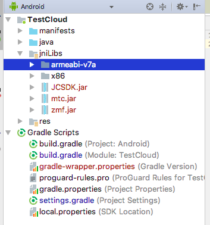

Android
===========================

.. _多方通话-Android:

.. highlight:: java

前提条件
----------------------------------

- Android SDK API 等级 16 或以上

- 支持 Android 4.1 或以上版本的移动设备

- 有效的菊风开发者账号（`免费注册 <http://developer.juphoon.com/signup>`_ ）

准备工作
----------------------------

开始之前，请您先做好如下准备工作：

SDK 下载
>>>>>>>>>>>>>>>>>>>>>>>>>>>>>>>>>>

点击 `Android SDK <http://developer.juphoon.com/document/cloud-communication-android-sdk#2>`_ 进行下载。

AppKey 获取
>>>>>>>>>>>>>>>>>>>>>>>>>>>>>>>>>>

AppKey 是应用在菊风云平台中的唯一标识。需要在 SDK 初始化的时候使用，AppKey 获取请参考 :ref:`创建应用 <创建应用>` 。

SDK 配置
>>>>>>>>>>>>>>>>>>>>>>>>>>>>>>>>>>

有两种方式集成 JC SDK：

**方法一：使用 JCenter 自动集成**

.. note:: 该方法仅适用于 2.0 及以上版本的 JC SDK 集成。
 
在项目的 /app/build.gradle 文件中，添加如下行：

::

    ...
    dependencies {
        ...
        // 可通过 SDK 发版说明取得最新版本号
        implementation 'com.JuphoonCloud:JC-SDK:2.0'
    }

**方法二：手动导入 JC SDK**

1. 下载 SDK，拷贝 libs 文件夹内的 armeabi-v7a、X86、mtc.jar 、JCSDK.jar 和 zmf.jar 到您工程目录中的 libs 目录下，并打开工程，如下图所示:

.. image:: images/android_sdklist.png

2. 为能连接到我们的 so 库，在您工程 build.gradle 文件中确保增加以下配置，如图:

.. image:: images/set_sdk_android2.png

3. 修改您工程中 Application 配置文件 AndroidManifest.xml，**请确保已经加入以下特性和权限信息**。具体信息可以参考 :ref:`Android 权限说明<Android 权限说明>` 。
::

    <uses-feature android:name="android.hardware.camera" />
    <uses-feature android:name="android.hardware.camera.autofocus" />
    <uses-permission android:name="android.permission.INTERNET" />
    <uses-permission android:name="android.permission.ACCESS_NETWORK_STATE" />
    <uses-permission android:name="android.permission.ACCESS_WIFI_STATE" />
    <uses-permission android:name="android.permission.READ_PHONE_STATE" />
    <uses-permission android:name="android.permission.WAKE_LOCK" />
    <uses-permission android:name="android.permission.CAMERA" />
    <uses-permission android:name="android.permission.RECORD_AUDIO" />
    <uses-permission android:name="android.permission.MODIFY_AUDIO_SETTINGS" />
    <uses-permission android:name="android.permission.WRITE_EXTERNAL_STORAGE" />
    <uses-permission android:name="android.permission.VIBRATE"/>
    <uses-permission android:name="android.permission.BLUETOOTH" />
    <uses-permission android:name="android.permission.SYSTEM_ALERT_WINDOW" />

.. note::

    您在 AndroidManifest 中进行权限配置时，请确保您能够获得打开摄像头、音视频录制等相关权限。

4. 配置完成后编译运行，如果没有报错，恭喜您，您已经成功配置 SDK，可以进行 SDK 初始化了。

.. note:: SDK 不支持模拟器运行，请使用真机。

SDK 初始化
>>>>>>>>>>>>>>>>>>>>>>>>>>>>>>>>>>

.. _Android SDK 初始化:

在使用 SDK 之前，需要进行 SDK 的初始化。在 App 的整个生命周期中，开发者只需要将 SDK 初始化一次。

首先在需要使用 JC SDK 的地方引入相关的类::

    import com.juphoon.cloud.JCClient;

在实现初始化的文件中实现 JCClientCallback 回调，用于接收 JCClient 相关通知。

在初始化的时候还可以设置 SDK 信息存储目录，日志路径以及日志打印的等级，具体通过 createParam 对象设置，如果不设置则使用默认值。

CreateParam 类有以下属性
::

    /**
     * SDK 相关信息存放目录，包括账号信息，日志信息等，默认为 sdcard/Android/data/包名/files 下
     */
    public String sdkInfoDir;
    /**
     * SDK 日志目录，如果不设置则默认在 sSdkInfoDir 下的 log 目录中
     */
    public String sdkLogDir;
    /**
     * 是否内部自动加载so库，默认为 true，如果上层需要自己加载则设置为 false
     */
    public boolean needLoadLibrary = true;
    /**
     * sdk 日志等级
     */
    public @LogLevel int sdkLogLevel;

日志等级 sdkLogLevel 有以下几种
::

    /**
     * disable日志等级
     */
    public static final int LOG_LEVEL_DISABLE = 0;
    /**
     * error日志等级
     */
    public static final int LOG_LEVEL_ERROR = 1;
    /**
     * info日志等级
     */
    public static final int LOG_LEVEL_INFO = 2;
    /**
     * debug日志等级
     */
    public static final int LOG_LEVEL_DEBUG = 3;

调用下面的接口初始化 SDK
::

    /**
     * 创建 JCClient 实例
     *
     * @param context   上下文句柄
     * @param appKey    用户从 Juphoon Cloud 平台上申请的 AppKey 字符串
     * @param callback    回调接口，用于接收 JCClient 相关通知
     * @param createParam 创建参数，null 则按默认值创建
     * @return JCClient 对象
     */
    public static JCClient create(@NonNull Context context, @NonNull String appKey, @NonNull JCClientCallback callback, CreateParam createParam) {

.. note::

       appKey 为准备工作中“获取 AppKey”步骤中取得的 AppKey。如果还未获取 AppKey，请参考 :ref:`创建应用 <创建应用>` 来获取。

示例代码::

    public boolean initialize(Context context) {
        // 初始化各模块，因为这些模块实例将被频繁使用，建议声明在单例中
        JCClient.CreateParam createParam = new JCClient.CreateParam(this);
        createParam.sdkLogLevel = LOG_LEVEL_INFO;
        createParam.sdkInfoDir = "SDK 信息存放路径";
        createParam.sdkLogDir = "日志存放路径";
        JCClient client = JCClient.create(Context, "your appkey", this, createParam);
        return true;
    }

SDK 初始化之后，可以调用下面的方法获取创建参数
::

    /**
     * 创建参数
     * @return 创建参数
     */
    public abstract CreateParam getCreateParam();

示例代码
::

    JCClient.CreateParam createParam = client.getCreateParam();

SDK 初始化之后，即可进行登录的集成。

登录
----------------------------------

.. _Android 登录:

登录涉及 JCClient 类及其回调 JCClientCallback，其主要作用是负责登录、登出管理及帐号信息存储。

登录之前，可以通过 loginParam 登录参数进行登录的相关配置，如服务器地址的设置或者使用代理服务器登录，如不设置则按照默认值登录，具体如下：

::

        JCClient.LoginParam loginParam = new JCClient.LoginParam();
        //默认国内环境 http:cn.router.justalkcloud.com:8080
        loginParam.serverAddress = "服务器地址";
        //如果使用代理服务器登录
        loginParam.httpsProxy = "代理服务器地址";

其中，服务器地址包括国际环境服务器地址和国内环境服务器地址：

**国际环境** 服务器地址默认为 ``http:intl.router.justalkcloud.com:8080`` 。

**国内环境** 服务器地址默认为 ``http:cn.router.justalkcloud.com:8080`` 。

开发者可以使用自定义服务器地址。

还可以通过 setDisplayName 接口设置昵称
::

    /**
     * 设置昵称，用于通话，消息等，可以更直观的表明身份
     * @param displayName 昵称
     */
    public abstract void setDisplayName(@NonNull String displayName);

示例代码::

    client.setDisplayName("小张");

发起登录
>>>>>>>>>>>>>>>>>>>>>>>>>>>

登录参数设置之后，即可调用 login 接口发起登录操作，userId 为英文、数字和'+' '-' '_' '.'，大小写不敏感，长度不要超过64字符，'-' '_' '.'不能作为第一个字符
::

    /**
     * 登陆 Juphoon Cloud 平台，只有登陆成功后才能进行平台上的各种业务 
     * 登陆结果通过 JCCallCallback 通知 
     * 注意:用户名为英文数字和'+' '-' '_' '.'，长度不要超过64字符，'-' '.' '_'字符不能处于第一位 
     *
     * @param userId   用户名
     * @param password 密码，但不能为空
     * @param loginParam 登录参数，null 则按默认值
     * @return 返回 true 表示正常执行调用流程，false 表示调用异常，异常错误通过 JCClientCallback 通知
     */
    public abstract boolean login(@NonNull String userId, @NonNull String password, LoginParam loginParam);

其中，LoginParam 类有以下属性
::

        /**
         * 登录服务器地址
         */
        public String serverAddress = "http:cn.router.justalkcloud.com:8080";
        /**
         * https代理地址，例如 192.168.1.100:3128
         */
        public String httpsProxy;
        /**
         * 设备id，一般模拟器使用，因为模拟器可能获得的设备id都一样
         */
        public String deviceId;
        /**
         * 登录账号不存在的情况下是否内部自动创建该账号，默认为 true
         */
        public boolean autoCreateAccount = true;

示例代码：
::

        JCClient.LoginParam loginParam = new JCClient.LoginParam();
        //默认国内环境 http:cn.router.justalkcloud.com:8080
        loginParam.serverAddress = "http:cn.router.justalkcloud.com:8080";
        client.login("账号", "123", loginParam);

登录成功之后，首先会触发登录状态改变（onClientStateChange）回调
::

    /**
     * 登录状态变化通知
     *
     * @param state    当前状态值
     * @param oldState 之前状态值
     */
    void onClientStateChange(@JCClient.ClientState int state, @JCClient.ClientState int oldState);

ClientState 有::

    // 未初始化
    public static final int STATE_NOT_INIT = 0;
    // 未登录
    public static final int STATE_IDLE = 1;
    // 登录中
    public static final int STATE_LOGINING = 2;
    // 登录成功
    public static final int STATE_LOGINED = 3;
    // 登出中
    public static final int STATE_LOGOUTING = 4;

示例代码::

    public void onClientStateChange(@JCClient.ClientState int state, @JCClient.ClientState int oldState) {
         if (state == JCClient.STATE_IDLE) { // 未登录
           ...
        } else if (state == JCClient.STATE_LOGINING) { // 正在登录
           ...
        } else if (state == JCClient.STATE_LOGINED) { // 登录成功
           ... 
        } else if (state == JCClient.STATE_LOGOUTING) { // 登出中
           ...
        }
    }

之后通过 onLogin 回调上报登录结果
::

    /**
     * 登陆结果回调
     *
     * @param result true 表示登陆成功，false 表示登陆失败
     * @param reason 当 result 为 false 时该值有效
     */
    void onLogin(boolean result, @JCClient.ClientReason int reason);

其中，ClientReason 有
::

    /**
     * 正常
     */
    public static final int REASON_NONE = 0;
    /**
     * sdk 未初始化
     */
    public static final int REASON_SDK_NOT_INIT = 1;
    /**
     * 无效参数
     */
    public static final int REASON_INVALID_PARAM = 2;
    /**
     * 函数调用失败
     */
    public static final int REASON_CALL_FUNCTION_ERROR = 3;
    /**
     * 当前状态无法再次登录
     */
    public static final int REASON_STATE_CANNOT_LOGIN = 4;
    /**
     * 超时
     */
    public static final int REASON_TIMEOUT = 5;
    /**
     * 网络异常
     */
    public static final int REASON_NETWORK = 6;
    /**
     * appkey 错误
     */
    public static final int REASON_APPKEY = 7;
    /**
     * 账号密码错误
     */
    public static final int REASON_AUTH = 8;
    /**
     * 无该用户
     */
    public static final int REASON_NOUSER = 9;
    /**
     * 强制登出
     */
    public static final int REASON_SERVER_LOGOUT = 10;
    /**
     * 其他错误
     */
    public static final int REASON_OTHER = 100;

登录成功之后，SDK 会自动保持与服务器的连接状态，直到用户主动调用登出接口，或者因为帐号在其他设备登录导致该设备登出。

登录之后可以通过下面的方法获取昵称、用户标识以及登录参数
::

    /**
     * 获取昵称
     *
     * @return 昵称
     */
    public abstract String getDisplayName();

    /**
     * 获得用户标识
     *
     * @return 用户标识
     */
    public abstract String getUserId();

    /**
     * 登录参数，只有调用登录接口后会有值，登出后为 nil
     * @return 登录参数
     */
    public abstract LoginParam getLoginParam();

示例代码::

        JCClient.CreateParam createParam = client.getCreateParam();
        JCClient.LoginParam loginParam = client.getLoginParam();
        String displayName = client.getDisplayName();
        String userId = client.getUserId();

登出
>>>>>>>>>>>>>>>>>>>>>>>>>>>

登出调用下面的方法，登出后不能进行平台上的各种业务操作
::

    /**
     * 登出 Juphoon Cloud 平台，登出后不能进行平台上的各种业务
     *
     * @return 返回 true 表示正常执行调用流程，false 表示调用异常，异常错误通过 JCClientCallback 通知
     */
    public abstract boolean logout();

登出同样会触发登录状态改变（onClientStateChange）回调

之后将通过 onlogout 回调上报登出结果
::

    /**
     * 登出回调
     *
     * @param reason 登出原因
     */
    void onLogout(@JCClient.ClientReason int reason);

集成登录后，即可进行相关业务的集成。

``SDK 支持前后台模式，可以在应用进入前台或者后台时调用 JCClient 类中的 setForeground 方法进行设置``

::

    /**
     * 设置是否为前台, 在有控制后台网络的手机上当进入前台时主动触发
     *
     * @param foreground 是否为前台
     */
    public abstract void setForeground(boolean foreground);

^^^^^^^^^^^^^^^^^^^^^^^^^^^^^^^

完成以上步骤，就做好了基础工作，您可以开始集成业务了。

业务集成
----------------------------------

**相关类说明**

多方视频通话涉及以下类：

.. list-table::
   :header-rows: 1

   * - 名称
     - 描述
   * - `JCMediaChannel <https://developer.juphoon.com/portal/reference/V2.0/android/com/juphoon/cloud/JCMediaChannel.html>`_
     - 媒体频道模块，类似音视频房间的概念，可以通过频道号加入此频道，从而进行音视频通话
   * - `JCMediaChannelParticipant <https://developer.juphoon.com/portal/reference/V2.0/android/com/juphoon/cloud/JCMediaChannelParticipant.html>`_
     - 媒体频道成员，主要用于成员基本信息以及状态等的管理
   * - `JCMediaChannelQueryInfo <https://developer.juphoon.com/portal/reference/V2.0/android/com/juphoon/cloud/JCMediaChannelQueryInfo.html>`_
     - 媒体频道查询信息结果
   * - `JCMediaChannelCallback <https://developer.juphoon.com/portal/reference/V2.0/android/com/juphoon/cloud/JCMediaChannelCallback.html>`_
     - 媒体频道模块回调代理
   * - `JCMediaDevice <https://developer.juphoon.com/portal/reference/V2.0/android/com/juphoon/cloud/JCMediaDevice.html>`_
     - 设备模块，主要用于视频、音频设备的管理
   * - `JCMediaDeviceVideoCanvas <https://developer.juphoon.com/portal/reference/V2.0/android/com/juphoon/cloud/JCMediaDeviceVideoCanvas.html>`_
     - 视频对象，主要用于 UI 层视频显示、渲染的控制
   * - `JCMediaDeviceCallback <https://developer.juphoon.com/portal/reference/V2.0/android/com/juphoon/cloud/JCMediaDeviceCallback.html>`_
     - 设备模块回调代理

更多关于类的详细信息请参考 `API 说明文档 <https://developer.juphoon.com/portal/reference/V2.0/android/>`_ 。

**开始集成多方视频通话功能前，请先实现 JCMediaDeviceCallback, JCMediaChannelCallback 回调，用于接收 JCMediaDevice 和 JCMediaChannel 的相关通知** 

之后进行 ``模块的初始化``

创建 JCMediaChannel 实例
::
    
    /**
     * 创建 JCMediaChannel 对象
     *
     * @param client      JCClient 对象
     * @param mediaDevice JCMediaDevice 对象
     * @param callback    JCMediaChannelCallback 回调接口，用于接收 JCMediaChannel 相关通知
     * @return            返回 JCMediaChannel 对象
     */
    public static JCMediaChannel create(JCClient client, JCMediaDevice mediaDevice, JCMediaChannelCallback callback);

创建 JCMediaDevice 实例
::

    /**
     * 创建 JCMediaDevice 对象
     *
     * @param client   JCClient 对象
     * @param callback JCMediaDeviceCallback 回调接口，用于接收 JCMediaDevice 相关通知
     * @return 返回 JCMediaDevice 对象
     */
    public static JCMediaDevice create(JCClient client, JCMediaDeviceCallback callback)

示例代码
::

    // 初始化各模块，因为这些模块实例将被频繁使用，建议声明在单例中
    JCMediaDevice mediaDevice = JCMediaDevice.create(client, this);
    JCMediaChannel mediaChannel = JCMediaChannel.create(client, mediaDevice, this);

**开始集成**

1. 加入频道
>>>>>>>>>>>>>>>>>>>>>>>>>>>>>>>>>>

.. image:: images/multivideojoin.png

发送本地音频流
^^^^^^^^^^^^^^^^^^^^^^^^^^^^^^^^^^^^^^^^^

在加入频道前，调用下面的接口打开或关闭“上传音频流”的标识，这样加入频道后其他成员就可以听到本端的声音     
::

    /**
     * 开启关闭发送本地音频流
     * 1.在频道中将会与服务器进行交互，服务器会更新状态并同步给其他用户
     * 2.未在频道中则标记是否上传音频流，在join时生效
     * 3.建议每次join前设置
     *
     * @param enable 是否开启本地音频流
     * @return 返回 true 表示正常执行调用流程，false 表示调用异常
     */
    public abstract boolean enableUploadAudioStream(boolean enable);

.. note:: 

        该接口可以在加入频道之前调用，也可以在加入频道之后调用。两者区别具体如下：
         - 如果在加入频道前调用，**只是打开或关闭“上传音频流”的标识，但不会发送数据**，当加入频道成功时会根据 enableUploadAudioStream 设定的值来确定是否上传音频数据。同时，频道中的其他成员会收到该成员“是否上传音频“的状态变化回调（onParticipantUpdate）。
         - 如果在加入频道后调用，则会开启或者关闭发送本地音频流数据，服务器也会根据 enableUploadAudioStream 设定的值来确定是否上传音频数据。同时，频道中的其他成员会收到该成员“是否上传音频“的状态变化回调（onParticipantUpdate）。
        此外，此方法还可以实现开启或关闭静音的功能。当 enable 值为 false ，将会停止发送本地音频流，此时其他成员将听不到本端的声音，从而实现静音功能。

发送本地视频流
^^^^^^^^^^^^^^^^^^^^^^^^^^^^^^^^^^^^^^^^^

在加入频道之前，调用下面的接口打开或者关闭“发送本地视频流”的标识，默认是开启发送本地视频流的，如果想看到视频画面，需要在加入频道后调用打开摄像头的接口
::

    /**
     * 开启关闭发送本地视频流
     * 1.在会议中将会与服务器进行交互，服务器会更新状态并同步给其他用户
     * 2.未在频道中则标记是否上传视频流，在join时生效
     * 3.建议每次join前设置
     *
     * @param enable 是否开启本地视频流
     * @return 返回 true 表示正常执行调用流程，false 表示调用异常
     */
    public abstract boolean enableUploadVideoStream(boolean enable);

.. note:: 

    该接口可以在加入频道之前调用，也可以在加入频道之后调用。两者区别具体如下：
     - 如果在加入频道前调用，**只是打开或关闭“上传视频流”的标识，但不发送数据**，当加入频道后会根据 enableUploadVideoStream 设定的值来确定是否上传视频流数据。同时，频道中的其他成员会收到该成员”是否上传视频“的状态变化回调（onParticipantUpdate）。如果设定的值为 false，则在加入频道后自动开启语音通话模式。
     - 如果在加入频道后调用，则会开启或关闭发送本地视频流数据。服务器会根据 enableUploadVideoStream 设定的值来确定是否上传视频流数据。同时，频道中的其他成员会收到该成员”是否上传视频“的状态变化回调（onParticipantUpdate），从而进行语音通话和视频通话的切换。
    此外，调用该方法发送本地视频流数据还要依赖摄像头是否已经打开。

加入频道
^^^^^^^^^^^^^^^^^^^^^^^^^^^^^^^^^^^^^^^^^

调用下面的接口加入频道
::

    /**
     * 加入频道
     *
     * @param channelIdOrUri 媒体频道标识或者频道Uri，当 params 中 JOIN_PARAM_URI_MODE 设置为 true 时表示频道 Uri，其他表示频道标识
     * @param joinParam 参数，没有则填null
     * @return 返回 true 表示正常执行调用流程，false 表示调用异常
     * @see MaxResolution
     * @see JoinParam
     */
    public abstract boolean join(String channelIdOrUri, JoinParam joinParam);

其中，JoinParam 为频道参数类，加入频道之前可以通过此类设置频道属性，如频道允许加入的最大人数，推流参数、录制参数等。具体如下：
::

        // 会议最大人数
        public int capacity = 16;
        // 推流参数
        public String cdn = null;
        // 录制参数
        public RecordParam record = null;
        // 密码
        public String password = "123456";
        // 平滑模式
        public boolean smooth = true;
        // 会议最大分辨率
        @MaxResolution public int maxResolution = MAX_RESOLUTION_360p;
        // uri 模式, join 函数的参数为会议 uri
        public boolean uriMode = false;
        // 心跳间隔
        public int heartbeatTime = 20;
        // 心跳超时
        public int heartbeatTimeout = 60;
        // 帧率 1-30, 默认 24
        public int framerate = 24;
        // 自定义属性
        public String customProperty = "";
        // 自定义媒体每层参数
        public String customVideoResolution = "";

.. note:: 加入频道会自动打开音频设备。

其中，customVideoResolution 代表自定义媒体每层参数，菊风提供 90p、360p、640p、720p、1080p 的分辨率供用户选择，如果这些分辨率无法满足用户的需求，则可以通过该参数自定义分层参数和码率。

关于该参数的具体说明如下：

1、格式

高基数 第一层高倍数 第一层码率 第二层高倍数 第二层码率 第三层高倍数 第三层码率 第四层高倍数 第四层码率

说明

- 默认宽高比16:9

- 编码宽高最后被裁成16整除

- 码率计算可大致参考文件 《码流甜点区域》

例如 "120 3 750 4 950 6 1200 9 1600"

 - 第一层 分辨率 宽640（120*3/9*16）高 360（120*3）； 码率750kbps

 - 第二层 分辨率 宽848（120*4/9*16）高 480（120*4）； 码率950kbps

 - 第三层 分辨率 宽1280（120*6/9*16）高 720（120*6）； 码率1200kbps

 - 第四层 分辨率 宽1920（120*9/9*16）高 1080（120*9）； 码率1600kbps

2、作用

自定义分层参数和码率

3、其他说明

二层或多层配置参数一致

 - 无意义，会增编码损耗。

 - 不会节约码率，码率取决于设置订阅层的码率；想减少流量，降低分层分配的码率。

   如 "120 3 750 3 750 6 1200 9 1600" 第一层和第二层一样

   当第一层和第二层都被订阅，实际第一层和第二层都在编码，没必要；可改成"120 3 750 6 1200 9 1600”，都订阅一层。
   
   以上情况设置成”120 3 750 6 1200 9 1600”会比”120 3 750 3 750 6 1200 9 1600" ，节约上行码率和减少编码损毁。

**示例代码**

::

    // 设置频道参数
    JCMediaChannel.JoinParam joinParam = new JCMediaChannel.JoinParam();
    joinParam.capacity = 6;
    joinParam.password = "ConfJoinPassword";
    joinParam.smooth = true;
    joinParam.maxResolution = MAX_RESOLUTION_720p;
    // 发送本地音频流
    mediaChannel.enableUploadAudioStream(true);
    // 发送本地视频流
    mediaChannel.enableUploadVideoStream(true);
    // 加入频道
    mediaChannel.join("222", joinParam);

加入频道结果回调
::

    /**
     * 加入频道结果回调
     *
     * @param result    true 表示成功，false 表示失败
     * @param reason    加入失败原因，当 result 为 false 时该值有效
     * @param channelId 频道标识符
     */
    void onJoin(boolean result, @JCMediaChannel.MediaChannelReason int reason, String channelId);

示例代码::

    // 加入频道结果回调
    public void onJoin(boolean result, @JCMediaChannel.MediaChannelReason int reason, String channelId) {
        if (result) {
            // 加入频道成功
        } else {
            // 加入频道失败
        }
    }

创建本地视频画面
^^^^^^^^^^^^^^^^^^^^^^^^^^^^^^^^^^^^^^^^^

- :ref:`创建本地视频画面<创建本地视频画面(android)>`

加入频道后，如果想看到本地视频画面，需要打开摄像头以创建视频画面。

创建视频画面需要用到 :ref:`JCMediaDevice<JCMediaDevice(android)>` 类和 :ref:`JCMediaDeviceVideoCanvas<JCMediaDeviceVideoCanvas(android)>` 类。

本地视频渲染调用 :ref:`startCameraVideo<创建本地视频画面(android)>` 接口，**该接口会打开摄像头**

::

    /**
     * 获得视频预览对象，通过此对象能获得视频用于UI显示
     *
     * @param renderType    渲染模式
     * @return              JCMediaDeviceVideoCanvas 对象
     * @see RenderType
     */
    public abstract JCMediaDeviceVideoCanvas startCameraVideo(@RenderType int renderType);

其中，渲染模式（RenderType)有以下几种::

    /**
     * 铺满窗口
     */
    public static final int RENDER_FULL_SCREEN = 0;
    /**
     * 全图像显示，会有黑边
     */
    public static final int RENDER_FULL_CONTENT = 1;
    /**
     * 自适应
     */
    public static final int RENDER_FULL_AUTO = 2;

.. note:: 调用该方法后，在挂断通话或者关闭摄像头时需要对应调用 stopVideo 方法停止视频。

示例代码::

    // 创建本地视频画面对象
    JCMediaDeviceVideoCanvas localCanvas = mediaDevice.startCameraVideo(JCMediaDevice.RENDER_FULL_CONTENT);
    viewGroup.addView(localCanvas.getVideoView(), 0);

该方法采集分辨率默认值为 640*360，帧率为 30，默认打开的是前置摄像头。

如果想自定义摄像头采集参数，如采集的高度、宽度和帧速率以及旋转角度等，请参考 :ref:`视频采集和渲染<视频采集和渲染(Android)>`。

创建远端视频画面
^^^^^^^^^^^^^^^^^^^^^^^^^^^^^^^^^^^^^^^^^

- :ref:`创建远端视频画面<创建远端视频画面(android)>`

加入频道后，如果有新成员加入，会收到 onParticipantJoin 回调
::

    /**
     * 新成员加入回调
     *
     * @param participant 成员对象
     */
    void onParticipantJoin(JCMediaChannelParticipant participant);

如果想看到其他成员的视频画面，需要创建远端视频画面，具体如下：

- 远端视频渲染

远端视频渲染调用 :ref:`startVideo<创建远端视频画面(android)>` 接口获取视频对象
::

    /**
     * 获得视频对象，通过此对象能获得视频用于UI显示
     *
     * @param videoSource   渲染标识串，比如 JCMediaChannelParticipant JCCallItem 中的 renderId
     * @param renderType    渲染模式
     * @return              JCMediaDeviceVideoCanvas 对象
     * @see RenderType
     */
    public abstract JCMediaDeviceVideoCanvas startVideo(String videoSource, @RenderType int renderType);

其中，渲染模式（RenderType)有以下几种::

    /**
     * 铺满窗口
     */
    public static final int RENDER_FULL_SCREEN = 0;
    /**
     * 全图像显示，会有黑边
     */
    public static final int RENDER_FULL_CONTENT = 1;
    /**
     * 自适应
     */
    public static final int RENDER_FULL_AUTO = 2;

.. note:: 调用该方法后，在挂断通话或者关闭摄像头时需要对应调用 stopVideo 方法停止视频。

- 请求远端成员视频流

由于服务器默认是不转发视频数据的，所以如果想看到远端成员画面需要请求远端成员的视频流
::
   
    /**
     * 请求频道中其他用户的视频流
     * 当 pictureSize 为 JCMediaChannelPictureSizeNone 时表示关闭请求
     *
     * @param participant   频道中其他成员对象
     * @param pictureSize   视频请求的尺寸类型
     * @return              返回 true 表示正常执行调用流程，false 表示调用异常
     * @see JCMediaChannel.PictureSize
     */
    public abstract boolean requestVideo(JCMediaChannelParticipant participant, @PictureSize int pictureSize);

其中，视频尺寸（PictureSize）有以下几种：

.. list-table::
   :header-rows: 1

   * - 名称
     - 描述
   * - public static final int PICTURESIZE_NONE = 0
     - 不请求
   * - public static final int PICTURESIZE_MIN = 1
     - 最小尺寸，160x90
   * - public static final int PICTURESIZE_SMALL = 2
     - 小尺寸，320x180，小窗口模式下可以使用小尺寸
   * - public static final int PICTURESIZE_LARGE = 3
     - 大尺寸，640x360
   * - public static final int PICTURESIZE_MAX = 4
     - 最大尺寸，360P 的会议为 640x360 ，720P 的会议为 1280x720

.. note:: 您可以根据相应的窗口大小使用相应的视频尺寸，避免造成不必要的流量浪费和额外的功耗。比如窗口的大小是 160x90，则应该使用 JCMediaChannel.PICTURESIZE_MIN。

现在您可以开始多方视频通话了。

**示例代码**

::

    public void onParticipantJoin(JCMediaChannelParticipant participant) {
        // 创建远端视频画面对象，renderId来源JCMediaChannelParticipant对象
        List<JCMediaChannelParticipant> partps = mediaChannel.getParticipants();
        JCMediaChannelParticipant item = partps.get(0);
        String renderId = item.getRenderId();
        JCMediaDeviceVideoCanvas remoteCanvas = mediaDevice.startVideo(renderId, JCMediaDevice.RENDER_FULL_CONTENT);
        viewGroup.addView(remoteCanvas.getVideoView(), 0);
        // 请求远端视频流，participant为JCMediaChannelParticipant对象
        mediaChannel.requestVideo(participant, JCMediaChannel.PICTURESIZE_LARGE);
    }

^^^^^^^^^^^^^^^^^^^^^^^^^^^^^^^^^^^^^^^^^^

2. 离开频道
>>>>>>>>>>>>>>>>>>>>>>>>>>>>>>>>>>>>>>

.. image:: leavechannel.png

如果想离开频道，可以调用下面的接口
::

    /**
     * 离开频道
     *
     * @return 返回 true 表示正常执行调用流程，false 表示调用异常
     */
    public abstract boolean leave();

示例代码::

    // 离开频道
    mediaChannel.leave();

在多方视频通话中，离开频道后还需要调用 :ref:`stopVideo<销毁本地和远端视频画面(android)>` 接口移除视频画面
::

    /**
     * 停止视频
     *
     * @param canvas JCMediaDeviceVideoCanvas 对象，由 startVideo 获得
     */
    public abstract void stopVideo(JCMediaDeviceVideoCanvas canvas);

离开频道后，UI 会收到 onLeave 回调，该回调返回离开原因以及频道标识符
::

    /**
     * 离开频道结果回调
     *
     * @param reason    离开原因
     * @param channelId 频道标识符
     */
    void onLeave(@JCMediaChannel.MediaChannelReason int reason, String channelId);

离开原因枚举值请参考 `JCMediaChannelReason <https://developer.juphoon.com/portal/reference/V2.0/android/>`_。

示例代码::

    // 离开频道结果回调
    public void onLeave(@JCMediaChannel.MediaChannelReason int reason, String channelId) {
        // 销毁视频
        JCManager.getInstance().mediaDevice.stopVideo(canvas);
        constraintLayout.removeView(canvas.getVideoView());
        canvas = null;
    }

3. 解散频道
>>>>>>>>>>>>>>>>>>>>>>>>>>>>>>>>>>>>>>

.. image:: stopchannel.png

如果想解散频道，可以调用下面的接口，此时所有成员都将被退出
::

    /**
     * 关闭频道，所有成员都将被退出
     *
     * @return 返回 true 表示正常执行调用流程，false 表示调用异常
     */
    public abstract boolean stop();

示例代码::

    // 结束频道
    mediaChannel.stop();

关闭频道的结果通过 onStop 回调上报
::

    /**
     * 解散频道结果回调
     *
     * @param result    true 表示成功，false 表示失败
     * @param reason    解散失败原因，当 result 为 false 时该值有效
     */
    void onStop(boolean result, @JCMediaChannel.MediaChannelReason int reason);

解散失败原因枚举值请参考 `JCMediaChannelReason <https://developer.juphoon.com/portal/reference/V2.0/android/>`_。

示例代码::

    // 解散频道结果回调
    public void onStop(boolean result, @JCMediaChannel.MediaChannelReason int reason) {
        // 销毁视频
        JCManager.getInstance().mediaDevice.stopVideo(canvas);
        constraintLayout.removeView(canvas.getVideoView());
        canvas = null;
    }

