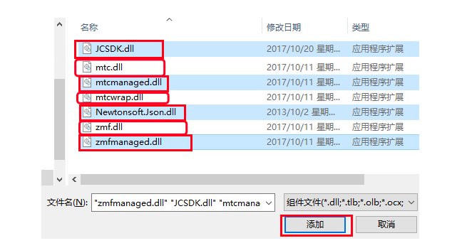
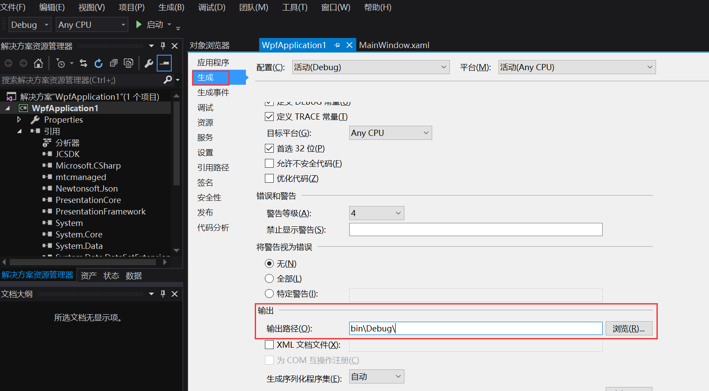

Windows
============================

.. _多方通话-windows:

.. highlight:: csharp

前提条件
----------------------------------

- Microsoft Visual Studio 2013 或以上版本

- 支持 Windows 7 或以上版本的 Windows 设备

- 有效的菊风开发者账号（`免费注册 <http://developer.juphoon.com/signup>`_ ）

准备工作
------------------------------

开始之前，请您先做好如下准备工作：

SDK 下载
>>>>>>>>>>>>>>>>>>>>>>>>>>>>>>>>>>

点击 `Windows SDK <http://developer.juphoon.com/document/cloud-communication-windows-sdk#2>`_ 进行下载。

AppKey 获取
>>>>>>>>>>>>>>>>>>>>>>>>>>>>>>>>>>

AppKey 是应用在菊风云平台中的唯一标识。需要在 SDK 初始化的时候使用，AppKey 获取请参考 :ref:`创建应用 <创建应用>` 。

SDK 配置
>>>>>>>>>>>>>>>>>>>>>>>>>>>>>>>>>>

.. _Windows SDK 配置:

准备工作：

1. 下载 Visual Studio 2013，请参考: `Visual Studio Downloads <https://www.visualstudio.com/en-us/downloads/download-visual-studio-vs.aspx>`_ 。

2. 安装 Directx End-User Runtime Web，请参考: `DirectX End-User Runtime Web <https://www.microsoft.com/zh-tw/download/details.aspx?id=35>`_ 。

.. note:: JC SDK Windows 版本（以下简称 SDK）支持 .net Framework 4.5及以上。

解压 SDK：

下载 Windows 版 SDK 并解压，解压后可以看到 bin 目录包含以下文件：

.. image:: images/windows_1.png

**导入Windows SDK**

1. 打开visual studio，新建WPF应用程序。

2. 点击“项目 > 添加引用”，将 bin 目录中的 JCSDK.dll，mtc.dll，mtcmanaged.dll，mtcwrap.dll，Newtonsoft.Json.dll，zmf.dll 和 zmfmanaged.dll 七个文件添加到您的工程目录中。

.. image:: images/windows_2.png

3. 在 Reference Manager 窗口中，可以看到添之后的文件，如下图：

.. image:: images/windows_4.png

4. 设置应用输出路径与库所在文件夹一致

5. 导入完成后编译运行，如果没有报错，恭喜您，您已经成功配置 SDK，可以进行 SDK 初始化了。

SDK 初始化
>>>>>>>>>>>>>>>>>>>>>>>>>>>>>>>>>>

.. _Windows SDK 初始化:

在实现初始化的文件中实现 JCClientCallback 回调，用于接收 JCClient 相关通知。

在初始化的时候还可以设置 SDK 信息存储目录，日志路径以及日志打印的等级，具体通过 CreateParam 对象设置，如果不设置则使用默认值。

CreateParam 对象有以下属性
::

    /// 

    /// SDK 相关信息存放目录，包括账号信息，日志信息等
    /// 

    public String sdkInfoDir;
    /// 

    /// SDK 日志目录
    /// 

    public String sdkLogDir;
    /// 

    /// SDK 日志打印等级
    /// 

    public JCLogLevel sdkLogLevel; 

调用下面的接口初始化 SDK

::

        /// 

        /// 创建 JCClient 实例
        /// 

        /// <param name="app">创建实例依赖的程序APP</param>
        /// <param name="appKey">用户从 Juphoon Cloud 平台申请的 AppKey 字符串</param>
        /// <param name="callback">回调接口，用于接收 JCClient 相关通知</param>
        /// <param name="createParam">创建参数</param>
        /// <returns>创建成功则返回创建的实例，否则返回null</returns>
        public static JCClient create(Application app, string appKey, JCClientCallback callback, CreateParam createParam)

.. note::

       appKey 为准备工作中“获取 AppKey”步骤中取得的 AppKey。如果还未获取 AppKey，请参考 :ref:`创建应用 <创建应用>` 来获取。

示例代码::

    public bool initialize(Application app)
    {
        // 初始化各模块，因为这些模块实例将被频繁使用，建议声明在单例中
         JCClient.CreateParam createParam = new JCClient.CreateParam();
         createParam.sdkInfoDir = "SDK 信息存放路径";
         createParam.sdkLogDir = "日志存放路径";
         createParam.sdkLogLevel = JCLogLevel.Info;
         JCClient client = JCClient.create(app, "your appkey", this, createParam);
         return true;
    }

SDK 初始化之后，即可进行登录的集成。

登录
------------------------

.. _Windows 登录:

登录涉及 JCClient 类及其回调 JCClientCallback，其主要作用是负责登录、登出管理及帐号信息存储。

登录之前，可以通过 loginParam 登录参数进行登录的相关配置，如服务器地址的设置或者使用代理服务器登录，如不设置则按照默认值登录，具体如下：

::

        /// 

        /// 登录服务器地址
        /// 

        public String serverAddress = "http:cn.router.justalkcloud.com:8080";
        /// 

        /// https代理地址，例如 192.168.1.100:3128
        /// 

        public String httpsProxy;
        /// 

        /// 设备id，一般模拟器使用，因为模拟器可能获得的设备id都一样
        /// 

        public String deviceId;
        /// 

        /// 登录账号不存在的情况下是否内部自动创建该账号，默认为 true
        /// 

        public bool autoCreateAccount = true;

其中，服务器地址包括国际环境服务器地址和国内环境服务器地址：

**国际环境** 服务器地址默认为 ``http:intl.router.justalkcloud.com:8080`` 。

**国内环境** 服务器地址默认为 ``http:cn.router.justalkcloud.com:8080`` 。

开发者可以使用自定义服务器地址。

示例代码::

    JCClient.LoginParam loginParam = new JCClient.LoginParam();
    loginParam.serverAddress = "服务器地址";

还可以通过 displayName 属性设置昵称，例如::

    client.displayName = "小张";

发起登录
>>>>>>>>>>>>>>>>>>>>>>>>>>>>>>>>>>

调用下面的接口发起登录，userId 为英文、数字和'+' '-' '_' '.'，大小写不敏感，长度不要超过64字符，'-' '_' '.'不能作为第一个字符
::

        /// 

        /// 登陆 Juphoon Cloud 平台，只有登陆成功后才能进行平台上的各种业务
        /// 登陆结果通过 JCCallCallback 通知
        /// 

        /// <param name="username">用户标识</param>
        /// <param name="password">密码，不能为空</param>
        /// <param name="loginParam">登入参数</param>
        /// <returns>true 表示正常执行调用流程，false 表示调用异常</returns>
        /// <remarks>注意:用户名为英文数字和'+' '-' '_' '.'，长度不要超过64字符, '-' '_' '.'不能作为首字符</remarks>
        /// <remarks>当用户不存在时会自动创建该用户</remarks>
        public bool login(string username, string password, LoginParam loginParam)

示例代码：
::

        JCClient.LoginParam loginParam = new JCClient.LoginParam();
        loginParam.serverAddress = "服务器地址";
        client.login("账号", "密码", loginParam);

登录成功之后，首先会触发登录状态改变（onClientStateChange）回调

::

        /// 

        /// 登陆状态变化通知
        /// 

        /// <param name="state">当前状态值</param>
        /// <param name="oldState">之前状态值</param>
        void onClientStateChange(JCClientState state, JCClientState oldState);

JCClientState 有::

    // 未初始化
    NotInit,
    // 未登录
    Idle,
    // 登录中
    Logining,
    // 登录成功
    Logined,
    // 登出中
    Logouting,

示例代码::

    public void onClientStateChange(JCClientState state, JCClientState oldState)
        {
            if (state == JCClientState.Idle) { // 未登录
               ...
            }
            else if (state == JCClientState.Logining) { // 登录中
               ...
            }
            else if (state == JCClientState.Logined) { // 登录成功
                ...
            }
            else if (state == JCClientState.Logouting) { // 登出中
                ...
            }
        }

之后通过 onLogin 回调上报登录结果
::

        /// 

        /// 登陆结果回调
        /// 

        /// <param name="result">true 表示登陆成功，false 表示登陆失败</param>
        /// <param name="reason">当 result 为 false 时该值有效，了解具体原因</param>
        void onLogin(bool result, JCClientReason reason);

其中，JCClientReason 有
::

        /// 

        /// 正常
        /// 

        None,
        /// 

        /// sdk 未初始化
        /// 

        SDKNotInit,
        /// 

        /// 无效参数
        /// 

        InvalidParam,
        /// 

        /// 函数调用失败
        /// 

        CallFucntionError,
        /// 

        /// 当前状态无法再次登录
        /// 

        StateCannotLogin,
        /// 

        /// 超时
        /// 

        TimeOut,
        /// 

        /// 网络异常
        /// 

        NetWork,
        /// 

        /// appkey 错误
        /// 
 
        AppKey,
        /// 

        /// 账号密码错误
        /// 

        Auth,
        /// 

        /// 无该用户
        /// 

        NoUser,
        /// 

        /// 强制登出
        /// 

        ServerLogout,
        /// 

        /// 其他错误
        /// 

        Other = 100,

登录成功之后，SDK 会自动保持与服务器的连接状态，直到用户主动调用登出接口，或者因为帐号在其他设备登录导致该设备登出。

登出
>>>>>>>>>>>>>>>>>>>>>>>>>>>>>>>>>>

登出调用下面的接口，登出后不能进行平台上的各种业务操作
::

    /// 

    /// 登出 Juphoon Cloud 平台
    /// 

    /// <returns>返回 true 表示正常执行调用流程，false 表示调用异常，异常错误通过 JCClientCallback 通知</returns>
    public bool logout();

登出同样会触发登录状态改变（onClientStateChange）回调

之后将通过 onlogout 回调上报登出结果
::

    /// 

    /// 登出回调
    /// 

    /// <param name="reason">登出原因</param>
    void onLogout(JCClientReason reason);

集成登录后，即可进行相关业务的集成。

^^^^^^^^^^^^^^^^^^^^^^^^^^^^^^^^^^^^^^^^^

业务集成
------------------------------

**相关类说明**

多方视频通话涉及以下类：

.. list-table::
   :header-rows: 1

   * - 名称
     - 描述
   * - `JCMediaChannel <http://developer.juphoon.com/portal/reference/V2.0/windows/html/8289e4bf-8045-497b-f584-fc76cad8f8a1.htm>`_
     - 媒体频道模块，类似音视频房间的概念，可以通过频道号加入此频道，从而进行音视频通话
   * - `JCMediaChannelParticipant <http://developer.juphoon.com/portal/reference/V2.0/windows/html/8ad58616-3028-b8d3-8106-81b8b805c1ea.htm>`_
     - 媒体频道成员，主要用于成员基本信息以及状态等的管理
   * - `JCMediaChannelQueryInfo <http://developer.juphoon.com/portal/reference/V2.0/windows/html/c933415b-17de-d9e6-ba4d-bbf14296e475.htm>`_
     - 媒体频道查询信息结果
   * - `JCMediaChannelCallback <http://developer.juphoon.com/portal/reference/V2.0/windows/html/0526ed70-e26b-ad4c-e666-d356e0eb0448.htm>`_
     - 媒体频道回调代理
   * - `JCMediaDevice <http://developer.juphoon.com/portal/reference/V2.0/windows/html/034d5af6-ec04-5148-7ec5-04e27e93e8c2.htm>`_
     - 设备模块，主要用于视频、音频设备的管理
   * - `JCMediaDeviceVideoCanvas <http://developer.juphoon.com/portal/reference/V2.0/windows/html/6a5b853c-d890-c30e-d236-5728d789ace1.htm>`_
     - 视频对象，主要用于 UI 层视频显示、渲染的控制
   * - `JCMediaDeviceCallback <http://developer.juphoon.com/portal/reference/V2.0/windows/html/3a00aa12-4e18-cf90-4610-b2c9c63b7a7b.htm>`_
     - 设备模块回调代理

更多关于类的详细信息请参考 `API 说明文档 <http://developer.juphoon.com/portal/reference/V2.0/windows/html/c134a0d9-74d2-4872-28ed-5b62b207aa8c.htm>`_ 。

**开始集成多方视频通话功能前，请先实现 JCMediaDeviceCallback, JCMediaChannelCallback 回调，用于接收 JCMediaDevice 和 JCMediaChannel 的相关通知** 

之后进行 ``模块的初始化``

创建 JCMediaDevice 实例
::

    /// 

    /// 创建JCMediaDevice实例
    /// 

    /// <param name="client">JCClient实例</param>
    /// <param name="callback">JCMediaDeviceCallback回调函数，用于接收JCMediaDevice相关事件</param>
    /// <returns>JCMediaDevice实例</returns>
    public static JCMediaDevice create(JCClient.JCClient client, JCMediaDeviceCallback callback)

创建 JCMediaChannel 实例
::

        /// 

        /// 创建JCMediaChannel对象
        /// 

        /// <param name="client"> JCClient 对象</param>
        /// <param name="mediaDevice">JCMediaDevice 对象</param>
        /// <param name="callback">JCMediaChannelCallback 对象，用于接收JCMediaDevice通知</param>
        /// <returns>JCMediaChannel对象</returns>
        public static JCMediaChannel create(JCClient.JCClient client, JCMediaDevice.JCMediaDevice mediaDevice, JCMediaChannelCallback callback)

示例代码
::

    // 初始化各模块，因为这些模块实例将被频繁使用，建议声明在单例中
    JCMediaDevice mediaDevice = JCMediaDevice.create(client, this);
    JCMediaChannel mediaChannel = JCMediaChannel.create(client, mediaDevice, this);

**开始集成**

1. 加入频道
>>>>>>>>>>>>>>>>>>>>>>>>>>>>>>>>>>

发送本地音频流
^^^^^^^^^^^^^^^^^^^^^^^^^^^^^^^^^^^^^^^^^

在加入频道前，调用下面的接口打开或关闭“上传音频流”的标识，这样加入频道后其他成员就可以听到本端的声音     

::

        /// 

        /// 开启关闭发送本地音频流
        /// 1.在频道中将会与服务器进行交互，服务器会更新状态并同步给其他用户
        /// 2.未在频道中则标记是否上传音频流，在Join时生效
        /// 2.建议每次Join前设置
        /// 

        /// <param name="enable">开启关闭本地音频流</param>
        /// <returns>返回true表示调用成功，false表示调用失败</returns>
        public bool enableUploadAudioStream(bool enable)

.. note:: 

        该接口可以在加入频道之前调用，也可以在加入频道之后调用。两者区别具体如下：
         - 如果在加入频道前调用，**只是打开或关闭“上传音频流”的标识，但不会发送数据**，当加入频道成功时会根据 enableUploadAudioStream 设定的值来确定是否上传音频数据。同时，频道中的其他成员会收到该成员“是否上传音频“的状态变化回调（onParticipantUpdate）。
         - 如果在加入频道后调用，则会开启或者关闭发送本地音频流数据，服务器也会根据 enableUploadAudioStream 设定的值来确定是否上传音频数据。同时，频道中的其他成员会收到该成员“是否上传音频“的状态变化回调（onParticipantUpdate）。
        此外，此方法还可以实现开启或关闭静音的功能。当 enable 值为 false ，将会停止发送本地音频流，此时其他成员将听不到本端的声音，从而实现静音功能。

发送本地视频流
^^^^^^^^^^^^^^^^^^^^^^^^^^^^^^^^^^^^^^^^^

在加入频道之前，调用下面的接口打开或者关闭“发送本地视频流”的标识，默认是开启发送本地视频流的，如果想看到视频画面，需要在加入频道后调用打开摄像头的接口

::

        /// 

        /// 开启关闭发送本地视频流
        /// 1.在频道中将会与服务器进行交互，服务器会更新状态并同步给其他用户
        /// 2.未在频道中则标记是否上传视频流，在Join时生效
        /// 2.建议每次Join前设置
        /// 

        /// <param name="enable">开启关闭本地视频流</param>
        /// <returns>返回true表示调用成功，false表示调用失败</returns>
        public bool enableUploadVideoStream(bool enable)

.. note:: 

    该接口可以在加入频道之前调用，也可以在加入频道之后调用。两者区别具体如下：
     - 如果在加入频道前调用，**只是打开或关闭“上传视频流”的标识，但不发送数据**，当加入频道后会根据 enableUploadVideoStream 设定的值来确定是否上传视频流数据。同时，频道中的其他成员会收到该成员”是否上传视频“的状态变化回调（onParticipantUpdate）。如果设定的值为 false，则在加入频道后自动开启语音通话模式。
     - 如果在加入频道后调用，则会开启或关闭发送本地视频流数据。服务器会根据 enableUploadVideoStream 设定的值来确定是否上传视频流数据。同时，频道中的其他成员会收到该成员”是否上传视频“的状态变化回调（onParticipantUpdate），从而进行语音通话和视频通话的切换。
    此外，调用该方法发送本地视频流数据还要依赖摄像头是否已经打开。

加入频道
^^^^^^^^^^^^^^^^^^^^^^^^^^^^^^^^^^^^^^^^^

调用下面的接口加入频道
::

        /// 

        /// 加入频道
        /// 当 params 中不设置 JOIN_PARAM_REGION 参数，则默认为中国区域，如果业务主要集中在国外则选择 REGION_OTHER
        /// <code>
        ///joinparams.Add(JCMediaChannelConstants.JOIN_PARAM_CDN, "推流地址");
        ///joinparams.Add(JCMediaChannelConstants.JOIN_PARAM_RECORD, "{"MtcConfIsVideoKey": true,
        ///              "Storage": {
        ///              "Protocol": "qiniu",
        ///              "BucketName": "用户填入",
        ///              "SecretKey": "用户填入",
        ///              "AccessKey": "用户填入",
        ///              "FileKey": "**.mp4"
        ///              }
        ///            }"
        ///          );
        ///joinparams.Add(JCMediaChannelConstants.JOIN_PARAM_REGION, JCMediaChannelRegion.REGION_CHINA.ToString());
        ///JCManager.shared().MediaChannel.join(confid, joinparams);
        /// </code>
        /// 

        /// <param name="channelIdOrUri">频道标识或频道Uri</param>
        /// <param name="joinParam">加入会议参数</param>
        /// <returns>返回true表示调用成功，false表示调用失败</returns>
        public bool join(string channelIdOrUri, JoinParam joinParam)

.. note:: 加入频道会自动打开音频设备。

加入频道之前可以通过 JoinParam（加入参数，第一个加入者有效）设置频道属性，如频道允许加入的最大人数，推流参数、录制参数等。具体如下：

::

    /// 

    /// 会议最大人数
    /// 

    public int capacity = 16;
    /// 

    /// 推流参数
    /// 

    public String cdn = null;
    /// 

    /// 录制参数
    /// 

    public RecordParam record = null;
    /// 

    /// 密码
    /// 

    public String password = "123456";
    /// 

    /// 平滑模式
    /// 

    public bool smooth = true;
    /// 

    /// 会议最大分辨率
    /// 

    public JCMediaChannelMaxResolution maxResolution = JCMediaChannelMaxResolution.MaxResolution360P;
    /// 

    /// uri 模式, join 函数的参数为会议 uri
    /// 

    public bool uriMode = false;
    /// 

    /// 心跳间隔
    /// 

    public int heartbeatTime = 20;
    /// 

    /// 心跳超时
    /// 

    public int heartbeatTimeout = 60;
    /// 

    /// 帧率 1-30, 默认 24
    /// 

    public int framerate = 24;
    ///// 

    ///// 最大码率
    ///// 

    //public int maxBitrate = 2000;
    /// 

    /// 自定义属性
    /// 
            
    public String customProperty = "";
    /// 自定义媒体每层参数，格式"基数 第一层倍数 第一层码率 第二层倍数 第二层码率 第三层倍数 第三层码率 第四层倍数 第四层码率" 
    /// 例如 "120 3 750 4 950 6 1200 9 1600" 第一层360P,码率750kbps,第二层480P,码率950kbps,第三层720P,码率1200kbps,第四层1080P,码率1600kbps
    /// 如果一致的层数越多越省流量
    /// 

    public String customVideoResolution = "";

其中，customVideoResolution 代表自定义媒体每层参数，菊风提供 90p、360p、640p、720p、1080p 的分辨率供用户选择，如果这些分辨率无法满足用户的需求，则可以通过该参数自定义分层参数和码率。

关于该参数的具体说明如下：

1、格式

高基数 第一层高倍数 第一层码率 第二层高倍数 第二层码率 第三层高倍数 第三层码率 第四层高倍数 第四层码率

说明

- 默认宽高比16:9

- 编码宽高最后被裁成16整除

- 码率计算可大致参考文件 《码流甜点区域》

例如 "120 3 750 4 950 6 1200 9 1600"

 - 第一层 分辨率 宽640（120*3/9*16）高 360（120*3）； 码率750kbps

 - 第二层 分辨率 宽848（120*4/9*16）高 480（120*4）； 码率950kbps

 - 第三层 分辨率 宽1280（120*6/9*16）高 720（120*6）； 码率1200kbps

 - 第四层 分辨率 宽1920（120*9/9*16）高 1080（120*9）； 码率1600kbps

2、作用

自定义分层参数和码率

3、其他说明

二层或多层配置参数一致

 - 无意义，会增编码损耗。

 - 不会节约码率，码率取决于设置订阅层的码率；想减少流量，降低分层分配的码率。

   如 "120 3 750 3 750 6 1200 9 1600" 第一层和第二层一样

   当第一层和第二层都被订阅，实际第一层和第二层都在编码，没必要；可改成"120 3 750 6 1200 9 1600”，都订阅一层。
   
   以上情况设置成”120 3 750 6 1200 9 1600”会比”120 3 750 3 750 6 1200 9 1600" ，节约上行码率和减少编码损毁。

**示例代码**

::

    // 设置频道参数
    JCMediaChannel.JoinParam joinParam = new JCMediaChannel.JoinParam();
    joinParam.capacity = "6";
    joinParam.password = "会议密码";
    joinParam.smooth = true;
    // 发送本地音频流
    mediaChannel.enableUploadAudioStream(true);
    // 发送本地视频流
    mediaChannel.enableUploadVideoStream(true);
    // 加入频道
    mediaChannel.join("222", joinParam);

加入频道接口调用后，首先会触发 onMediaChannelStateChange 回调，该回调返回自身当前的状态
::

        /// 

        /// 自身状态变化回调
        /// 

        /// <param name="state">当前状态</param>
        /// <param name="oldState">变化前状态值</param>
        void onMediaChannelStateChange(JCMediaChannelState state, JCMediaChannelState oldState);

JCMediaChannelState 有以下值
::

        /// 

        /// 空闲
        /// 

        Idle,
        /// 

        /// 加入中
        /// 

        Joining,
        /// 

        /// 已加入
        /// 

        Joined,
        /// 

        /// 离开中
        /// 

        Leaving

加入频道的结果通过 onJoin 回调
::

        /// 

        /// 加入频道结果回调
        /// 

        /// <param name="result">true表示加入成功，false表示加入失败</param>
        /// <param name="reason">加入失败原因，在result为false时该值有效</param>
        /// <param name="channelId">媒体频道标识</param>
        void onJoin(bool result, JCMediaChannelReason reason, string channelId);

示例代码::

    // 加入频道结果回调
    public void onJoin(bool result, JCMediaChannelReason reason, string channelId)
    {
        if (result)
        {
            // 加入频道成功
        } else {
            // 加入频道失败
        }
    }

创建本地视频画面
^^^^^^^^^^^^^^^^^^^^^^^^^^^^^^^^^^^^^^^^^

- :ref:`创建本地视频画面<创建本地视频画面>`

加入频道后，如果想看到本地视频画面，需要打开摄像头以创建本地视频画面。

创建视频画面需要用到 :ref:`JCMediaDevice<JCMediaDevice>` 类和 :ref:`JCMediaDeviceVideoCanvas<JCMediaDeviceVideoCanvas>` 类。

调用 JCMediaDevice 类中的 :ref:`startCameraVideo<创建本地视频画面>` 接口创建本地视频画面，**调用该接口会自动打开摄像头**
::

        /// 

        /// 获取预览视频对象，通过此对象能获得视图用于UI显示
        /// 

        /// <param name="mode">渲染方式</param>
        /// <returns>JCMediaDeviceVideoCanvas对象</returns>
        public JCMediaDeviceVideoCanvas startCameraVideo(JCMediaDeviceRenderMode mode)

其中，JCMediaDeviceRenderMode（渲染模式）有以下几种：
::

        /// 

        /// 铺满窗口
        /// 

        FULLSCREEN,
        /// 

        /// 全图像显示，会有黑边
        /// 

        FULLCONTENT,
        /// 

        /// 自适应
        /// 

        FULLAUTO

.. note:: 调用该方法后，在离开频道或者关闭摄像头时需要对应调用 stopVideo 方法停止视频。

示例代码::

    // 创建本地视频画面
    JCMediaDeviceVideoCanvas loacalCanvas = mediaDevice.startCameraVideo(JCMediaDeviceRenderMode.FULLCONTENT);
    ImageBrush image = new ImageBrush(loacalCanvas.videoView);
    image.Stretch = Stretch.Uniform;
    this.smVideoGrid.Background = image;

如果想自定义摄像头采集参数，如采集的高度、宽度和帧速率以及旋转角度等，请参考 :ref:`视频采集和渲染<视频采集和渲染>`。

创建远端视频画面
^^^^^^^^^^^^^^^^^^^^^^^^^^^^^^^^^^^^^^^^^

- :ref:`创建远端视频画面<创建远端视频画面>`

加入频道后，如果有新成员加入，会收到 onParticipantJoin 回调
::

        /// 

        /// 成员加入回调
        /// 

        /// <param name="participant">成员对象</param>
        void onParticipantJoin(JCMediaChannelParticipant participant);

如果想看到其他成员的视频画面，需要创建远端视频画面，具体如下：

- 远端视频渲染

调用 :ref:`startVideo<创建远端视频画面>` 接口获得远端预览视频对象
::

        /// 

        /// 获得视频对象，通过此对象能获得视图用于UI显示
        /// 

        /// <param name="videoSource">渲染标识串，比如 JCMediaChannelParticipant JCCallItem 中的 renderId，当videoSource 为 videoFileId 时，内部会调用 startVideoFile</param>
        /// <param name="mode">渲染模式</param>
        /// <returns>JCMediaDeviceVideoCanvas对象</returns>
        public JCMediaDeviceVideoCanvas startVideo(string videoSource, JCMediaDeviceRenderMode mode)

其中，JCMediaDeviceRenderMode（渲染模式）有以下几种：
::

        /// 

        /// 铺满窗口
        /// 

        FULLSCREEN,
        /// 

        /// 全图像显示，会有黑边
        /// 

        FULLCONTENT,
        /// 

        /// 自适应
        /// 

        FULLAUTO

.. note:: 调用该方法后，在离开频道或者关闭摄像头时需要对应调用 stopVideo 方法停止视频。

- 请求远端成员视频流

由于服务器默认是不转发视频数据的，所以如果想看到远端成员视频画面还需要调用 requestVideo 接口请求远端成员的视频流
::

        /// 

        /// 请求频道中的其他用户视频流
        /// 当pictureSize为None表示关闭请求
        /// 

        /// <param name="participant">用户对象</param>
        /// <param name="pictureSize">视频请求尺寸类型</param>
        /// <returns>返回true表示调用成功，false表示调用失败</returns>
        public bool requestVideo(JCMediaChannelParticipant participant, JCMediaChannelPictureSize pictureSize)

其中，视频尺寸（JCMediaChannelPictureSize）有以下几种
::

        /// 

        /// 不渲染
        /// 

        None,
        /// 

        /// 最小尺寸
        /// 

         Min,
        /// 

        /// 小尺寸
        /// 

        Small,
        /// 

        /// 大尺寸
        /// 

        Large,
        /// 

        /// 最大尺寸
        /// 

        Max

.. note:: 您可以根据相应的窗口大小使用相应的视频尺寸，避免造成不必要的流量浪费和额外的功耗。比如窗口的大小是 160x90，则应该使用 JCMediaChannelPictureSizeMin。

现在您可以开始多方视频通话了。

示例代码::

    // 成员加入回调
    public void onParticipantJoin(JCMediaChannelParticipant participant) {
        // 创建远端视频画面对象，renderId来源JCMediaChannelParticipant对象
        List<JCMediaChannelParticipant> partps = mediaChannel.getParticipants();
        JCMediaChannelParticipant item = partps.get(0);
        String renderId = item.renderId;
        JCMediaDeviceVideoCanvas remoteCanvas = mediaDevice.startVideo(renderId, JCMediaDevice.JCMediaDeviceRenderMode.FULLSCREEN);
        ImageBrush image = new ImageBrush(remoteCanvas.videoView);
        image.Stretch = Stretch.Uniform;
        this.label.Background = image;
        // 请求远端视频流，participant为JCMediaChannelParticipant对象
        mediaChannel.requestVideo(participant, JCMediaChannelPictureSize.Large);
    }

^^^^^^^^^^^^^^^^^^^^^^^^^^^^^^^^^^^^^^^^^^

2. 离开频道
>>>>>>>>>>>>>>>>>>>>>>>>>>>>>>>>>>

.. image:: leavechannel.png

如果想离开频道，可以调用下面的接口
::

        /// 

        /// 离开频道，当前只支持同时加入一个频道
        /// 

        /// <returns>返回true表示调用成功，false表示调用失败</returns>
        public bool leave()

示例代码::

    // 离开频道
    mediaChannel.leave();

在多方视频通话中，还需要在离开频道后调用 :ref:`stopVideo<销毁本地和远端视频画面>` 接口移除视频画面
::

        /// 

        /// 停止视频
        /// 

        /// <param name="canvas">JCMediaDeviceVideoCanvas对象，由startVideo获得</param>
        public void stopVideo(JCMediaDeviceVideoCanvas canvas)

离开频道后，UI 会收到 onLeave 回调，该回调返回离开原因以及频道标识符
::

        /// 

        /// 离开频道结果标识
        /// 

        /// <param name="reason">离开原因</param>
        /// <param name="channelId">媒体频道标识</param>
        void onLeave(JCMediaChannelReason reason, string channelId);

离开原因枚举值请参考 `JCMediaChannelReason <http://developer.juphoon.com/portal/reference/V2.0/windows/html/4481d778-9d4d-43fe-f94d-fdfa690dd939.htm>`_。

示例代码::

    public void onLeave(JCMediaChannelReason reason, string channelId)
    {
        // 停止视频
        // 销毁canvas
    }

3. 解散频道
>>>>>>>>>>>>>>>>>>>>>>>>>>>>>>>>>>

.. image:: stopchannel.png

如果想解散频道，可以调用下面的接口，此时所有成员都将被退出
::

        /// 

        /// 结束频道，所有成员都将被退出
        /// 

        /// <returns>返回true表示调用成功，false表示调用失败</returns>
        public bool stop()

示例代码::

    // 结束频道
    mediaChannel.stop();

关闭频道的结果通过 onStop 回调上报
::

       /// 

        /// 解散频道结果回调
        /// 

        /// <param name="result">true 表示成功，false 表示失败</param>
        /// <param name="reason">解散失败原因，当 result 为 false 时该值有效</param>
        void onStop(bool result, JCMediaChannelReason reason);

解散失败原因枚举值请参考 `JCMediaChannelReason <http://developer.juphoon.com/portal/reference/V2.0/windows/html/4481d778-9d4d-43fe-f94d-fdfa690dd939.htm>`_。

