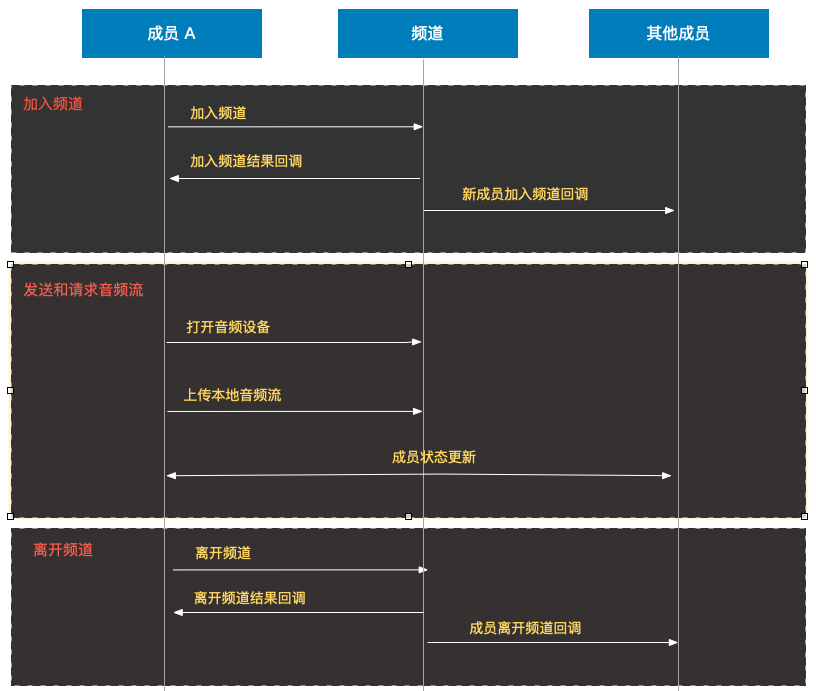

业务流程
==============================

多方通话是利用频道实现多人音视频通话的功能，频道是类似音视频房间的概念，用户通过频道号加入通话。

**相关概念**

- 频道：频道是多个用户进行实时音视频通话的场所，以频道号为唯一标识，用户通过加入同一个频道进行语音通话或者视频通话。频道允许16人同时进行发言。

- 观众：观众是指在多人通话时只可以观看但是没有发言权限的人，这些用户只可以接收发言人的音频或视频数据，但不能发送音频或视频数据。

- 互动者：互动者是指在多人通话时可以参与互动，可以发言的人，这些用户可以发送音视频数据，也可以接收其他成员的音视频数据。

**业务流程**

- ``加入频道``

 成员 A 通过频道号加入频道，并监听回调加入结果。

- ``上传音频流``

 成员 A 加入成功后，打开音频设备，并上传本地音频流，此时成员状态进行更新。

- ``离开频道``

 通话过程中可以随时离开通话，当所有成员都离开频道后，频道将被释放。

- ``新成员加入频道回调``

 通话过程中，如果有新成员加入，其他成员将收到新成员加入的回调，同时进行通话状态的更新。

- ``成员离开频道回调``

 通话过程中，如果有成员离开频道，其他成员将会收到成员离开的回调，同时进行通话状态的更新。