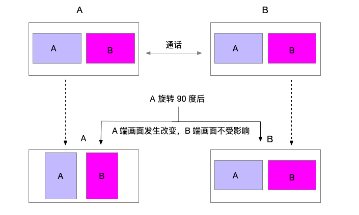

.. _视频设备管理(Android):

视频管理
=============================

.. highlight:: java

视频管理模块的内容主要包括视频采集、视频渲染、渲染控制、视频数据管理以及视频设备的控制。您可以针对具体的场景进行灵活的设置。

视频模块涉及到以下两个类：

.. _JCMediaDevice(android):

- JCMediaDevice ：主要用于媒体设备的控制和管理。详细信息请参考 `JCMediaDevice 类说明 <https://developer.juphoon.com/portal/reference/V2.0/android/>`_。

.. _JCMediaDeviceVideoCanvas(android):

- JCMediaDeviceVideoCanvas ：主要用于界面层操作视频。如渲染的控制、视频旋转、视频通话截图等。详细信息请参考 `JCMediaDeviceVideoCanvas 类说明 <https://developer.juphoon.com/portal/reference/V2.0/android/>`_。

**初始化 JCMediaDevice 模块**

::

    // 初始化各模块，因为这些模块实例将被频繁使用，建议声明在单例中
    JCMediaDevice mediaDevice = JCMediaDevice.create(client, this);

.. _视频采集和渲染(Android):

视频采集设置
------------------------

设置要开启的摄像头类型
>>>>>>>>>>>>>>>>>>>>>>>>>>>>>

视频采集设置前，可以通过 JCMediaDevice 类中的属性和方法获取摄像头列表、当前摄像头以及默认摄像头，具体如下：

::

    /**
     * 获取摄像头列表
     *
     * @return 摄像头列表
     */
    public abstract List<JCMediaDeviceCamera> getCameras();

    /**
     * 当前默认的摄像头
     *
     * @return 当前摄像头
     */
    public abstract JCMediaDeviceCamera getCamera();

    /**
     * 默认摄像头
     */
    public JCMediaDeviceCamera defaultCamera;

其中，摄像头对象（JCMediaDeviceCamera）有以下属性
::

    /*摄像头id*/
    public String cameraId;
    /*摄像头名字*/
    public String cameraName;
    /*摄像头类型*/
    public @CameraType int cameraType;

CameraType（摄像头类型）有以下几种
::

    /**
     * 未获取到摄像头
     */
    public static final int CAMERA_NONE = 0;
    /**
     * 前置摄像头
     */
    public static final int CAMERA_FRONT = 1;
    /**
     * 后置摄像头
     */
    public static final int CAMERA_BACK = 2;
    /**
     * 未知摄像头
     */
    public static final int CAMERA_UNKNOWN = 3;

获取摄像头列表后，可以调用下面的方法获得列表中的摄像头类型
::

    /**
     * 获得摄像头类型
     *
     * @param cameraIndex 摄像头队列索引
     * @return 摄像头类型
     */
    @CameraType
    public abstract int getCameraType(int cameraIndex);

如果想切换摄像头，调用下面的方法切换指定的摄像头
::

    /**
     * 切换摄像头
     * @param camera 摄像头
     * @return 成功返回 true，失败返回 false
     */
    public abstract boolean switchCamera(JCMediaDeviceCamera camera);

示例代码::

    JCMediaDeviceCamera item = new JCMediaDeviceCamera();
    item.cameraType = JCMediaDevice.CAMERA_FRONT;
    List<JCMediaDevice.JCMediaDeviceCamera> cameras = mediaDevice.getCameras();
    mediaDevice.defaultCamera = cameras.get(0);

设置摄像头采集分辨率
>>>>>>>>>>>>>>>>>>>>>>>>>>>>>

您可以通过自定义摄像头采集参数实现不同的视频分辨率，如采集的高度、宽度和帧速率。

摄像头采集属性设置接口如下：

::

    /**
     * 设置摄像头采集属性
     * @param width     采集宽度，默认640
     * @param height    采集高度，默认360
     * @param frameRate 采集帧速率，默认30
     */
    public abstract void setCameraProperty(int width, int height, int frameRate);

示例代码
::

    // 设置摄像头采集属性
    mediaDevice.setCameraProperty(640, 360, 30);

设置视频窗体角度
>>>>>>>>>>>>>>>>>>>>>>>>>>>>>

调用下面的接口设置视频窗体角度
::

    /**
     * 设置视频窗体角度
     *
     * @param angle 参看 @VideoAngle
     */
    public abstract void setlVideoAngle(@VideoAngle int angle);

其中，VideoAngle 有以下几种::

    /** 自动 */
    public static final int VIDEO_ANGLE_AUTO = -1;
    /** 0度 */
    public static final int VIDEO_ANGLE_0 = 0;
    /** 90度 */
    public static final int VIDEO_ANGLE_90 = 90;
    /** 180度 */
    public static final int VIDEO_ANGLE_180 = 180;
    /** 270度 */
    public static final int VIDEO_ANGLE_270 = 270;

示例代码
::

    // 设置摄像头采集属性
    mediaDevice.setlVideoAngle(JCMediaDevice.VIDEO_ANGLE_0);

设置 Canvas 旋转角度
>>>>>>>>>>>>>>>>>>>>>>>>>>>>>>>>>>

如果想设置Canvas中画布的角度，需要调用 JCMediaDeviceVideoCanvas 类中的 rotate 接口
::

    /**
     * 旋转角度，必须是90的倍数，该角度表示与屏幕正方向旋转后的夹角
     *
     * @param angle 角度值
     */
    public void rotate(int angle)

其中，角度需为 90 的倍数。调用该接口后，本端显示的本地视频画面和远端视频画面会同时旋转相同的角度，而对端显示的画面不受影响。

例如 A 设置旋转 90 度，则 A 端显示的 A 和 B 视频画面会同时旋转 90 度。而 B 端的视频画面则不会发生任何改变。如下图所示：

**示例代码**

::

    // 设置 Canvas 旋转角度
    JCMediaDeviceVideoCanvas canvas = mediaDevice.startCameraVideo(JCMediaDevice.RENDER_FULL_CONTENT));
    canvas.rotate(90);

^^^^^^^^^^^^^^^^^^^^^^^^^^^^

.. _创建本地和远端视频画面(android):

视频渲染
------------------------

创建本地和远端视频画面
>>>>>>>>>>>>>>>>>>>>>>>>>>>>>

.. _创建本地视频画面(android):

- 本地视频渲染

本地视频渲染通过调用 startCameraVideo 接口获得本地视频对象用于 UI 界面显示，**该接口会打开摄像头**
::

    /**
     * 获得视频预览对象，通过此对象能获得视频用于UI显示
     *
     * @param renderType    渲染模式
     * @return              JCMediaDeviceVideoCanvas 对象
     * @see RenderType
     */
    public abstract JCMediaDeviceVideoCanvas startCameraVideo(@RenderType int renderType);

.. _渲染模式(android):

其中，渲染模式（JCMediaDeviceRender)有以下三种

.. list-table::
   :header-rows: 1

   * - 名称
     - 描述
   * - public static final int RENDER_FULL_SCREEN = 0
     - 铺满窗口
   * - public static final int RENDER_FULL_CONTENT = 1
     - 全图像显示，会有黑边，但在窗口跟图像比例相同的情况下不会有黑边
   * - public static final int RENDER_FULL_AUTO = 2
     - 自适应

.. _创建远端视频画面(android):

- 远端视频渲染

您可以调用 startVideo 方法获取对端视频对象并进行渲染
::

    /**
     * 获得视频对象，通过此对象能获得视频用于UI显示
     *
     * @param videoSource   渲染标识串，比如 JCMediaChannelParticipant JCCallItem 中的 renderId
     * @param renderType    渲染模式
     * @return              JCMediaDeviceVideoCanvas 对象
     * @see RenderType
     */
    public abstract JCMediaDeviceVideoCanvas startVideo(String videoSource, @RenderType int renderType);

^^^^^^^^^^^^^^^^^^^^^^^^^^^^^^

**示例代码**

::

    // 打开本地视频预览
    JCMediaDeviceVideoCanvas localCanvas = mediaDevice.startCameraVideo(JCMediaDevice.RENDER_FULL_CONTENT);
    viewGroup.addView(localCanvas.getVideoView(), 0);
    // 远端视频渲染，renderId来源于通话对象，一对一为JCCallItem对象，多方为JCMediaChannelParticipant对象
    JCMediaDeviceVideoCanvas remoteCanvas = mediaDevice.startVideo(renderId, JCMediaDevice.RENDER_FULL_CONTENT);
    viewGroup.addView(remoteCanvas.getVideoView(), 0);

^^^^^^^^^^^^^^^^^^^^^^^^^^^^^^^^^^

.. _销毁本地和远端视频画面(android):

销毁本地和远端视频画面
>>>>>>>>>>>>>>>>>>>>>>>>>>>>>

在视频通话结束或者视频通话中，如果想销毁视频画面，可以调用下面的接口
::

    /**
     * 停止视频
     *
     * @param canvas JCMediaDeviceVideoCanvas 对象，由 startVideo 获得
     */
    public abstract void stopVideo(JCMediaDeviceVideoCanvas canvas);

示例代码::

    JCMediaDeviceVideoCanvas localCanvas = mediaDevice.startCameraVideo(JCMediaDevice.RENDER_FULL_CONTENT);
    JCMediaDeviceVideoCanvas remoteCanvas = mediaDevice.startVideo(renderId, JCMediaDevice.RENDER_FULL_CONTENT);
    if (localCanvas != null) {
        mContentView.removeView(localCanvas.getVideoView());
        mediaDevice.stopVideo(localCanvas);
        localCanvas = null;
    
    if (remoteCanvas != null) {
        mContentView.removeView(remoteCanvas.getVideoView());
        mediaDevice.stopVideo(remoteCanvas);
        remoteCanvas = null;
    }

^^^^^^^^^^^^^^^^^^^^^^^^^^^^^^

渲染控制
---------------------------

暂停渲染
>>>>>>>>>>>>>>>>>>>>>>>>>>>>>

如果暂停画面的渲染，可以调用下面的接口：

::

    /**
     * 暂停视频渲染
     */
    public void pause();

恢复渲染
>>>>>>>>>>>>>>>>>>>>>>>>>>>>>

如果想对已暂停的画面继续进行渲染，可以调用下面的接口：
::

    /**
     * 继续视频渲染
     */
    public void resume();

^^^^^^^^^^^^^^^^^^^^^^^^^^^^^^^^^^^^^

视频数据管理
---------------------------

原始视频数据
>>>>>>>>>>>>>>>>>>>>>>>>>>>>>>>>>

在视频传输过程中，可以对每帧视频数据进行图像处理，以实现美颜等需求。有以下两种处理时机：

1、在视频采集后编码前处理；会影响本地预览和对端接收视频。

2、在解码后渲染前处理；影响本地接收视频。

具体如下：

**视频采集后，编码前处理**

参考如下步骤，在你的项目中实现原始视频数据功能：

1.发起业务前通过 ZmfVideo.captureAddCallback 注册视频采集回调，并在该函数中实现一个 CaptureCallback 类型的回调函数

2.成功注册后，JC SDK 会在捕捉到每个视频帧时通过回调函数回调采集到的原始视频数据相对应参数

3.用户拿到视频数据后，根据场景需要自行在回调函数中进行参数处理，处理后数据通过该回调函数返回给 JC SDK。

首先注册视频采集回调
::

    /**
     * add capture data callback
     *
     * @param[in] callback      the callback user data
     *
     * @return                  >= 0 on succeed is handle, otherwise failed.
     */
    ZmfVideo.captureAddCallback(CaptureCallback callback);

回调类型说明
::

    /**
     * The callback to handle video capture data 
     *
     * @param[in] captureId        video capture unique name
     * @param[in] iFace            the capture Face @see ZmfVideoFaceType
     * @param[in] iImgAngle        the image rotated angle   
     * @param[in] iCaptureOrient   the capturer fixed orient
     * @param[in,out] iWidthHeight the width and height of image,2 length first width second height
     * @param[in,out] data         the image data I420 buffer
     *
     * @return                     if process capturer data should return true, other false
     */
    public interface CaptureCallback
    {
         boolean onFrame(String captureId, int iFace, int iImgAngle, int iCaptureOrient, int[] iWidthHeight, ByteBuffer data);
    }

注册后，每帧采集的视频数据通过 onFrame 回调，可以处理对应的视频数据。

示例代码
::

    public boolean onFrame(String captureId, int iFace, int iImgAngle, int iCaptureOrient, int[] iWidthHeight, ByteBuffer data) {
        System.out.println("视频采集数据处理");
        return true;
    }
    public void joinChannel() {
        //注册回调
        ZmfVideo.captureAddCallback(onFrame);
        // 加入直播
        mediaChannel.join("频道id", null);
    }

如果想移除回调，调用下面的接口
::

    /**
     * remove capture data callback
     *
     * @param[in]  handle       the handle
     *
     * @return                  0 on succeed, otherwise failed.
     */
    ZmfVideo.captureRemoveCallback(int handle)

示例代码
::

    public void leaveChannel() {
        int handle = ZmfVideo.captureAddCallback(onFrame);
        //移除回调
        ZmfVideo.captureRemoveCallback(handle);
        // 离开直播
        mediaChannel.leave();
    }

**解码后，渲染前处理**

参考如下步骤，在你的项目中实现原始视频数据功能：

1.发起业务前通过 ZmfVideo.renderAddCallback 注册视频输出回调，并在该函数中实现一个 RenderCallback 类型的回调函数

2.成功注册后，JC SDK 会在捕捉到每个视频帧时通过回调函数回调输出的原始视频数据相对应参数

3.用户拿到视频数据后，根据场景需要自行在回调函数中进行参数处理，处理后数据通过该回调函数返回给JC SDK。

首先注册视频输出回调
::

    /**
     * add render data callback
     *
     * @param[in] callback      the callback user data
     *
     * @return                  >= 0 on succeed is handle, otherwise failed.
     */
    ZmfVideo.renderAddCallback(RenderCallback callback);

回调类型说明
::

    /**
     * The callback to receive video render data 
     *
     * @param[in] renderId      video render unique name
     * @param[in] sourceType    video render source type @see ZmfVideoSourceType
     * @param[in] iAngle        
     * @param[in] iMirror 
     * @param[in] iWidth
     * @param[in] iHeight
     * @param[in] data          I420 render data
     *
     * @return                  if process render data should return true, other false
     *
     * @remarks
     *  if data == null or iWidth <=0 or iHeight <= 0, means the render will close,
     *  so should call onRenderRequestRemove.
     */
    public interface RenderCallback
    {
         boolean onFrame(String renderId, int sourceType, int iAngle, int iMirror, int iWidth, int iHeight, ByteBuffer data, int timeStampMs);
    }

注册后，每帧解码后的视频数据通过onFrame回调，可以处理对应的视频数据。

示例代码
::

    public boolean onFrame(String renderId, int sourceType, int iAngle, int iMirror, int iWidth, int iHeight, ByteBuffer data, int timeStampMs) {
        System.out.println("解码后的视频数据处理");
        return true;
    }
    public void joinChannel() {
        //注册回调
        ZmfVideo.renderAddCallback(onFrame);
        // 加入直播
        mediaChannel.join("频道id", null);
    }

如果想移除回调，调用下面的接口
::

    /**
     * remove render data callback
     *
     * @param[in]  handle       the handle
     *
     * @return                  0 on succeed, otherwise failed.
     */
    ZmfVideo.renderRemoveCallback(int handle)

示例代码
::

    public void leaveChannel() {
        int handle = ZmfVideo.renderAddCallback(onFrame);
        //移除回调
        ZmfVideo.renderRemoveCallback(handle)
        // 离开直播
        mediaChannel.leave();
    }

自定义视频采集和渲染
>>>>>>>>>>>>>>>>>>>>>>>>>>>>>>>>>>

自定义视频采集和渲染

对于不支持系统标准 API 的视频采集/渲染设备，或者想利用已经采集好的 I420 或 h264 数据，可另起采集/渲染线程，把采集/渲染数据放入 Juphoon 对应的接口中进行后续操作。

参考如下步骤，在你的项目中实现自定义视频源功能：

1.通过JC SDK 提供的接口将外部设备采集/准备渲染的数据输入到 JC SDK 进行后续操作。

2. 如果想停止外部设备采集/准备渲染的数据输入，则调用JC SDK 提供的接口停止数据输入即可。

在登录成功后，Zmf_VideoInitialize 初始化成功后，把采集/准备渲染的数据通过下面的接口输入；
::

    /**
     * The video capture data entry to ZMF
     *
     * @param[in] captureId     unique name of the video capture               //标识外部采集的ID
     * @param[in] iCaptureFace the capture face, @see ZmfVideoFaceType         //外部视频的朝向，一般取0                               
     * @param[in] iImgAngle     the image rotated angle (CW)                   //输入的外部视频正立所需旋转角度，顺时针为正， 取值范围0，90，180，270
     * @param[in] iCamAngle     the camera fixed orient                        //外部镜头固定角度，同iImgAngle，取值范围0，90，180，270
     * @param[in,out] iWidthHeight the image input size, at least align 4.
     *                             return the cropped height of data           //图像宽高，0为宽，1为高
     * @param[in] data          the image data buffer                          //图像buffer
     * @param[in] encoderName  the image ecoder type buffer                    //图像编码类型，H264为h264,其他为I420
     */
    static public void onVideoCapture (String captureId, int iCaptureFace,
            int iImgAngle, int iCamAngle, int[] iWidthHeight, ByteBuffer data, String encoderName, int[] encoderCfg)

示例代码
::

    // 初始化视频设备
    android.content.Context activity;
    ZmfVideo.initialize(activity);
    public void joinChannel() {
        //输入分辨率为640*360，编码为I420无需额外旋转的图像
        onVideoCapture("Test",0,0,0,640,360,buf,0);
        // 加入直播
        mediaChannel.join("频道id", null);
    }

采集停止接口
::

    /**
     * tell ZMF the video capture has stopped
     * 
     * @param[in] captureId     unique name of the device
     */
    void Zmf_OnVideoCaptureDidStop(const char *captureId);

示例代码
::

    public void leaveChannel() {
        //停止视频采集
        Zmf_OnVideoCaptureDidStop("Test");
        // 离开直播
        mediaChannel.leave();
    }

如果想在视频渲染端使用自己的渲染方式，则调用下面的接口：

视频数据渲染接口
::

    /**
     * The video render data entry to ZMF
     *
     * @param[in] renderId      unique name of the render source            //标识渲染的ID
     * @param[in] sourceType    the source type, @see ZmfRenderSource       //渲染源类型，一般为0
     * @param[in] iAngle        the image rotated angle (CW)                //渲染正立所需角度，一般为0 取值范围0，90，180，270
     * @param[in] iMirror       the camera fixed orient                     //渲染镜像类型，一般为0       
     * @param[in] iWidth        the image width                             //渲染图像宽
     * @param[in] iHeight       the image height                            //渲染图像高
     * @param[in] data          the image data buffer                       //渲染数据buffer
     */
    static public void onRender(String renderId, int sourceType, int iAngle, int iMirror,
            					int iWidth, int iHeight, ByteBuffer data)

示例代码
::

    // 初始化视频设备
    android.content.Context activity;
    ZmfVideo.initialize(activity);
    public void joinChannel() {
        //输入分辨率为640*360，编码为I420无需额外旋转的图像
        onRender("Test",0,0,0,640,360,buf,0);
        // 加入直播
        mediaChannel.join("频道id", null);
    }

渲染数据停止接口
::

    //Zmf_OnVideoRender，renderId/sourceType同上，后面传0。
    ZmfVideo.onRender(String renderId, 0, 0, 0, 0, 0, 0, 0); 

示例代码
::

    public void leaveChannel() {
        //停止渲染
        ZmfVideo.onRender("Test", 0, 0, 0, 0, 0, 0, 0); 
        // 离开直播
        mediaChannel.leave();
    }

^^^^^^^^^^^^^^^^^^^^^^^^^^^^^^^^^

视频设备管理
---------------------------

视频设备管理主要用到 JCMediaDevice 类中的方法，具体如下：

获取摄像头列表
>>>>>>>>>>>>>>>>>>>>>>>>>>>>>

::

    /**
     * 获取摄像头列表
     *
     * @return 摄像头列表
     */
    public abstract List<JCMediaDeviceCamera> getCameras();

示例代码
::

    获取摄像头列表
    List<JCMediaDeviceCamera> cameras = mediaDevice.getCameras();

获取当前默认的摄像头
>>>>>>>>>>>>>>>>>>>>>>>>>>>>>
::

    /**
     * 当前默认的摄像头
     *
     * @return 当前摄像头
     */
    public abstract JCMediaDeviceCamera getCamera();

示例代码
::

    获取摄像头列表
    JCMediaDeviceCamera camera = mediaDevice.getCamera();

开启关闭摄像头
>>>>>>>>>>>>>>>>>>>>>>>>>>>>>

::

    /**
     * 开启摄像头
     *
     * @return 成功返回 true，失败返回 false
     */
    public abstract boolean startCamera();

    /**
     * 关闭摄像头
     *
     * @return 成功返回 true，失败返回 false
     */
    public abstract boolean stopCamera();

切换摄像头
>>>>>>>>>>>>>>>>>>>>>>>>>>>>>

::

    /**
     * 切换摄像头，内部会根据当前摄像头类型来进行切换
     *
     * @return 成功返回 true，失败返回 false
     */
    public abstract boolean switchCamera();

**示例代码**

::

    // 打开摄像头
    mediaDevice.startCamera();
    // 关闭摄像头
    mediaDevice.stopCamera();
    // 切换摄像头
    mediaDevice.switchCamera();