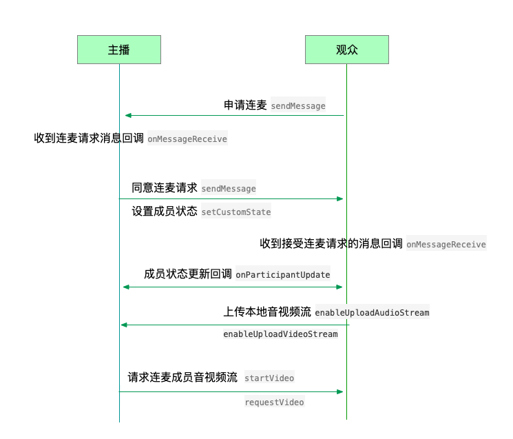

Android 进阶
=========================

.. highlight:: java

.. _互动连麦(android):

互动连麦
------------------------

观众可以在直播中向主播发送连麦互动请求，主播也可以对加入直播的观众发送连麦请求。连麦请求包括语音连麦和视频连麦。

连麦的流程如下：

发送连麦请求
>>>>>>>>>>>>>>>>>>>>>>>>>>

通过发送消息功能实现连麦请求的发送，接口如下：

::

    /**
     * 发送消息
     *
     * @param type     消息类型
     * @param content  消息内容，当 toUserId 不为 null 时，content 不能大于 4k
     * @param toUserId 接收者id，null则发给频道所有人员
     * @return true表示成功，false表示失败
     */
    public abstract boolean sendMessage(String type, String content, String toUserId);

示例代码
::

    mediaChannel.sendMessage(JCLiveConstants.MESSAGE_TYPE_MESSAGE, message, null)

接受连麦
>>>>>>>>>>>>>>>>>>>>>>>>>>

连麦消息发送后，主播会收到 onMessageReceive 回调

::

    /**
     * 接收频道消息的回调
     *
     * @param type          消息类型
     * @param content       消息内容
     * @param fromUserId    消息发送成员的userId
     */
    public void onMessageReceive(String type, String content, String fromUserId);

此时，主播可以根据消息类型（语音连麦或者视频连麦请求）以及消息发送的对象进行对应的处理。

如果是语音连麦，则主播同意后，连麦成员状态变为音频连麦状态，连麦成员会收到成员状态更新的回调，此时请求连麦的成员需要调用 enableUploadAudioStream 接口上传本地音频流。

如果是视频连麦，则主播同意后，连麦成员状态变为视频连麦状态，连麦成员会收到成员状态更新的回调，此时请求连麦的成员需要调用 enableUploadAudioStream 接口和 enableUploadVideoStream 接口上传本地音频流和视频流，同时主播需要调用 startVideo 接口和 requestVideo 接口创建连麦成员的视频画面。

主播同意连麦后，成员状态变为连麦互动状态。此时需要调用“设置状态”接口改变成员的状态。

设置状态
>>>>>>>>>>>>>>>>>>>>>>>>>>

当成员与主播进行音视频连麦、停止连麦以及连麦成员离开时，均需要调用下面的接口设置成员状态

::

    /**
     * 设置自定义状态
     *
     * @param customState 自定义状态, 参看 CustomState
     * @param participant 成员，null 则默认设置自己
     */
    public abstract void setCustomState(@CustomState int customState, JCMediaChannelParticipant participant);

状态值可以根据 CustomState 枚举值自定义， CustomState 有以下几种
::

    /**
     * 无自定义状态
     */
    public static final int CUSTOM_STATE_NONE = 0;
    /**
     * 自定义状态0
     */
    public static final int CUSTOM_STATE_0 = 1<<12;
    /**
     * 自定义状态1
     */
    public static final int CUSTOM_STATE_1 = 1<<13;
    /**
     * 自定义状态2
     */
    public static final int CUSTOM_STATE_2 = 1<<14;
    /**
     * 自定义状态3
     */
    public static final int CUSTOM_STATE_3 = 1<<15;

例如
::

    //自定义音频连麦状态
    int STATE_AUDIO_JOIN = JCMediaChannel.CUSTOM_STATE_0;
    //自定义视频连麦状态
    int STATE_VIDEO_JOIN = JCMediaChannel.CUSTOM_STATE_1;

状态设置后，可以通过下面的方法获取自定义状态值
::

    /**
     * 获得自定义状态
     *
     * @return
     */
    public abstract @CustomState int getCustomState();

示例代码

::

        public void dealMessage(message) {  
            //主播接受音频连麦请求，取出消息类型和消息对象
            JCMediaChannelParticipant p = mediaChannel.getParticipant(message.fromUserId)
            if (p != null) {
                // 设置成员状态
                mediaChannel.setCustomState(STATE_AUDIO_JOIN, p)
            }
        }

成员状态设置后会收到 onParticipantUpdate 回调，该回调会上报变化的成员以及变化的属性
::

    /**
     * 成员更新回调
     *
     * @param participant 成员对象
     * @param changeParam 更新标识类
     */
    void onParticipantUpdate(JCMediaChannelParticipant participant, JCMediaChannelParticipant.ChangeParam changeParam);

示例代码
::

    public void onParticipantUpdate(JCMediaChannelParticipant participant, JCMediaChannelParticipant.ChangeParam changeParam) {
        /** custom state 变化处理自身的音视频上传状态 */
        if (participant.isSelf && participant.isAudience && changeParam.customState) {
            if (participant.isAudioJoiner) { // 音频加入
                mediaChannel.enableUploadVideoStream(false)
                mediaChannel.enableUploadAudioStream(true)
            } else { // 普通观众加入
                mediaChannel.enableUploadVideoStream(false)
                mediaChannel.enableUploadAudioStream(false)
            }
        }
    }

踢出成员
--------------------

直播中，主播可以调用下面的接口踢出成员
::

    /**
     * 将成员踢出会议
     *
     * @param participant 成员
     * @return true表示成功，false表示失败
     */
    public abstract boolean kick(JCMediaChannelParticipant participant);

示例代码
::

    mediaChannel.kick(partp)

.. _发送消息(android):

发送消息
----------------------

如果想在频道中给其他成员发送消息，可以调用下面的接口
::

    /**
     * 发送消息
     *
     * @param type     消息类型
     * @param content  消息内容，当 toUserId 不为 null 时，content 不能大于 4k
     * @param toUserId 接收者id，null则发给频道所有人员
     * @return true表示成功，false表示失败
     */
    public abstract boolean sendMessage(String type, String content, String toUserId);

其中，消息类型（type）为自定义类型。

示例代码::

    public void onJoin(boolean result, @JCMediaChannel.MediaChannelReason int reason, String channelId) {
        // 发送给所有成员
        mediaChannel.sendMessage("text", "content", null);
        // 发送给某个成员
        mediaChannel.sendMessage("text", "content", "userId");
    }

当频道中的其他成员收到消息时会收到 onMessageReceive 回调
::

    /**
     * 接收频道消息的回调
     *
     * @param type          消息类型
     * @param content       消息内容
     * @param fromUserId    消息发送成员的userId
     */
    public void onMessageReceive(String type, String content, String fromUserId);

^^^^^^^^^^^^^^^^^^^^^^^^^^^

.. _文件视频源(android):

使用文件作为视频输入源
------------------------------

在视频通话中，可以将文件作为视频输入源，典型的场景如在线课堂的文稿显示，文件和摄像头作为视频输入源 **只能存在一种**，如果将文件作为视频输入源，而当前摄像头已开启的话，则会关闭摄像头。

开启视频文件作为视频输入源之前调用下面的方法获取文件视频源是否开启
::

    /**
     * 文件视频源是否开启
     *
     * @return 是否开启文件视频源
     */
    public abstract boolean isVideoFileOpen();

如果未开启，调用下面的接口开启视频文件作为视频输入源
::

    /**
     * 开启视频文件作为视频输入源，文件和摄像头作为视频输入源只能存在一种，当前摄像头开启的话会关闭摄像头
     *
     * @return 是否成功
     */
    public abstract boolean startVideoFile();

向文件视频源逐帧添加视频数据
::

    /**
     * 逐帧采集视频画面
     *
     * 当为 H264 格式时
     * 1. 如果是关键帧需要将 0x67 0x68 0x41 的数据作为一帧传入
     * 2. 关键帧要以固定间隔传入，例如5秒，否则一开始可能有几秒对端无法显示视频
     *
     * @param data 画面二进制数据
     * @param format   视频像素格式
     * @param width    宽
     * @param height   高
     * @param angle    90 的倍数
     * @param mirror   0 不镜像，1进行左右镜像
     * @param keyFrame 是否为关键帧，针对 format 为 H264
     */
    public abstract void setVideoFileFrame(byte[] data, @VideoPixelFormat int format, int width, int height, int angle, int mirror, boolean keyFrame);

开启文件作为视频输入源之后，对端通过调用下面的接口获得文件视频源渲染id
::

    /**
     * 获得文件视频源渲染id
     *
     * @return 视频源渲染id
     */
    public abstract String getVideoFileId();

之后通过 startVideo 方法渲染远端视频画面
::

    /**
     * 获得视频对象，通过此对象能获得视图用于UI显示
     *
     * @param videoSource   渲染标识串，比如 JCMediaChannelParticipant JCCallItem 中的 renderId，当videoSource 为 videoFileId 时，内部会调用 startVideoFile
     * @param renderType    渲染模式
     * @return              JCMediaDeviceVideoCanvas 对象
     * @see RenderType
     */
    public abstract JCMediaDeviceVideoCanvas startVideo(String videoSource, @RenderType int renderType);

如果想关闭文件视频源，调用下面的接口
::

    /**
     * 关闭逐帧采集画面
     *
     * @return ture表示关闭成功，false表示关闭失败
     */
    public abstract boolean stopVideoFile();
