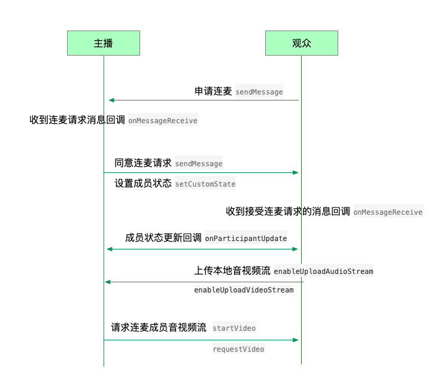

macOS
======================

.. highlight:: objective-c

互动连麦
------------------------------

在直播中，观众可以向主播发送连麦互动请求，主播也可以对加入直播的观众发送连麦请求。连麦请求包括语音连麦和视频连麦。

连麦的流程如下：

发送连麦请求
>>>>>>>>>>>>>>>>>>>>>>>>>>>>

通过发送消息功能实现连麦请求的发送，接口如下：
::

    /**
     * @brief 发送消息
     *
     * @param type 消息类型
     * @param content 消息内容，当 toUserId 不为 nil 时，content 不能大于 4k
     * @param toUserId 接收者id，null则发给频道所有人员
     * @return 返回 true 表示成功，false表示失败
     */
    -(bool)sendMessage:(NSString * __nonnull)type content:(NSString * __nonnull)content toUserId:(NSString * __nullable)toUserId;

示例代码
::

    [mediaChannel sendMessage:MESSAGE_TYPE_REQUEST_VIDEO content: @"请求连麦" toUserId:@"主播id"];

接受连麦
>>>>>>>>>>>>>>>>>>>>>>>>>>>>

连麦消息发送后，主播会收到 onMessageReceive 回调

::

    /**
     * @brief 接收频道消息的回调
     *
     * @param type 消息类型
     * @param content 消息内容
     * @param fromUserId    消息发送成员的userId
     */
    -(void)onMessageReceive:(NSString *)type content:(NSString *)content fromUserId:(NSString *)fromUserId;

此时，主播可以根据消息类型（语音连麦或者视频连麦请求）以及消息发送的对象进行对应的处理。

如果是语音连麦，则主播同意后，连麦成员会收到成员状态更新的回调，此时请求连麦的成员需要调用 enableUploadAudioStream 接口上传本地音频流。

如果是视频连麦，则主播同意后，连麦成员会收到成员状态更新的回调，此时请求连麦的成员需要调用 enableUploadAudioStream 接口和 enableUploadVideoStream 接口上传本地音频流和视频流，同时主播需要调用 startVideo 接口和 requestVideo 接口创建连麦成员的视频画面。

主播同意连麦后，成员状态变为连麦互动状态。此时需要调用“设置状态”接口改变成员的状态。

设置状态
>>>>>>>>>>>>>>>>>>>>>>>>>>>>

当成员与主播进行音视频连麦、停止连麦以及连麦成员离开时，均需要调用下面的接口设置成员状态

::

    /**
     * @brief 设置自定义状态
     *
     * @param customState 自定义状态, 参看 JCMediaChannelCustomState
     * @param participant 成员，nil 则默认设置自己
     */
    -(void)setCustomState:(JCMediaChannelCustomState)customState participant:(JCMediaChannelParticipant * __nullable)participant;

状态值可以根据 JCMediaChannelCustomState 枚举值自定义，JCMediaChannelCustomState 有以下几种
::

    /// 无自定义状态
    JCMediaChannelCustomStateNone = 0,
    /// 自定义状态0
    JCMediaChannelCustomState0 = 1<<12,
    /// 自定义状态1
    JCMediaChannelCustomState1 = 1<<13,
    /// 自定义状态2
    JCMediaChannelCustomState2 = 1<<14,
    /// 自定义状态3
    JCMediaChannelCustomState3 = 1<<15,

例如
::

    //自定义音频连麦状态
    JCMediaChannelCustomState STATE_AUDIO_JOIN = JCMediaChannelCustomState0;
    //自定义视频连麦状态
    JCMediaChannelCustomState STATE_VIDEO_JOIN = JCMediaChannelCustomState1;

状态设置后，可以通过下面的方法获取自定义状态值
::

    /**
     * @brief 获得自定义状态
     *
     * @return
     */
    -(JCMediaChannelCustomState)getCustomState;

示例代码
::

    //自定义音频连麦状态
    JCMediaChannelCustomState STATE_AUDIO_JOIN = JCMediaChannelCustomState0;
    //自定义视频连麦状态
    JCMediaChannelCustomState STATE_VIDEO_JOIN = JCMediaChannelCustomState1;
    -(void)mediaChannelMessage:(NSNotification*)note {
      NSDictionary *dic = note.object;
      //取出消息类型
      NSString *type = [dic objectForKey:KtypeKey];
      //取出消息发送者id
      NSString *userId = [dic objectForKey:kFromUserIdKey];
      //获取发送者对象
      JCMediaChannelParticipant *partp = [mediaChannel getParticipant:userId];
      if (// 主播同意音频连麦) { 
          if partp != nil {
              //设置成员状态为音频加入者
              [mediaChannel setCustomState:STATE_AUDIO_JOIN participant: partp];
          }
      }
    }

成员状态设置后会收到 onParticipantUpdate 回调，该回调会上报变化的成员以及变化的属性
::

    /**
     *  @brief 成员更新回调
     *  @param participant 成员对象
     *  @param participantChangeParam 变化标识集合
     */
    -(void)onParticipantUpdate:(JCMediaChannelParticipant*)participant participantChangeParam:(JCMediaChannelParticipantChangeParam *)participantChangeParam;

示例代码
::

    -(void)onParticipantUpdate:(JCMediaChannelParticipant*)participant participantChangeParam:(JCMediaChannelParticipantChangeParam*)participantChangeParam {
        if (participant.isSelf && participant.isAudience && participantChangeParam.customState) {
            if (participant.isAudioJoiner) { //音频连麦成员
                [mediaChannel enableUploadVideoStream:false];
                [mediaChannel enableUploadAudioStream:true];
            } else if (participant.isVideoJoiner) { //视频连麦成员
                [mediaChannel enableUploadVideoStream:true];
                [mediaChannel enableUploadAudioStream:true];
            } else { //普通成员
                [mediaChannel enableUploadVideoStream:false];
                [mediaChannel enableUploadAudioStream:false];
            }
        }

踢出成员
------------------------

直播中，主播可以调用下面的接口踢出成员
::

    /**
     * @brief 将成员踢出会议
     *
     * @param participant 成员
     * @return true表示成功，false表示失败
     */
    -(BOOL)kick:(JCMediaChannelParticipant * __nonnull)participant;

示例代码
::

    [mediaChannel kick:partp];

发送消息
----------------------

如果想在直播中发送消息，可以调用下面的接口
::

    /**
     * @brief 发送消息
     *
     * @param type 消息类型
     * @param content 消息内容，当 toUserId 不为 nil 时，content 不能大于 4k
     * @param toUserId 接收者id，null则发给频道所有人员
     * @return 返回 true 表示成功，false表示失败
     */
    -(bool)sendMessage:(NSString * __nonnull)type content:(NSString * __nonnull)content toUserId:(NSString * __nullable)toUserId;

其中，消息类型（type）为自定义类型。

示例代码
::
    
    -(void)onJoin:(bool)result reason:(JCMediaChannelReason)reason channelId:(NSString*)channelId {
        // 发送给所有成员
        [mediaChannel sendMessage:@"text" content:@"content" toUserId:nil];
        // 发送给某个成员
        [mediaChannel sendMessage:@"text" content:@"content" toUserId:@"接收者id"];
    }

当频道中的其他成员收到消息时，会收到 onMessageReceive 回调
::

    /**
     * @brief 接收频道消息的回调
     *
     * @param type 消息类型
     * @param content 消息内容
     * @param fromUserId    消息发送成员的userId
     */
    -(void)onMessageReceive:(NSString *)type content:(NSString *)content fromUserId:(NSString *)fromUserId;

使用文件作为视频输入源
------------------------------

在视频通话中，可以将文件作为视频输入源，典型的场景如在线课堂的文稿显示，文件和摄像头作为视频输入源 **只能存在一种**，如果将文件作为视频输入源，而当前摄像头已开启的话，则会关闭摄像头。

开启视频文件作为视频输入源接口如下
::

    /**
     *  @brief 开启视频文件作为视频输入源，文件和摄像头作为视频输入源只能存在一种，当前摄像头开启的话会关闭摄像头
     *  @return 是否成功
     */
    -(bool)startVideoFile;

向文件视频源逐帧添加视频数据有如下两种接口可供选择，开发者可根据具体的需求选择调用
::

    /**
     *  @brief 向文件视频源逐帧添加视频数据
     *  @param srcFrame 画面二进制数据
     *  @param format 视频像素格式
     *  @param width 宽
     *  @param height 高
     */
    -(void)setVideoFileFrame:(NSData* __nonnull)srcFrame format:(JCMediaDeviceVideoPixelFormat)format width:(int)width height:(int)height;

    /**
     *  @brief 向文件视频源逐帧添加视频数据
     *  @param CVPixelBufferRef 视频数据
     *  @param angle 角度, 为 90 的倍数
     *  @param mirror 是否镜像，0 不镜像，1 镜像
     */
    -(void)setVideoFileFrame:(CVPixelBufferRef __nonnull)srcFrame angle:(int)angle mirror:(int)mirror;

如果想关闭文件视频源，则调用下面的接口
::

    /**
     *  @brief 关闭文件视频源
     *  @return ture表示关闭成功，false表示关闭失败
     */
    -(bool)stopVideoFile;
