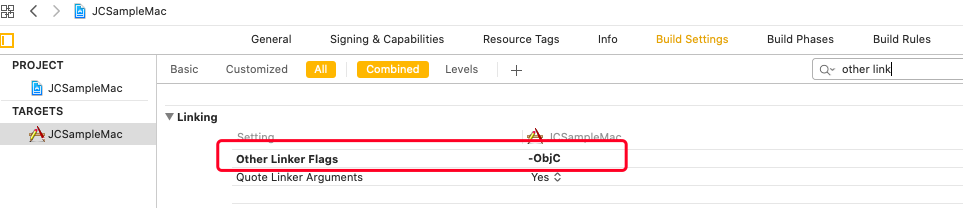
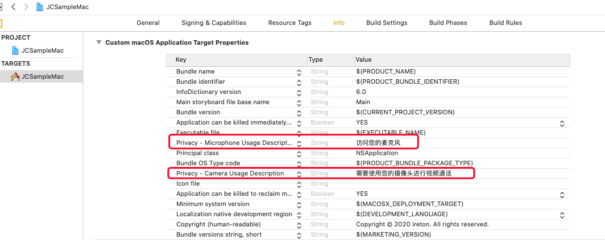

macOS
======================

.. highlight:: objective-c

前提条件
----------------------------------

- 支持 macOS 10.10 或以上版本的 macOS 设备

- 有效的菊风开发者账号（`免费注册 <http://developer.juphoon.com/signup>`_ ）

准备工作
----------------------------------

开始之前，请先做好如下准备工作：

SDK 下载
>>>>>>>>>>>>>>>>>>>>>>>>>>>>>>>>>>

点击 macOS SDK (此处加SDK下载链接）进行下载。如果已经下载了 SDK，请直接进行 SDK 配置。

AppKey 获取
>>>>>>>>>>>>>>>>>>>>>>>>>>>>>>>>>>

AppKey 是应用在菊风云平台中的唯一标识。需要在 SDK 初始化的时候使用，AppKey 获取请参考 :ref:`创建应用 <创建应用>` 。

SDK 配置
>>>>>>>>>>>>>>>>>>>>>>>>>>>>>>>>>>

只有完成 SDK 的配置，才可以集成 JC SDK 提供的功能，mac 端使用的是动态库，因此下面介绍动态库的配置方法。

在 Mac 环境下解压下载的压缩包，解压后的文件夹包含了 JCSDKOC.framework、lib 和 include 三个文件夹。如下图

.. image:: macimages/macsdklist.png

**拷贝文件**

将 JC SDK 文件夹拷贝到您工程所在的目录下，如下图（仅供参考）：

.. image:: macimages/macsdkcopy.png

**工程设置**

1. 导入文件和库

打开 Xcode（以 Xcode 11.0 为例），进入 TARGETS > Project Name > Build Phases > Link Binary with Libraries 菜单，点击 + 添加如下依赖的库。

.. image:: macimages/macsdk0.png

进入 TARGETS > Project Name > General > Frameworks, Libraries, and Embedded Content 菜单，点击 + ，再点击 Add Other…，找到 JCSDKOC.framework、libmtc.dylib 和 libzmf.dylib 文件并添加，并将这些文件的状态改为 Embed & Sign。

2. 设置 Framework Search Paths 路径

点击 ‘Build Settings’，找到 Framework Search Paths、Header Search Paths 和 Library Search Paths，在右侧输入路径。如下图：

.. note:: 在设置 Framework Search Paths 时，一般在完成第1步导入 JCSDKOC.framework 后，Xcode 会自动生成该路径
       如果 Xcode 没有自动生成路径，用户要根据 JCSDKOC.framework、lib 和 include 文件所在目录，手动设置路径。

3. 设置预处理宏定义

点击 ‘Build Settings’，找到 Preprocessor Macros，在右侧输入 ZPLATFORM=ZPLATFORM_OSX，如下图：

4. 设置 Other Linker Flags 的参数为 -ObjC

点击 ‘Build Settings’，找到 Other Linker Flags 并添加参数 -ObjC，如下图：

5. 若你的项目已启用 App Sandbox 或 Hardened Runtime 设置，则需勾选如下内容，获取相应的设备权限：

**权限设置**

6. 设置麦克风和摄像头的权限

点击 ‘Info’，然后添加麦克风和摄像头权限，如下图：

.. list-table::
   :header-rows: 1

   * - Key
     - Type
     - Value
   * - Privacy - Microphone Usage Description
     - String
     - 使用麦克风的目的，如语音通话。
   * - Privacy - Camera Usage Description
     - String
     - 使用摄像头的目的，如视频通话。

7. 编译运行

以上步骤进行完后，编译工程，如果没有报错，恭喜您，您已经成功配置 SDK，可以进行下一步了。

^^^^^^^^^^^^^^^^^^^^^^^^^^^^^^^^^^^^^^^

SDK 初始化
>>>>>>>>>>>>>>>>>>>>>>>>>>>>>>>>>>

在使用 SDK 之前，需要进行 SDK 的初始化。

在需要使用 JC SDK 的地方 #import <JCSDKOC/JCSDKOC.h> 。

.. highlight:: objective-c

初始化 SDK，具体接口如下：

在初始化的时候还可以设置 SDK 信息存储目录，日志路径以及日志打印的等级，具体通过 createParam 参数设置，如果不设置则使用默认值。
::

    /**
     * @brief 创建 JCClient 实例
     * @param appKey 用户从 Juphoon Cloud 平台上申请的 AppKey 字符串
     * @param callback 回调接口，用于接收 JCClient 相关通知
     * @param createParam 创建参数，nil 则按默认值创建
     * @return JCClient 对象
     */
    +(JCClient* __nullable)create:(NSString* __nonnull)appKey callback:(id<JCClientCallback> __nonnull)callback creatParam:(JCClientCreateParam* __nullable)createParam;

.. note::

       appKey 为准备工作中“获取 AppKey”步骤中取得的 AppKey。如果还未获取 AppKey，请参考 :ref:`创建应用 <创建应用>` 来获取。

示例代码::

    // 初始化各模块，因为这些模块实例将被频繁使用，建议声明在单例中
    JCClientCreateParam *param = [[JCClientCreateParam alloc] init];
    param.sdkLogLevel = JCLogLevelInfo;
    param.sdkInfoDir = @"SDK 信息存放路径";
    param.sdkLogDir = @"日志存放路径";
    JCClient *client = [JCClient create:@"your appkey" callback:self creatParam:param];

SDK 初始化之后，即可进行登录的集成。

^^^^^^^^^^^^^^^^^^^^^^^^^^^^^^^^^^^^^^^

登录
----------------------------------

登录涉及 JCClient 类及其回调 JCClientCallback 类，其主要作用是负责登录、登出管理及帐号信息存储。

登录之前，可以通过 loginParam 登录参数进行登录的相关配置，如服务器地址的设置或者使用代理服务器登录，如不设置则按照默认值登录，具体如下：

::

        JCClientLoginParam* loginParam = [[JCClientLoginParam alloc] init];
        //默认国内环境 http:cn.router.justalkcloud.com:8080
        loginParam.serverAddress = @"服务器地址";
        //如果使用代理服务器登录
        loginParam.httpsProxy = @"代理服务器地址";

其中，服务器地址包括国际环境服务器地址和国内环境服务器地址：

**国际环境** 服务器地址为 ``http:intl.router.justalkcloud.com:8080`` 。

**国内环境** 服务器地址为 ``http:cn.router.justalkcloud.com:8080`` 。

还可以通过 displayName 属性设置昵称，例如::

    JCManager.shared.client.displayName = @"小张";

发起登录
>>>>>>>>>>>>>>>>>>>>>>>>>>>>>>>>>>

调用下面的接口发起登录
::

    /**
     * @brief 登陆 Juphoon Cloud 平台，只有登陆成功后才能进行平台上的各种业务
     * 服务器分为鉴权模式和非鉴权模式
     *
     *     - 鉴权模式: 服务器会检查用户名和密码
     *
     *     - 免鉴权模式: 只要用户保证用户标识唯一即可, 服务器不校验
     *
     * 登陆结果通过 JCClientCallback 通知
     *
     * @param userId 用户名
     * @param password 密码，免鉴权模式密码可以随意输入，但不能为空
     * @param loginParam 登录参数，nil则按照默认值登录
     * @return 返回 true 表示正常执行调用流程，false 表示调用异常，异常错误通过 JCClientCallback 通知
     * @warning 目前只支持免鉴权模式，免鉴权模式下当账号不存在时会自动去创建该账号
     * @warning 用户名为英文数字和'+' '-' '_' '.'，长度不要超过64字符，'-' '_' '.'不能作为第一个字符
     */
    -(bool)login:(NSString* __nonnull)userId password:(NSString* __nonnull)password loginParam:(JCClientLoginParam* __nullable)loginParam;

.. note:: 用户名大小写不敏感，用户名为英文、数字和'+' '-' '_' '.'，长度不要超过64字符，'-' '_' '.'不能作为第一个字符。

示例代码：
::

        JCClientLoginParam* loginParam = [[JCClientLoginParam alloc] init];
        //默认国内环境 http:cn.router.justalkcloud.com:8080
        loginParam.serverAddress = @"服务器地址";
        [JCManager.shared.client login:@"账号" password:@"123" loginParam:loginParam];

登录的结果通过 onlogin 回调上报::

    /**
     *  @brief 登陆结果回调
     *  @param result true 表示登陆成功，false 表示登陆失败
     *  @param reason 当 result 为 false 时该值有效
     *  @see JCClientReason
     */
    -(void)onLogin:(bool)result reason:(JCClientReason)reason;

其中，JCClientReason 有
::

    /// 正常
    JCClientReasonNone,
    /// sdk 未初始化
    JCClientReasonSDKNotInit,
    /// 无效的参数
    JCClientReasonInvalidParam,
    /// 函数调用失败
    JCClientReasonCallFunctionError,
    /// 当前状态无法再次登录
    JCClientReasonStateCannotLogin,
    /// 超时
    JCClientReasonTimeOut,
    /// 网络异常
    JCClientReasonNetWork,
    /// appkey 错误
    JCClientReasonAppKey,
    /// 账号密码错误
    JCClientReasonAuth,
    /// 无该用户
    JCClientReasonNoUser,
    /// 被强制登出
    JCClientReasonServerLogout,
    /// 其他错误
    JCClientReasonOther,

登录成功之后，SDK 会自动保持与服务器的连接状态，直到用户主动调用登出接口，或者因为帐号在其他设备登录导致该设备登出。

登出
>>>>>>>>>>>>>>>>>>>>>>>>>>>>>>>>>>

登出调用下面的接口，登出后不能进行平台上的各种业务操作
::

    /**
     *  登出 Juphoon Cloud 平台，登出后不能进行平台上的各种业务
     *  @return 返回 true 表示正常执行调用流程，false 表示调用异常，异常错误通过 JCClientCallback 通知
     */
    -(bool)logout;

登出结果通过 onlogout 回调上报::

    /**
     *  @brief 登出回调
     *  @param reason 登出原因
     *  @see JCClientReason
     */
    -(void)onLogout:(JCClientReason)reason;

当登录状态发生改变时，会通过 onClientStateChange 回调上报：

::
    
    /**
     *  @brief 登录状态变化通知
     *  @param state    当前状态值
     *  @param oldState 之前状态值
     */
    -(void)onClientStateChange:(JCClientState)state oldState:(JCClientState)oldState;

JCClientState 有::

    // 未初始化
    JCClientStateNotInit,
    // 未登录
    JCClientStateIdle,
    // 登录中
    JCClientStateLogining,
    // 登录成功
    JCClientStateLogined,
    // 登出中
    JCClientStateLogouting,

示例代码::

    -(void)onClientStateChange:(JCClientState)state oldState:(JCClientState)oldState
    {
        if (state == JCClientStateIdle) { // 未登录
           ...
        } else if (state == JCClientStateLogining) { // 登录中
           ...
        } else if (state == JCClientStateLogined) {  // 登录成功
           ...
        } else if (state == JCClientStateLogouting) {  // 登出中
           ...
        }
    }

集成登录后，即可进行相关业务的集成。

^^^^^^^^^^^^^^^^^^^^^^^^^^^^^^^

业务集成
----------------------------------

**相关类说明**

视频互动直播涉及以下类：

.. list-table::
   :header-rows: 1

   * - 名称
     - 描述
   * - `JCMediaChannel <https://developer.juphoon.com/portal/reference/V2.0/ios/Classes/JCMediaChannel.html>`_
     - 媒体频道模块，类似音视频房间的概念，可以通过频道号加入此频道，从而进行音视频通话
   * - `JCMediaChannelParticipant <https://developer.juphoon.com/portal/reference/V2.0/ios/Classes/JCMediaChannelParticipant.html>`_
     - 媒体频道成员，主要用于成员基本信息以及状态等的管理
   * - `JCMediaChannelQueryInfo <https://developer.juphoon.com/portal/reference/V2.0/ios/Classes/JCMediaChannelQueryInfo.html>`_
     - 媒体频道查询信息结果
   * - `JCMediaChannelCallback <https://developer.juphoon.com/portal/reference/V2.0/ios/Protocols/JCMediaChannelCallback.html>`_
     - 媒体频道回调代理
   * - `JCMediaDevice <https://developer.juphoon.com/portal/reference/V2.0/ios/Classes/JCMediaDevice.html>`_
     - 设备模块，主要用于视频、音频设备的管理
   * - `JCMediaDeviceVideoCanvas <https://developer.juphoon.com/portal/reference/V2.0/ios/Classes/JCMediaDevice.html>`_
     - 视频对象，主要用于 UI 层视频显示、渲染的控制
   * - `JCMediaDeviceCallback <https://developer.juphoon.com/portal/reference/V2.0/ios/Classes/JCMediaDeviceVideoCanvas.html>`_
     - 设备模块回调代理

更多关于类的详细信息请参考 `API 说明文档 <https://developer.juphoon.com/portal/reference/V2.0/ios/>`_ 。

**开始集成视频互动直播功能前，请先进行** ``模块的初始化``

创建 JCMediaDevice 实例
::

    /**
     *  @brief 创建 JCMediaDevice 对象
     *  @param client JCClient 对象
     *  @param callback JCMediaDeviceCallback 回调接口，用于接收 JCMediaDevice 相关通知
     *  @return 返回 JCMediaDevice 对象
     */
    +(JCMediaDevice* __nullable)create:(JCClient* __nonnull)client callback:(id<JCMediaDeviceCallback> __nonnull)callback;

创建 JCMediaChannel 实例
::

    /**
     *  @brief 创建 JCMediaChannel 对象
     *  @param client       JCClient 对象
     *  @param mediaDevice  JCMediaDevice 对象
     *  @param callback     JCMediaChannelCallback 回调接口，用于接收 JCMediaChannel 相关通知
     *  @return             返回 JCMediaChannel 对象
     */
    +(JCMediaChannel* __nullable)create:(JCClient* __nonnull)client mediaDevice:(JCMediaDevice* __nonnull)mediaDevice callback:(id<JCMediaChannelCallback> __nonnull)callback;

示例代码
::

    // 初始化各模块，因为这些模块实例将被频繁使用，建议声明在单例中
    JCMediaDevice *mediaDevice = [JCMediaDevice create:client callback:self];
    JCMediaChannel *mediaChannel = [JCMediaChannel create:client mediaDevice:mediaDevice callback:self];

**开始集成**

1. 角色设置
>>>>>>>>>>>>>>>>>>>>>>>>>>>>>>>>>>

加入频道前要先进行角色的设置。其中角色设置包括主播和观众。

角色值可以根据 JCMediaChannelCustomRole 枚举值进行自定义，JCMediaChannelCustomRole 有以下几种
::

    /// 无自定义角色
    JCMediaChannelCustomRoleNone = 0,
    /// 自定义角色0
    JCMediaChannelCustomRole0 = 1<<12,
    /// 自定义角色1
    JCMediaChannelCustomRole1 = 1<<13,
    /// 自定义角色2
    JCMediaChannelCustomRole2 = 1<<14,
    /// 自定义角色3
    JCMediaChannelCustomRole3 = 1<<15,

例如
::

    //自定义主播角色
    JCMediaChannelCustomRole ROLE_BROASCASTER = JCMediaChannelCustomRole0;
    //自定义观众角色
    JCMediaChannelCustomRole ROLE_AUDIENCE = JCMediaChannelCustomRole1;

角色定义之后，调用下面的接口设置角色
::

    /**
     * @brief 设置自定义角色
     *
     * @param customRole 自定义角色, 参看 JCMediaChannelCustomRole
     * @param participant 成员，nil 则默认设置自己
     */
    -(void)setCustomRole:(JCMediaChannelCustomRole)customRole participant:(JCMediaChannelParticipant * __nullable)participant;

自定义角色设置后可以调用下面的方法获取自定义的角色值
::

    /**
     * @brief 获得自定义角色
     *
     * @return
     */
    -(JCMediaChannelCustomRole)getCustomRole;

2. 发送本地音频流
>>>>>>>>>>>>>>>>>>>>>>>>>>>>>

**如果角色为主播，则需要在加入频道前打开“上传音频流”的标识。这样在加入频道后，服务器就会根据设定的值来确定是否上传本地音频流数据。如果为观众，则不需要。** 

::

    /**
     *  @brief 开启关闭发送本地音频流
     *      1.在频道中将会与服务器进行交互，服务器会更新状态并同步给其他用户
     *      2.未在频道中则标记是否上传音频流，在join时生效
     *      3.建议每次join前设置
     *  @param enable 是否开启本地音频流
     *  @return 返回 true 表示正常执行调用流程，false 表示调用异常
     */
    -(bool)enableUploadAudioStream:(bool)enable;

.. note:: 

        该接口可以在加入频道之前调用，也可以在加入频道之后调用。两者区别具体如下：
         - 如果在加入频道前调用，**只是打开或关闭“上传音频流”的标识，但不会发送数据**，当加入频道成功时会根据 enableUploadAudioStream 设定的值来确定是否上传音频数据。同时，频道中的其他成员会收到该成员“是否上传音频“的状态变化回调（onParticipantUpdate）。
         - 如果在加入频道后调用，则会开启或者关闭发送本地音频流数据，服务器也会根据 enableUploadAudioStream 设定的值来确定是否上传音频数据。同时，频道中的其他成员会收到该成员“是否上传音频“的状态变化回调（onParticipantUpdate）。
        此外，此方法还可以实现开启或关闭静音的功能。当 enable 值为 false ，将会停止发送本地音频流，此时其他成员将听不到本端的声音，从而实现静音功能。

3. 发送本地视频流
>>>>>>>>>>>>>>>>>>>>>>>>>>>>

**如果角色为主播，则需要在加入频道前打开“上传视频流”的标识，这样在加入频道后，服务器就会根据设定的值来确定是否上传本地视频流数据。如果为观众，则不需要。**

发送本地视频流(enableUploadVideoStream)接口如下
::

    /**
     *  @brief 开启关闭发送本地视频流
     *      1.在频道中将会与服务器进行交互，服务器会更新状态并同步给其他用户
     *      2.未在频道中则标记是否上传音频流，在join时生效
     *      3.建议每次join前设置
     *  @param enable    是否开启本地视频流
     *  @return          返回 true 表示正常执行调用流程，false 表示调用异常
     */
    -(bool)enableUploadVideoStream:(bool)enable;

.. note:: 

    该接口可以在加入频道之前调用，也可以在加入频道之后调用。两者区别具体如下：
     - 如果在加入频道前调用，**只是打开或关闭“上传视频流”的标识，但不发送数据**，当加入频道后会根据 enableUploadVideoStream 设定的值来确定是否上传视频流数据。同时，频道中的其他成员会收到该成员”是否上传视频“的状态变化回调（onParticipantUpdate）。如果设定的值为 false，则在加入频道后自动开启语音通话模式。
     - 如果在加入频道后调用，则会开启或关闭发送本地视频流数据。服务器会根据 enableUploadVideoStream 设定的值来确定是否上传视频流数据。同时，频道中的其他成员会收到该成员”是否上传视频“的状态变化回调（onParticipantUpdate），从而进行语音通话和视频通话的切换。
    此外，调用该方法发送本地视频流数据还要依赖摄像头是否已经打开。

4. 加入频道
>>>>>>>>>>>>>>>>>>>>>>>>>>>>>>>

调用下面的接口加入频道
::

    /**
     * 加入频道
     *  @param channelIdOrUri    媒体频道标识或者频道Uri，当 param 中 uriMode 设置为 true 时表示频道 Uri，其他表示频道标识
     *  @param joinParam    参数，没有则填null
     *  @return             返回 true 表示正常执行调用流程，false 表示调用异常
     */
    -(bool)join:(NSString* __nonnull)channelIdOrUri joinParam:(JCMediaChannelJoinParam* __nullable)joinParam;

.. note:: 加入频道会自动打开音频设备。

其中，JCMediaChannelJoinParam 为频道参数类，加入频道之前可以通过此类设置频道属性，如频道允许加入的最大人数，推流参数、录制参数等。具体如下：

::

    /// 会议最大人数
    @property (nonatomic) int capacity;
    /// 推流参数
    @property (nonatomic) NSString* __nullable cdn;
    /// 录制参数
    @property (nonatomic) JCMediaChannelRecordParam * __nullable record;
    /// 密码
    @property (nonatomic) NSString* __nonnull password;
    /// 平滑模式
    @property (nonatomic) bool smooth;
    /// 会议最大分辨率 JCMediaChannelMaxResolution
    @property (nonatomic) JCMediaChannelMaxResolution maxResolution;
    /// uri 模式, join 函数的参数为会议 uri
    @property (nonatomic) bool uriMode;
    /// 心跳间隔
    @property (nonatomic) int heartbeatTime;
    /// 心跳超时
    @property (nonatomic) int heartbeatTimeout;
    /// 方形画面
    @property (nonatomic) bool square;
    /// 帧率 1-30, 默认 24
    @property (nonatomic) int framerate;
    /// 最大码率
    //@property (nonatomic) int maxBitrate;
    /// 自定义属性
    @property (nonatomic) NSString* __nullable customProperty;

其中： JCMediaChannelMaxResolution 枚举值有
::

    /// 最大分辨率360P
    JCMediaChannelMaxResolution360,
    /// 最大分辨率720P
    JCMediaChannelMaxResolution720,
    /// 最大分辨率1080P
    JCMediaChannelMaxResolution1080,

**示例代码**

::

    //自定义主播角色
    JCMediaChannelCustomRole ROLE_BROASCASTER = JCMediaChannelCustomRole0;
    //自定义观众角色
    JCMediaChannelCustomRole ROLE_AUDIENCE = JCMediaChannelCustomRole1;
    //设置自己的角色
    [mediaChannel setCustomRole:ROLE_BROASCASTER participant:nil];
    -(void)joinRoom:(JCMediaChannelCustomRole)customRole {
        //主播可以上传本地音视频流
        [mediaChannel enableUploadVideoStream:customRole == ROLE_BROASCASTER];
        [mediaChannel enableUploadAudioStream:customRole == ROLE_BROASCASTER];
        [mediaChannel enableAudioOutput:true];
        // 设置频道参数
        JCMediaChannelJoinParam *joinParam = [[JCMediaChannelJoinParam alloc] init];
        if (needsPassword) {//需要密码
           joinParam.password = @"joinPassword";
        }
        //加入直播
        [mediaChannel join:"channelId" joinParam:joinParam];
    }

加入频道结果回调
::

    /**
     *  @brief             加入频道结果回调
     *  @param result      true 表示成功，false 表示失败
     *  @param reason      加入失败原因，当 result 为 false 时该值有效
     *  @param channelId   媒体频道标识符
     *  @see JCMediaChannelReason
     */
    -(void)onJoin:(bool)result reason:(JCMediaChannelReason)reason channelId:(NSString*)channelId;

示例代码::

    // 加入频道结果回调
    -(void)onJoin:(bool)result reason:(JCMediaChannelReason)reason channelId:(NSString*)channelId
    {
        if (result) {
          // 加入成功
        } else {
          // 加入失败
        }
    }

5. 本地视频画面渲染
>>>>>>>>>>>>>>>>>>>>>>>>>>>>>>>

主播加入频道后，需要打开摄像头以创建本地视频画面。

创建视频画面需要用到 :ref:`JCMediaDevice<JCMediaDevice>` 类和 :ref:`JCMediaDeviceVideoCanvas<JCMediaDeviceVideoCanvas>` 类。

调用 JCMediaDevice 类中的 :ref:`startCameraVideo<创建本地视频画面>` 接口创建本地视频画面，**调用该接口会自动打开摄像头**
::

    /**
     *  @brief 获得预览视频对象，通过此对象能获得视图用于UI显示
     *  @param type 渲染模式，@ref JCMediaDeviceRender
     *  @return JCMediaDeviceVideoCanvas 对象
     */
    -(JCMediaDeviceVideoCanvas* __nullable)startCameraVideo:(int)type;

其中，渲染模式（JCMediaDeviceRender）有以下几种：
::

    /// 视频图像按比例填充整个渲染区域（裁剪掉超出渲染区域的部分区域）
    JCMediaDeviceRenderFullScreen = 0,
    /// 视频图像的内容完全呈现到渲染区域（可能会出现黑边，类似放电影的荧幕）
    JCMediaDeviceRenderFullContent,
    /// 自动
    JCMediaDeviceRenderFullAuto,

示例代码::

    // 创建本地视频画面对象
    JCMediaDeviceVideoCanvas *local = [mediaDevice startCameraVideo:JCMediaDeviceRenderFullContent];
    local.videoView.frame = CGRectMake(0, 0, 100, 100);
    [self.view addSubview:local.videoView];

.. note:: 调用该方法后，在直播结束或者关闭摄像头时需要对应调用 stopVideo 方法停止视频。

该方法采集分辨率默认值为 640*360，帧率为 30。

如果想自定义摄像头采集参数，如采集的高度、宽度和帧速率以及旋转角度等，请参考 :ref:`视频采集和渲染<视频采集和渲染>`。

现在您可以开始视频直播了。

直播中如果有新成员加入，会收到 onParticipantJoin 回调，此时可以进行界面更新
::

    /**
     *  @brief 新成员加入回调
     *  @param participant 成员对象
     */
    -(void)onParticipantJoin:(JCMediaChannelParticipant*)participant;

6. 远端视频画面渲染
>>>>>>>>>>>>>>>>>>>>>>>>>>>>>>>

当新加入的成员想要看到主播的画面时，需要进行远端视频渲染并请求主播的视频流。

- 远端视频渲染

调用 :ref:`startVideo<创建远端视频画面>` 接口获得远端预览视频对象
::

    /**
     *  @brief 获得预览视频对象，通过此对象能获得视图用于UI显示
     *  @param videoSource 渲染标识串，比如 JCMediaChannelParticipant JCCallItem 中的 renderId，当videoSource 为 videoFileId 时，内部会调用 startVideoFile
     *  @param type        渲染模式，@ref JCMediaDeviceRender
     *  @return JCMediaDeviceVideoCanvas 对象
     */
    -(JCMediaDeviceVideoCanvas* __nullable)startVideo:(NSString* __nonnull)videoSource renderType:(int)type;

其中，type（渲染模式）可以参考 JCMediaDeviceRender 的枚举值，具体如下：
::

    /// 视频图像按比例填充整个渲染区域（裁剪掉超出渲染区域的部分区域）
    JCMediaDeviceRenderFullScreen = 0,
    /// 视频图像的内容完全呈现到渲染区域（可能会出现黑边，类似放电影的荧幕）
    JCMediaDeviceRenderFullContent,
    /// 自动
    JCMediaDeviceRenderFullAuto,

.. note:: 调用该方法后，在通话结束或者关闭摄像头时需要对应调用 stopVideo 方法停止视频。

- 请求远端成员视频流

由于服务器默认是不转发视频数据的，所以如果想看到远端成员视频画面还需要调用 requestVideo 接口请求远端成员的视频流
::
   
    /**
     *  @brief 请求频道中其他用户的视频流
     *  @param participant 频道中其他成员对象
     *  @param pictureSize  视频请求尺寸类型
     *  @return 返回 true 表示正常执行调用流程，false 表示调用异常
     *  @see JCMediaChannelPictureSize
     *  @warning 当 pictureSize 为 JCMediaChannelPictureSizeNone 表示关闭请求
     */
    -(bool)requestVideo:(JCMediaChannelParticipant* __nonnull)participant pictureSize:(JCMediaChannelPictureSize)pictureSize;

其中，视频尺寸（JCMediaChannelPictureSize）有以下几种：

.. list-table::
   :header-rows: 1

   * - 名称
     - 描述
   * - JCMediaChannelPictureSizeNone
     - 不渲染
   * - JCMediaChannelPictureSizeMin
     - 最小尺寸，160x90
   * - JCMediaChannelPictureSizeSmall
     - 小尺寸，320x180，小窗口模式下可以使用小尺寸
   * - JCMediaChannelPictureSizeLarge
     - 大尺寸，640x360
   * - JCMediaChannelPictureSizeMax
     - 最大尺寸，360P 的会议为 640x360 ，720P 的会议为 1280x720

.. note:: 您可以根据相应的窗口大小使用相应的视频尺寸，避免造成不必要的流量浪费和额外的功耗。比如窗口的大小是 160x90，则应该使用 JCMediaChannelPictureSizeMin。

示例代码::

    -(void)onParticipantJoin:(JCMediaChannelParticipant*)participant {
        // 创建远端视频画面对象，renderId来源JCMediaChannelParticipant对象
        NSArray *partps = mediaChannel.participants
        for (JCMediaChannelParticipant * partp in partps) {
             // 如果是本端
            if ([partp.userId isEqualToString:client.userId]) {
                // 本地视频渲染
                ...
            } else {
                // 远端视频渲染
                JCMediaDeviceVideoCanvas *remote = [mediaDevice startVideo:partp.renderId renderType:JCMediaDeviceRenderFullContent];
                // 请求远端视频流
                [mediaChannel requestVideo:partp pictureSize:JCMediaChannelPictureSizeMin];
                remote.videoView.frame = CGRectMake(100, 0, 100, 100);
                [self.view addSubview:remote.videoView];
            }
        }
    }

^^^^^^^^^^^^^^^^^^^^^^^^^^^^^^^^^^^^

7. 离开频道
>>>>>>>>>>>>>>>>>>>>>>>>>>>>>>>>>>

.. image:: leavechannel.png

如果想离开直播，可以调用下面的接口
::

    /**
     *  离开媒体频道，当前只支持同时加入一个媒体通道
     *  @return  返回 true 表示正常执行调用流程，false 表示调用异常
     */
    -(bool)leave;

示例代码::

    // 离开频道
    [mediaChannel leave];

离开直播后，UI 会收到 onLeave 回调，该回调返回离开原因以及频道标识符
::

    /**
     *  @brief             离开频道结果回调
     *  @param reason      离开原因
     *  @param channelId   频道标识符
     *  @see JCMediaChannelReason
     */
    -(void)onLeave:(JCMediaChannelReason)reason channelId:(NSString*)channelId;

离开原因枚举值请参考 `JCMediaChannelReason <https://developer.juphoon.com/portal/reference/V2.0/ios/Constants/JCMediaChannelReason.html>`_。

示例代码::

    // 离开频道回调
    -(void)onLeave:(JCMediaChannelReason)reason channelId:(NSString*)channelId {
        // 界面处理
    }

8. 解散频道
>>>>>>>>>>>>>>>>>>>>>>>>>>>>>>>>>>

.. image:: stopchannel.png

如果主播想解散频道，可以调用下面的接口关闭频道，此时所有成员都将被退出
::

    /**
     *  @brief 关闭频道，所有成员都将被退出
     *  @return 返回 true 表示正常执行调用流程，false 表示调用异常
     */
    -(bool)stop;

示例代码::

    // 结束频道
    [mediaChannel stop];

关闭频道的结果通过 onStop 回调
::

    /**
     * brief 解散频道结果回调
     * @param result    true 表示成功，false 表示失败
     * @param reason    解散失败原因，当 result 为 false 时该值有效
     */
    -(void)onStop:(bool)result reason:(JCMediaChannelReason)reason;

解散失败原因枚举值请参考 `JCMediaChannelReason <https://developer.juphoon.com/portal/reference/V2.0/ios/Constants/JCMediaChannelReason.html>`_。

示例代码
::

    -(void)onStop:(bool)result reason:(JCMediaChannelReason)reason
    {
        // 界面处理
    }

9. 媒体资源释放
>>>>>>>>>>>>>>>>>>>>>>>>>>>>>>>>>>

在视频直播中，还需要在离开频道后调用 :ref:`stopVideo<销毁本地和远端视频画面>` 接口移除视频画面
::

    /**
     *  @brief 停止视频
     *  @param canvas JCMediaDeviceVideoCanvas 对象，由 startVideo 获得
     */
    -(void)stopVideo:(JCMediaDeviceVideoCanvas* __nonnull)canvas;

示例代码::

    -(void)onLeave:(JCMediaChannelReason)reason channelId:(NSString*)channelId {
        // 停止视频
        // 销毁canvas
    }

