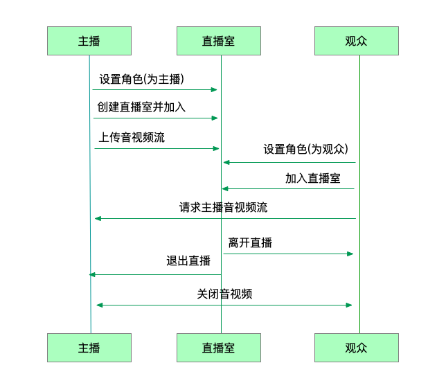

业务流程
==============================

直播是利用频道实现的一对多的交流方式，频道是类似音视频房间的概念，主播创建房间，其他用户通过加入直播室进行观看或者与主播互动。

**相关概念**

- 频道：频道是多个用户进行实时音视频通话的场所，以频道号为唯一标识，用户通过加入同一个频道进行语音通话或者视频通话。

- 观众：观众是指在多人通话时只可以观看但是没有发言权限的人，这些用户只可以接收主播的音频或视频数据，但不能发送音频或视频数据。

- 互动者：互动者是指与主播进行连麦的成员，互动用户可以发送音视频数据。

**业务流程**

- ``角色设置以及频道设置``

 加入频道前需要先进行角色的设置，角色包括主播和观众，默认角色为观众。角色设置后还可以进行码率、最大分辨率、帧率以及密码的设置。

- ``主播创建并加入直播间``

 角色设置后，如果角色为主播，则需由主播创建直播间，主播创建直播间并加入，并监听加入结果回调。

- ``上传音频流``

 主播加入成功后，打开音视频设备，并上传本地音视频流，此时会收到成员状态更新的回调。

- ``观众加入直播回调``

 直播过程中，如果有观众加入，直播间的其他成员将收到新成员加入的回调，同时进行状态的更新。

- ``请求主播视频流``

 如果是视频互动直播，观众加入直播后需要请求主播的视频流，才可以看到主播的画面。

- ``申请连麦``

 直播过程中，观众可以与主播进行连麦互动，通过发送消息进行连麦请求的发送，请求发送后，主播端会上报会收到消息的回调，此时可以主播可以做对应的处理。

- ``接受连麦``

 主播同意连麦并设置成员状态为音频连麦状态或者视频连麦状态，状态改变会收到成员更新的回调。

- ``成员离开频道回调``

 直播过程中，如果有成员离开直播，其他成员将会收到成员离开的回调。离开的成员会收到自己离开的结果回调。

- ``销毁频道``

 当所有成员都离开直播后，直播间被释放。