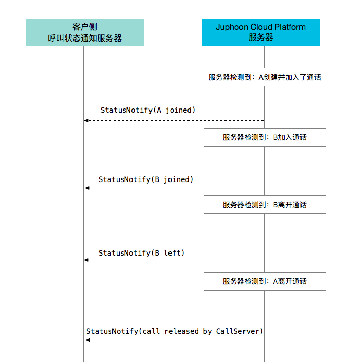

多方通话状态通知
===========================

.. highlight:: JavaScript

多方通话状态通知流程如下：

**获取通话状态通知的操作如下：**

消息格式
---------------------

statusNotify 消息用于通知通话状态，由菊风服务器发起 RESTful 请求，由客户服务器响应。

请求
---------------------

HTTP报文头：

.. list-table::
   :header-rows: 1

   * - 报文头域	
     - 是否必选	
     - 值	
     - 说明
   * - POST	
     - 
     - 	
     - 
   * - Authorization	
     - 否
     - Base64编码	
     - ”Basic Base64('[域用户名]:[域密码]')"
   * - Domain
     - 否	
     - 发起请求者的域名	
     - 
   * - Content-Type	
     - 是
     - application/json	
     - 
   * - Content-Length
     - 是
     - HTTP Body的实际长度		
     - 

加入会议 HTTP 报文样例：

::

    POST HTTP/1.1
    Authorization: Basic YWRtaW46MTIz
    Content-Length: 317
    Content-Type: application/json
    Domain: sample.cloud.justalk.com

    {
    "in":{"params":{},
            "roomId":"96305879581145",
            "status":"{\"pub\":\"join\",
                        \"actor\":{\"[username:alice@sample.cloud.justalk.com]\":
                                    {\"nick\":\"alice\",
                                    \"role\":7,
                                    \"state\":2,
                                    \"idx\":3}
                                    },
                        \"roomId\":\"96305879581145\",
                        \"time\":1469511339}",
            "userData":"My UserData",
            "conferenceNumber":"327511"},
    "cmd":"statusNotify.JSME.JSM",
    "oid":"JSMUser",
    "tid":4022588287,
    "params":{}
    }

其中：

- Authorization头: 值为“Basic [Base64(用户名:密码)]”。此处假定客户指定的HTTP鉴权用户名为test，密码为123，"dGVzdDoxMjM="为Base64(test:123)编码后的结果。

参数说明：

- in: 会议相关信息

- roomId: 会议标示

- status: 会议的实时状态。status 对应的 value 为 json 字符串，客户需转成 json 格式，然后取出对应的值，具体如下：

::

    \"pub\":\"join\" 表示加入会议

    \"actor\":{\"[username:alice@sample.cloud.justalk.com]\":{\"nick\":\"alice\",\"role\":7,\"state\":2,\"idx\":3}} 表示加入会议的成员，value 也是 json 字符串，需转成 json 格式。转成 json 格式后，先取出 key，这里为 [username:alice@sample.cloud.justalk.com]，表示该成员的 uri，是登录 JusTalk Cloud 帐号系统的标示，其中 alice 为客户终端登录时的使用的用户名，所以可以使用这个来匹配客户的帐号体系。

    \"time\":1469511339 表示加入会议的时间戳，单位秒    

 - userData: 用户自定义数据。可用于传客户自定义数据，例如订单号。预约会议时在参数加入 userdata，例如 "params":{"video":"1","title":"test","userdata":"My UserData"}

- oid: 提供服务的对象名称。

- tid: 事务 ID，值唯一的整数。transaction 代表本次 Nofity 的一次交互。该 ID 值由发起 Request 的一方生成。

离开会议 HTTP 报文样例：

::

    POST HTTP/1.1
    Authorization: Basic YWRtaW46MTIz
    Content-Length: 317
    Content-Type: application/json
    Domain: sample.cloud.justalk.com

    {
    "in":{"params":{},
            "roomId":"96305879581145",
            "status":"{\"pub\":\"leave\",
                        \"actor\":{\"[username:alice@sample.cloud.justalk.com]\":\"leave\"},
                        \"roomId\":\"96305879581145\",
                        \"time\":1469511362}",
            "userData":"My UserData",
            "conferenceNumber":"327511"},
    "cmd":"statusNotify.JSME.JSM",
    "oid":"JSMUser",
    "tid":4022588287,
    "params":{}
    }

其中：

- Authorization头: 值为“Basic [Base64(用户名:密码)]”。此处假定客户指定的HTTP鉴权用户名为test，密码为123，"dGVzdDoxMjM="为Base64(test:123)编码后的结果。

参数说明：

- in: 会议相关信息

- roomId: 会议标示

- status: 会议的实时状态。status 对应的 value 为 json 字符串，客户需转成 json 格式，然后取出对应的值，具体如下：

::

    \"pub\":\"leave\" 表示离开会议

    \"actor\":{\"[username:alice@sample.cloud.justalk.com]\":\"leave\"} 表示离开会议的成员，value 也是 json 字符串，需转成 json 格式。转成 json 格式后，先取出 key，这里为 [username:alice@sample.cloud.justalk.com]，表示该成员的 uri，是登录 JusTalk Cloud 帐号系统的标示，其中 alice 为客户终端登录时的使用的用户名，所以可以使用这个来匹配客户的帐号体系。

    \"time\":1469511339 表示离开会议的时间戳，单位秒    

 - userData: 用户自定义数据。可用于传客户自定义数据，例如订单号。预约会议时在参数加入 userdata，例如 "params":{"video":"1","title":"test","userdata":"My UserData"}

- oid: 提供服务的对象名称。

- tid: 事务ID，值唯一的整数。transaction 代表本次 Nofity 的一次交互。该 ID 值由发起 Request 的一方生成。

响应
---------------------

HTTP报文头：

.. list-table::
   :header-rows: 1

   * - 报文头域	
     - 是否必选	
     - 值	
   * - 202 Accepted
     - 是
     - 	
   * - Authorization	
     - 否
     - Base64编码	
   * - Domain
     - 否	
     - 发起请求者的域名	
   * - Content-Length
     - 是
     - HTTP Body的实际长度	

HTTP报文样例：

::

    HTTP/1.1 202 Accepted
    Content-Length: 29

    {"tid":4022588287,"ret":true}

其中：

- tid：事务 ID，值唯一的整数。与请求报文保持一致。

- ret：true 表示收到通知。

报文说明
---------------------

会议创建
>>>>>>>>>>>>>>>>>>>>>>>>>>

- 关键字 new 表示 创建会议;

- time 表示创建时间，单位是秒。

::

    {
      "in": {
        "params": null,
        "roomId": "-181601554958257",
        "status": "{\"pub\":\"new\",\"roomId\":\"-181601554958257\",\"id\":\"-181601554958257\",\"time\":1523947486,\"config\":{\"capacity\":2047,\"sender\":16,\"media\":\"\"},\"room\":{\"title\":\"123456\",\"psswrd\":\"123456\",\"screen\":\"\",\"dat\":\"\"}}",
        "userData": "",
        "conferenceNumber": "10521028"
      },
      "cmd": "statusNotify.JSME.JSM",
      "oid": "JSMUser",
      "tid": 1031033531,
      "params": null
    }

会议加入
>>>>>>>>>>>>>>>>>>>>>>>>>>

- 关键字 join 表示 加入会议;

- time 表示加入时间，单位是秒。

::

    {
      "in": {
        "params": null,
        "roomId": "-181601554958257",
        "status": "{\"pub\":\"join\",\"actor\":{\"[username:cfl1@sample.cloud.justalk.com]\":{\"nick\":\"cfl1\",\"role\":15,\"state\":14,\"idx\":1}},\"mid\":\"-181601554958257\",\"sid\":\"-181601554958257\",\"roomId\":\"-181601554958257\",\"id\":\"-181601554958257\",\"time\":1523947486}",
        "userData": "",
        "conferenceNumber": "10521028"
      },
      "cmd": "statusNotify.JSME.JSM",
      "oid": "JSMUser",
      "tid": 1031033532,
      "params": null
    }

会议人员离开（带流量和视频时间）
>>>>>>>>>>>>>>>>>>>>>>>>>>>>>>>>>>>>>>>>>>>

- 关键字 actorleave，表示离开会议;
- time表示离开会议的时间，单位是秒;
- nf.snd.sum 表示发送流量，单位KB;
- nf.rcv.sum 表示接收流量，单位KB;
- 90ptime，180ptime，360ptime，720ptime，1080ptime 分别表示90p,180p,360p,720p，1080p 各用了多少时长，单位是秒。

::

    {
      "in": {
        "params": null,
        "roomId": "-181601554958257",
        "status": "{\"pub\":\"actorleave\",\"actorleave\":{\"actorid\":\"[username:cfl1@sample.cloud.justalk.com]\",\"actorrole\":15,\"actorstate\":14,\"appid\":1,\"lasttime\":100,\"channeltype\":1,\"mediatype\":{\"est.br.snd.avg\":1200,\"est.br.rcv.avg\":1200,\"nf.snd.sum\":74,\"nf.rcv.sum\":21,\"br.snd.avg\":5,\"br.rcv.avg\":1,\"loss.snd.avg\":0,\"loss.rcv.avg\":0,\"rtt.avg\":51,\"jitter.snd.avg\":0,\"jitter.rcv.avg\":0,\"idletime\":98,\"audiotime\":0,\"screensharetime\":0,\"90ptime\":0,\"180ptime\":0,\"360ptime\":0,\"720ptime\":0,\"1080ptime\":0}},\"mid\":\"-181601554958257\",\"sid\":\"-181601554958257\",\"roomId\":\"-181601554958257\",\"id\":\"-181601554958257\",\"time\":1523947587}",
        "userData": "",
        "conferenceNumber": "10521028"
      },
      "cmd": "statusNotify.JSME.JSM",
      "oid": "JSMUser",
      "tid": 1031033676,
      "params": null
    }

会议成员离开（不带流量和视频时间）
>>>>>>>>>>>>>>>>>>>>>>>>>>>>>>>>>>>>>>>>>>>

- 关键字leave，表示离开会议;
- time表示离开会议的时间，单位是秒。
::

    {
      "in": {
        "params": null,
        "roomId": "-181601554958257",
        "status": "{\"pub\":\"leave\",\"actor\":{\"[username:cfl1@sample.cloud.justalk.com]\":\"leave\"},\"mid\":\"-181601554958257\",\"sid\":\"-181601554958257\",\"roomId\":\"-181601554958257\",\"id\":\"-181601554958257\",\"time\":1523947587}",
        "userData": "",
        "conferenceNumber": "10521028"
      },
      "cmd": "statusNotify.JSME.JSM",
      "oid": "JSMUser",
      "tid": 1031033677,
      "params": null
    }

会议销毁
>>>>>>>>>>>>>>>>>>>>>>>>>>>>>>>>>>>>>>>>>>>

- 关键字 delete 表示会议销毁。
- nf.snd.sum 表示整个会议发送流量，单位KB。
- nf.rcv.sum 表示整个会议接收流量，单位KB。
- audiotime 表示会议所有成员累计使用的音频时间，单位秒。
- 90ptime，180ptime，360ptime，720ptime，1080ptime 分别表示90p,180p,360p,720p，1080p 各用了多少时长，单位是秒。

::

    {
      "in": {
        "params": null,
        "roomId": "-181601554958257",
        "status": "{\"pub\":\"delete\",\"net\":{\"mediatypes\":\" Au\",\"nf.snd.sum\":99,\"nf.rcv.sum\":89,\"br.snd.avg\":0,\"br.rcv.avg\":0,\"est.br.snd.avg\":2400,\"est.br.rcv.avg\":2400,\"loss.snd.avg\":0,\"loss.rcv.avg\":0,\"rtt.avg\":78,\"jitter.snd.avg\":0,\"jitter.rcv.avg\":0,\"idletime\":113,\"audiotime\":43,\"screensharetime\":0,\"90ptime\":0,\"180ptime\":0,\"360ptime\":0,\"720ptime\":0,\"1080ptime\":0},\"channeltypes\":\"N\",\"monline\":2,\"md\":120,\"td\":162,\"mid\":\"-181601554958257\",\"sid\":\"-181601554958257\",\"roomId\":\"-181601554958257\",\"id\":\"-181601554958257\",\"time\":1523947595}",
        "userData": "",
        "conferenceNumber": "10521028"
      },
      "cmd": "statusNotify.JSME.JSM",
      "oid": "JSMUser",
      "tid": 1031033704,
      "params": null
    }
