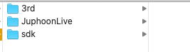
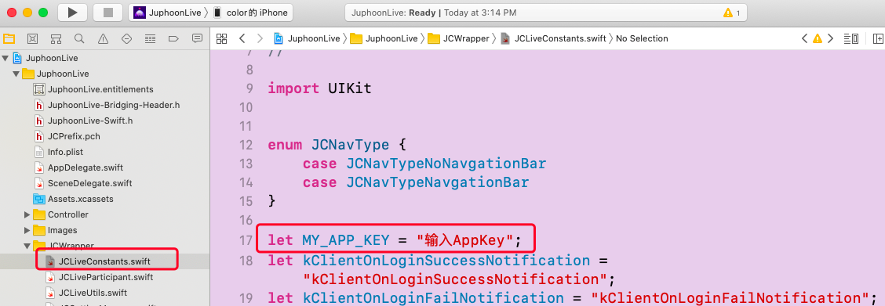
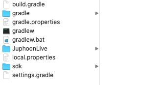
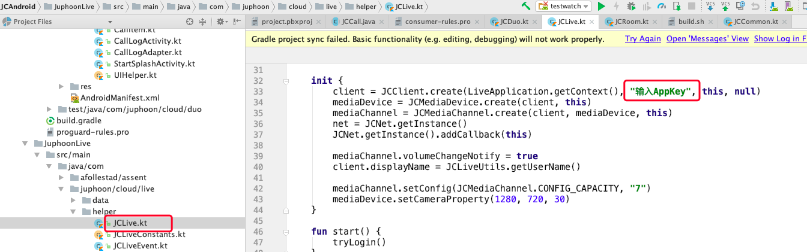

运行 Demo 源码
==================================

.. toctree::
   :maxdepth: 3

   iOS
   Android

iOS
----------------------------

想要快速体验 Demo，请按以下步骤操作：

1. 获取 AppKey
>>>>>>>>>>>>>>>>>>>>>>>>>>>>>>

请参考 :ref:`创建应用<创建应用>` 来获取您的 AppKey 。

.. note::

       同一个账号下创建的应用属于同一个域，同域中的应用可以互通。

2. Demo 源码下载
>>>>>>>>>>>>>>>>>>>>>>>>>>>>>>

请点击这里（替换新链接） 进行 Demo 源码下载。

3. 编译运行
>>>>>>>>>>>>>>>>>>>>>>>>>>>>>>

3.1 解压下载的 Demo 源码压缩包，并打开工程
^^^^^^^^^^^^^^^^^^^^^^^^^^^^^^^^^^^^^^^^^^^^^^^^

解压后的目录如下：

3.2 设置自己的 AppKey
^^^^^^^^^^^^^^^^^^^^^^^^^^^^^^^^^^^^^^^^

在下图红框标记的代码中输入自己的 AppKey

3.3 运行 Demo
^^^^^^^^^^^^^^^^^^^^^^^^^^^^^^^^^^^^^^^^

连接 iOS 真机，编译运行 Demo 程序。

.. note:: 当前 RealmSwift 版本为使用 Swift 5.1 编译器编译的，开发者需要根据自己当前的 Xcode 版本下载对应的 RealmSwift 库进行替换。

^^^^^^^^^^^^^^^^^^^^^^^^^^^^^^^^^^^^^^

Android
-------------------------

想要快速体验 Demo，请按以下步骤操作：

1. 获取 AppKey
>>>>>>>>>>>>>>>>>>>>>>>>>>>>>>

请参考 :ref:`创建应用<创建应用>` 来获取您的 AppKey 。

.. note::

       同一个账号下创建的应用属于同一个域，同域中的应用可以互通。

2. Demo 源码下载
>>>>>>>>>>>>>>>>>>>>>>>>>>>>>>

请点击这里（替换新链接） 进行 Demo 源码下载。

3. 编译运行
>>>>>>>>>>>>>>>>>>>>>>>>>>>>>>

3.1 解压下载的 Demo 源码压缩包，并打开工程
^^^^^^^^^^^^^^^^^^^^^^^^^^^^^^^^^^^^^^^^^^^^^^^^^^^^^^

解压后的目录如下：

3.2 设置自己的 AppKey
^^^^^^^^^^^^^^^^^^^^^^^^^^^^^^^^^^^^^^^^

在下图红框标记的代码中输入自己的 AppKey

3.3 运行 Demo
^^^^^^^^^^^^^^^^^^^^^^^^^^^^^^^^^^^^^^^^

连接安卓真机，编译运行 Demo 程序。

**示例图片**

.. image:: images/pic1.png
   :width: 300
   :height: 520

.. image:: images/pic2.png
   :width: 300
   :height: 520

.. image:: images/pic3.png
   :width: 300
   :height: 520

.. image:: images/pic4.png
   :width: 300
   :height: 520

.. image:: images/pic5.png
   :width: 300
   :height: 520

.. image:: images/pic6.png
   :width: 300
   :height: 520

.. image:: images/pic7.png
   :width: 300
   :height: 520