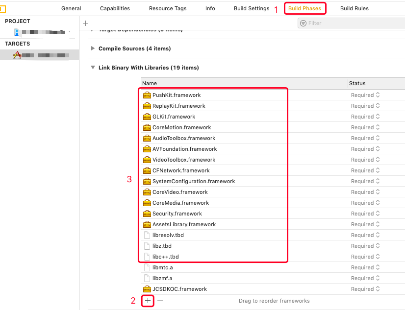
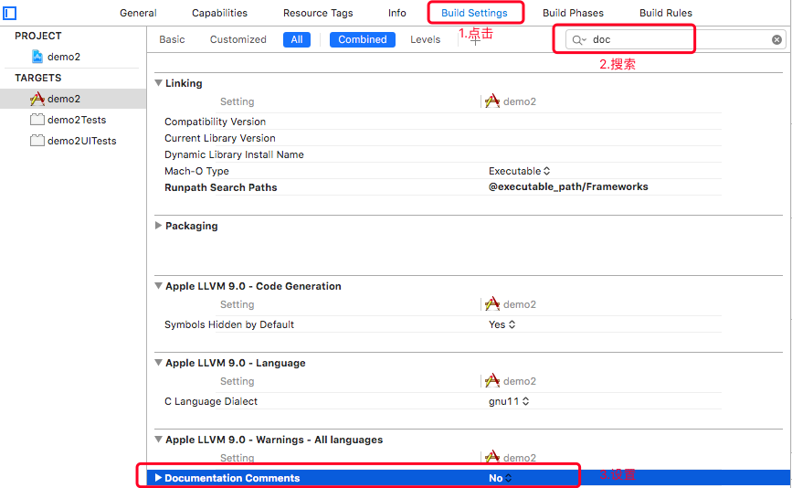

iOS
===============================

.. highlight:: objective-c

前提条件
----------------------------------

- 支持 iOS 8.0 或以上版本的 iOS **真机** 设备

- 有效的菊风开发者账号（`免费注册 <http://developer.juphoon.com/signup>`_ ）

准备工作
----------------------------------

开始之前，请先做好如下准备工作：

SDK 下载
>>>>>>>>>>>>>>>>>>>>>>>>>>>>>>>>>>

点击 `iOS SDK <http://developer.juphoon.com/document/cloud-communication-ios-sdk#2>`_ 进行下载。如果已经下载了 SDK，请直接进行 SDK 配置。

AppKey 获取
>>>>>>>>>>>>>>>>>>>>>>>>>>>>>>>>>>

AppKey 是应用在菊风云平台中的唯一标识。需要在 SDK 初始化的时候使用，AppKey 获取请参考 :ref:`创建应用 <创建应用>` 。

SDK 配置
>>>>>>>>>>>>>>>>>>>>>>>>>>>>>>>>>>

您可以在工程中使用静态库或者动态库，此处介绍使用静态库的配置方法。如果想使用动态库，请参考动态库的配置说明文档 :ref:`iOS 导入动态库<iOS 导入动态库>` 。

.. note::

        如果您已经集成了多家音视频引擎，则推荐使用动态库。

只有完成 SDK 的配置之后，您才可以集成 JC SDK 提供的功能，请按以下操作完成静态库的配置：

**导入静态库**

有两种方式导入静态库

**方法一：使用 CocoaPods 自动导入**

.. note:: 该方法仅适用于 2.0 及以上版本的静态库集成。

SDK 支持使用 CocoaPods 导入 SDK。 需要安装 CocoaPods 环境，请参照 `CocoaPods 官网 <https://cocoapods.org>`_ 安装。

CocoaPods 环境安装好后，请执行以下操作：

1. 打开 Terminal，cd 至项目根目录

2. 执行 pod init，项目文件夹下会生成一个 Podfile 文本文件

3. 执行 open -e Podfile

4. 添加导入配置 pod 'JuphoonCloudSDK_iOS', '2.0'

修改后内容如下所示，注意将 Your App 替换为你的 Target 名称。
::

    platform :ios, '9.0'
    #use_frameworks!
    target 'Your App' do
    pod 'JuphoonCloudSDK_iOS', '2.0'
    end

2.0 为当前发布的最新版本，关于指定具体版本请参考 `pod 使用规范 <https://guides.cocoapods.org/using/the-podfile.html>`_ 。

5. 执行 pod install，成功安装后，Terminal 中会显示 Pod installation complete!，此时项目文件夹下会生成一个 xcworkspace 文件。

.. note:: 如果需要更新本地库版本，在执行 pod install 之前执行 pod update 命令。

6. 双击打开 .xcworkspace 文件即可。

**方法二：手动导入**

在 Mac 环境下打开下载的 iOS SDK，在 sdk 文件夹内包含了 lib、JCSDKOC.framework 和 include 三个文件。

.. image:: images/ios_sdk_list1.png

``拷贝文件``

将 sdk 文件夹拷贝到您工程所在的目录下。

``工程设置``

**1. 导入 SDK**

打开 Xcode，进入 TARGETS > Project Name > Build Phases > Link Binary with Libraries 菜单，点击 ‘+’ 符号，导入 sdk 文件夹下的 JCSDKOC.framework、lib 文件夹下的两个 .a 文件，如下图：

.. image:: images/inputlib.png

**2. 导入 SDK 依赖的库**

继续点击 ‘+’ 符号，导入下图红框中的库：

**3. 设置路径**

点击 ‘Build Settings’，找到 Framework Search Paths 、Header Search Paths（头文件路径） 和 Library Search Paths（库文件路径）。并设置 Framework Search Paths、Header Search Paths 和 Library Search Paths，如下图：

.. image:: images/pathset.png

.. note:: 在完成第1步导入 JCSDKOC.framework 和两个.a文件后，Xcode 会自动生成该路径，如果 Xcode 没有自动生成路径，用户要根据 JCSDKOC.framework 、include 和 lib 库文件所在目录，手动设置路径。

**4. 设置 Enable Bitcode 为 NO**

点击 ‘Build Settings’，找到 Enable Bitcode 设置为 NO，如下图：

.. image:: images/iOS_integration_DynamicBitcode.png

**5. 设置 Other Linker Flags 的参数为 -ObjC**

点击 ‘Build Settings’，找到 Other Linker Flags 并添加参数 -ObjC，如下图：

.. image:: images/iOS_integration_ObjC.png

**6.设置预处理宏定义**

点击 ‘Build Settings’，找到 Preprocessor Macros，在右侧输入 ZPLATFORM=ZPLATFORM_IOS，如下图：

.. image:: images/static_import_ios.png

**如果设置了 APNs 推送**，则还需要在 Preprocessor Macros 下的 Debug 中输入 DEBUG，如下图：

.. image:: images/pushdebug.png

.. note::

    DEBUG 宏定义的目的是为了区分推送环境是 release 还是 debug，环境不对会导致推送失败。

**7. 设置 Documentation Comments 为 NO**

点击 ‘Build Settings’，找到 Documentation Comments 并设置为 NO，如下图：

**8. 设置后台运行模式**

点击 ‘Capabilities’，找到 Background Modes，勾选红框内的 Audio, AirPlay, and Picture in Picture ，如下图：

.. image:: images/iOS_integration_DynamicBackgroundModes.png

**权限设置**

**9. 设置麦克风和摄像头权限**

点击 ‘Info’，然后添加麦克风和摄像头的权限，如下图：

.. image:: images/iOS_integration_DynamicPermissions.png

.. list-table::
   :header-rows: 1

   * - Key
     - Type
     - Value
   * - Privacy - Microphone Usage Description
     - String
     - 使用麦克风的目的，如语音通话。
   * - Privacy - Camera Usage Description
     - String
     - 使用摄像头的目的，如视频通话。

**10. 编译运行**

以上步骤进行完后，编译工程，如果提示 succeeded，恭喜您已经成功配置 SDK，可以进行 SDK 初始化了。

.. note:: SDK 不支持模拟器运行，请使用真机。

^^^^^^^^^^^^^^^^^^^^^^^^^^^^^^^^^^^^^^^

SDK 初始化
>>>>>>>>>>>>>>>>>>>>>>>>>>>>>>>>>>

在使用 SDK 之前，需要进行 SDK 的初始化。在 App 的整个生命周期中，开发者只需要将 SDK 初始化一次。

首先在需要使用 JC SDK 的地方 #import <JCSDKOC/JCSDKOC.h> 。

然后在实现初始化的文件中实现 JCClientCallback 回调接口，用于接收 JCClient 相关通知。

在初始化的时候还可以设置 SDK 信息存储目录，日志路径以及日志打印的等级，具体通过 JCClientCreateParam 对象设置，如果不设置则使用默认值。

JCClientCreateParam 对象有以下属性
::

    /// sdk信息存储目录
    @property (nonatomic, copy) NSString* __nonnull sdkInfoDir;

    /// sdk日志目录
    @property (nonatomic, copy) NSString* __nonnull sdkLogDir;

    /// sdk日志等级 JCLogLevel
    @property (nonatomic) JCLogLevel sdkLogLevel;

调用下面的接口初始化 SDK
::

    /**
     * @brief 创建 JCClient 实例
     * @param appKey 用户从 Juphoon Cloud 平台上申请的 AppKey 字符串
     * @param callback 回调接口，用于接收 JCClient 相关通知
     * @param createParam 创建参数，nil 则按默认值创建
     * @return JCClient 对象
     */
    +(JCClient* __nullable)create:(NSString* __nonnull)appKey callback:(id<JCClientCallback> __nonnull)callback creatParam:(JCClientCreateParam* __nullable)createParam;

.. note::

       appKey 为准备工作中“获取 AppKey”步骤中取得的 AppKey。如果还未获取 AppKey，请参考 :ref:`创建应用 <创建应用>` 来获取。

示例代码::

    // 初始化，因为这些模块实例将被频繁使用，建议声明在单例中
    JCClientCreateParam *param = [[JCClientCreateParam alloc] init];
    param.sdkLogLevel = JCLogLevelInfo;
    param.sdkInfoDir = @"SDK 信息存放路径";
    param.sdkLogDir = @"日志存放路径";
    JCClient *client = [JCClient create:@"your appkey" callback:self creatParam:param];

SDK 初始化之后，即可进行登录的集成。

^^^^^^^^^^^^^^^^^^^^^^^^^^^^^^^^^^^^^^^

登录
----------------------------------

登录涉及 JCClient 类及其回调 JCClientCallback，其主要作用是负责登录、登出管理及帐号信息存储。

登录之前，可以通过 loginParam 登录参数进行登录的相关配置，如服务器地址的设置或者使用代理服务器登录，如不设置则按照默认值登录，具体如下：

::

        JCClientLoginParam* loginParam = [[JCClientLoginParam alloc] init];
        //默认国内环境 http:cn.router.justalkcloud.com:8080
        loginParam.serverAddress = @"服务器地址";
        //如果使用代理服务器登录
        loginParam.httpsProxy = @"代理服务器地址";

其中，服务器地址包括国际环境服务器地址和国内环境服务器地址：

**国际环境** 服务器地址默认为 ``http:intl.router.justalkcloud.com:8080`` 。

**国内环境** 服务器地址默认为 ``http:cn.router.justalkcloud.com:8080`` 。

开发者可以使用自定义服务器地址。

还可以通过 displayName 属性设置昵称，例如::

    JCManager.shared.client.displayName = @"小张";

发起登录
>>>>>>>>>>>>>>>>>>>>>>>>>>>>>>>>>>

调用下面的接口发起登录，userId 为英文、数字和'+' '-' '_' '.'，大小写不敏感，长度不要超过64字符，'-' '_' '.'不能作为第一个字符
::

    /**
     * @brief 登陆 Juphoon Cloud 平台，只有登陆成功后才能进行平台上的各种业务
     * 服务器分为鉴权模式和非鉴权模式
     *
     *     - 鉴权模式: 服务器会检查用户名和密码
     *
     *     - 免鉴权模式: 只要用户保证用户标识唯一即可, 服务器不校验
     *
     * 登陆结果通过 JCClientCallback 通知
     *
     * @param userId 用户名
     * @param password 密码，免鉴权模式密码可以随意输入，但不能为空
     * @param loginParam 登录参数，nil则按照默认值登录
     * @return 返回 true 表示正常执行调用流程，false 表示调用异常，异常错误通过 JCClientCallback 通知
     * @warning 目前只支持免鉴权模式，免鉴权模式下当账号不存在时会自动去创建该账号
     * @warning 用户名为英文数字和'+' '-' '_' '.'，长度不要超过64字符，'-' '_' '.'不能作为第一个字符
     */
    -(bool)login:(NSString* __nonnull)userId password:(NSString* __nonnull)password loginParam:(JCClientLoginParam* __nullable)loginParam;

示例代码：
::

        JCClientLoginParam* loginParam = [[JCClientLoginParam alloc] init];
        //默认国内环境 http:cn.router.justalkcloud.com:8080
        loginParam.serverAddress = @"服务器地址";
        [JCManager.shared.client login:@"账号" password:@"123" loginParam:loginParam];

登录成功之后，首先会触发登录状态改变（onClientStateChange）回调

::
    
    /**
     *  @brief 登录状态变化通知
     *  @param state    当前状态值
     *  @param oldState 之前状态值
     */
    -(void)onClientStateChange:(JCClientState)state oldState:(JCClientState)oldState;

JCClientState 有::

    // 未初始化
    JCClientStateNotInit,
    // 未登录
    JCClientStateIdle,
    // 登录中
    JCClientStateLogining,
    // 登录成功
    JCClientStateLogined,
    // 登出中
    JCClientStateLogouting,

示例代码::

    -(void)onClientStateChange:(JCClientState)state oldState:(JCClientState)oldState
    {
        if (state == JCClientStateIdle) { // 未登录
           ...
        } else if (state == JCClientStateLogining) { // 登录中
           ...
        } else if (state == JCClientStateLogined) {  // 登录成功
           ...
        } else if (state == JCClientStateLogouting) {  // 登出中
           ...
        }
    }

之后通过 onLogin 回调上报登录结果
::

    /**
     *  @brief 登陆结果回调
     *  @param result true 表示登陆成功，false 表示登陆失败
     *  @param reason 当 result 为 false 时该值有效
     *  @see JCClientReason
     */
    -(void)onLogin:(bool)result reason:(JCClientReason)reason;

其中，JCClientReason 有
::

    /// 正常
    JCClientReasonNone,
    /// sdk 未初始化
    JCClientReasonSDKNotInit,
    /// 无效的参数
    JCClientReasonInvalidParam,
    /// 函数调用失败
    JCClientReasonCallFunctionError,
    /// 当前状态无法再次登录
    JCClientReasonStateCannotLogin,
    /// 超时
    JCClientReasonTimeOut,
    /// 网络异常
    JCClientReasonNetWork,
    /// appkey 错误
    JCClientReasonAppKey,
    /// 账号密码错误
    JCClientReasonAuth,
    /// 无该用户
    JCClientReasonNoUser,
    /// 被强制登出
    JCClientReasonServerLogout,
    /// 其他错误
    JCClientReasonOther,

登录成功之后，SDK 会自动保持与服务器的连接状态，直到用户主动调用登出接口，或者因为帐号在其他设备登录导致该设备登出。

登出
>>>>>>>>>>>>>>>>>>>>>>>>>>>>>>>>>>

登出调用下面的接口，登出后不能进行平台上的各种业务操作
::

    /**
     *  登出 Juphoon Cloud 平台，登出后不能进行平台上的各种业务
     *  @return 返回 true 表示正常执行调用流程，false 表示调用异常，异常错误通过 JCClientCallback 通知
     */
    -(bool)logout;

登出同样会触发登录状态改变（onClientStateChange）回调

之后将通过 onlogout 回调上报登出结果
::

    /**
     *  @brief 登出回调
     *  @param reason 登出原因
     *  @see JCClientReason
     */
    -(void)onLogout:(JCClientReason)reason;

集成登录后，即可进行相关业务的集成。

^^^^^^^^^^^^^^^^^^^^^^^^^^^^^^^^^^^^^^^^^^^

业务集成
----------------------------------

**相关类说明**

语音互动直播涉及以下类：

.. list-table::
   :header-rows: 1

   * - 名称
     - 描述
   * - `JCMediaChannel <https://developer.juphoon.com/portal/reference/V2.0/ios/Classes/JCMediaChannel.html>`_
     - 媒体频道模块，类似音视频房间的概念，可以通过频道号加入此频道，从而进行音视频通话
   * - `JCMediaChannelParticipant <https://developer.juphoon.com/portal/reference/V2.0/ios/Classes/JCMediaChannelParticipant.html>`_
     - 媒体频道成员，主要用于成员基本信息以及状态等的管理
   * - `JCMediaChannelQueryInfo <https://developer.juphoon.com/portal/reference/V2.0/ios/Classes/JCMediaChannelQueryInfo.html>`_
     - 媒体频道查询信息结果
   * - `JCMediaChannelCallback <https://developer.juphoon.com/portal/reference/V2.0/ios/Protocols/JCMediaChannelCallback.html>`_
     - 媒体频道回调代理
   * - `JCMediaDevice <https://developer.juphoon.com/portal/reference/V2.0/ios/Classes/JCMediaDevice.html>`_
     - 设备模块，主要用于视频、音频设备的管理
   * - `JCMediaDeviceCallback <https://developer.juphoon.com/portal/reference/V2.0/ios/Classes/JCMediaDeviceVideoCanvas.html>`_
     - 设备模块回调代理

更多关于类的详细信息请参考 `API 说明文档 <https://developer.juphoon.com/portal/reference/V2.0/ios/>`_ 。

**开始集成语音互动直播功能前，请先实现 JCMediaDeviceCallback, JCMediaChannelCallback 回调，用于接收 JCMediaDevice 和 JCMediaChannel 的相关通知** 

之后进行 ``模块的初始化``

创建 JCMediaDevice 实例
::

    /**
     *  @brief 创建 JCMediaDevice 对象
     *  @param client JCClient 对象
     *  @param callback JCMediaDeviceCallback 回调接口，用于接收 JCMediaDevice 相关通知
     *  @return 返回 JCMediaDevice 对象
     */
    +(JCMediaDevice* __nullable)create:(JCClient* __nonnull)client callback:(id<JCMediaDeviceCallback> __nonnull)callback;

创建 JCMediaChannel 实例
::

    /**
     *  @brief 创建 JCMediaChannel 对象
     *  @param client       JCClient 对象
     *  @param mediaDevice  JCMediaDevice 对象
     *  @param callback     JCMediaChannelCallback 回调接口，用于接收 JCMediaChannel 相关通知
     *  @return             返回 JCMediaChannel 对象
     */
    +(JCMediaChannel* __nullable)create:(JCClient* __nonnull)client mediaDevice:(JCMediaDevice* __nonnull)mediaDevice callback:(id<JCMediaChannelCallback> __nonnull)callback;

示例代码
::

    // 初始化各模块，因为这些模块实例将被频繁使用，建议声明在单例中
    JCMediaDevice *mediaDevice = [JCMediaDevice create:client callback:self];
    JCMediaChannel *mediaChannel = [JCMediaChannel create:client mediaDevice:mediaDevice callback:self];

**开始集成**

1. 角色设置
>>>>>>>>>>>>>>>>>>>>>>>>>>>>>>>>>>

加入频道前要先进行角色的设置。其中角色设置包括主播和观众。

角色值可以根据 JCMediaChannelCustomRole 枚举值进行自定义，JCMediaChannelCustomRole 有以下几种
::

    /// 无自定义角色
    JCMediaChannelCustomRoleNone = 0,
    /// 自定义角色0
    JCMediaChannelCustomRole0 = 1<<12,
    /// 自定义角色1
    JCMediaChannelCustomRole1 = 1<<13,
    /// 自定义角色2
    JCMediaChannelCustomRole2 = 1<<14,
    /// 自定义角色3
    JCMediaChannelCustomRole3 = 1<<15,

例如
::

    //自定义主播角色
    JCMediaChannelCustomRole ROLE_BROASCASTER = JCMediaChannelCustomRole0;
    //自定义观众角色
    JCMediaChannelCustomRole ROLE_AUDIENCE = JCMediaChannelCustomRole1;

角色定义之后，调用下面的接口设置角色
::

    /**
     * @brief 设置自定义角色
     *
     * @param customRole 自定义角色, 参看 JCMediaChannelCustomRole
     * @param participant 成员，nil 则默认设置自己
     */
    -(void)setCustomRole:(JCMediaChannelCustomRole)customRole participant:(JCMediaChannelParticipant * __nullable)participant;

自定义角色设置后可以调用下面的方法获取自定义的角色值
::

    /**
     * @brief 获得自定义角色
     *
     * @return
     */
    -(JCMediaChannelCustomRole)getCustomRole;

2. 发送本地音频流
>>>>>>>>>>>>>>>>>>>>>>>>>>>>>

**如果角色为主播，则需要在加入频道前打开“上传音频流”的标识。这样在加入频道后，服务器就会根据设定的值来确定是否上传本地音频流数据。如果为观众，则不需要。** 

::

    /**
     *  @brief 开启关闭发送本地音频流
     *      1.在频道中将会与服务器进行交互，服务器会更新状态并同步给其他用户
     *      2.未在频道中则标记是否上传音频流，在join时生效
     *      3.建议每次join前设置
     *  @param enable 是否开启本地音频流
     *  @return 返回 true 表示正常执行调用流程，false 表示调用异常
     */
    -(bool)enableUploadAudioStream:(bool)enable;

.. note:: 

        该接口可以在加入频道之前调用，也可以在加入频道之后调用。两者区别具体如下：
         - 如果在加入频道前调用，**只是打开或关闭“上传音频流”的标识，但不会发送数据**，当加入频道成功时会根据 enableUploadAudioStream 设定的值来确定是否上传音频数据。同时，频道中的其他成员会收到该成员“是否上传音频“的状态变化回调（onParticipantUpdate）。
         - 如果在加入频道后调用，则会开启或者关闭发送本地音频流数据，服务器也会根据 enableUploadAudioStream 设定的值来确定是否上传音频数据。同时，频道中的其他成员会收到该成员“是否上传音频“的状态变化回调（onParticipantUpdate）。
        此外，此方法还可以实现开启或关闭静音的功能。当 enable 值为 false ，将会停止发送本地音频流，此时其他成员将听不到本端的声音，从而实现静音功能。

要实现语音直播，还需要调用下面的接口关闭发送本地视频流
::

    /**
     *  @brief 开启关闭发送本地视频流
     *      1.在频道中将会与服务器进行交互，服务器会更新状态并同步给其他用户
     *      2.未在频道中则标记是否上传音频流，在join时生效
     *      3.建议每次join前设置
     *  @param enable    是否开启本地视频流
     *  @return          返回 true 表示正常执行调用流程，false 表示调用异常
     */
    -(bool)enableUploadVideoStream:(bool)enable;

.. note:: 

    该接口可以在加入频道之前调用，也可以在加入频道之后调用。两者区别具体如下：
     - 如果在加入频道前调用，**只是打开或关闭“上传视频流”的标识，但不发送数据**，当加入频道后会根据 enableUploadVideoStream 设定的值来确定是否上传视频流数据。同时，频道中的其他成员会收到该成员”是否上传视频“的状态变化回调（onParticipantUpdate）。如果设定的值为 false，则在加入频道后自动开启语音通话模式。
     - 如果在加入频道后调用，则会开启或关闭发送本地视频流数据。服务器会根据 enableUploadVideoStream 设定的值来确定是否上传视频流数据。同时，频道中的其他成员会收到该成员”是否上传视频“的状态变化回调（onParticipantUpdate），从而进行语音通话和视频通话的切换。
    此外，调用该方法发送本地视频流数据还要依赖摄像头是否已经打开。

3. 加入频道
>>>>>>>>>>>>>>>>>>>>>>>>>>>>>>>

调用下面的接口加入频道
::

    /**
     * 加入频道
     *  @param channelIdOrUri    媒体频道标识或者频道Uri，当 param 中 uriMode 设置为 true 时表示频道 Uri，其他表示频道标识
     *  @param joinParam    参数，没有则填null
     *  @return             返回 true 表示正常执行调用流程，false 表示调用异常
     */
    -(bool)join:(NSString* __nonnull)channelIdOrUri joinParam:(JCMediaChannelJoinParam* __nullable)joinParam;

.. note:: 加入频道会自动打开音频设备。

其中，JCMediaChannelJoinParam 为频道参数类，加入频道之前可以通过此类设置频道属性，如频道允许加入的最大人数，推流参数等。具体如下：

::

    /// 会议最大人数
    @property (nonatomic) int capacity;
    /// 推流参数
    @property (nonatomic) NSString* __nullable cdn;
    /// 录制参数
    @property (nonatomic) JCMediaChannelRecordParam * __nullable record;
    /// 密码
    @property (nonatomic) NSString* __nonnull password;
    /// 平滑模式
    @property (nonatomic) bool smooth;
    /// 会议最大分辨率 JCMediaChannelMaxResolution
    @property (nonatomic) JCMediaChannelMaxResolution maxResolution;
    /// uri 模式, join 函数的参数为会议 uri
    @property (nonatomic) bool uriMode;
    /// 心跳间隔
    @property (nonatomic) int heartbeatTime;
    /// 心跳超时
    @property (nonatomic) int heartbeatTimeout;
    /// 方形画面
    @property (nonatomic) bool square;
    /// 帧率 1-30, 默认 24
    @property (nonatomic) int framerate;
    /// 最大码率
    //@property (nonatomic) int maxBitrate;
    /// 自定义属性
    @property (nonatomic) NSString* __nullable customProperty;

**示例代码**

::

    //自定义主播角色
    JCMediaChannelCustomRole ROLE_BROASCASTER = JCMediaChannelCustomRole0;
    //自定义观众角色
    JCMediaChannelCustomRole ROLE_AUDIENCE = JCMediaChannelCustomRole1;
    //设置自己的角色
    [mediaChannel setCustomRole:ROLE_BROASCASTER participant:nil];
    -(void)joinRoom:(JCMediaChannelCustomRole)customRole {
        //主播可以上传本地音频流，语音直播时，不需要上传本地视频流
        [mediaChannel enableUploadVideoStream:false];
        [mediaChannel enableUploadAudioStream:customRole == ROLE_BROASCASTER];
        [mediaChannel enableAudioOutput:true];
        // 设置频道参数
        JCMediaChannelJoinParam *joinParam = [[JCMediaChannelJoinParam alloc] init];
        if (needsPassword) {//需要密码
           joinParam.password = @"joinPassword";
        }
        //加入直播
        [mediaChannel join:"channelId" joinParam:joinParam];
    }

加入频道结果回调
::

    /**
     *  @brief             加入频道结果回调
     *  @param result      true 表示成功，false 表示失败
     *  @param reason      加入失败原因，当 result 为 false 时该值有效
     *  @param channelId   媒体频道标识符
     *  @see JCMediaChannelReason
     */
    -(void)onJoin:(bool)result reason:(JCMediaChannelReason)reason channelId:(NSString*)channelId;

示例代码::

    // 加入频道结果回调
    -(void)onJoin:(bool)result reason:(JCMediaChannelReason)reason channelId:(NSString*)channelId
    {
        if (result) {
          // 加入成功
        } else {
          // 加入失败
        }
    }

现在您可以开始语音直播了。

直播中如果有新成员加入，会收到 onParticipantJoin 回调，此时可以进行界面更新
::

    /**
     *  @brief 新成员加入回调
     *  @param participant 成员对象
     */
    -(void)onParticipantJoin:(JCMediaChannelParticipant*)participant;

直播中，还可以与观众互动连麦，请参考 :ref:`互动连麦<互动连麦(ios)>`。

4. 离开频道
>>>>>>>>>>>>>>>>>>>>>>>>>>>>>>>>>>

.. image:: leavechannel.png

如果想离开直播，可以调用下面的接口
::

    /**
     *  离开媒体频道，当前只支持同时加入一个媒体通道
     *  @return  返回 true 表示正常执行调用流程，false 表示调用异常
     */
    -(bool)leave;

示例代码::

    // 离开频道
    [mediaChannel leave];

离开直播后，UI 会收到 onLeave 回调，该回调返回离开原因以及频道标识符
::

    /**
     *  @brief             离开频道结果回调
     *  @param reason      离开原因
     *  @param channelId   频道标识符
     *  @see JCMediaChannelReason
     */
    -(void)onLeave:(JCMediaChannelReason)reason channelId:(NSString*)channelId;

离开原因枚举值请参考 `JCMediaChannelReason <https://developer.juphoon.com/portal/reference/V2.0/ios/Constants/JCMediaChannelReason.html>`_。

示例代码::

    // 离开频道回调
    -(void)onLeave:(JCMediaChannelReason)reason channelId:(NSString*)channelId {
        // 界面处理
    }

5. 解散频道
>>>>>>>>>>>>>>>>>>>>>>>>>>>>>>>>>>

.. image:: stopchannel.png

如果主播想解散频道，可以调用下面的接口关闭频道，此时所有成员都将被退出
::

    /**
     *  @brief 关闭频道，所有成员都将被退出
     *  @return 返回 true 表示正常执行调用流程，false 表示调用异常
     */
    -(bool)stop;

示例代码::

    // 结束频道
    [mediaChannel stop];

关闭频道的结果通过 onStop 回调
::

    /**
     * brief 解散频道结果回调
     * @param result    true 表示成功，false 表示失败
     * @param reason    解散失败原因，当 result 为 false 时该值有效
     */
    -(void)onStop:(bool)result reason:(JCMediaChannelReason)reason;

解散失败原因枚举值请参考 `JCMediaChannelReason <https://developer.juphoon.com/portal/reference/V2.0/ios/Constants/JCMediaChannelReason.html>`_。

示例代码
::

    -(void)onStop:(bool)result reason:(JCMediaChannelReason)reason
    {
        // 界面处理
    }

