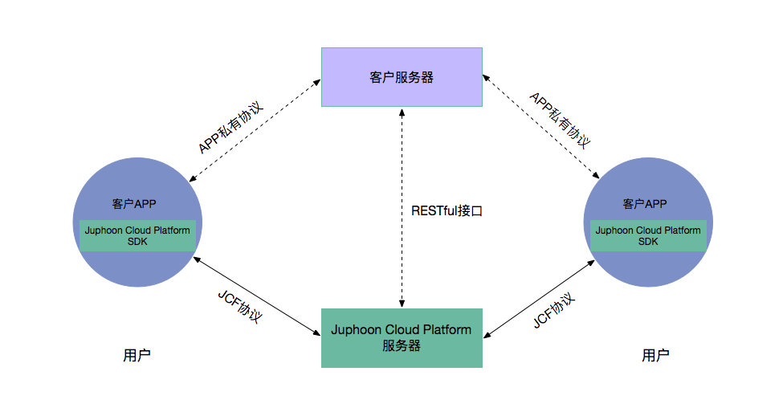
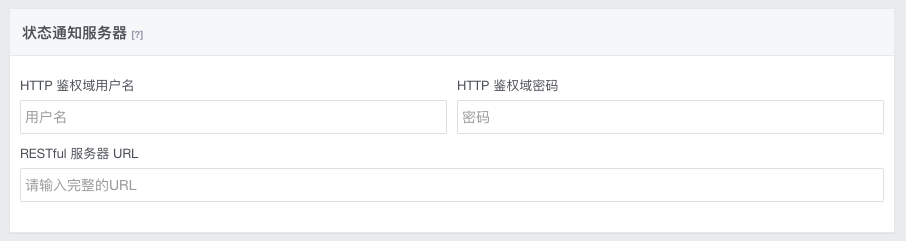

通话状态通知
=======================

.. _通话状态通知:

简介
-----------------

获取通话状态通知是菊风云平台提供的一项服务。通过该服务，您的服务器可以获得通话的实时状态通知，从而使您能够在通话业务的基础上增加额外的业务控制。

文档描述基于您已经完成以下工作：

- 创建您的应用

- 使用 SDK 接口完成集成通话功能

基本架构

控制台配置通知服务器
------------------------

为了获取通话状态通知，您需要在控制台设置接收通话状态通知的服务器地址、鉴权用户名和密码。进入控制台-应用-设置-高级，打开“状态通知服务器”配置页面，如下图：

其中：

- 服务器 URL 是您的服务器访问的 URL 信息

- 图示中服务器访问协议为 HTTP，地址为 112.124.116.65，端口为 7123

- 如果您的服务器通过 HTTPS 访问，请对应选择 HTTPS

- 如果您的服务器通过域名访问，这里需要填入对应域名

- 如果您的服务器有特定的访问路径，请一并填入。例如 112.124.116.65:7123/call_status/

- HTTP 鉴权域用户名和用户密码，是用于访问您的服务器的用户名和密码

了解了获取通话状态通知的基本内容后，下面将分别介绍一对一通话状态通知和多方通话状态通知的内容。

.. toctree::
   :maxdepth: 1
   
   一对一通话状态通知 <1-1callstate>
   多方通话状态通知 <multicallstate>